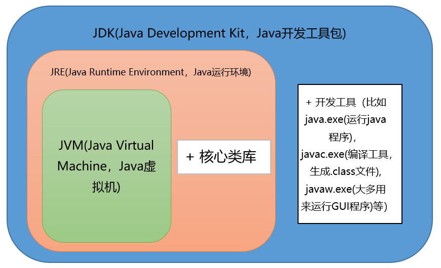

# Java概述

## Java语言有哪些特点？

* 面向对象（封装，继承，多态）；

* 平台无关性，平台无关性的具体表现在于，Java 是"一次编写，到处运行（Write Once，Run any Where）"的语言，因此采用 Java 语言编写的程序具有很好的可移植性，而保证这一点的正是 Java 的虚拟机机制。在引入虚拟机之后，Java 语言在不同的平台上运行不需要重新编译。

* 可靠性、安全性；

* 支持多线程。C++ 语言没有内置的多线程机制，因此必须调用操作系统的多线程功能来进行多线程程序设计，而 Java 语言却提供了多线程支持；

* 支持网络编程并且很方便。Java 语言诞生本身就是为简化网络编程设计的，因此 Java 语言不仅支持网络编程而且很方便；

* 编译与解释并存；

## 面向对象

> 面向对象三大特性（封装、继承、多态）、重写与重载、多态实现原理等详见 [面向对象思想.md](面向对象思想.md)。此处仅作概要说明。

### 面向对象和面向过程的区别？

| | 面向过程 | 面向对象 |
|:---|:---|:---|
| 优点 | 性能高，无需实例化开销 | 易维护、易复用、易扩展 |
| 缺点 | 不易维护、不易复用、不易扩展 | 性能相对较低 |
| 适用场景 | 单片机、嵌入式、Linux/Unix | 大型复杂系统 |

### 重载（Overload）和重写（Override）的区别？

| 对比 | 重写（Override） | 重载（Overload） |
|:---|:---|:---|
| 范围 | 子类与父类之间 | 同一个类内部 |
| 方法名 | 相同 | 相同 |
| 参数 | 必须相同 | 必须不同（类型/个数/顺序） |
| 返回类型 | 必须相同或是其子类型 | 可以不同 |
| 访问权限 | 不能比父类更严格 | 无限制 |
| 异常 | 不能比父类抛更宽泛的异常 | 无限制 |
| 多态类型 | 运行时多态 | 编译时多态 |

> 注意：构造器不能被继承，因此不能被重写，但可以被重载。
## JVM、JRE和JDK的关系是什么？

JDK是（Java Development Kit）的缩写，它是功能齐全的 Java SDK。它拥有 JRE 所拥有的一切，还有编译器（javac）和工具（如 javadoc 和 jdb）。它能够创建和编译程序。

JRE是Java Runtime Environment缩写，它是运行已编译 Java 程序所需的所有内容的集合，包括 Java 虚拟机（JVM），Java 类库，java 命令和其他的一些基础构件。但是，它不能用于创建新程序。

JDK包含JRE，JRE包含JVM。

## 抽象类和接口的区别是什么？

语法层面上的区别：

* 抽象类可以提供成员方法的实现细节，而接口中只能存在public abstract 方法；
* 抽象类中的成员变量可以是各种类型的，而接口中的成员变量只能是public static final类型的；
* 接口中不能含有静态代码块以及静态方法，而抽象类可以有静态代码块和静态方法；
* 一个类只能继承一个抽象类，而一个类却可以实现多个接口。

设计层面上的区别：

* 抽象类是对一种事物的抽象，即对类抽象，而接口是对行为的抽象。抽象类是对整个类整体进行抽象，包括属性、行为，但是接口却是对类局部（行为）进行抽象。
* 设计层面不同，抽象类作为很多子类的父类，它是一种模板式设计。而接口是一种行为规范，它是一种辐射式设计。

参考文章 ：https://www.cnblogs.com/dolphin0520/p/3811437.html

### 抽象类能使用 final 修饰吗？

不能，定义抽象类就是让其他类继承的，如果定义为 final 该类就不能被继承，这样彼此就会产生矛盾，所以 final 不能修饰抽象类

