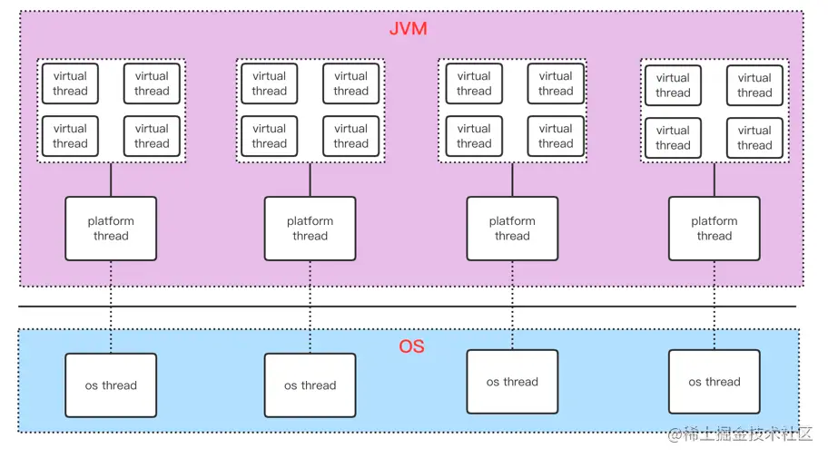

# 虚拟线程

> **版本基线**：本文以 **JDK 21+**（虚拟线程正式版）为基线，并覆盖至 **JDK 25** 的最新变化。JDK 19/20 的预览版内容已过时，此处不再赘述。

## 目录

- [一、核心概念](#一核心概念)
  - [什么是虚拟线程](#什么是虚拟线程)
  - [为什么需要虚拟线程](#为什么需要虚拟线程)
  - [三种线程的关系](#三种线程的关系)
- [二、版本演进（重要）](#二版本演进重要)
- [三、创建虚拟线程](#三创建虚拟线程)
- [四、使用方式与最佳实践](#四使用方式与最佳实践)
- [五、Pinning 固定问题（重点）](#五pinning-固定问题重点)
- [六、实战陷阱](#六实战陷阱)
- [七、实现原理](#七实现原理)
- [八、适用场景与性能](#八适用场景与性能)
  - [适用场景](#适用场景)
  - [具体场景示例](#具体场景示例)
  - [场景速查表](#场景速查表)
  - [性能对比](#性能对比)
- [九、总结](#九总结)

## 一、核心概念

### 什么是虚拟线程

虚拟线程（Virtual Thread）是 JDK 21 正式引入的**轻量级线程**，由 **JVM 调度**而非操作系统调度。

官方定位可以概括为三条：

- **不是更快的线程，而是更「多」的线程**——它提供的是**吞吐量（规模）**，不是  **延迟（速度）** 的改善。
- **面向 thread-per-request 模型**——让「一个请求一个线程」这种简单直观的写法重新变得可扩展，无需转向响应式编程。
- **复用 Thread API**——创建入口仍在 `Thread` / `Executors` 中，现有代码可平滑迁移。

### 为什么需要虚拟线程

**平台线程的问题**：

- Java 线程是对操作系统线程的**一对一包装**，创建、调度、销毁都由操作系统完成。
- 线程切换消耗 CPU 时间（这部分与业务无关）。
- 一个平台线程默认占用约 **1MB 栈空间**，一台机器只能创建几千个。
- 线程是**重量级资源**，因此传统做法是**池化**（线程池）来避免频繁创建销毁。

**关键矛盾**：线程池解决了创建开销，但**没有解决「阻塞」问题**。当线程执行 IO 时（数据库查询、HTTP 调用），它处于阻塞状态却依然**占着操作系统线程**。所以传统线程池的大小必须按「并发阻塞数」来估算，成为吞吐量的瓶颈。

**虚拟线程的破局**：把「Java 线程」与「操作系统线程」解耦。大量虚拟线程复用少量平台线程（M:N 调度），遇到阻塞时自动让出载体线程给其他虚拟线程使用。这样即使并发数很高，也不会耗尽系统资源。

### 三种线程的关系

```
VirtualThread（虚拟线程，JVM 调度，数量可达百万）
        ↓ 挂载（mount）/ 卸载（unmount）
Platform Thread（平台线程 / 载体线程，即传统 Thread）
        ↓ 一对一
OS Thread（操作系统线程）
```



说明：

- 每个**平台线程**与**操作系统线程**一一对应。
- 多个**虚拟线程**挂载（mount）在少量平台线程（**载体线程**）上运行。
- 虚拟线程是 **JVM 级别**的线程，资源开销极小，**用完即销毁，不需要池化**。
- 虚拟线程执行到 IO 或阻塞操作时会**自动卸载**，让载体线程去执行其他虚拟线程，从而用少量线程调度海量任务。

## 二、版本演进（重要）

虚拟线程经历了较长的演进过程，版本对应关系如下：

| JDK 版本 | JEP | 状态 | 关键变化 |
|:---|:---|:---|:---|
| JDK 19 | JEP 425 | Preview | 首次预览，需 `--enable-preview` |
| JDK 20 | JEP 436 | Second Preview | 第二次预览 |
| **JDK 21** | **JEP 444** | **正式转正** | **`--enable-preview` 不再需要** |
| **JDK 24** | **JEP 491** | **正式** | **`synchronized` 不再导致 Pinning** |
| JDK 25 | JEP 505 | Preview | 结构化并发第 5 次预览（仍未转正） |

### JDK 21 转正时的两处变化

1. **虚拟线程始终支持 ThreadLocal**：预览版中可以创建不支持 thread-local 的虚拟线程，该能力已被移除。这使现有库能无需修改直接使用虚拟线程。
2. **通过 `Thread.Builder` 创建的虚拟线程默认被监控**，可通过新的线程转储（thread dump）观察。

### ⚠️ 过时内容提醒

以下说法**均已过时**，不要再沿用：

| 过时说法 | 当前事实 |
|:---|:---|
| 虚拟线程是预览功能，需 `--enable-preview` | JDK 21 已转正，**无需任何参数** |
| `@PreviewFeature` 注解标注 | 正式 API，注解已移除 |
| 尚无生产环境验证 | 已在大量生产系统使用 |
| 必须要用 `ReentrantLock` 替代 `synchronized` | **JDK 24 起不再必要**（见第五节） |

## 三、创建虚拟线程

### 1. Thread.startVirtualThread()（最简）

```java
Thread.startVirtualThread(() -> {
    System.out.println("虚拟线程运行中");
});
```

### 2. Thread.ofVirtual()（推荐，可配置）

```java
// 创建并立即启动
Thread thread = Thread.ofVirtual()
        .name("my-vthread")
        .start(task);

// 先创建不启动
Thread unstarted = Thread.ofVirtual().unstarted(task);
unstarted.start();
```

### 3. ThreadFactory

```java
ThreadFactory factory = Thread.ofVirtual().factory();
Thread thread = factory.newThread(task);
thread.start();
```

### 4. Executors.newVirtualThreadPerTaskExecutor()（生产环境首选）

```java
// 每个任务一个虚拟线程，推荐用 try-with-resources 确保关闭
try (ExecutorService executor = Executors.newVirtualThreadPerTaskExecutor()) {
    for (int i = 0; i < 10_000; i++) {
        executor.submit(() -> {
            Thread.sleep(Duration.ofSeconds(1));
            return i;
        });
    }
}  // 自动 close()，并等待所有任务完成
```

## 四、使用方式与最佳实践

### 核心建议

| 建议 | 说明 |
|:---|:---|
| ✅ 用 `newVirtualThreadPerTaskExecutor()` | 每个任务一个新虚拟线程，语义清晰 |
| ❌ **不要池化虚拟线程** | 虚拟线程廉价且充足，池化会丧失其优势 |
| ✅ 需要限制并发时用 **Semaphore** | 而不是用固定大小的线程池 |
| ✅ 用 try-with-resources 管理 executor | 确保 `close()` 被调用，等待任务结束 |

**为什么不能池化虚拟线程？**

虚拟线程的设计前提就是「**廉价、可大量创建**」。池化会带来两个问题：

- 违背设计意图：销毁和创建的开销已经足够小，池化反而增加复杂度。
- 掩盖问题：如果虚拟线程池被占满，说明确实有阻塞未释放，此时应该用信号量控制**资源访问**，而不是限制**线程数量**。

### 限制并发的正确姿势

```java
// 用 Semaphore 限制对有限资源的并发访问
private static final Semaphore LIMITER = new Semaphore(100);

try (var executor = Executors.newVirtualThreadPerTaskExecutor()) {
    for (int i = 0; i < 10_000; i++) {
        executor.submit(() -> {
            LIMITER.acquire();          // 限制并发数
            try {
                callExternalService();  // 访问有限资源
            } finally {
                LIMITER.release();
            }
        });
    }
}
```

## 五、Pinning 固定问题（重点）

### 什么是 Pinning

虚拟线程遇到阻塞操作时通常会**卸载**，释放载体线程。但在某些情况下**无法卸载**，被「**固定（pinned）**」在载体线程上。

**Pinning 本身不会导致程序出错**，但会**损害可扩展性**：被固定的虚拟线程若执行阻塞操作，其载体和底层 OS 线程都会在操作期间被阻塞，无法服务其他虚拟线程。

> ⚠️ **关键**：调度器**不会通过扩展并行度来补偿 pinning**。如果 pinning 频繁且耗时，性能会急剧退化，甚至出现饥饿或死锁。

### 两种 Pinning 场景

| 场景 | JDK 21~23 | JDK 24+ |
|:---|:---|:---|
| **`synchronized` 块/方法内阻塞** | ❌ 会 Pinning | ✅ **已解决**（JEP 491） |
| **native 方法 / 外部函数内阻塞** | ❌ 会 Pinning | ❌ 仍存在（无法移除） |
| 类初始化器内阻塞 | ❌ 会 Pinning | ❌ 仍存在（少见） |
| 解析符号引用阻塞于类加载 | ❌ 会 Pinning | ❌ 仍存在（少见） |

### synchronized 为什么会导致 Pinning（原理）

这是理解 Pinning 的关键，也是 JEP 491 要解决的核心问题：

- JVM 的**监视器（monitor）实现记录的是「哪个平台线程」持有锁**，而不是哪个虚拟线程。
- 如果虚拟线程在 `synchronized` 内卸载，调度器会把**另一个虚拟线程**挂载到这个平台线程上。
- 此时 JVM 会误认为新挂载的虚拟线程持有监视器，导致**互斥锁失效**。
- 因此 JVM 只能**阻止虚拟线程在 `synchronized` 内卸载**——这就是 Pinning。

### JDK 24 的解决方案（JEP 491）

JEP 491 修改了 JVM 对 `synchronized` 的实现，使**虚拟线程可以独立于载体获取、持有和释放监视器**：

- 挂载/卸载会记录必要信息，允许虚拟线程在 `synchronized` 内（或等待监视器时）卸载和重新挂载。
- 阻塞等待监视器时，虚拟线程会卸载并释放载体；监视器释放后，由调度器可能在**不同载体**上恢复执行。
- `Object.wait()` 同理。

**这带来的直接影响**：

- 现有使用 `synchronized` 的**库无需修改**即可获得虚拟线程的扩展性优势。
- 不再需要为了虚拟线程强制把 `synchronized` 改成 `ReentrantLock`。
- `jdk.tracePinnedThreads` 系统属性**已被移除**（设置后无效）。

### 诊断手段

| 工具 | JDK 21~23 | JDK 24+ | 说明 |
|:---|:---|:---|:---|
| **JFR 事件** `jdk.VirtualThreadPinned` | ✅ | ✅（用途变更） | JDK 24 起仅用于诊断**残余** pinning（如 native 场景） |
| `-Djdk.tracePinnedThreads=full/short` | ✅ | ❌ **已移除** | JDK 24 起失效 |

**JDK 21~23 环境下的诊断示例**：

```bash
# 打印完整堆栈，突出 native 帧和持有监视器的帧
java -Djdk.tracePinnedThreads=full Main

# 只输出有问题的帧
java -Djdk.tracePinnedThreads=short Main
```

### 选 synchronized 还是 ReentrantLock

**JDK 24 之后**：可以纯粹根据问题需要选择，两者在虚拟线程下都能正确卸载。

| 对比项 | `synchronized` | `ReentrantLock` |
|:---|:---|:---|
| 语法 | 简洁，自动释放 | 需 try-finally 手动释放 |
| 灵活性 | 低 | 高（公平性、读写锁、超时/可中断获取） |
| 推荐场景 | **一般场景优先** | 需要高级特性时 |

> **注意**：已经迁移到 `ReentrantLock` 的代码**无需回退**，两者都可用。
>
> **JDK 21~23 环境**：对**频繁运行且守护长时间 IO 操作**的 `synchronized`，建议改用 `ReentrantLock`。仅在启动时执行或守护内存操作的 `synchronized` 则无需替换。

## 六、实战陷阱

### 1. ThreadLocal 的内存问题

虚拟线程数量可达百万级，如果每个虚拟线程都持有 ThreadLocal 副本，内存消耗会急剧膨胀。

```java
// ❌ 危险：百万虚拟线程 × ThreadLocal 副本
private static final ThreadLocal<byte[]> LOCAL = ThreadLocal.withInitial(() -> new byte[1024 * 1024]);

// ✅ 推荐：改用 ScopedValue（JDK 21+ 预览，JDK 25 仍为预览）
private static final ScopedValue<User> CURRENT_USER = ScopedValue.newInstance();
```

**要点**：
- 虚拟线程的 ThreadLocal 是**继承式**的，创建时会复制父线程的 inheritable thread-local。
- 大量虚拟线程场景应避免使用 ThreadLocal，优先考虑 **ScopedValue**。
- 若必须使用，确保及时 `remove()`。

### 2. 不要用虚拟线程做 CPU 密集型任务

虚拟线程的优势在于**遇到阻塞时能释放载体**。CPU 密集型任务很少阻塞，虚拟线程不会带来收益，反而因调度开销略慢。

**CPU 密集型任务**应该：
- 使用固定大小的平台线程池（并行度 = CPU 核数）。
- 或通过增加 CPU 核心、分布式计算解决。

### 3. 输出流仍有同步开销

`System.out` 使用的是 `PrintStream`，它内部有同步逻辑。在大量虚拟线程中频繁打印会因锁竞争而成为瓶颈。

> JDK 21 已对 `BufferedInputStream`、`PrintStream` 等做了改造（改用显式锁而非监视器）以缓解此问题，但高频输出仍应避免。

### 4. 虚拟线程是守护线程

- 虚拟线程**始终是守护线程**，`setDaemon()` 无效。
- 虚拟线程**优先级固定为 `NORM_PRIORITY`**，`setPriority()` 无效。
- 虚拟线程**不是线程组的活跃成员**，`getThreadGroup()` 返回名为 `VirtualThreads` 的占位组。
- **公共 `Thread` 构造函数无法创建虚拟线程**，必须用 `Thread.ofVirtual()` 等 API。

### 5. 栈存储在堆中，需注意 GC 行为

- 虚拟线程的栈存储在 **Java 堆**中（作为「栈块对象」），**不是 GC 根**。
- **G1 GC 的已知限制**：不支持巨型（humongous）栈块对象。如果虚拟线程栈达到 region 大小的一半（可能小至 512KB），可能抛出 `StackOverflowError`。

**实践建议**：
- 避免过深的递归调用栈。
- 关注大栈场景，必要时调整 G1 region 大小或改用其他 GC。

## 七、实现原理

### 核心公式

```text
虚拟线程 = Continuation（任务包装器）+ Scheduler（调度器）
```

- **Continuation**：把任务（`Runnable`）包装起来，支持 `yield()` 让出、`run()` 恢复。
- **Scheduler**：`Executor`，默认是 **FIFO 模式的工作窃取 ForkJoinPool**（注意：与并行流用的 common pool 的 LIFO 模式不同）。

### 调度器参数

| 系统属性 | 默认值 | 说明 |
|:---|:---|:---|
| `jdk.virtualThreadScheduler.parallelism` | 可用处理器数 | 并行度 |
| `jdk.virtualThreadScheduler.maxPoolSize` | `max(parallelism, 256)` | 池最大大小 |
| `jdk.virtualThreadScheduler.minRunnable` | `max(parallelism/2, 1)` | 最小可运行线程数 |

源码参考（`VirtualThread.createDefaultScheduler()`）：

```java
private static ForkJoinPool createDefaultScheduler() {
    ForkJoinWorkerThreadFactory factory = pool -> {
        PrivilegedAction<ForkJoinWorkerThread> pa = () -> new CarrierThread(pool);
        return AccessController.doPrivileged(pa);
    };
    PrivilegedAction<ForkJoinPool> pa = () -> {
        int parallelism, maxPoolSize, minRunnable;
        String parallelismValue = System.getProperty("jdk.virtualThreadScheduler.parallelism");
        String maxPoolSizeValue = System.getProperty("jdk.virtualThreadScheduler.maxPoolSize");
        String minRunnableValue = System.getProperty("jdk.virtualThreadScheduler.minRunnable");
        if (parallelismValue != null) {
            parallelism = Integer.parseInt(parallelismValue);
        } else {
            parallelism = Runtime.getRuntime().availableProcessors();
        }
        if (maxPoolSizeValue != null) {
            maxPoolSize = Integer.parseInt(maxPoolSizeValue);
            parallelism = Integer.min(parallelism, maxPoolSize);
        } else {
            maxPoolSize = Integer.max(parallelism, 256);
        }
        if (minRunnableValue != null) {
            minRunnable = Integer.parseInt(minRunnableValue);
        } else {
            minRunnable = Integer.max(parallelism / 2, 1);
        }
        Thread.UncaughtExceptionHandler handler = (t, e) -> { };
        boolean asyncMode = true; // FIFO
        return new ForkJoinPool(parallelism, factory, handler, asyncMode,
                0, maxPoolSize, minRunnable, pool -> true, 30, SECONDS);
    };
    return AccessController.doPrivileged(pa);
}
```

### mount 与 unmount

| 操作 | 说明 |
|:---|:---|
| **mount（挂载）** | 虚拟线程分配到平台线程执行，Continuation 栈数据帧从堆拷贝到平台线程栈 |
| **unmount（卸载）** | 虚拟线程暂停，Continuation 栈数据帧留在**堆内存**中 |

```java
mount();
try {
    Continuation.run();
} finally {
    unmount();
}
```

源码：

```java
final class VirtualThread extends BaseVirtualThread {

    @ChangesCurrentThread
    private void mount() {
        // 设置载体线程
        Thread carrier = Thread.currentCarrierThread();
        setCarrierThread(carrier);

        // 同步中断状态
        if (interrupted) {
            carrier.setInterrupt();
        } else if (carrier.isInterrupted()) {
            synchronized (interruptLock) {
                if (!interrupted) {
                    carrier.clearInterrupt();
                }
            }
        }

        // 让 Thread.currentThread() 返回虚拟线程
        carrier.setCurrentThread(this);
    }

    @ChangesCurrentThread
    private void unmount() {
        // 让 Thread.currentThread() 返回平台线程
        Thread carrier = this.carrierThread;
        carrier.setCurrentThread(carrier);

        // 断开与载体的关联，与中断操作同步
        synchronized (interruptLock) {
            setCarrierThread(null);
        }
        carrier.clearInterrupt();
    }
}
```

### 执行流程

1. 调度器中的平台线程等待处理任务
2. 虚拟线程被分配一个平台线程（载体线程）→ **mount**
3. 虚拟线程运行其 Continuation，执行用户任务
4. 遇到阻塞操作 → **unmount**，载体线程去执行其他虚拟线程
5. 阻塞结束 → 重新 **mount**（可能在不同载体上）
6. 任务完成 → Continuation 终结 → 虚拟线程终结 → 载体线程返还调度器

### VirtualThread 类特性

```java
final class VirtualThread extends BaseVirtualThread {
    // ...
}
```

- 继承 `BaseVirtualThread`，后者继承 `Thread`。
- **终态类（final）**，无法被继承和扩展。
- 仅提供一个构造器，接收 4 个参数：`Executor scheduler`、`String name`、`int characteristics`、`Runnable task`。

## 八、适用场景与性能

### 适用场景

| 场景 | 是否适合 | 说明 |
|:---|:---|:---|
| **IO 密集型**（DB 查询、HTTP 调用、文件读写） | ✅ **非常适合** | 阻塞时释放载体，吞吐量提升显著 |
| **高并发任务数**（数千以上） | ✅ **非常适合** | 用少量平台线程调度海量任务 |
| **CPU 密集型**（计算、加解密） | ❌ 不适合 | 不会阻塞，无收益，反而有调度开销 |
| **需要限制并发** | ⚠️ 用 Semaphore | 不要用池化虚拟线程 |

**判断口诀**：如果一个任务的耗时**大部分花在「等待」上**（等 DB、等下游、等磁盘），就适合虚拟线程；如果耗时花在「计算」上，就不适合。

### 具体场景示例

#### 场景 1：API 网关 / BFF 聚合服务

**背景**：一个页面请求需要调用 5 个下游微服务（用户、订单、库存、营销、推荐），每次 RPC 耗时 50~200ms。

**传统写法**（平台线程池）：

```java
// 线程池大小 200，每个请求占用 1 个线程约 300ms
// 理论最大吞吐 ≈ 200 / 0.3 ≈ 660 QPS，线程几乎全在阻塞等待
```

**虚拟线程写法**：

```java
try (var executor = Executors.newVirtualThreadPerTaskExecutor()) {
    Future<User> user = executor.submit(() -> userService.get(userId));
    Future<List<Order>> orders = executor.submit(() -> orderService.list(userId));
    Future<Stock> stock = executor.submit(() -> stockService.query(skuId));

    // 合并结果返回
    return new PageData(user.get(), orders.get(), stock.get());
}
```

**为什么适合**：
- 请求的绝大部分时间在**等待下游响应**，纯等待、纯阻塞。
- 一个请求内还要**并发调用多个下游**，天然产生大量并行阻塞任务。
- 平台线程池的线程数成为吞吐瓶颈，而虚拟线程可以轻松支撑数万并发请求。

**收益**：同样的硬件，吞吐量可提升数倍到数十倍（取决于下游延迟占比）。

#### 场景 2：数据库访问密集的后台服务

**背景**：报表导出服务，需要分批查询 5000 条记录，每条记录还要再查一次详情（典型的 N+1 查询场景）。

**传统写法的问题**：
- 数据库连接池通常只有 10~50 个连接，平台线程数再多也得排队等连接。
- 如果用线程池，线程数受限于连接池，每个线程都在等 DB 返回。

**虚拟线程写法**：

```java
List<Long> ids = fetchAllIds();   // 5000 个 ID

try (var executor = Executors.newVirtualThreadPerTaskExecutor()) {
    List<Future<Detail>> futures = ids.stream()
            .map(id -> executor.submit(() -> detailService.query(id)))
            .toList();

    for (Future<Detail> f : futures) {
        result.add(f.get());
    }
}
```

**为什么适合**：
- 每个任务都是「发 SQL → 等 DB 返回」，**全程阻塞等待**。
- 任务数量多（数千），用平台线程池会迅速耗尽线程。

**重要提醒**：此时真正的瓶颈是**数据库连接池**，不是线程数。要配合 `Semaphore` 限制并发，避免把 DB 打垮：

```java
private static final Semaphore DB_LIMITER = new Semaphore(20);  // 匹配连接池大小

executor.submit(() -> {
    DB_LIMITER.acquire();
    try {
        return detailService.query(id);
    } finally {
        DB_LIMITER.release();
    }
});
```

#### 场景 3：消息队列的消费者

**背景**：消费者从 Kafka 拉取消息，每条消息需要调用外部接口处理（耗时 100ms 左右），要求高吞吐。

**传统写法的问题**：
- 如果单线程消费，吞吐受限于处理速度。
- 如果用线程池并发消费，线程数受限于下游能承受的并发量，且线程大部分时间在等外部接口。

**虚拟线程写法**：

```java
// 拉取一批消息后，为每条消息起一个虚拟线程处理
while (running) {
    List<Record> records = consumer.poll(Duration.ofMillis(100));
    try (var executor = Executors.newVirtualThreadPerTaskExecutor()) {
        for (Record r : records) {
            executor.submit(() -> process(r));   // 内部是外部接口调用
        }
    }   // 等待本批全部处理完
    consumer.commitSync();
}
```

**为什么适合**：
- 每条消息的处理都是「调用外部接口 → 等待返回」，纯阻塞。
- 消息可能成批到来，瞬时并发需求高，虚拟线程能弹性应对。
- 用虚拟线程而不是固定线程池，不用担心「消息堆积时线程不够用」。

**注意**：批量场景下要控制批大小和下游并发量，避免一次提交过多任务。

#### 场景 4：爬虫 / 批量外部接口调用

**背景**：需要抓取 10 万个网页或调用 10 万次第三方 API。

**传统写法的问题**：
- 线程池开 500 个线程，每个线程抓一个页面耗时 1 秒，10 万个需要 200 秒。
- 线程数开到几千会因栈内存（1MB × N）耗尽内存。

**虚拟线程写法**：

```java
try (var executor = Executors.newVirtualThreadPerTaskExecutor()) {
    for (String url : urls) {          // 10 万个 URL
        executor.submit(() -> fetch(url));
    }
}
```

**为什么适合**：
- 网络 IO 是**最典型的阻塞场景**，等待时间远超处理时间。
- 任务数极大（十万级），平台线程根本无法支撑。
- 虚拟线程栈存在堆中且可动态伸缩，**不会有 1MB × N 的内存问题**。

#### 场景 5：不适合的反例 — 图像处理 / 加解密服务

**背景**：需要对图片做缩放、滤镜处理，单张耗时 200ms，**纯 CPU 计算无阻塞**。

**为什么不适合**：
- 任务几乎不阻塞，虚拟线程**没有机会卸载**，无法释放载体。
- 载体线程数（默认 = CPU 核数）就是实际并行度，与用平台线程池没有区别。
- 反而多了一层调度开销，可能略慢。

**正确做法**：

```java
// CPU 密集型用固定大小线程池，并行度 = CPU 核数
ExecutorService executor = Executors.newFixedThreadPool(
        Runtime.getRuntime().availableProcessors());
```

**另一个反例 — 同步锁竞争激烈的场景（JDK 21~23）**：

如果代码里有大量 `synchronized` 且内部有阻塞操作，在 JDK 21~23 下会触发 **Pinning**，性能可能不升反降。此时应改用 `ReentrantLock`，**或直接升级到 JDK 24+**（JEP 491 已解决）。

### 场景速查表

| 场景 | 特征 | 是否适合 | 关键原因 |
|:---|:---|:---|:---|
| API 网关聚合 | 大量等待下游 + 请求内并行 | ✅ 强推 | 阻塞占比极高 |
| 数据库密集查询 | 等 DB 返回，任务数大 | ✅ 适合 | 需配 Semaphore 限流 |
| MQ 消费者 | 等外部接口，批量并发 | ✅ 适合 | 弹性应对流量波动 |
| 爬虫 / 批量 HTTP | 等网络响应，十万级任务 | ✅ 强推 | 平台线程无法支撑 |
| 文件 IO 批处理 | 等磁盘读写 | ✅ 适合 | 阻塞时间占比高 |
| 图像 / 视频处理 | 纯 CPU 计算 | ❌ 不适合 | 不阻塞，无卸载机会 |
| 复杂算法计算 | 纯 CPU 计算 | ❌ 不适合 | 用固定线程池即可 |
| 高频 `synchronized`（JDK≤23） | 锁竞争 + 内含阻塞 | ⚠️ 谨慎 | 会 Pinning，需升级 JDK |

### 性能对比

原文给出的对比测试（10 万个任务、每个睡眠 10ms）：

| 方式 | 总耗时 | 最大平台线程数 |
|:---|:---|:---|
| 虚拟线程 | 129 ms | 18 |
| 固定线程池（200） | 6103 ms | 207 |

> **注意**：这个测试模拟的是「IO 等待」场景（`sleep`），虚拟线程的优势在于**大量阻塞时能释放载体**。对于 CPU 密集型任务，虚拟线程不会有这样的优势。这类测试数据仅用于说明原理，实际性能取决于具体场景，应以**压测**为准。

## 九、总结

### 核心要点（划重点）

1. **虚拟线程 ≠ 更快的线程**。它提供的是**吞吐量（规模）**，不是延迟改善。目的是让 thread-per-request 模型重新可扩展。
2. **由 JVM 调度，不是操作系统**。M:N 调度，多个虚拟线程复用少量平台线程。
3. **不要池化虚拟线程**。它廉价且充足，应为每个任务创建一个。需要限流用 `Semaphore`。
4. **适合 IO 密集型，不适合 CPU 密集型**。
5. **JDK 21 正式转正**，不再是预览功能，无需 `--enable-preview`。
6. **Pinning 是最大的性能陷阱**。JDK 21~23 下 `synchronized` 会导致 pinning，**JDK 24（JEP 491）已解决**；native 方法导致的 pinning 无法移除。
7. **注意 ThreadLocal 的内存风险**，大量虚拟线程场景应改用 ScopedValue。
8. **虚拟线程是守护线程**，优先级固定，无效的 API 有 `setDaemon()`、`setPriority()`。

### 演进脉络

Java 曾长期投入 **Reactor 响应式编程**来提升性能，但响应式存在「**难理解、难调试、难使用**」的问题。

虚拟线程代表了一次思路转变：**回归同步编程模型**，用「廉价的线程」解决可扩展性问题，而不是用「复杂的异步代码」。这对开发者是重大利好——保留了直观的编程模型，同时获得了高吞吐量。

### 现状

- 虚拟线程已在 **JDK 21（LTS）** 正式可用，生产环境已有大量实践。
- **JDK 24** 解决了 `synchronized` 的 pinning 问题，扫清了最大的落地障碍。
- **结构化并发**（`StructuredTaskScope`）在 JDK 25 仍是**第五次预览**，尚未转正。

### 相关 JEP 速查

| JEP | 内容 | 版本 | 状态 |
|:---|:---|:---|:---|
| JEP 425 | Virtual Threads（首次预览） | JDK 19 | Preview |
| JEP 436 | Virtual Threads（二次预览） | JDK 20 | Second Preview |
| **JEP 444** | **Virtual Threads（正式）** | **JDK 21** | **Finalized** |
| **JEP 491** | **Synchronize Virtual Threads without Pinning** | **JDK 24** | **Delivered** |
| JEP 487 | Scoped Values | JDK 25 | Preview |
| JEP 505 | Structured Concurrency（第 5 次预览） | JDK 25 | Preview |

# 参考文章

- [JEP 444: Virtual Threads](https://openjdk.org/jeps/444)
- [JEP 491: Synchronize Virtual Threads without Pinning](https://openjdk.org/jeps/491)
- [JEP 505: Structured Concurrency (Fifth Preview)](https://openjdk.org/jeps/505)
- [Virtual Threads 官方文档](https://docs.oracle.com/en/java/javase/21/core/virtual-threads.html)
- https://juejin.cn/post/7258180488358084669
- https://www.cnblogs.com/throwable/p/16758997.html
