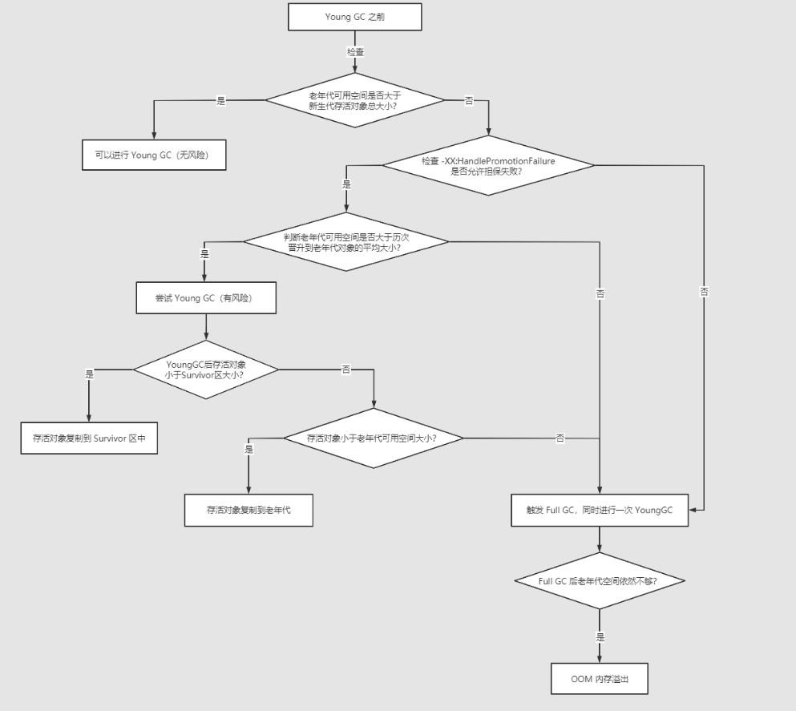

* [对象优先在 Eden 分配](#对象优先在-eden-分配)
* [大对象直接进入老年代](#大对象直接进入老年代)
* [长期存活的对象进入老年代](#长期存活的对象进入老年代)
* [动态对象年龄判定](#动态对象年龄判定)
* [空间分配担保](#空间分配担保)

### 对象优先在 Eden 分配
大多数情况下，对象在新生代 Eden 上分配，当 Eden 空间不够时，发起 Minor GC。
### 大对象直接进入老年代
- 大对象是指需要连续内存空间的对象，最典型的大对象是那种很长的字符串以及数组。
- 经常出现大对象会提前触发垃圾收集以获取足够的连续空间分配给大对象
- -XX:PretenureSizeThreshold，大于此值的对象直接在老年代分配，避免在 Eden 和 Survivor 之间的大量内存复制。
### 长期存活的对象进入老年代
- 为对象定义年龄计数器，对象在 Eden 出生并经过 Minor GC 依然存活，将移动到 Survivor 中，年龄就增加 1 岁，增加到一定年龄则移动到老年代中。
- -XX:MaxTenuringThreshold 用来定义年龄的阈值
### 动态对象年龄判定
虚拟机并不是永远要求对象的年龄必须达到 MaxTenuringThreshold 才能晋升老年代，如果在 Survivor 中相同年龄所有对象大小的总和大于 Survivor 空间的一半，则年龄大于或等于该年龄的对象可以直接进入老年代，无需等到MaxTenuringThreshold 中要求的年龄。
### 空间分配担保
- 在发生 Minor GC 之前，虚拟机先检查老年代最大可用的连续空间是否大于新生代所有对象总空间，如果条件成立的话，那么 Minor GC 可以确认是安全的
- 如果不成立的话则虚拟机会先查看- XX：HandlePromotionFailure参数的设置值是否允许担保失败，如果允许那么就会继续检查老年代 最大可用的连续空间是否大于历次晋升到老年代对象的平均大小，如果大于，将尝试着进行一次 Minor GC；如果小于，或者-XX： HandlePromotionFailure设置不允许冒险，那么就要进行一次 Full GC。
  > 解释一下“冒险”是冒了什么风险：前面提到过，新生代使用复制收集算法，但为了内存利用率， 只使用其中一个Survivor空间来作为轮换备份，因此当出现大量对象在Minor GC后仍然存活的情况 ——最极端的情况就是内存回收后新生代中所有对象都存活，需要老年代进行分配担保，把Survivor无 法容纳的对象直接送入老年代，这与生活中贷款担保类似。老年代要进行这样的担保，前提是老年代 本身还有容纳这些对象的剩余空间，但一共有多少对象会在这次回收中活下来在实际完成内存回收之 前是无法明确知道的，所以只能取之前每一次回收晋升到老年代对象容量的平均大小作为经验值，与 老年代的剩余空间进行比较，决定是否进行Full GC来让老年代腾出更多空间。

  如果YougGC时新生代有大量对象存活下来，而 survivor 区放不下了，这时必须转移到老年代中，但这时发现老年代也放不下这些对象了，那怎么处理呢？其实JVM有一个老年代空间分配担保机制来保证对象能够进入老年代。
```
在执行每次 YoungGC 之前，JVM会先检查老年代最大可用连续空间是否大于新生代所有对象的总大小。因为在极端情况下，可能新生代 YoungGC 后，所有对象都存活下来了，而 survivor 区又放不下，那可能所有对象都要进入老年代了。这个时候如果老年代的可用连续空间是大于新生代所有对象的总大小的，那就可以放心进行 YoungGC。但如果老年代的内存大小是小于新生代对象总大小的，那就有可能老年代空间不够放入新生代所有存活对象，这个时候JVM就会先检查 -XX:HandlePromotionFailure 参数是否允许担保失败，如果允许，就会判断老年代最大可用连续空间是否大于历次晋升到老年代对象的平均大小，如果大于，将尝试进行一次YoungGC，尽快这次YoungGC是有风险的。如果小于，或者 -XX:HandlePromotionFailure 参数不允许担保失败，这时就会进行一次 Full GC。

在允许担保失败并尝试进行YoungGC后，可能会出现三种情况：

- ① YoungGC后，存活对象小于survivor大小，此时存活对象进入survivor区中
- ② YoungGC后，存活对象大于survivor大小，但是小于老年大可用空间大小，此时直接进入老年代。
- ③ YoungGC后，存活对象大于survivor大小，也大于老年大可用空间大小，老年代也放不下这些对象了，此时就会发生“Handle Promotion Failure”，就触发了 Full GC。如果 Full GC后，老年代还是没有足够的空间，此时就会发生OOM内存溢出了。
```
通过下图来了解空间分配担保原则：

