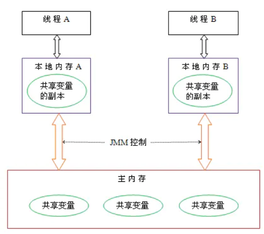

# 什么是JVM内存模型？

**Java 内存模型**（下文简称 **JMM**）就是在底层处理器内存模型的基础上，定义自己的多线程语义。它明确指定了一组排序规则，来保证线程间的可见性。

这一组规则被称为 **Happens-Before**, JMM 规定，要想保证 B 操作能够看到 A 操作的结果（无论它们是否在同一个线程），那么 A 和 B 之间必须满足 **Happens-Before 关系**：

- **单线程规则**：一个线程中的每个动作都 happens-before 该线程中后续的每个动作
- **监视器锁定规则**：监听器的**解锁**动作 happens-before 后续对这个监听器的**锁定**动作
- **volatile 变量规则**：对 volatile 字段的写入动作 happens-before 后续对这个字段的每个读取动作
- **线程 start 规则**：线程 **start()** 方法的执行 happens-before 一个启动线程内的任意动作
- **线程 join 规则**：一个线程内的所有动作 happens-before 任意其他线程在该线程 **join()** 成功返回之前
- **传递性**：如果 A happens-before B, 且 B happens-before C, 那么 A happens-before C

怎么理解 happens-before 呢？如果按字面意思，比如第二个规则，线程（不管是不是同一个）的解锁动作发生在锁定之前？这明显不对。happens-before 也是为了保证可见性，比如那个解锁和加锁的动作，可以这样理解，线程1释放锁退出同步块，线程2加锁进入同步块，那么线程2就能看见线程1对共享对象修改的结果。

Java 提供了几种语言结构，包括 *volatile*, *final* 和 *synchronized*, 它们旨在帮助程序员向**编译器**描述程序的并发要求，其中：

- **volatile** - 保证**可见性**和**有序性**
- **synchronized** - 保证**可见性**和**有序性**; 通过**管程（Monitor）\**保证一组动作的\**原子性**
- **final** - 通过禁止**在构造函数初始化**和**给 final 字段赋值**这两个动作的重排序，保证**可见性**（如果 **this 引用逃逸**就不好说可见性了）

编译器在遇到这些关键字时，会插入相应的内存屏障，保证语义的正确性。

有一点需要**注意**的是，**synchronized** **不保证**同步块内的代码禁止重排序，因为它通过锁保证同一时刻只有**一个线程**访问同步块（或临界区），也就是说同步块的代码只需满足 **as-if-serial** 语义 - 只要单线程的执行结果不改变，可以进行重排序。

所以说，Java 内存模型描述的是多线程对共享内存修改后彼此之间的可见性，另外，还确保正确同步的 Java 代码可以在不同体系结构的处理器上正确运行。

# 常量池
JVM常量池主要分为**Class文件常量池、运行时常量池，全局字符串常量池，以及基本类型包装类对象常量池**。

* **Class文件常量池**。class文件是一组以字节为单位的二进制数据流，在java代码的编译期间，我们编写的java文件就被编译为.class文件格式的二进制数据存放在磁盘中，其中就包括class文件常量池。
* **运行时常量池**：运行时常量池相对于class常量池一大特征就是具有动态性，java规范并不要求常量只能在运行时才产生，也就是说运行时常量池的内容并不全部来自class常量池，在运行时可以通过代码生成常量并将其放入运行时常量池中，这种特性被用的最多的就是String.intern()。
* **全局字符串常量池**：字符串常量池是JVM所维护的一个字符串实例的引用表，在HotSpot VM中，它是一个叫做StringTable的全局表。在字符串常量池中维护的是字符串实例的引用，底层C++实现就是一个Hashtable。这些被维护的引用所指的字符串实例，被称作”被驻留的字符串”或”interned string”或通常所说的”进入了字符串常量池的字符串”。 
* 基本类型包装类对象常量池：java中基本类型的包装类的大部分都实现了常量池技术，这些类是Byte,Short,Integer,Long,Character,Boolean,另外两种浮点数类型的包装类则没有实现。另外上面这5种整型的包装类也只是在对应值小于等于127时才可使用对象池，也即对象不负责创建和管理大于127的这些类的对象。
