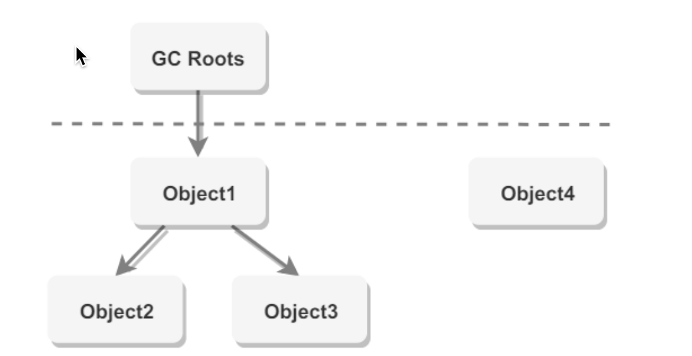
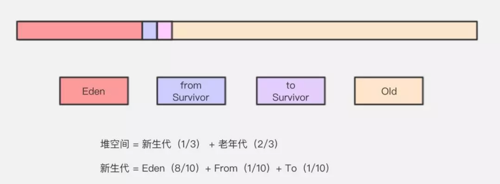
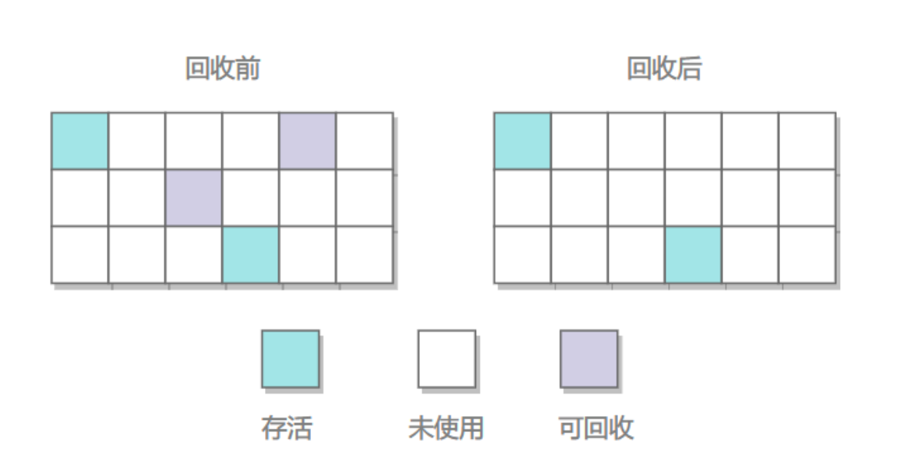
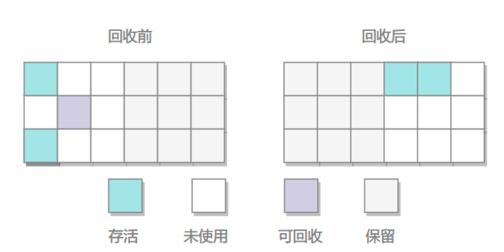
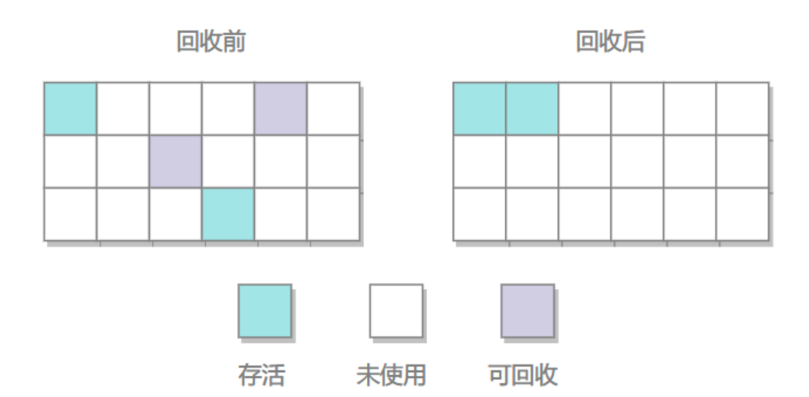
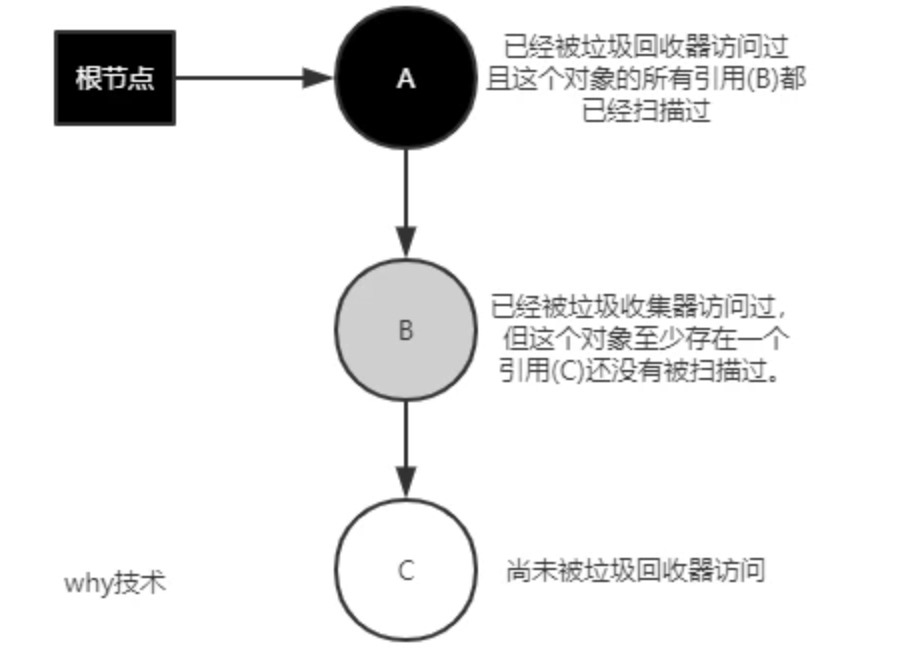
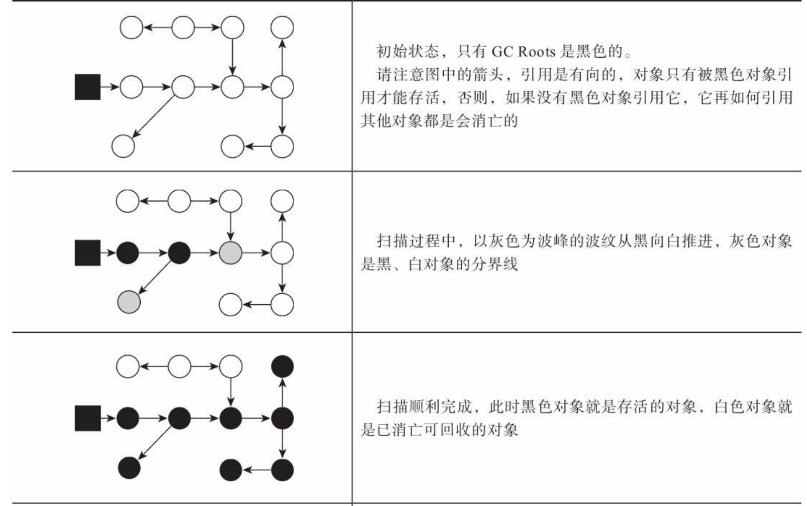
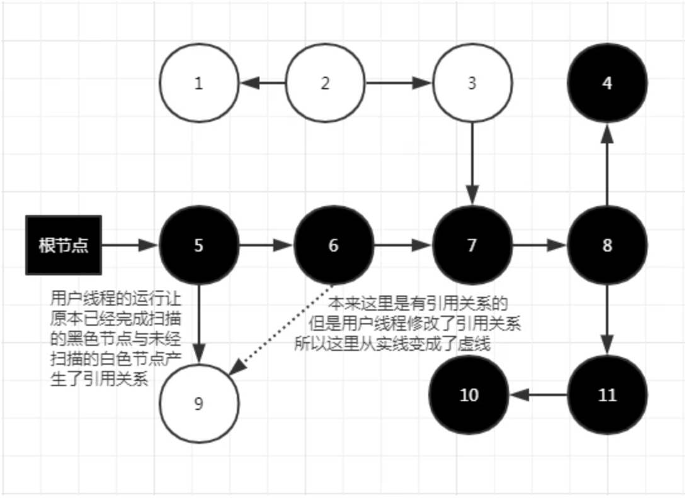
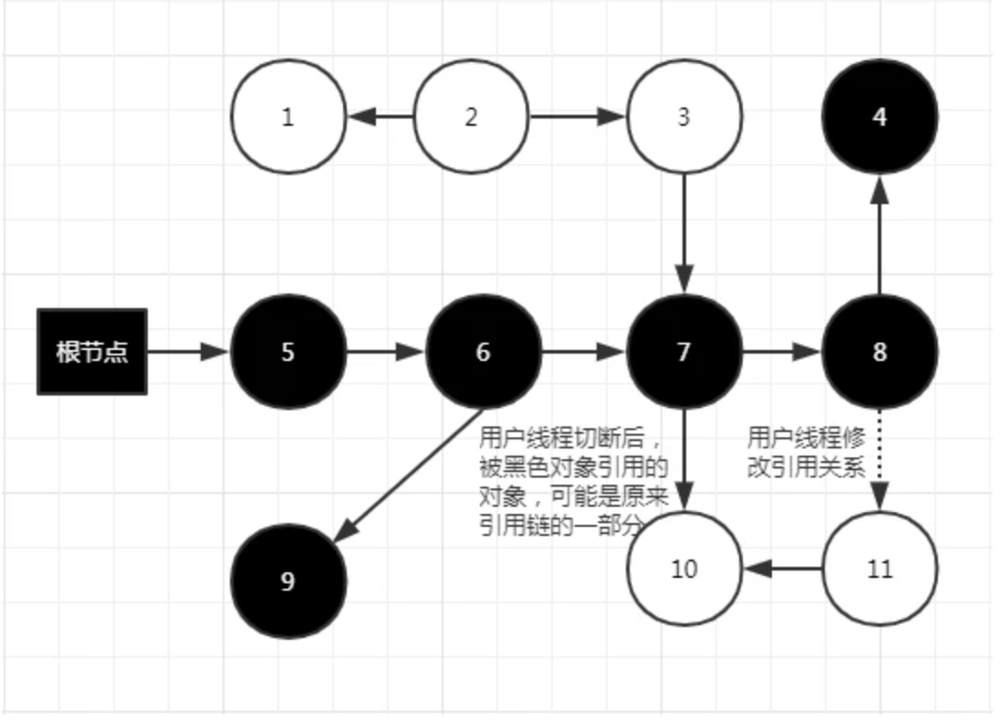
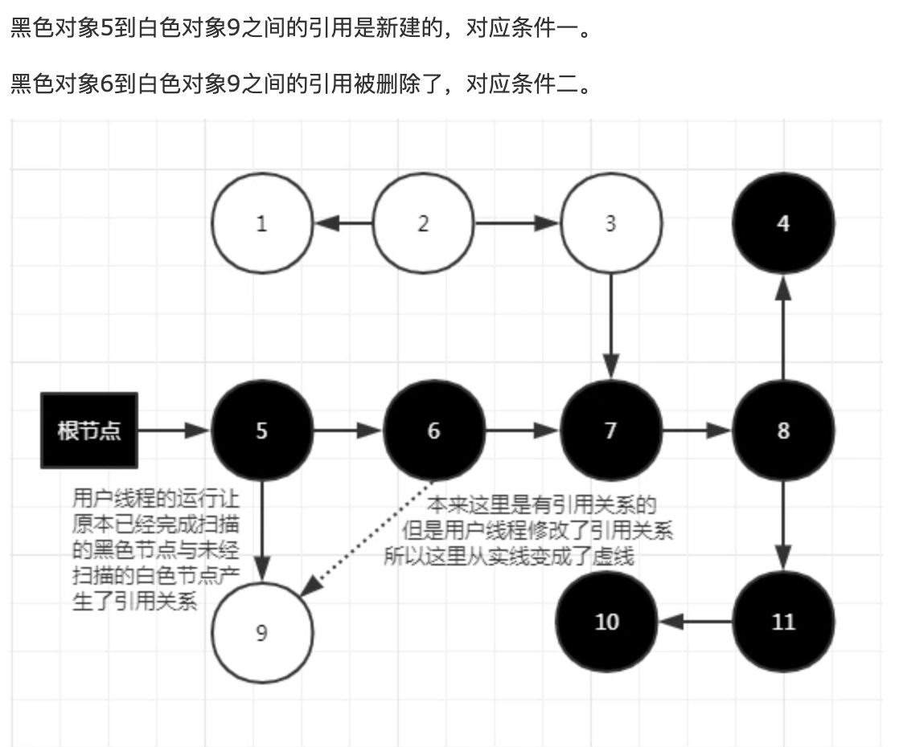

# 判断一个对象能否被回收（是否存活）
## 如何判断一个对象（能否被回收）？

判断一个对象是否存活，分为两种算法1：引用计数法；2：可达性分析算法；

## 引用计数法
- 为对象添加一个引用计数器，当对象增加一个引用时计数器加 1，引用失效时计数器减 1。引用计数为 0 的对象可被回收。
- 在两个对象出现循环引用的情况下，此时引用计数器永远不为 0，导致无法对它们进行回收。正是因为循环引用的存在，因此 Java 虚拟机不使用引用计数算法。
```
给每一个对象设置一个引用计数器，当有一个地方引用该对象的时候，引用计数器就+1，引用失效时，引用计数器就-1；当引用计数器为0的时候，就说明这个对象没有被引用，也就是垃圾对象，等待回收；
缺点：无法解决循环引用的问题，当A引用B，B也引用A的时候，此时AB对象的引用都不为0，此时也就无法垃圾回收，所以一般主流虚拟机都不采用这个方法；
```
## 可达性算法
从一个被称为GC Roots的对象向下搜索，如果一个对象到GC Roots没有任何引用链相连接时，说明此对象不可用，在java中可以作为GC Roots的对象有以下几种：

* 虚拟机栈中引用的对象
* 方法区类静态属性引用的变量
* 方法区常量池引用的对象
* 本地方法栈JNI引用的对象

但一个对象满足上述条件的时候，不会马上被回收，还需要进行两次标记；第一次标记：判断当前对象是否有finalize()方法并且该方法没有被执行过，若不存在则标记为垃圾对象，等待回收；若有的话，则进行第二次标记；第二次标记将当前对象放入F-Queue队列，并生成一个finalize线程去执行该方法，虚拟机不保证该方法一定会被执行，这是因为如果线程执行缓慢或进入了死锁，会导致回收系统的崩溃；如果执行了finalize方法之后仍然没有与GC Roots有直接或者间接的引用，则该对象会被回收；

<div style="text-align: center;">
    
</div>

以 GC Roots 为起始点进行搜索，可达的对象都是存活的，不可达的对象可被回收。
## 哪些可以作为是根节点
- 虚拟机栈（栈帧中的本地变量表）中引用的对象
- 本地方法栈中 JNI（即一般说的 Native 方法）引用的对象
- 方法区中类静态属性引用的对象
- 方法区中常量引用的对象
- 正在运⾏的线程
- 锁住的对象

这种算法的优点是简单、高效，但缺点是有可能出现"内存泄漏"，即存在一些对象已经无用了，但是由于这些对象与GC Roots对象之间存在间接引用，导致这些对象不能被回收。

除了可达性分析算法外，还有一些高级的垃圾回收算法，如G1垃圾收集器的Region To Space算法，以及ZGC垃圾收集器的读屏障算法等。这些算法都能够更加精确地判断对象是否可以被回收，以及更加高效地进行垃圾回收。

## 方法区的回收
## finalize()
当一个对象可被回收时，如果需要执行该对象的 finalize() 方法，那么就有可能在该方法中让对象重新被引用，从而实现自救。自救只能进行一次，如果回收的对象之前调用了 finalize() 方法自救，后面回收时不会再调用该方法。
- 经过可达性分析后如果对象没有域root有任何相关的引用链，则会被标记，随后经过一次筛选，筛选的条件就是是否需要执行finalize()方法，如果对象没有覆盖finalize方法，或者已经被虚拟机调用过。则没必要执行
- 如果需要执行，则把对象放在一个名为F-Queue的队列中中，并由一个优先级低的由虚拟机创建的线程去执行他们的finalize()方法，这里的执行只是触发，并不一定要等待他们执行完，否则如果该方法之心缓慢甚至死循环，则会阻塞队列
## 引用类型
无论是通过引用计数算法判断对象的引用数量，还是通过可达性分析算法判断对象是否可达，判定对象是否可被回收都与引用有关。

引用类型的种类
### 强引用
- 被强引用关联的对象不会被回收。
- 使用 new 一个新对象的方式来创建强引用。`Object obj = new Object();`
### 软引用
  - 被软引用关联的对象只有在内存不够的情况下才会被回收。
  - 使用 SoftReference 类来创建软引用。
  ```java
    Object obj = new Object();
    SoftReference<Object> sf = new SoftReference<>(obj);
    obj = null;//使对象只被软引用关联
  ```
### 弱引用
- 被弱引用关联的对象一定会被回收，也就是说它只能存活到下一次垃圾回收发生之前。
- 使用 WeakReference 类来创建弱引用。
  ```java
    Object obj = new Object();
    WeakReference<Object> sf = new WeakReference<>(obj);
    obj = null;
  ```
### 虚引用
- 又称为幽灵引用或者幻影引用，一个对象是否有虚引用的存在，不会对其生存时间造成影响，也无法通过虚引用得到一个对象。
- 为一个对象设置虚引用的唯一目的是能在这个对象被回收时收到一个系统通知。
- 使用 PhantomReference 来创建虚引用。
  ```java
    Object obj = new Object();
    PhantomReference<Object> sf = new PhantomReference<>(obj,null);
    obj = null;
  ```
# 分代收集理论
当前商业虚拟机的垃圾收集器，大多数都遵循了“分代收集”（Generational Collection）[1]的理论进 行设计，分代收集名为理论，实质是一套符合大多数程序运行实际情况的经验法则，它建立在两个分 代假说之上：
- 1）弱分代假说（Weak Generational Hypothesis）：绝大多数对象都是朝生夕灭的。
- 2）强分代假说（Strong Generational Hypothesis）：熬过越多次垃圾收集过程的对象就越难以消 亡。

这两个分代假说共同奠定了多款常用的垃圾收集器的一致的设计原则：收集器应该将Java堆划分 出不同的区域，然后将回收对象依据其年龄（年龄即对象熬过垃圾收集过程的次数）分配到不同的区 域之中存储

# GC定义
## 新生代收集（Minor GC/Young GC）
指目标只是新生代的垃圾收集。
- 当Eden区满了的时候，会触发Young GC
## 老年代收集（Major GC/Old GC）
指目标只是老年代的垃圾收集。目前只有CMS收集器会有单 独收集老年代的行为。另外请注意“Major GC”这个说法现在有点混淆，在不同资料上常有不同所指， 读者需按上下文区分到底是指老年代的收集还是整堆收集。
## 混合收集（Mixed GC）
指目标是收集整个新生代以及部分老年代的垃圾收集。目前只有G1收 集器会有这种行为。
## 整堆收集（Full GC） 
收集整个Java堆和方法区的垃圾收集
- 在发生Young GC的时候，虚拟机会检测之前每次晋升到老年代的平均大小是否大于年老代的剩余空间，如果大于，则直接进行Full GC；
- 如果小于，但设置了Handle PromotionFailure，那么也会执行Full GC。
  - -XX:HandlePromotionFailure：是否设置空间分配担保 JDK7及以后这个参数就失效了. 只要老年代的连续空间大于新生代对象的总大小或者历次晋升到老年代的对象的平均大小就进行MinorGC，否则FullGC
- 永久代空间不足，会触发Full GC
- System.gc()也会触发Full GC
- 堆中分配很大的对象 所谓大对象，是指需要大量连续内存空间的java对象，例如很长的数组，此种对象会直接进入老年代，而老年代虽然有很大的剩余空间，但是无法找到足够大的连续空间来分配给当前对象，此种情况就会触发JVM进行Full GC。

## JVM中一次完整的GC是什么样子的？

先描述一下Java堆内存划分。

在 Java 中，堆被划分成两个不同的区域：新生代 ( Young )、老年代 ( Old )，新生代默认占总空间的 1/3，老年代默认占 2/3。
新生代有 3 个分区：Eden、To Survivor、From Survivor，它们的默认占比是 8:1:1。

新生代的垃圾回收（又称Minor GC）后只有少量对象存活，所以选用复制算法，只需要少量的复制成本就可以完成回收。

老年代的垃圾回收（又称Major GC）通常使用“标记-清理”或“标记-整理”算法。



再描述它们之间转化流程：

* 对象优先在Eden分配。当 eden 区没有足够空间进行分配时，虚拟机将发起一次 Minor GC。

  * 在 Eden 区执行了第一次 GC 之后，存活的对象会被移动到其中一个 Survivor 分区；

  - Eden 区再次 GC，这时会采用复制算法，将 Eden 和 from 区一起清理，存活的对象会被复制到 to 区；
  - 移动一次，对象年龄加 1，对象年龄大于一定阀值会直接移动到老年代。GC年龄的阀值可以通过参数 -XX:MaxTenuringThreshold 设置，默认为 15；
  - 动态对象年龄判定：Survivor 区相同年龄所有对象大小的总和 > (Survivor 区内存大小 * 这个目标使用率)时，大于或等于该年龄的对象直接进入老年代。其中这个使用率通过 -XX:TargetSurvivorRatio 指定，默认为 50%；
  - Survivor 区内存不足会发生担保分配，超过指定大小的对象可以直接进入老年代。

* 大对象直接进入老年代，大对象就是需要大量连续内存空间的对象（比如：字符串、数组），为了避免为大对象分配内存时由于分配担保机制带来的复制而降低效率。

* 老年代满了而**无法容纳更多的对象**，Minor GC 之后通常就会进行Full GC，Full GC 清理整个内存堆 – **包括年轻代和老年代**。

## Minor GC 和 Full GC 有什么不同呢？

Minor GC：只收集新生代的GC。

Full GC: 收集整个堆，包括 新生代，老年代，永久代(在 JDK 1.8及以后，永久代被移除，换为metaspace 元空间)等所有部分的模式。

**Minor GC触发条件：** 

* 当Eden区满时，触发Minor GC。

**Full GC触发条件**：

* 通过Minor GC后进入老年代的平均大小大于老年代的可用内存。如果发现统计数据说之前Minor GC的平均晋升大小比目前old gen剩余的空间大，则不会触发Minor GC而是转为触发full GC。
* 老年代空间不够分配新的内存（或永久代空间不足，但只是JDK1.7有的，这也是用元空间来取代永久代的原因，可以减少Full GC的频率，减少GC负担，提升其效率）。
* 由Eden区、From Space区向To Space区复制时，对象大小大于To Space可用内存，则把该对象转存到老年代，且老年代的可用内存小于该对象大小。
* 调用System.gc时，系统建议执行Full GC，但是不必然执行。


# 回收算法
## 标记-清除

<div style="text-align: center;">
    
</div>

### 原理
首先标记出所有需要回 收的对象，在标记完成后，统一回收掉所有被标记的对象，也可以反过来，标记存活的对象，统一回 收所有未被标记的对象
### 优缺点
- 优点
  - 简单
- 缺点
  - 标记和清除过程效率都不高；
  - 会产生大量不连续的内存碎片，导致无法给大对象分配内存。
## 标记-复制

<div style="text-align: center;">
    
</div>

### 原理
- 为了解决标记-清除算法面对大量可回收对象时执行效率低 的问题
- 它将可用 内存按容量划分为大小相等的两块，每次只使用其中的一块。当这一块的内存用完了，就将还存活着 的对象复制到另外一块上面，然后再把已使用过的内存空间一次清理掉
- 新生代采用此算法
### 优缺点
- 优点
  - 不会产生内存碎片
- 缺点
  - 空间浪费
  - 对象存活率较高时就要进行较多的复制操作，效率将会降低
## 标记-整理

<div style="text-align: center;">
    
</div>

### 原理
- 让所有存活的对象都向一端移动，然后直接清理掉端边界以外的内存。
- 老年代采用此算法
### 优缺点
- 优点
  - 不会产生内存碎片
- 缺点
  - 需要移动大量对象，处理效率比较低。

# Hotspot算法实现细节
## 根节点枚举GC Roots
- 必须暂定用户线程STW
- 需要在一个能保障一致性的快照中进行
  - 如果在分析过程对象引用关系不断变化肯定是不行的
- 但是如果在此时依次枚举成百上万的关系肯定会耗费大大量的时间
- 所以应当是能直接获取到哪些地方存放着对象的引用
- 一个数据结构OopMap
  - 一旦类加载完成，就会把对象内什么偏移量上是什么类型的数据计算出来，在特定的位置记录下栈里和寄存器里哪些位置是引用
  - 相当于把引用已经存在了这里，扫描时直接来拿就好了
## 安全点Safe Point
- 在OopMap的协助下，HotSpot可以快速准确地完成GC Roots枚举，但一个很现实的问题随之而 来：可能导致引用关系变化，或者说导致OopMap内容变化的指令非常多，如果为每一条指令都生成 对应的OopMap，那将会需要大量的额外存储空间，这样垃圾收集伴随而来的空间成本就会变得无法 忍受的高昂。
- 实际上HotSpot也的确没有为每条指令都生成OopMap，前面已经提到，只是在“特定的位置”记录 了这些信息，这些位置被称为安全点（Safepoint）。
- 让线程跑到安全点再GC
  - 抢先式中断
    - GC时中断所有的用户线程
    - 如果发现该线程不在安全点则恢复，直到它跑到了安全点
      - 现在几乎没有虚拟机实现采用抢先式中断来暂停线程响应GC事件。
  - 主动式中断
    - 不主动中断线程，设置一个标志位，让线程自己主动轮询这个标志位，一旦发现标志位为真，就自己在最近的安全点主动中断挂起
## 安全区域Safe Region
如果线程未获取到处理器时间则无法到达安全点
- 于是设置一个安全区域，在这个区域的任意地方开始GC都是安全的
  - 执行到安全区时标识自己已进入，当离开时检查是否完成了根节点枚举，完成了继续执行，否则一直等待直到收到离开安全区的信号为止
## 记忆集Remembered Set与卡表Card Table
在Java虚拟机（JVM）中，垃圾收集器（GC）负责回收不再使用的对象以释放内存。Java堆内存通常被分为几个部分，主要包括：

1. 年轻代（Young Generation）：新创建的对象被分配在这里，大部分对象在这里很快被回收。
2. 老年代（Old Generation 或 Tenured Generation）：经过一定次数垃圾回收仍然存活的对象会被移到这里。
3. 永久代（Permanent Generation，在Java 8中被元空间Metaspace取代）：存放类和方法信息等。

跨代引用，即一个老年代对象引用了一个年轻代对象，或者反过来，会影响垃圾收集器的效率。在JVM中，主要使用了两种算法来处理跨代引用的问题：

1. **记忆集（Remembered Set）**：用于记录从老年代到年轻代的引用。垃圾收集器在进行Minor GC（只清理年轻代的GC）时，只会检查年轻代内存。然而，如果存在老年代对象引用年轻代对象，这些年轻代的对象即使没有在年轻代内部被引用，也不能被当作垃圾回收。记忆集就是用来避免整个老年代扫描这种情况的，它记录下哪些老年代的区域包含指向年轻代对象的引用，从而只扫描这些区域。

2. **卡表（Card Table）**：它是记忆集的一种实现，通常使用一个字节数组来实现。堆被分成了许多小的区域，这些区域称为“卡（cards）”。每个卡对应于记忆集中的一个条目。当老年代对象持有年轻代对象的引用时，这个引用所在的卡被标记为脏卡（dirty card），表示该区域有横跨不同代的引用。Minor GC时，垃圾收集器将只检查这些脏卡对应的老年代部分，来更新跨代引用。

处理好跨代引用对于垃圾回收的性能至关重要。一个高效的GC必须尽可能快地确定哪些对象是垃圾，而跨代引用如果处理不当，会大大增加GC的时间，因此记忆集和卡表等机制是GC优化中非常关键的组成部分。
## 写屏障Write Barrier
- 还没有解决卡表元素如何维 护的问题，例如它们何时变脏、谁来把它们变脏等
- 卡表元素何时变脏的答案是很明确的
  - 有其他分代区域中对象引用了本区域对象时，其对应的 卡表元素就应该变脏
  - 变脏时间点原则上应该发生在引用类型字段赋值的那一刻
- 但问题是如何变 脏，即如何在对象赋值的那一刻去更新维护卡表呢？假如是解释执行的字节码，那相对好处理，虚拟 机负责每条字节码指令的执行，有充分的介入空间；但在编译执行的场景中呢？经过即时编译后的代 码已经是纯粹的机器指令流了，这就必须找到一个在机器码层面的手段，把维护卡表的动作放到每一 个赋值操作之中。
  - 在HotSpot虚拟机里是通过写屏障（Write Barrier）技术维护卡表状态的
  - 写屏障可以看作在虚拟机层面对“引用类型字段赋值”这个动作的AOP切 面[2]，在引用对象赋值时会产生一个环形（Around）通知，供程序执行额外的动作，也就是说赋值的 前后都在写屏障的覆盖范畴内
    - 在赋值前的部分的写屏障叫作写前屏障（Pre-Write Barrier），在赋值 后的则叫作写后屏障（Post-Write Barrier）
    - 应用写屏障后，虚拟机就会为所有赋值操作生成相应的指令，一旦收集器在写屏障中增加了更新 卡表操作，无论更新的是不是老年代对新生代对象的引用，每次只要对引用进行更新，就会产生额外 的开销，不过这个开销与Minor GC时扫描整个老年代的代价相比还是低得多的。
## 并发的可达性分析
### 为什么需要并发标记
首先GC的前提是：基于一个能保证一致性的快照中，这就意味必须要STW，STW的停顿时间是和需要标记的堆的对象数量成正比的，所以能相对削弱这部分的停顿时间，收益是客观的，如果不冻结用户线程就需要GC线程和用户线程同时运行，这就需要并发标记
### 三色标记Tri-color Marking(并发标记使用的方法)
#### 什么是三色标记

<div style="text-align: center;">
    
</div>

在遍历对象图的过程中，把访问的对象都按照是否访问过标记成3种颜色
- `白色` 还未被垃圾回收器访问过，开始阶段所有对象都是白色的，在结束阶段如果对象还是白色则不可达
- `黑色` 对象已经被垃圾回收器访问过，且这个对象的所有引用都已经被扫描过，是安全存活的
- `灰色` 对象被垃圾回收器访问过，但是这个对象至少存在一个引用没有被访问过

**问题**：

如果现在GC和用户线程同时运行，GC在标记颜色，用户线程在修改引用关系，就会出现并发标记的问题
##### 并发标记存在的问题
- 把原本死亡的对象标记为存活
  - 其实这个是小问题因为这就产生了浮动的垃圾，下次清理就好了
  - 出现浮动垃圾
    - 本来应该被回收的对象，但是因为并发标记的原因，被标记为存活，这就产生了浮动垃圾
    - 例子：GC线程先标记了A为存活，用户线程修改A=null,这时候A依然可达，就是浮动垃圾
- 把原本存活的对象标记为死亡【对象消失的情况】
  - 这个问题就非常严重了，需要的对象被回收，程序肯定会发生错误
  - 例子：某个对象 A 在标记过程中被标记为黑色（即标记已经完成），表示 A 和 A 所引用的所有对象都已被访问。但在标记完成后，应用程序线程修改了 A 的引用，将其引用指向了一个新对象 B。此时，如果 B 尚未被标记，而 A 已经是黑色，则 B 可能永远不会被标记为存活对象。这种情况会导致对象 B 被误认为是死亡对象，即使它实际上仍然被引用并存活。

##### 正常标记

<div style="text-align: center;">
    
</div>


##### 并发标记-对象消失的情况
- 正在扫描的灰色对象的一个引用被切断，与一个原本已经被扫描过的黑色对象产生了引用关系

<div style="text-align: center;">
    
</div>

- 原本是引用链的一部分，但是被切断了并与原本扫描的黑色节点产生了引用关系

<div style="text-align: center;">
    
</div>

#### 对象消失的条件
当且仅当以下两个条件同时满足时会产生对象消失问题

- 条件一 赋值器插入了一条或者多条黑色到白色对象的引用
- 条件二 赋值器删除了全部灰色对象到白色对象的直接或间接引用

这两个条件只要破坏一个即可

<div style="text-align: center;">
    
</div>

#### 对象消失的情况-解决方案

##### 写屏障（Write Barrier）
写屏障是一种技术，用于捕获应用程序线程对对象引用的修改。当应用程序修改一个引用时，写屏障可以确保新引用的对象也被正确地标记。例如：

- 增量更新（Incremental Update）：当一个对象已经是黑色时，如果其引用发生了变化（指向一个新的白色对象），则写屏障会将新的引用对象标记为灰色，确保它在之后的标记过程中被扫描。增量更新破坏的是第一个条件，在新增一条引用时，将该记录保存。实际的实现中，通常是将引用相关的节点进行重新标记

- 原始快照（Snapshot-at-the-Beginning，SATB）：在标记开始时快照所有的引用关系，写屏障会将旧的引用标记为灰色，即使它被更新。这可以确保所有的对象都会被正确标记，而不会因为引用更新而漏标。原始快照破坏的是第二个条件，当灰色对象要删除指向白色对象的引用关系时，就将这个要删除的引用记录下来，并发扫描结束后，在将这些记录重新扫描一次。

##### 读屏障（Read Barrier）
读屏障是在读取引用对象时触发的机制，通常用于更加激进的垃圾收集器（例如 ZGC）。当应用线程试图访问某个对象时，读屏障可以确保这个对象是被正确标记的。

### 三色标记法与现代垃圾回收器
对于读写屏障，以Java HotSpot VM为例，其并发标记时对漏标的处理方案如下：

- CMS：写屏障 + 增量更新
- G1：写屏障 + SATB（原始快照）
- ZGC：读屏障

#### 为什么G1用SATB？CMS用增量更新？
增量更新：黑色对象新增一条指向白色对象的引用，那么要进行深入扫描白色对象及它的引用对象。

原始快照：灰色对象删除了一条指向白色对象的引用，实际上就产生了浮动垃圾，好处是不需要像 CMS 那样 remark，再走一遍 root trace 这种相当耗时的流程。

我的理解：SATB相对增量更新效率会高(当然SATB可能造成更多的浮动垃圾)，因为不需要在重新标记阶段再次深度扫描被删除引用对象，而CMS对增量引用的根对象会做深度扫描，G1因为很多对象都位于不同的region，CMS就一块老年代区域，重新深度扫描对象的话G1的代价会比CMS高，所以G1选择SATB不深度扫描对象，只是简单标记，等到下一轮GC再深度扫描。


# 参考文章
- https://tech.meituan.com/2020/08/06/new-zgc-practice-in-meituan.html
- https://www.cnblogs.com/hongdada/p/14578950.html