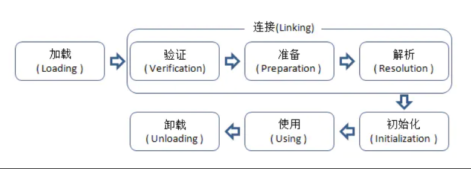
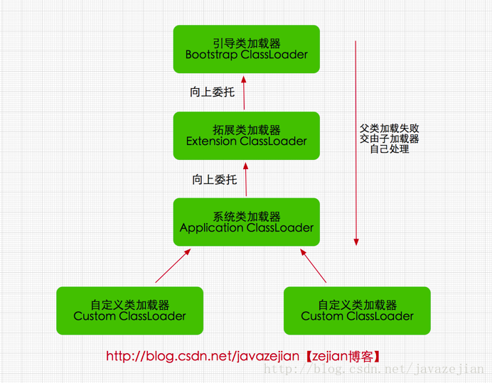
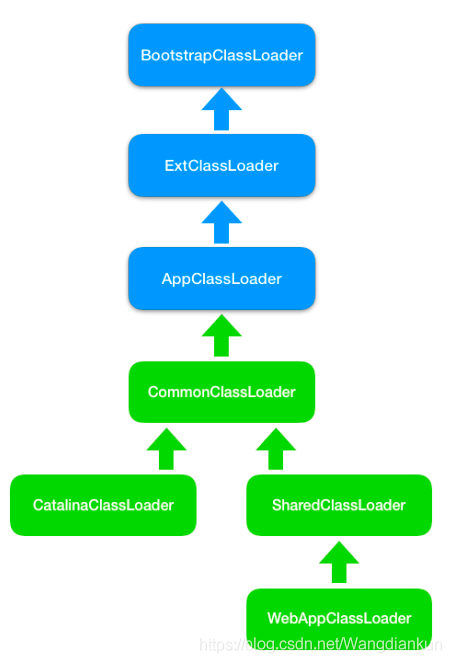

# 类加载机制

##  什么是类加载？类加载的过程（生命周期）？

虚拟机把描述类的数据加载到内存里面，并对数据进行校验、解析和初始化，最终变成可以被虚拟机直接使用的class对象；

类的整个生命周期包括：加载（Loading）、验证（Verification）、准备(Preparation)、解析(Resolution)、初始化(Initialization)、使用(Using)和卸载(Unloading)7个阶段。其中准备、验证、解析3个部分统称为连接（Linking）。如图所示：



加载、验证、准备、初始化和卸载这5个阶段的顺序是确定的，类的加载过程必须按照这种顺序按部就班地开始，而解析阶段则不一定：它在某些情况下可以在初始化阶段之后再开始，这是为了支持Java语言的运行时绑定（也称为动态绑定或晚期绑定）

类加载过程如下：

### 加载
加载分为三步：
  1. 通过类的全限定性类名获取该类的二进制流；
  2. 将该二进制流的静态存储结构转为方法区的运行时数据结构；
  3. 在堆中为该类生成一个class对象；
```
通过类的完全限定名称获取定义该类的二进制字节流。
- 其中二进制字节流可以从以下方式中获取
  - 从 ZIP 包读取，成为 JAR、EAR、WAR 格式的基础。
  - 从网络中获取，最典型的应用是 Applet。
  - 运行时计算生成，例如动态代理技术，在 java.lang.reflect.Proxy 使用 ProxyGenerator.generateProxyClass的代理类的二进制字节流。
  - 由其他文件生成，例如由 JSP 文件生成对应的 Class 类。
- 将该字节流表示的静态存储结构转换为方法区的运行时存储结构。
- 在内存中生成一个代表该类的 Class 对象，作为方法区中该类各种数据的访问入口
```

### 验证
> 验证该class文件中的字节流信息复合虚拟机的要求，不会威胁到jvm的安全；

确保 Class 文件的字节流中包含的信息符合当前虚拟机的要求，并且不会危害虚拟机自身的安全

### 准备：
> `为class对象的静态变量分配内存，初始化其初始值；`

准备阶段是正式为类变量（即静态变量，被static修饰的变量,并非实例变量）分配内存并设置类变量初 始值的阶段
- 类变量是被 static 修饰的变量，准备阶段为类变量分配内存并设置初始值，使用的是方法区的内存
  - 初始值一般为 0 值，例如下面的类变量 value 被初始化为 0 而不是 123。 `public static int value = 123;`
  - 如果类变量是常量，那么它将初始化为表达式所定义的值而不是 0。例如下面的常量 value 被初始化为 123 而不是0。 `public static final int value = 123;`
- 实例变量不会在这阶段分配内存，它会在对象实例化时随着对象一起被分配在堆中。应该注意到，实例化不是类加载的一个过程，类加载发生在所有实例化操作之前，并且类加载只进行一次，实例化可以进行多次。

### 解析：
> 该阶段主要完成符号引用转化成直接引用；

将常量池的符号引用替换为直接引用的过程
- 符号引用（Symbolic References）：符号引用以一组符号来描述所引用的目标，符号可以是任何 形式的字面量，只要使用时能无歧义地定位到目标即可
- 直接引用（Direct References）：直接引用是可以直接指向目标的指针、相对偏移量或者是一个能 间接定位到目标的句柄

举个例子来说，现在调用方法hello()，这个方法的地址是1234567，那么hello就是符号引用，1234567就是直接引用。

在解析阶段，虚拟机会把所有的类名，方法名，字段名这些符号引用替换为具体的内存地址或偏移量，也就是直接引用。

### 初始化：
> 到了初始化阶段，才开始执行类中定义的java代码；初始化阶段是调用类构造器的过程；
 
在类的class文件中，包含两个特殊的方法：`<clinit>`和`<init>`。这两个方法由编译器自动生成，分别代表类构造器和构造函数。其中构造函数可以由编程人员实现，而类构造器则由编译器自动生成。而初始化阶段则负责调用类构造器，来初始化变量和资源。
`<clinit>`方法由编译器自动收集类的赋值动作和静态语句块（static{}块）中的语句合并生成的，它有以下特点：

编译器收集的顺序由源文件中语句的顺序决定，静态语句块只能访问到在它之前定义的变量，在它之后定义的变量，它只能进行赋值操作，但不能访问。

```java
public class Test {
  static {
      // 变量赋值编译可以正常通过
      value = 2;
      // 访问变量编译失败
      System.out.println(i);
  }

    static int value = 1;
}
```
- 虚拟机保证在子类的`<clinit>`方法执行之前，父类的`<clinit>`方法已经执行完毕。因此父类中的操作对于子类都是可见的。
- 接口的`<clinit>`方法执行之前，不需要先执行父接口的`<clinit>`方法，只有父接口中定义的变量被使用时，父接口才会初始化。同时接口的实现类在初始化时也不会执行父接口的`<clinit>`方法。
- ``<clinit>``方法不是必须的，如果一个类或者接口没有变量赋值和静态语句块，则编译器可以不生成`<clinit>`方法。
- 虚拟机会保证`<clinit>`方法在多线程中被正确的加锁、同步。如果多个线程同时去初始化一个类，那么只有一个线程去执行`<clinit>`方法，其他线程会被阻塞。

## 什么是类加载器，常见的类加载器有哪些？

类加载器是指：通过一个类的全限定性类名获取该类的二进制字节流叫做类加载器；类加载器分为以下四种：


#### 1.引导类加载器 `bootstrap classloader`
启动类加载器主要加载的是JVM自身需要的类（java核心类库），这个类加载使用C++语言实现的，无法被java程序直接引用；
#### 2.扩展类加载器 `extensions classloader`
它负责加载`JAVA_HOME/lib/ext`目录下或者由系统变量`-Djava.ext.dir`指定位路径中的类库，开发者可以直接使用标准扩展类加载器，用来加载java的扩展库，java的虚拟机实现会提供一个扩展库目录，该类加载器在扩展库目录里面查找并加载java类；
#### 3.应用程序类加载器 `application classloader`
应用程序加载器是指 Sun公司实现的`sun.misc.Launcher$AppClassLoader`。它负责加载系统类路径`java -classpath`或`-D java.class.path` 指定路径下的类库，也就是我们经常用到的classpath路径，用来加载java的扩展库，java的虚拟机实现会提供一个扩展库目录，该类加载器在扩展库目录里面查找并加载java类；
#### 4.自定义类加载器 `java.lang.classloder`
由java语言实现，继承java.lang.ClassLoader类的方式


# 双亲委派模型
当一个类加载器收到一个类加载的请求，他首先不会尝试自己去加载，而是将这个请求委派给父类加载器去加载，只有父类加载器在自己的搜索范围类查找不到给类时，子加载器才会尝试自己去加载该类；

为了防止内存中出现多个相同的字节码；因为如果没有双亲委派的话，用户就可以自己定义一个java.lang.String类，那么就无法保证类的唯一性。

该模型要求除了顶层的启动类加载器外，其它的类加载器都要有自己的父类加载器

## 工作过程
一个类加载器首先将类加载请求转发到父类加载器，只有当父类加载器无法完成时才尝试自己加载
### 好处
保证了基础类是唯一的
- 它使得类有了层次的划分。就拿`java.lang.Object`来说，你加载它经过一层层委托最终是由Bootstrap ClassLoader来加载的，也就是最终都是由Bootstrap ClassLoader去找`<JAVA_HOME>\lib`中`rt.jar`里面的`java.lang.Object`加载到JVM中。
- 这样如果有不法分子自己造了个`java.lang.Object`,里面嵌了不好的代码，如果我们是按照双亲委派模型来实现的话，最终加载到JVM中的只会是我们`rt.jar`里面的东西，也就是这些核心的基础类代码得到了保护。因为这个机制使得系统中只会出现一个`java.lang.Object`。不会乱套了。你想想如果我们JVM里面有两个Object,那岂不是天下大乱了
### ClassLoader用过吗？用在哪些方面
#### 1、依赖冲突
实际项目中如果出现需要同时依赖多个版本的jar包，可以自定义类加载器分别加载各自的依赖jar即可
#### 2、热加载
可以让RestartClassLoader为自定义的类加载器，其核心是loadClass的加载方式，我们发现其通过修改了双亲委托机制，默认优先从自己加载，如果自己没有加载到，从从parent进行加载。这样保证了业务代码可以优先被RestartClassLoader加载。进而通过重新加载RestartClassLoader即可完成应用代码部分的重新加载。
#### 3、加密保护
- 打包时加密class文件
- 加载时使用实现解密的classloader

## 怎么打破双亲委派模型？
- 自定义类加载器，并使用自定义类加载器
- 继承ClassLoader类
- 重写loadClass方法和findClass方法

## 列举一些你知道的打破双亲委派机制的例子，为什么要打破？
- JNDI 通过引入线程上下文类加载器，可以在 Thread.setContextClassLoader 方法设置，默认是应用程序类加载器，来加载 SPI 的代码。有了线程上下文类加载器，就可以完成父类加载器请求子类加载器完成类加载的行为。打破的原因，是为了 JNDI 服务的类加载器是启动器类加载，为了完成高级类加载器请求子类加载器（即上文中的线程上下文加载器）加载类。

- Tomcat，应用的类加载器优先自行加载应用目录下的 class，并不是先委派给父加载器，加载不了才委派给父加载器。

  tomcat之所以造了一堆自己的classloader，大致是出于下面三类目的：

  - 对于各个 `webapp`中的 `class`和 `lib`，需要相互隔离，不能出现一个应用中加载的类库会影响另一个应用的情况，而对于许多应用，需要有共享的lib以便不浪费资源。
  - 与 `jvm`一样的安全性问题。使用单独的 `classloader`去装载 `tomcat`自身的类库，以免其他恶意或无意的破坏；
  - 热部署。

  tomcat类加载器如下图：

  

- OSGi，实现模块化热部署，为每个模块都自定义了类加载器，需要更换模块时，模块与类加载器一起更换。其类加载的过程中，有平级的类加载器加载行为。打破的原因是为了实现模块热替换。

- JDK 9，Extension ClassLoader 被 Platform ClassLoader 取代，当平台及应用程序类加载器收到类加载请求，在委派给父加载器加载前，要先判断该类是否能够归属到某一个系统模块中，如果可以找到这样的归属关系，就要优先委派给负责那个模块的加载器完成加载。打破的原因，是为了添加模块化的特性。


## Tomcat是如何隔离Web应用的？

Tomcat通过自定义的类加载器WebAppClassLoader打破了双亲委托机制，目的就是为了优化加载Web应用目录下的类。Tomcat 作为 Servlet 容器，它负责加载我们Servlet 类，此外它还负责加载 Servlet 所依赖的 JAR 包。并且Tomcat 本身也是也是一个 Java 程序，因此它需要加载自己的类和依赖的 JAR 包。

如果Tomcat里面运行了两个Web应用程序，两个Web应用程序中有同名的Servlet，但功能不同，Tomcat需要同时加载和管理这两个同名的 Servlet 类，保证它们不会冲突，因此 Web 应用之间的类需要隔离。

如果如两个 Web 应用都依赖同一个第三方的 JAR 包，比如 Spring，那 Spring 的 JAR 包被加载到内存后，Tomcat 要保证这两个 Web 应用能够共享，也就是说Spring 的 JAR 包只被加载一次，否则随着依赖的第三方JAR 包增多，JVM 的内存会膨胀。

同时，跟JVM一样，我们需要隔离Tomcat本身的类和Web应用类。
### Tomcat的类加载器的层次结构
为了解决AppClassLoader，同类名的Servlet类只能被加载一次。Tomcat 自定义一个类加载器WebAppClassLoader， 并且给每个 Web 应用创建一个类加载器实例。Context 容器组件对应一个 Web应用，因此，每个 Context 容器负责创建和维护一个WebAppClassLoader 加载器实例。原理是，不同的加载器实例加载的类被认为是不同的类，即使它们的类名相同。这就相当于在 Java 虚拟机内部创建了一个个相互隔离的 Java 类空间，每一个 Web 应用都有自己的类空间，Web 应用之间通过各自的类加载器互相隔离。


为了Tomcat可以存放多个Web应用，Tomcat实现了Web应用的隔离，从而达到可以加载不同Web应用下相同名的Servlet类，从而编写了自己的类加载器，其内部类加载器模型如上图所示
1. SharedClassLoader：该类加载器存在是为了解决不同Web应用之间共享类库，并且不会重复加载相同的类。它作为WebAppClassLoader的父加载器，专门加载Web应用之间的共享类。
2. CatalinaClassloader：该类加载器专门加载Tomcat自身的类，从而和web应用的类做一个隔离。
3. CommonClassLoad：CatalinaClassLader实现了Tomcat类和web应用类的隔离，如果二者之间需要共享一些类怎么办？这里就需要CommonClassLoad，它所加载的所有类都可以被SharedClassLoader和CatalinaClassLoader使用，从而实现web应用和tomcat对一些类的共享。
### 补充Spring的加载问题
在 JVM 的实现中有一条隐含的规则，默认情况下，如果一个类由类加载器 A 加载，那么这个类的依赖类也是由相同的类加载器加载。比如 Spring 作为一个 Bean 工厂，它需要创建业务类的实例，并且在创建业务类实例之前需要加载这些类。Spring 是通过调用Class.forName来加载业务类的。

我在前面提到，Web 应用之间共享的 JAR 包可以交给SharedClassLoader 来加载，从而避免重复加载。Spring作为共享的第三方 JAR 包，它本身是由SharedClassLoader 来加载的，Spring 又要去加载业务类，按照前面那条规则，加载 Spring 的类加载器也会用来加载业务类，但是业务类在 Web 应用目录下，不在SharedClassLoader 的加载路径下，这该怎么办呢？

于是线程上下文加载器登场了，它其实是一种类加载器传递机制。为什么叫作“线程上下文加载器”呢，因为这个类加载器保存在线程私有数据里，只要是同一个线程，一旦设置了线程上下文加载器，在线程后续执行过程中就能把这个类加载器取出来用。因此 Tomcat 为每个 Web 应用创建一个WebAppClassLoarder 类加载器，并在启动 Web 应用的线程里设置线程上下文加载器，这样 Spring 在启动时就将线程上下文加载器取出来，用来加载 Bean。

# 参考文章
- https://www.cnblogs.com/jay-wu/p/11590571.html
- https://juejin.cn/post/6844903733952774152
- https://blog.csdn.net/Wangdiankun/article/details/105819963
