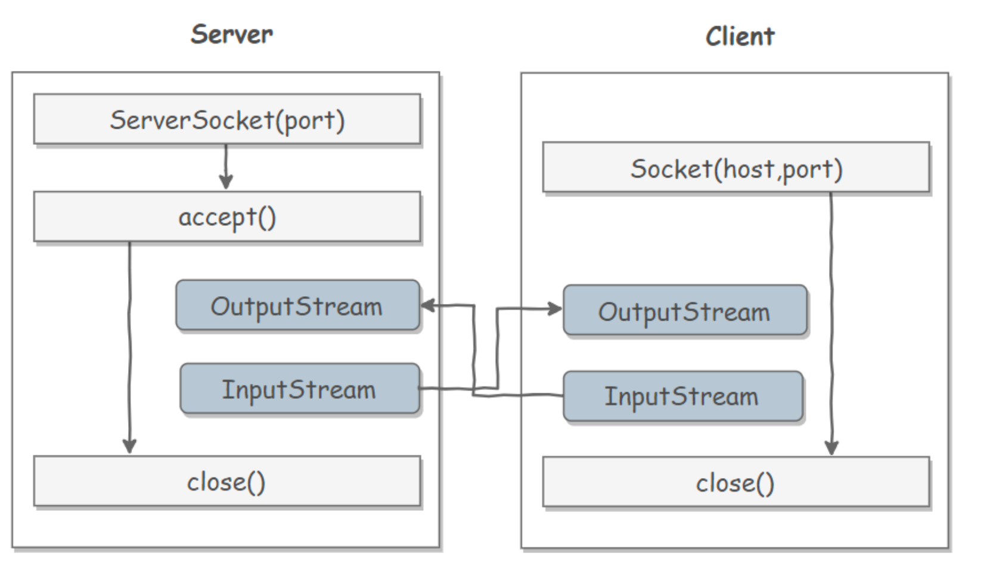
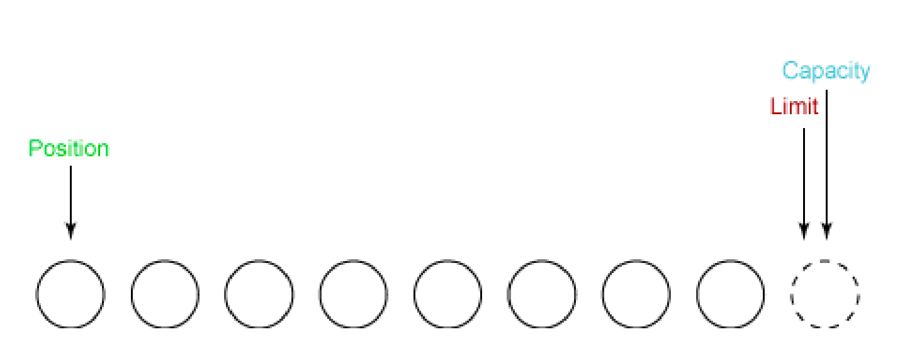
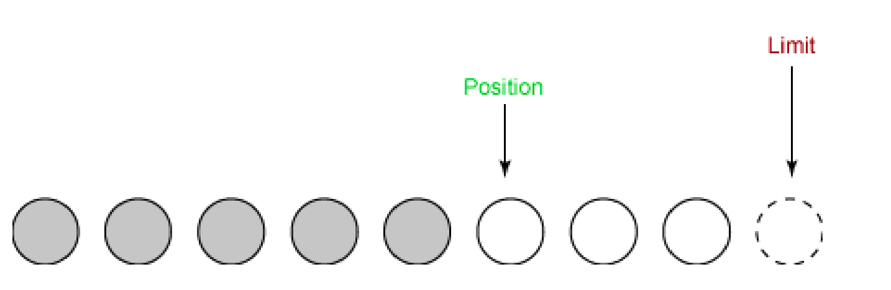
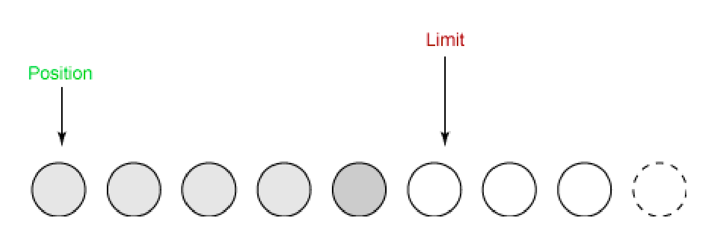
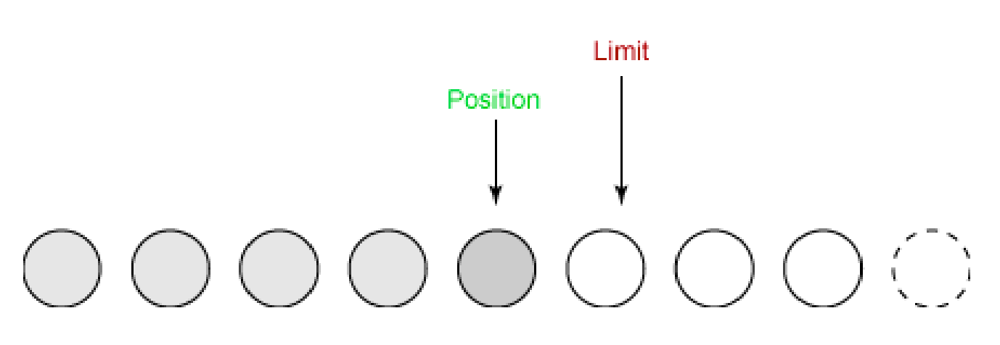
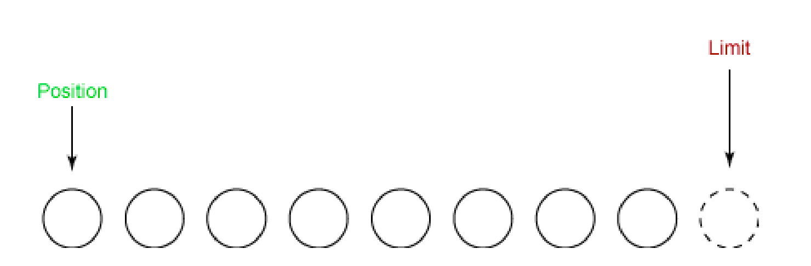
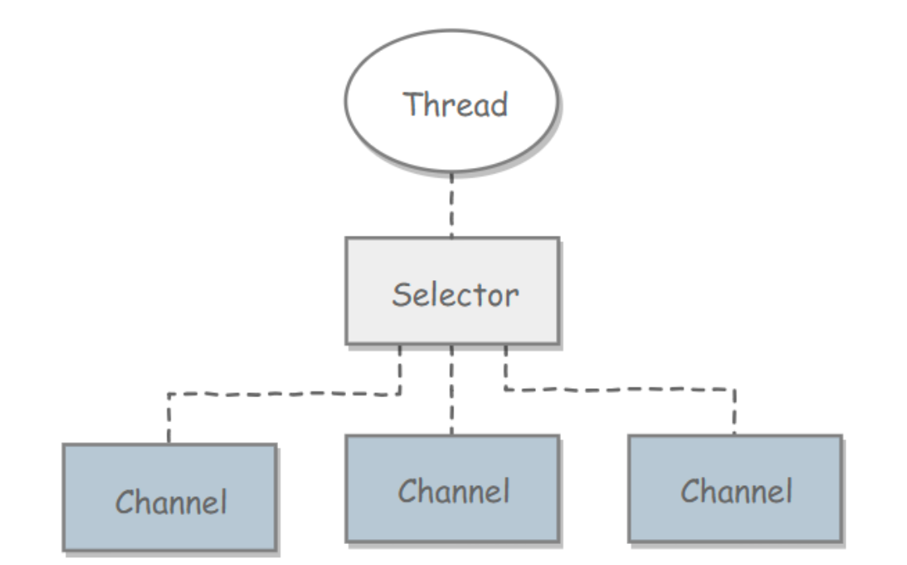

# IO
### JavaIO流分类

* 按照流的方向：输入流（inputStream）和输出流（outputStream）；
* 按照实现功能分：节点流（可以从或向一个特定的地方读写数据，如 FileReader）和处理流（是对一个已存在的流的连接和封装，通过所封装的流的功能调用实现数据读写， BufferedReader）；
* 按照处理数据的单位： 字节流和字符流。分别由四个抽象类来表示（每种流包括输入和输出两种所以一共四个）:InputStream，OutputStream，Reader，Writer。Java中其他多种多样变化的流均是由它们派生出来的。


### BIO、NIO、AIO的区别

|特性|BIO(阻塞IO)|NIO(非阻塞IO)|AIO(异步IO)|
|:------:|:------:|:-------:|:-----:|
|模型类型|同步阻塞|同步非阻塞|异步非阻塞|
|线程要求|1连接1线程|单线程多连接|无额外线程|
|吞吐量|低|高|极高|
|编程复杂度|简单|复杂|中等|
|JDK支持|Java 1.0+|Java 1.4+|Java 7+|
|底层机制|流(Stream)|选择器(Selector)|回调(Callback)|
|适用场景|低并发、短连接|高并发、长连接|超大文件、高吞吐|

**BIO（阻塞IO）**
```
同步并阻塞，在服务器中实现的模式为 一个连接一个线程
客户端有连接请求的时候，服务器就需要启动一个线程进行处理，如果这个连接不做任何事情会造成不必要的线程开销，当然这也可以通过线程池机制改善。
BIO一般适用于连接数目小且固定的架构 ，这种方式对于服务器资源要求比较高，而且并发局限于应用中，是JDK1.4之前的唯一选择，但好在程序直观简单，易理解。
```
**NIO（非阻塞IO）**
```
同步并非阻塞，在服务器中实现的模式为 一个请求一个线程
客户端发送的连接请求都会注册到多路复用器上，多路复用器轮询到有连接IO请求时才会启动一个线程进行处理。
NIO一般适用于连接数目多且连接比较短（轻操作）的架构** ，并发局限于应用中，编程比较复杂，从JDK1.4开始支持。
```
**AIO（异步IO）**
```
异步并非阻塞，在服务器中实现的模式为 一个有效请求一个线程
客户端的IO请求都是通过操作系统先完成之后，再通知服务器应用去启动线程进行处理。
AIO一般适用于连接数目多且连接比较长（重操作）的架构，充分调用操作系统参与并发操作，编程比较复杂，从JDK1.7开始支持。
```
### Java IO都有哪些设计模式

使用了**适配器模式**和**装饰器模式**

**适配器模式**：

```java
Reader reader = new INputStreamReader(inputStream);
```

**把一个类的接口变换成客户端所期待的另一种接口，从而使原本因接口不匹配而无法在一起工作的两个类能够在一起工作**

- **类适配器**：Adapter类（适配器）继承Adaptee类（源角色）实现Target接口（目标角色）
- **对象适配器**：Adapter类（适配器）持有Adaptee类（源角色）对象实例，实现Target接口（目标角色）
  

**装饰器模式**：

```java
new BufferedInputStream(new FileInputStream(inputStream));
```

**一种动态地往一个类中添加新的行为的设计模式。就功能而言，装饰器模式相比生成子类更为灵活，这样可以给某个对象而不是整个类添加一些功能。**

- ConcreteComponent（具体对象）和Decorator（抽象装饰器）实现相同的Conponent（接口）并且Decorator（抽象装饰器）里面持有Conponent（接口）对象，可以传递请求。
- ConcreteComponent（具体装饰器）覆盖Decorator（抽象装饰器）的方法并用super进行调用，传递请求。


---

## 文件io
### 磁盘操作
```java
public static void listAllFiles(File dir){
    if(dir == null || !dir.exists()){
        return;
    }
    if (dir.isFile()){
        System.out.println(dir.getName());
        return;
    }
    for (File file : dir.listFiles()) {
        listAllFiles(file);
    }
}
```
### 字节流
可以处理任意类型的数据
```java
public static void copyFile(String src, String dist) throws IOException {
    FileInputStream in = new FileInputStream(src);
    FileOutputStream out = new FileOutputStream(dist);

    byte[] buffer = new byte[20 * 1024];
    int cnt;
    //read()最多读取buffer.length个字节
    //返回的是实际读取的个数
    //返回-1的时候表示读到eof，即文件尾
    while ((cnt = in.read(buffer, 0, buffer.length)) != -1) {
        out.write(buffer, 0, cnt);
    }
    in.close();
    out.close();
}
```
- inputStream
  - FileInputStream
- outputStream
  - FileOutputStream
### 字符流
- 只能处理字符类型的数据
```java
public static void readFileContent(String filePath) throws IOException {
    FileReader fileReader = new FileReader(filePath);
    BufferedReader bufferedReader = new BufferedReader(fileReader);
    String line;
    while ((line = bufferedReader.readLine()) != null) {
        System.out.println(line);
    }
    //装饰者模式使得BufferedReader 组合了一个Reader对象
    //在调用BufferedReader的close()方法时会去调用Reader的close()方法
    //因此只要一个close()即可
    bufferedReader.close();
}
```

- 编码与解码
  - 编码就是把字符转换为字节，而解码是把字节重新组合成字符。
- Reader
- InputStreamReader
实现从字节流解码成字符流
- Writer
- InputStreamWriter
实现字符流编码成为字节流

### 字符流与字节流的区别？

- 读写的时候字节流是按字节读写，字符流按字符读写。
- 字节流适合所有类型文件的数据传输，因为计算机字节（Byte）是电脑中表示信息含义的最小单位。字符流只能够处理纯文本数据，其他类型数据不行，但是字符流处理文本要比字节流处理文本要方便。
- 在读写文件需要对内容按行处理，比如比较特定字符，处理某一行数据的时候一般会选择字符流。
- 只是读写文件，和文件内容无关时，一般选择字节流。


## 序列化

### 什么是序列化与反序列化

Java序列化是指把Java对象转换为字节序列的过程，而Java反序列化是指把字节序列恢复为Java对象的过程：

- **序列化：** 序列化就是一种用来处理对象流的机制，将对象的内容进行流化（把对象转换成有序字节流），以便在网络上传输或者保存在本地文件中。

    核心作用是对象状态的保存与重建。我们都知道，Java对象是保存在JVM的堆内存中的，也就是说，如果JVM堆不存在了，那么对象也就跟着消失了。
    ```
    可以对流化后的对象进行读写操作，可以将流化后的对象传输于网络之间。序列化是为了解决在对象流读写操作时所引发的问题
    ```
    而序列化提供了一种方案，可以让你在即使JVM停机的情况下也能把对象保存下来的方案。就像我们平时用的U盘一样。把Java对象序列化成可存储或传输的形式（如二进制流），比如保存在文件中。这样，当再次需要这个对象的时候，从文件中读取出二进制流，再从二进制流中反序列化出对象。
    ```
    方便存储和传输
    ```

- **反序列化：** 客户端从文件中或网络上获得序列化后的对象字节流，根据字节流中所保存的对象状态及描述信息，通过反序列化重建对象。

- 序列化：`ObjectOutputStream.writeObject()`
- 反序列化：`ObjectInputStream.readObject()`

### 为什么需要序列化与反序列化？

简要描述：**对内存中的对象进行持久化或网络传输, 这个时候都需要序列化和反序列化**

深入描述：

1. **对象序列化可以实现分布式对象。**

主要应用例如：RMI(即远程调用Remote Method Invocation)要利用对象序列化运行远程主机上的服务，就像在本地机上运行对象时一样。

2. **java对象序列化不仅保留一个对象的数据，而且递归保存对象引用的每个对象的数据。**

可以将整个对象层次写入字节流中，可以保存在文件中或在网络连接上传递。利用对象序列化可以进行对象的"深复制"，即复制对象本身及引用的对象本身。序列化一个对象可能得到整个对象序列。

3. **序列化可以将内存中的类写入文件或数据库中。**

比如：将某个类序列化后存为文件，下次读取时只需将文件中的数据反序列化就可以将原先的类还原到内存中。也可以将类序列化为流数据进行传输。

总的来说就是将一个已经实例化的类转成文件存储，下次需要实例化的时候只要反序列化即可将类实例化到内存中并保留序列化时类中的所有变量和状态。

4. **对象、文件、数据，有许多不同的格式，很难统一传输和保存。**

序列化以后就都是字节流了，无论原来是什么东西，都能变成一样的东西，就可以进行通用的格式传输或保存，传输结束以后，要再次使用，就进行反序列化还原，这样对象还是对象，文件还是文件。

### 序列化的实现

将需要被序列化的类实现 **Serializable** 接口或者 **Externalizable** 接口。

#### **Serializable**接口

**类通过实现 `java.io.Serializable` 接口以启用其序列化功能**。可序列化类的所有子类型本身都是可序列化的。**序列化接口没有方法或字段，仅用于标识可序列化的语义。**

如以下例子：

```java
import java.io.Serializable;

public class User implements Serializable {
   private String name;
   private int age;
   public String getName() {
       return name;
   }
   public void setName(String name) {
       this.name = name;
   }

   @Override
   public String toString() {
       return "User{" +
               "name='" + name +
               '}';
   }
}
```

通过下面的代码进行序列化及反序列化：

```java
public class SerializableDemo {

   public static void main(String[] args) {
       //Initializes The Object
       User user = new User();
       user.setName("cosen");
       System.out.println(user);

       //Write Obj to File
       try (FileOutputStream fos = new FileOutputStream("tempFile"); ObjectOutputStream oos = new ObjectOutputStream(
           fos)) {
           oos.writeObject(user);
       } catch (IOException e) {
           e.printStackTrace();
       }

       //Read Obj from File
       File file = new File("tempFile");
       try (ObjectInputStream ois = new ObjectInputStream(new FileInputStream(file))) {
           User newUser = (User)ois.readObject();
           System.out.println(newUser);
       } catch (IOException | ClassNotFoundException e) {
           e.printStackTrace();
       }
   }
}

//OutPut:
//User{name='cosen'}
//User{name='cosen'}
```


#### **Externalizable**接口

`Externalizable`继承自`Serializable`，该接口中定义了两个抽象方法：`writeExternal()`与`readExternal()`。

当使用`Externalizable`接口来进行序列化与反序列化的时候需要开发人员重写`writeExternal()`与`readExternal()`方法。否则所有变量的值都会变成默认值。

```java
public class User implements Externalizable {

   private String name;
   private int age;

   public String getName() {
       return name;
   }
   public void setName(String name) {
       this.name = name;
   }
   public void writeExternal(ObjectOutput out) throws IOException {
       out.writeObject(name);
   }
   public void readExternal(ObjectInput in) throws IOException, ClassNotFoundException {
       name = (String) in.readObject();
   }

   @Override
   public String toString() {
       return "User{" +
               "name='" + name +
               '}';
   }
}
```

通过下面的代码进行序列化及反序列化：

```java
public class ExternalizableDemo1 {

  public static void main(String[] args) {
      //Write Obj to file
      User user = new User();
      user.setName("cosen");
      try(ObjectOutputStream oos = new ObjectOutputStream(new FileOutputStream("tempFile"))){
          oos.writeObject(user);
      } catch (IOException e) {
          e.printStackTrace();
      }

      //Read Obj from file
      File file = new File("tempFile");
      try(ObjectInputStream ois =  new ObjectInputStream(new FileInputStream(file))){
          User newInstance = (User) ois.readObject();
          //output
          System.out.println(newInstance);
      } catch (IOException | ClassNotFoundException e ) {
          e.printStackTrace();
      }
  }
}

//OutPut:
//User{name='cosen'}
```

##### 两种序列化的对比

| 实现Serializable接口                                         | 实现Externalizable接口   |
| ------------------------------------------------------------ | ------------------------ |
| 系统自动存储必要的信息                                       | 程序员决定存储哪些信息   |
| Java内建支持，易于实现，只需要实现该接口即可，无需任何代码支持 | 必须实现接口内的两个方法 |
| 性能略差                                                     | 性能略好                 |

### Java 序列化中如果有些字段不想进行序列化，怎么办？

对于不想进行序列化的变量，使用 transient 关键字修饰。

`transient` 关键字的作用是控制变量的序列化，在变量声明前加上该关键字，可以阻止该变量被序列化到文件中，在被反序列化后，`transient` 变量的值被设为初始值，如 int 型的是 0，对象型的是 null。transient 只能修饰变量，不能修饰类和方法。

```
- transient 关键字可以使一些属性不会被序列化
- ArrayList 中存储数据的数组 elementData 是用 transient 修饰的，因为这个数组是动态扩展的，并不是所有的空间都被使用，因此就不需要所有的内容都被序列化。通过重写序列化和反序列化方法，使得可以只序列化数组中有内容的那部分数据。
  - `private transient Object[] elementData;`
```

### 静态变量会被序列化吗?

不会。因为序列化是针对对象而言的, 而静态变量优先于对象存在, 随着类的加载而加载, 所以不会被序列化.

看到这个结论, 是不是有人会问, serialVersionUID也被static修饰, 为什么serialVersionUID会被序列化? 其实serialVersionUID属性并没有被序列化, JVM在序列化对象时会自动生成一个serialVersionUID, 然后将我们显示指定的serialVersionUID属性值赋给自动生成的serialVersionUID。


## 网络io
### InetAddress
用于表示网络上的硬件资源，即 IP 地址；
- InetAddress.getByName(String host);
- InetAddress.getByAddress(byte[] address);
### URL
案例
```java
public static void main(String[] args) throws IOException {
    URL url = new URL("http://www.baidu.com");
    //字节流
    InputStream is = url.openStream();
    //字符流
    InputStreamReader isr = new InputStreamReader(is, StandardCharsets.UTF_8);
    //提供缓存功能
    BufferedReader br = new BufferedReader(isr);
    String line;
    while ((line = br.readLine()) != null) {
        System.out.println(line);
    }
    br.close();
}
```
### socket
```java
public class IOServer {
    public static void main(String[] args) throws Exception {
        ServerSocket serverSocket = new ServerSocket(8000);
        //接收新线程
        new Thread(() -> {
            while (true) {
                try {
                    //1-阻塞方法获取新连接
                    Socket socket = serverSocket.accept();
                    //2-每一个新连接都创建一个线程，负责读取数据
                    new Thread(() -> {
                        try {
                            int len;
                            byte[] data = new byte[1024];
                            InputStream inputStream = socket.getInputStream();
                            //3-按字节流方式读取数据
                            while ((len = inputStream.read(data)) != -1) {
                                System.out.println(new String(data, 0, len));
                            }
                        } catch (IOException e) {
                            e.printStackTrace();
                        }
                    }).start();
                } catch (Exception e) {
                    e.printStackTrace();
                }
            }
        }).start();
    }
}
```

### 特点
同步阻塞，一个线程只能处理一个请求，如果要处理多个请求需要开启多个线程

## NIO
### 什么是NIO
新的输入/输出 (NIO) 库是在 JDK 1.4 中引入的，弥补了原来的 I/O 的不足，提供了高速的、面向块的 I/O
### 流与块
I/O 与 NIO 最重要的区别是数据打包和传输的方式，I/O 以流的方式处理数据，而 NIO 以块的方式处理数据。
### 通道 Channel
- 是对原 I/O 包中的流的模拟，可以通过它读取和写入数据
- 特点
  - 通道与流的不同之处在于，流只能在一个方向上移动(一个流必须是 InputStream 或者 OutputStream 的子类)，而通道是双向的，可以用于读、写或者同时用于读写。
- 类型
  - FileChannel：从文件中读写数据；
  - DatagramChannel：通过 UDP 读写网络中数据；
  - SocketChannel：通过 TCP 读写网络中数据；
  - ServerSocketChannel：可以监听新进来的 TCP 连接，对每一个新进来的连接都会创建一个 SocketChannel。
### 缓冲区Buffer
- 发送给一个通道的所有数据都必须首先放到缓冲区中，同样地，从通道中读取的任何数据都要先读到缓冲区中。也就是说，不会直接对通道进行读写数据，而是要先经过缓冲区。
- 缓冲区实质上是一个数组，但它不仅仅是一个数组。缓冲区提供了对数据的结构化访问，而且还可以跟踪系统的读/写进程。
- 类型
  - ByteBuffer
  - CharBuffer
  - ShortBuffer
  - IntBuffer
  - LongBuffer
  - FloatBuffer
  - DoubleBuffer
- 缓冲区状态变量
  - capacity：最大容量；
  - position：当前已经读写的字节数；
    - 下一个要被读取或者写入的元素的索引
  - limit：还可以读写的字节数。
    - 缓冲区中第一个不能被读或者写的位置
- 状态变量的改变过程
  1. 新建一个大小为 8 个字节的缓冲区，此时 position 为 0，而 limit = capacity = 8。capacity 变量不会改变
     
  2. 从输入通道中读取 5 个字节数据写入缓冲区中，此时 position 为 5，limit 保持不变。
     
  3. 在将缓冲区的数据写到输出通道之前，需要先调用 flip() 方法，这个方法将 limit 设置为当前 position，并将position 设置为 0。
     
  4. 从缓冲区中取 4 个字节到输出缓冲中，此时 position 设为 4。
     
  5. 最后需要调用 clear() 方法来清空缓冲区，此时 position 和 limit 都被设置为最初位置。
     
- 文件 NIO 实例
```java
public static void fastCopy(String src, String dist) throws IOException {
    //获取源文件的输入字节流
    FileInputStream fin = new FileInputStream(src);
    //获取输入字节流的文件通道
    FileChannel fcin = fin.getChannel();
    //获取目标文件的输出字节流
    FileOutputStream fout = new FileOutputStream(dist);
    //获取输出字节流的文件通道
    FileChannel fcout = fout.getChannel();
    //为缓冲区分配1024字节
    ByteBuffer buffer = ByteBuffer.allocateDirect(1024);
    while (true) {
        //从输入通道中读取数据到缓冲区
        int r = fcin.read(buffer);
        //read()返回 -1 表示EOF
        if (r == -1) {
            break;
        }
        //切换读写
        buffer.flip();
        //把缓冲区的内容写入输出文件中
        fcout.write(buffer);
        //清空缓冲区
        buffer.clear();
    }
}
```
### 选择器 Selector
#### 选择器
##### 什么是选择器

- NIO 常常被叫做非阻塞 IO，主要是因为 NIO 在网络通信中的非阻塞特性被广泛使用。
- NIO 实现了 IO 多路复用中的 Reactor 模型，一个线程 Thread 使用一个选择器 Selector 通过轮询的方式去监听多个通道 Channel 上的事件，从而让一个线程就可以处理多个事件。
- 通过配置监听的通道 Channel 为非阻塞，那么当 Channel 上的 IO 事件还未到达时，就不会进入阻塞状态一直等待，而是继续轮询其它 Channel，找到 IO 事件已经到达的 Channel 执行。
- 因为创建和切换线程的开销很大，因此使用一个线程来处理多个事件而不是一个线程处理一个事件，对于 IO 密集型的应用具有很好地性能。
- 应该注意的是，只有套接字 Channel 才能配置为非阻塞，而 FileChannel 不能，因为 FileChannel 配置非阻塞也没有意义。
#### 流程
- 创建选择器
`Selector selector = Selector.open();`
- 将通道注册到选择器上
  ```
  ServerSocketChannel ssChannel = ServerSocketChannel.open();
  ssChannel.configureBlocking(false);
  ssChannel.register(selector, SelectionKey.OP_ACCEPT);
  ```
  - 事件
    - `SelectionKey.OP_CONNECT`
    - `SelectionKey.OP_ACCEPT`
    - `SelectionKey.OP_READ`
    - `SelectionKey.OP_WRITE`
- 监听事件
  `int num = selector.select();`
  - 它会一直阻塞直到有至少一个事件到达。
- 获取到达的事件
```java
Set<SelectionKey> keys = selector.selectedKets();
Iterator<SelectionKey> keyIterator = keys.iterator();
while(keyIterator.hasNext()){
    SelectionKey key = keyIterator.next();
    if(key.isAcceptable()){
        //....
    } else if (key.isReadable()){
        //....    
    }
    keyIterator.remove();
}
``` 
- 事件循环
  因为一次 select() 调用不能处理完所有的事件，并且服务器端有可能需要一直监听事件，因此服务器端处理事件的代码一般会放在一个死循环内。
```java
while(true){
    int num = selector.select();
    Set<SelectionKey> keys = selector.selectedKets();
    Iterator<SelectionKey> keyIterator = keys.iterator();
    while(keyIterator.hasNext()){
        SelectionKey key = keyIterator.next();
        if(key.isAcceptable()){
            //....
        } else if (key.isReadable()){
            //....    
        }
        keyIterator.remove();
    }    
}
```
- nio示例
```java
public class NIOServer {
    public static void main(String[] args) throws IOException {
        Selector selector = Selector.open();
        ServerSocketChannel ssChannel = ServerSocketChannel.open();
        ssChannel.configureBlocking(false);
        ssChannel.register(selector, SelectionKey.OP_ACCEPT);

        ServerSocket serverSocket = ssChannel.socket();
        InetSocketAddress address = new InetSocketAddress("127.0.0.1", 8888);
        serverSocket.bind(address);

        while (true) {
            selector.select();
            Set<SelectionKey> keys = selector.selectedKeys();
            Iterator<SelectionKey> keyIterator = keys.iterator();

            while (keyIterator.hasNext()) {
                SelectionKey key = keyIterator.next();

                if (key.isAcceptable()) {
                    ServerSocketChannel ssChannel1 = (ServerSocketChannel) key.channel();
                    //服务器会为每个新连接创建一个SocketChannel
                    SocketChannel sChannel = ssChannel1.accept();
                    sChannel.configureBlocking(false);

                    //这个新连接主要用于从客服端读取数据
                    sChannel.register(selector, SelectionKey.OP_READ);
                } else if (key.isReadable()) {
                    SocketChannel sChannel = (SocketChannel) key.channel();
                    System.out.println(readDataFromSocketChannel(sChannel));
                    sChannel.close();
                }
                keyIterator.remove();
            }
        }
    }

    private static String readDataFromSocketChannel(SocketChannel sChannel) throws IOException {
        ByteBuffer buffer = ByteBuffer.allocate(1024);
        StringBuilder data = new StringBuilder();
        while (true) {
            buffer.clear();
            int n = sChannel.read(buffer);
            if (n == -1) {
                break;
            }
            buffer.flip();
            int limit = buffer.limit();
            char[] dst = new char[limit];
            for (int i = 0; i < limit; i++) {
                dst[i] = (char) buffer.get(i);
            }
            data.append(dst);
            buffer.clear();
        }
        return data.toString();
    }
}
```
```java
public static class NIOClient{
    public static void main(String[] args) throws IOException {
        Socket socket = new Socket("127.0.0.1",8888);
        OutputStream out = socket.getOutputStream();
        String s = "hello world";
        out.write(s.getBytes(StandardCharsets.UTF_8));
        out.close();
    }
}
```
### NIO的bug
JDK NIO的BUG，例如臭名昭著的epoll bug，它会导致Selector空轮询，最终导致CPU 100%。官方声称在JDK1.6版本的update18修复了该问题，但是直到JDK1.7版本该问题仍旧存在，只不过该BUG发生概率降低了一些而已，它并没有被根本解决

**Selector BUG出现的原因**

因为poll和epoll对于突然中断的连接socket会对返回的eventSet事件集合置为EPOLLHUP或者EPOLLERR，eventSet事件集合发生了变化，这就导致Selector会被唤醒，唤醒后遍历，若Selector的轮询结果为空，也没有wakeup或新消息处理，则发生空轮询，CPU使用率100%，

**Netty的解决办法**
- 对Selector的select操作周期进行统计，每完成一次空的select操作进行一次计数，
- 若在某个周期内连续发生N次空轮询，则触发了epoll死循环bug。
- 重建Selector，判断是否是其他线程发起的重建请求，若不是则将原SocketChannel从旧的Selector上去除注册，重新注册到新的Selector上，并将原来的Selector关闭。
