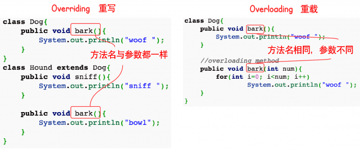

# Java概述

## Java语言有哪些特点？

* 面向对象（封装，继承，多态）；

* 平台无关性，平台无关性的具体表现在于，Java 是“一次编写，到处运行（Write Once，Run any Where）”的语言，因此采用 Java 语言编写的程序具有很好的可移植性，而保证这一点的正是 Java 的虚拟机机制。在引入虚拟机之后，Java 语言在不同的平台上运行不需要重新编译。

* 可靠性、安全性；

* 支持多线程。C++ 语言没有内置的多线程机制，因此必须调用操作系统的多线程功能来进行多线程程序设计，而 Java 语言却提供了多线程支持；

* 支持网络编程并且很方便。Java 语言诞生本身就是为简化网络编程设计的，因此 Java 语言不仅支持网络编程而且很方便；

* 编译与解释并存；

## 面向对象

### 面向对象和面向过程的区别？

**面向过程**：

* 优点：性能比面向对象高，因为类调用时需要实例化，开销比较大，比较消耗资源;比如单片机、嵌入式开发、Linux/Unix等一般采用面向过程开发，性能是最重要的因素。

* 缺点：没有面向对象易维护、易复用、易扩展。

**面向对象**：

* 优点：易维护、易复用、易扩展，由于面向对象有封装、继承、多态性的特性，可以设计出低耦合的系统，使系统更加灵活、更加易于维护。

* 缺点：性能比面向过程低。

### 讲讲面向对象三大特性

- 封装。封装最好理解了。封装是面向对象的特征之一，是对象和类概念的主要特性。封装，也就是把客观事物封装成抽象的类，并且类可以把自己的数据和方法只让可信的类或者对象操作，对不可信的进行信息隐藏。
- 继承。继承是指这样一种能力：它可以使用现有类的所有功能，并在无需重新编写原来的类的情况下对这些功能进行扩展。通过继承创建的新类称为“子类”或“派生类”，被继承的类称为“基类”、“父类”或“超类”。
- 多态性。它是指在父类中定义的属性和方法被子类继承之后，可以具有不同的数据类型或表现出不同的行为，这使得同一个属性或方法在父类及其各个子类中具有不同的含义。

### Java语言是如何实现多态的？

本质上多态分两种：

> **1、编译时多态（又称静态多态）**
>
> **2、运行时多态（又称动态多态）**

重载（overload）就是编译时多态的一个例子，编译时多态在编译时就已经确定，运行的时候调用的是确定的方法。

**我们通常所说的多态指的都是运行时多态，也就是编译时不确定究竟调用哪个具体方法，一直延迟到运行时才能确定。**这也是为什么有时候多态方法又被称为延迟方法的原因。

Java实现多态有 3 个必要条件：继承、重写和向上转型。只有满足这 3 个条件，开发人员才能够在同一个继承结构中使用统一的逻辑实现代码处理不同的对象，从而执行不同的行为。

- 继承：在多态中必须存在有继承关系的子类和父类。
- 重写：子类对父类中某些方法进行重新定义，在调用这些方法时就会调用子类的方法。
- 向上转型：在多态中需要将子类的引用赋给父类对象，只有这样该引用才既能可以调用父类的方法，又能调用子类的方法。

Java多态的实现原理可看这篇文章：https://my.oschina.net/u/4432600/blog/4535042

### 重载（Overload）和重写（Override）的区别是什么？

方法的重载和重写都是实现多态的方式，区别在于前者实现的是编译时的多态性，而后者实现的是运行时的多态性。

* 重写发生在子类与父类之间, 重写方法返回值和形参都不能改变，与方法返回值和访问修饰符无关，即重载的方法不能根据返回类型进行区分。**即外壳不变，核心重写！**
* 重载(overloading) 是在一个类里面，方法名字相同，而参数不同。返回类型可以相同也可以不同。每个重载的方法（或者构造函数）都必须有一个独一无二的参数类型列表。最常用的地方就是构造器的重载。


---
#### 提问：重载的方法能否根据返回值类型进行区分？
**回答：**

不能根据返回值类型来区分重载的方法。因为调用时不指定类型信息，编译器不知道你要调用哪个函数。

当调用`max（1,2）;`时无法确定调用的是哪个，单从这一点上来说，仅返回值类型不同的重载是不应该允许的。
```java
float max(int a, int b);
int max(int a, int b);
```
---
#### 提问：构造器（constructor）是否可被重写（override）？
**回答：**
```
构造器不能被继承，因此不能被重写，但可以被重载。每一个类必须有自己的构造函数，负责构造自己这部分的构造。子类不会覆盖父类的构造函数，相反必须一开始调用父类的构造函数。
```
---
## JVM、JRE和JDK的关系是什么？

JDK是（Java Development Kit）的缩写，它是功能齐全的 Java SDK。它拥有 JRE 所拥有的一切，还有编译器（javac）和工具（如 javadoc 和 jdb）。它能够创建和编译程序。

JRE是Java Runtime Environment缩写，它是运行已编译 Java 程序所需的所有内容的集合，包括 Java 虚拟机（JVM），Java 类库，java 命令和其他的一些基础构件。但是，它不能用于创建新程序。

JDK包含JRE，JRE包含JVM。


## 抽象类和接口的区别是什么？

语法层面上的区别：

* 抽象类可以提供成员方法的实现细节，而接口中只能存在public abstract 方法；
* 抽象类中的成员变量可以是各种类型的，而接口中的成员变量只能是public static final类型的；
* 接口中不能含有静态代码块以及静态方法，而抽象类可以有静态代码块和静态方法；
* 一个类只能继承一个抽象类，而一个类却可以实现多个接口。

设计层面上的区别：

* 抽象类是对一种事物的抽象，即对类抽象，而接口是对行为的抽象。抽象类是对整个类整体进行抽象，包括属性、行为，但是接口却是对类局部（行为）进行抽象。
* 设计层面不同，抽象类作为很多子类的父类，它是一种模板式设计。而接口是一种行为规范，它是一种辐射式设计。

参考文章 ：https://www.cnblogs.com/dolphin0520/p/3811437.html

### 抽象类能使用 final 修饰吗？

不能，定义抽象类就是让其他类继承的，如果定义为 final 该类就不能被继承，这样彼此就会产生矛盾，所以 final 不能修饰抽象类

