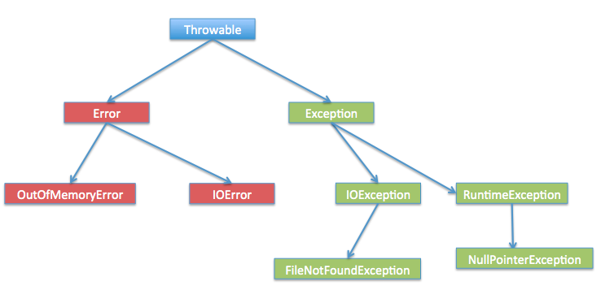

## Throwable

### Error
表示 JVM 无法处理的错误
- OutOfMemoryError
- StackOverflowError
### Exception
- 受检异常
  - 需要用 try...catch... 语句捕获并进行处理，并且可以从异常中恢复；（Java 编译器会检查受检查异常。）

  常见的受检查异常有
    - IOException
    - ClassNotFoundException
    - SQLException

- 非受检异常
  - 是程序运行时错误，例如除 0 会引发 Arithmetic Exception，此时程序崩溃并且无法恢复（Java 编译器不会检查运行时异常。）

  常见的非受检异常有：
    - RuntimeException
      - NullPointException(空指针)
      - IllegalArgumentException
      - NumberFormatException（字符串转换为数字）
      - IndexOutOfBoundsException(数组越界)
      - ClassCastException(类转换异常)
      - ArrayStoreException(数据存储异常，操作数组时类型不一致)

#### 面试提问： 非受检查异常(运行时异常)和受检查异常(一般异常)区别是什么？
回答：

**非受检查异常和受检查异常之间的区别**：是否强制要求调用者必须处理此异常，如果强制要求调用者必须进行处理，那么就使用受检查异常，否则就选择非受检查异常。
```
非受检查异常：包括 `RuntimeException` 类及其子类，表示 JVM 在运行期间可能出现的异常。 
受检查异常：是Exception 中除 `RuntimeException` 及其子类之外的异常。 
```


## 提问： Error 和 Exception 区别是什么？

**回答：**

 Java 中，所有的异常都有一个共同的祖先 `java.lang` 包中的 `Throwable` 类。`Throwable` 类有两个重要的子类 `Exception`（异常）和 `Error`（错误）。

`Exception` 和 `Error` 二者都是 Java 异常处理的重要子类，各自都包含大量子类。

- **`Exception`** :程序本身可以处理的异常，可以通过 `catch` 来进行捕获，通常遇到这种错误，应对其进行处理，使应用程序可以继续正常运行。`Exception` 又可以分为运行时异常(RuntimeException, 又叫非受检查异常)和非运行时异常(又叫受检查异常) 。
- **`Error`** ：`Error` 属于程序无法处理的错误 ，我们没办法通过 `catch` 来进行捕获 。例如，系统崩溃，内存不足，堆栈溢出等，编译器不会对这类错误进行检测，一旦这类错误发生，通常应用程序会被终止，仅靠应用程序本身无法恢复。

## NoClassDefFoundError 和 ClassNotFoundException 区别？

NoClassDefFoundError 是一个 Error 类型的异常，是由 JVM 引起的，不应该尝试捕获这个异常。引起该异常的原因是 JVM 或 ClassLoader 尝试加载某类时在内存中找不到该类的定义，该动作发生在运行期间，即编译时该类存在，但是在运行时却找不到了，可能是编译后被删除了等原因导致。

ClassNotFoundException 是一个受检查异常，需要显式地使用 try-catch 对其进行捕获和处理，或在方法签名中用 throws 关键字进行声明。当使用 Class.forName, ClassLoader.loadClass 或 ClassLoader.findSystemClass 动态加载类到内存的时候，通过传入的类路径参数没有找到该类，就会抛出该异常；另一种抛出该异常的可能原因是某个类已经由一个类加载器加载至内存中，另一个加载器又尝试去加载它。

## Java常见异常有哪些？
* `IllegalAccessError` ：违法访问错误。当一个应用试图访问、修改某个类的域（Field）或者调用其方法，但是又违反域或方法的可见性声明，则抛出该异常。
* `InstantiationError` ：实例化错误。当一个应用试图通过Java的new操作符构造一个抽象类或者接口时抛出该异常.
* `OutOfMemoryError` ：内存不足错误。当可用内存不足以让Java虚拟机分配给一个对象时抛出该错误。
* `StackOverflowError` ：堆栈溢出错误。当一个应用递归调用的层次太深而导致堆栈溢出或者陷入死循环时抛出该错误。
* `ClassCastException` ：类造型异常。假设有类A和B（A不是B的父类或子类），O是A的实例，那么当强制将O构造为类B的实例时抛出该异常。该异常经常被称为强制类型转换异常。
* `ClassNotFoundException` ：找不到类异常。当应用试图根据字符串形式的类名构造类，而在遍历CLASSPAH之后找不到对应名称的class文件时，抛出该异常。
* `ArithmeticException` ：算术条件异常。譬如：整数除零等。
* `ArrayIndexOutOfBoundsException` ：数组索引越界异常。当对数组的索引值为负数或大于等于数组大小时抛出。
* `IndexOutOfBoundsException` ：索引越界异常。当访问某个序列的索引值小于0或大于等于序列大小时，抛出该异常。
* `InstantiationException` ：实例化异常。当试图通过newInstance()方法创建某个类的实例，而该类是一个抽象类或接口时，抛出该异常。
* `NoSuchFieldException` ：属性不存在异常。当访问某个类的不存在的属性时抛出该异常。
* `NoSuchMethodException` ：方法不存在异常。当访问某个类的不存在的方法时抛出该异常。
* `NullPointerException` ：空指针异常。当应用试图在要求使用对象的地方使用了null时，抛出该异常。譬如：调用null对象的实例方法、访问null对象的属性、计算null对象的长度、使用throw语句抛出null等等。
* `NumberFormatException` ：数字格式异常。当试图将一个String转换为指定的数字类型，而该字符串确不满足数字类型要求的格式时，抛出该异常。
* `StringIndexOutOfBoundsException：` 字符串索引越界异常。当使用索引值访问某个字符串中的字符，而该索引值小于0或大于等于序列大小时，抛出该异常。


## try catch finally机制
- 有当try代码块发生异常的时候，才会执行到catch代码块
- 不管try中是否发生异常，finally都会执行。
  - 以下两种情况例外：
    - 一：try中不发生异常时，try块中有System.exit(0);
    - 二：try中发生异常时，catch中有System.exit(0);
    - 说明：System.exit(0) 代码的作用的退出虚拟机;
- 若finally块内有return语句，则以finally块内的return为准
   - 如果try 或者 catch内也有return 其实是先执行了try 或者 catch代码块中的return语句的，
   - 但是由于finally的机制，执行完try或者catch内的代码以后并不会立刻结束函数，还会执行finally块代码，
   - 若finally也有return语句，则会覆盖try块或者catch块中的return语句
- 若finally代码块中有return语句，则屏蔽catch代码块中抛出的异常

### try-catch-finally 中哪个部分可以省略？

catch 可以省略。更为严格的说法其实是：try只适合处理运行时异常，try+catch适合处理运行时异常+普通异常。也就是说，如果你只用try去处理普通异常却不加以catch处理，编译是通不过的，因为编译器硬性规定，普通异常如果选择捕获，则必须用catch显示声明以便进一步处理。而运行时异常在编译时没有如此规定，所以catch可以省略，你加上catch编译器也觉得无可厚非。

理论上，编译器看任何代码都不顺眼，都觉得可能有潜在的问题，所以你即使对所有代码加上try，代码在运行期时也只不过是在正常运行的基础上加一层皮。但是你一旦对一段代码加上try，就等于显示地承诺编译器，对这段代码可能抛出的异常进行捕获而非向上抛出处理。如果是普通异常，编译器要求必须用catch捕获以便进一步处理；如果运行时异常，捕获然后丢弃并且+finally扫尾处理，或者加上catch捕获以便进一步处理。

至于加上finally，则是在不管有没捕获异常，都要进行的“扫尾”处理。

### try-catch-finally 中，如果 catch 中 return 了，finally 还会执行吗？
会执行，在 return 前执行。

在 finally 中改变返回值的做法是不好的，因为如果存在 finally 代码块，try中的 return 语句不会立马返回调用者，而是记录下返回值待 finally 代码块执行完毕之后再向调用者返回其值，然后如果在 finally 中修改了返回值，就会返回修改后的值。显然，在 finally 中返回或者修改返回值会对程序造成很大的困扰，Java 中也可以通过提升编译器的语法检查级别来产生警告或错误。


## throw 和 throws 的区别是什么？

Java 中的异常处理除了包括捕获异常和处理异常之外，还包括声明异常和拋出异常，可以通过 throws 关键字在方法上声明该方法要拋出的异常，或者在方法内部通过 throw 拋出异常对象。

throws 关键字和 throw 关键字在使用上的几点区别如下：

* throw 关键字用在方法内部，只能用于抛出一种异常，用来抛出方法或代码块中的异常，受查异常和非受查异常都可以被抛出。
* throws 关键字用在方法声明上，可以抛出多个异常，用来标识该方法可能抛出的异常列表。一个方法用 throws 标识了可能抛出的异常列表，调用该方法的方法中必须包含可处理异常的代码，否则也要在方法签名中用 throws 关键字声明相应的异常。

举例如下：

**throw 关键字**：

```java
public static void main(String[] args) {
		String s = "abc";
		if(s.equals("abc")) {
			throw new NumberFormatException();
		} else {
			System.out.println(s);
		}
		//function();
}
```

**throws 关键字**：

```java
public static void function() throws NumberFormatException{
		String s = "abc";
		System.out.println(Double.parseDouble(s));
	}
	
	public static void main(String[] args) {
		try {
			function();
		} catch (NumberFormatException e) {
			System.err.println("非数据类型不能转换。");
			//e.printStackTrace();
		}
}
```

### JVM 是如何处理异常的？

在一个方法中如果发生异常，这个方法会创建一个异常对象，并转交给 JVM，该异常对象包含异常名称，异常描述以及异常发生时应用程序的状态。创建异常对象并转交给 JVM 的过程称为抛出异常。可能有一系列的方法调用，最终才进入抛出异常的方法，这一系列方法调用的有序列表叫做调用栈。

JVM 会顺着调用栈去查找看是否有可以处理异常的代码，如果有，则调用异常处理代码。当 JVM 发现可以处理异常的代码时，会把发生的异常传递给它。如果 JVM 没有找到可以处理该异常的代码块，JVM 就会将该异常转交给默认的异常处理器（默认处理器为 JVM 的一部分），默认异常处理器打印出异常信息并终止应用程序。
想要深入了解的小伙伴可以看这篇文章：https://www.cnblogs.com/qdhxhz/p/10765839.html


## OOM && SOF
OutOfMemoryError异常: 除了程序计数器外，虚拟机内存的其他几个运行时区域都有发生OutOfMemoryError(OOM)异常的可能，

内存泄露：指程序中动态分配内存给一些临时对象，但是对象不会被GC所回收，它始终占用内存。即被分配的对象可达但已无用。

内存溢出：指程序运行过程中无法申请到足够的内存而导致的一种错误。内存溢出通常发生于OLD段或Perm段垃圾回收后，仍然无内存空间容纳新的Java对象的情况。

从定义上可以看出内存泄露是内存溢出的一种诱因，不是唯一因素。

栈溢出：当应用程序递归太深而发生堆栈溢出时，抛出该错误。


### 发生了内存泄露或溢出怎么办
一般的异常信息：java.lang.OutOfMemoryError:Java heap spacess
java堆用于存储对象实例，我们只要不断的创建对象，并且保证GC Roots到对象之间有可达路径来避免垃圾回收机制清除这些对象，就会在对象数量达到最大堆容量限制后产生内存溢出异常。

（1）通过参数 -XX:+HeapDumpOnOutOfMemoryError 让虚拟机在出现OOM异常的时候Dump出内存映像以便于分析。

（2）一般手段是先通过内存映像分析工具(如Eclipse Memory Analyzer)对dump出来的堆转存快照进行分析，重点是确认内存中的对象是否是必要的，先分清是因为内存泄漏(Memory Leak)还是内存溢出(Memory Overflow)。（到底是出现了内存泄漏还是内存溢出）

哪些对象被怀疑为内存泄漏，哪些对象占的空间最大及对象的调用关系，还可以分析线程状态，可以观察到线程被阻塞在哪个对象上，从而判断系统的瓶颈。

（3）如果是内存泄漏，可进一步通过工具查看泄漏对象到GC Roots的引用链。于是就能找到泄漏对象时通过怎样的路径与GC Roots相关联并导致垃圾收集器无法自动回收。 找到引用信息，可以准确的定位出内存泄漏的代码位置。（HashMap中的元素的某些属性改变了，影响了hashcode的值会发生内存泄漏）

（4）如果不存在内存泄漏，就应当检查虚拟机的参数(-Xmx与-Xms)的设置是否适当，是否可以调大；修改代码逻辑，把某些对象生命周期过长，持有状态时间过长等情况的代码修改。


### 内存泄漏的场景
   （1）使用静态的集合类

静态的集合类的生命周期和应用程序的生命周期一样长，所以在程序结束前容器中的对象不能被释放，会造成内存泄露。

解决办法是最好不使用静态的集合类，如果使用的话，在不需要容器时要将其赋值为null。

修改hashset中对象的参数值，且参数是计算哈希值的字段

（2）单例模式可能会造成内存泄露（长生命周期的对象持有短生命周期对象的引用）

单例模式只允许应用程序存在一个实例对象，并且这个实例对象的生命周期和应用程序的生命周期一样长，如果单例对象中拥有另一个对象的引用的话，这个被引用的对象就不能被及时回收。

解决办法是单例对象中持有的其他对象使用弱引用，弱引用对象在GC线程工作时，其占用的内存会被回收掉。

（3）数据库、网络、输入输出流，这些资源没有显示的关闭

垃圾回收只负责内存回收，如果对象正在使用资源的话，Java虚拟机不能判断这些对象是不是正在进行操作，比如输入输出，也就不能回收这些对象占用的内存，所以在资源使用完后要调用close()方法关闭。

### 内存溢出的场景
#### Java Heap 溢出

在jvm规范中，堆中的内存是用来生成对象实例和数组的。 

如果细分，堆内存还可以分为年轻代和年老代，年轻代包括一个eden区和两个survivor区。
   
当生成新对象时，内存的申请过程如下：

- jvm先尝试在eden区分配新建对象所需的内存；
- 如果内存大小足够，申请结束，否则下一步；
- jvm启动youngGC，试图将eden区中不活跃的对象释放掉，释放后若Eden空间仍然不足以放入新对象，则试图将部分Eden中活跃对象放入Survivor区；
- Survivor区被用来作为Eden及old的中间交换区域，当OLD区空间足够时，Survivor区的对象会被移到Old区，否则会被保留在Survivor区；
- 当OLD区空间不够时，JVM会在OLD区进行full GC；
- full GC后，若Survivor及OLD区仍然无法存放从Eden复制过来的部分对象，导致JVM无法在Eden区为新对象创建内存区域，则出现”out of memory错误”： outOfMemoryError：java heap space


#### 虚拟机栈和本地方法栈溢出
如果线程请求的栈深度大于虚拟机所允许的最大深度，将抛出StackOverflowError异常。
不断创建线程，如果虚拟机在扩展栈时无法申请到足够的内存空间，则抛出OutOfMemoryError异常
这里需要注意当栈的大小越大可分配的线程数就越少。
用Xss设置


#### 运行时常量池溢出
异常信息：java.lang.OutOfMemoryError:PermGen space
如果要向运行时常量池中添加内容，最简单的做法就是使用String.intern()这个Native方法。
该方法的作用是：如果池中已经包含一个等于此String的字符串，则返回代表池中这个字符串的String对象；否则，将此String对象包含的字符串添加到常量池中，并且返回此String对象的引用。
由于常量池分配在方法区内，我们可以通过-XX:PermSize和-XX:MaxPermSize限制方法区的大小，从而间接限制其中常量池的容量。


#### 方法区溢出
异常信息：java.lang.OutOfMemoryError: PermGen space

方法区用于存放Class的相关信息，如类名、访问修饰符、常量池、字段描述、方法描述等。


所以如果程序加载的类过多，或者使用反射、gclib等这种动态代理生成类的技术，就可能导致该区发生内存溢出

方法区溢出也是一种常见的内存溢出异常，一个类如果要被垃圾收集器回收，判定条件是很苛刻的。在经常动态生成大量Class的应用中，要特别注意这点。

我们可以通过-XX:PermSize和-XX:MaxPermSize限制方法区的大小

#### java.lang.OutOfMemoryError: GC overhead limit exceeded
原因：执行垃圾收集的时间比例太大, 有效的运算量太小. 默认情况下, 如果GC花费的时间超过 98%, 并且GC回收的内存少于 2%, JVM就会抛出这个错误。

目的是为了让应用终止，给开发者机会去诊断问题。一般是应用程序在有限的内存上创建了大量的临时对象或者弱引用对象，从而导致该异常。

解决方法：
1. 大对象在使用之后指向null。
2. 增加参数，-XX:-UseGCOverheadLimit，关闭这个特性；
3. 增加heap大小，-Xmx1024m


### SOF （堆栈溢出 StackOverflow）
StackOverflowError 的定义：当应用程序递归太深而发生堆栈溢出时，抛出该错误。 因为栈一般默认为1-2M，一旦出现死循环或者是大量的递归调用，在不断的压栈过程中，造成栈容量超过1M而导致溢出。

栈溢出的原因：
- 递归调用
- 大量循环或死循环
- 全局变量是否过多
- 数组、List、map数据过大


### 如何避免发生内存泄露和溢出
1. 尽早释放无用对象的引用
2. 使用字符串处理，避免使用String，应大量使用StringBuffer，每一个String对象都得独立占用内存一块区域
3. 尽量少用静态变量，因为静态变量存放在永久代（方法区），永久代基本不参与垃圾回收
4. 避免在循环中创建对象
5. 开启大型文件或从数据库一次拿了太多的数据很容易造成内存溢出，所以在这些地方要大概计算一下数据量的最大值是多少，并且设定所需最小及最大的内存空间值。


# 参考文章
- https://www.cnblogs.com/haimishasha/p/11329510.html