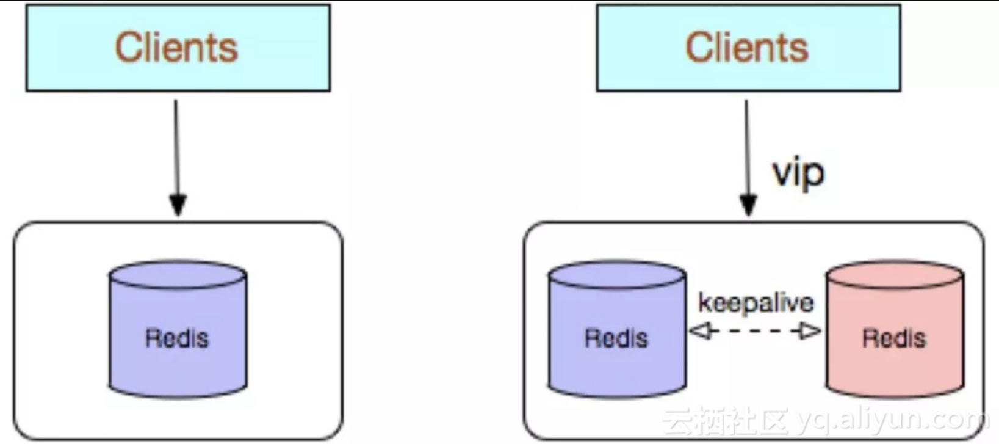

# redis
## Redis是什么？简述它的优缺点？
Redis本质上是一个Key-Value类型的内存数据库，很像Memcached，整个数据库加载在内存当中操作，定期通过异步操作把数据库中的数据flush到硬盘上进行保存。

因为是纯内存操作，Redis的性能非常出色，每秒可以处理超过 10万次读写操作，是已知性能最快的Key-Value 数据库。

**优点**：

* 读写性能极高， Redis能读的速度是110000次/s，写的速度是81000次/s。
* 支持数据持久化，支持AOF和RDB两种持久化方式。
* 支持事务， Redis的所有操作都是原子性的，意思就是要么成功执行要么失败完全不执行。单个操作是原子性的。多个操作也支持事务，即原子性，通过MULTI和EXEC指令包起来。
* 数据结构丰富，除了支持string类型的value外，还支持hash、set、zset、list等数据结构。
* 支持主从复制，主机会自动将数据同步到从机，可以进行读写分离。
* 丰富的特性 – Redis还支持 publish/subscribe， 通知， key 过期等特性。

**缺点**：

* 数据库容量受到物理内存的限制，不能用作海量数据的高性能读写，因此Redis适合的场景主要局限在较小数据量的高性能操作和运算上。
* 主机宕机，宕机前有部分数据未能及时同步到从机，切换IP后还会引入数据不一致的问题，降低了系统的可用性。

## 特点
- Key-Value健值类型存储
- 支持数据可靠存储及落地
- 单进程单线程高性能服务器
- 单机qps(每秒查询率)可以达到10w.
- 适合小数据量高速读写访问
## Redis为什么这么快
- 完全基于内存 没有磁盘IO上的开销
- 优化的数据结构
- 采用单线程
  - 避免了不必要的上下文切换和竞争条件，也不存在多进程或者多线程导致的切换而消耗 CPU，不用去考虑各种锁的问题，不存在加锁释放锁操作，没有因为可能出现死锁而导致的性能消耗
  - Redis 没有使用多线程？为什么不使用多线程？
    - 虽然说 Redis 是单线程模型，但是， 实际上，Redis 在 4.0 之后的版本中就已经加入了对多线程的支持。
    - 引入多线程主要是为了提高网络 IO 读写性能
    - 对比
      

      


        - 主要负责接受客户端连接并且分发到各个Io线程，而io线程负责读取客户端命令，命令读取完由主线程执行命令，主线程执行完命令后再由Io线程把回复数据返回给客户端
        - 不把处理命令交给各个io线程去执行，这里就涉及到了竞争问题，因为数据库是共享的，多个线程必要加锁，而锁是一个耗时的操作还会涉及多线程之间的上下文切换
- 使用多路I/O复用模型，非阻塞IO

## 为什么要用 Redis 做缓存？

**从高并发上来说：**

- 直接操作缓存能够承受的请求是远远大于直接访问数据库的，所以我们可以考虑把数据库中的部分数据转移到缓存中去，这样用户的一部分请求会直接到缓存这里而不用经过数据库。

**从高性能上来说：**

- 用户第一次访问数据库中的某些数据。 因为是从硬盘上读取的所以这个过程会比较慢。将该用户访问的数据存在缓存中，下一次再访问这些数据的时候就可以直接从缓存中获取了。操作缓存就是直接操作内存，所以速度相当快。如果数据库中的对应数据改变的之后，同步改变缓存中相应的数据。

## 为什么要用 Redis 而不用 map/guava 做缓存?

缓存分为本地缓存和分布式缓存。以java为例，使用自带的map或者guava实现的是本地缓存，最主要的特点是轻量以及快速，生命周期随着jvm的销毁而结束，并且在多实例的情况下，每个实例都需要各自保存一份缓存，缓存不具有一致性。

使用Redis或memcached之类的称为分布式缓存，在多实例的情况下，各实例共用一份缓存数据，缓存具有一致性。缺点是需要保持Redis或memcached服务的高可用，整个程序架构上较为复杂。

对比:

* Redis 可以用几十 G 内存来做缓存，Map 不行，一般 JVM 也就分几个 G 数据就够大了；
* Redis 的缓存可以持久化，Map 是内存对象，程序一重启数据就没了；
* Redis 可以实现分布式的缓存，Map 只能存在创建它的程序里；
* Redis 可以处理每秒百万级的并发，是专业的缓存服务，Map 只是一个普通的对象；
* Redis 缓存有过期机制，Map 本身无此功能；Redis 有丰富的 API，Map 就简单太多了；
* Redis可单独部署，多个项目之间可以共享，本地内存无法共享；
* Redis有专门的管理工具可以查看缓存数据。


## 常见使用场景
#### 缓存
缓存现在几乎是所有中大型网站都在用的必杀技，合理的利用缓存不仅能够提升网站访问速度，还能大大降低数据库的压力。Redis提供了键过期功能，也提供了灵活的键淘汰策略，所以，现在Redis用在缓存的场合非常多。Redis作为缓存使用可能涉及缓存雪崩、缓存穿透、缓存击穿等问题
#### 排行榜 
很多网站都有排行榜应用的，如京东的月度销量榜单、商品按时间的上新排行榜等。Redis提供的有序集合数据类构能实现各种复杂的排行榜应用
#### 计数器
什么是计数器，如电商网站商品的浏览量、视频网站视频的播放数等。为了保证数据实时效，每次浏览都得给+1，并发量高时如果每次都请求数据库操作无疑是种挑战和压力。Redis提供的incr命令来实现计数器功能，内存操作，性能非常好，非常适用于这些计数场景。
#### 分布式会话
集群模式下，在应用不多的情况下一般使用容器自带的session复制功能就能满足，当应用增多相对复杂的系统中，一般都会搭建以Redis等内存数据库为中心的session服务，session不再由容器管理，而是由session服务及内存数据库管理
#### 分布式锁
在很多互联网公司中都使用了分布式技术，分布式技术带来的技术挑战是对同一个资源的并发访问，如全局ID、减库存、秒杀等场景，并发量不大的场景可以使用数据库的悲观锁、乐观锁来实现，但在并发量高的场合中，利用数据库锁来控制资源的并发访问是不太理想的，大大影响了数据库的性能。可以利用Redis的setnx功能来编写分布式的锁，如果设置返回1说明获取锁成功，否则获取锁失败，实际应用中要考虑的细节要更多
#### 社交网络
点赞、踩、关注/被关注、共同好友等是社交网站的基本功能，社交网站的访问量通常来说比较大，而且传统的关系数据库类型不适合存储这种类型的数据，Redis提供的哈希、集合等数据结构能很方便的的实现这些功能
#### 最新列表
Redis列表结构，LPUSH可以在列表头部插入一个内容ID作为关键字，LTRIM可用来限制列表的数量，这样列表永远为N个ID，无需查询最新的列表，直接根据ID去到对应的内容页即可
#### 消息系统
消息队列是大型网站必用中间件，如ActiveMQ、RabbitMQ、Kafka等流行的消息队列中间件，主要用于业务解耦、流量削峰及异步处理实时性低的业务。Redis提供了发布/订阅及阻塞队列功能，能实现一个简单的消息队列系统。另外，这个不能和专业的消息中间件相比


## 数据类型

有五种常用数据类型：String、Hash、Set、List、SortedSet。以及三种特殊的数据类型：Bitmap、HyperLogLog、Geospatial ，其中HyperLogLog、Bitmap的底层都是 String 数据类型，Geospatial 的底层是 Sorted Set 数据类型。

**五种常用的数据类型**：

1、String：String是最常用的一种数据类型，普通的key- value 存储都可以归为此类。其中Value既可以是数字也可以是字符串。使用场景：常规key-value缓存应用。常规计数: 微博数， 粉丝数。

2、Hash：Hash 是一个键值(key => value)对集合。Redishash 是一个 string 类型的 field 和 value 的映射表，hash 特别适合用于存储对象，并且可以像数据库中update一个属性一样只修改某一项属性值。

3、Set：Set是一个无序的天然去重的集合，即Key-Set。此外还提供了交集、并集等一系列直接操作集合的方法，对于求共同好友、共同关注什么的功能实现特别方便。

4、List：List是一个有序可重复的集合，其遵循FIFO的原则，底层是依赖双向链表实现的，因此支持正向、反向双重查找。通过List，我们可以很方面的获得类似于最新回复这类的功能实现。

5、SortedSet：类似于java中的TreeSet，是Set的可排序版。此外还支持优先级排序，维护了一个score的参数来实现。适用于排行榜和带权重的消息队列等场景。

**三种特殊的数据类型**：

1、Bitmap：位图，Bitmap想象成一个以位为单位数组，数组中的每个单元只能存0或者1，数组的下标在Bitmap中叫做偏移量。使用Bitmap实现统计功能，更省空间。如果只需要统计数据的二值状态，例如商品有没有、用户在不在等，就可以使用 Bitmap，因为它只用一个 bit 位就能表示 0 或 1。

2、Hyperloglog。HyperLogLog 是一种用于统计基数的数据集合类型，HyperLogLog 的优点是，在输入元素的数量或者体积非常非常大

时，计算基数所需的空间总是固定 的、并且是很小的。每个 HyperLogLog 键只需要花费 12 KB 内存，就可以计算接近 2^64 个不同元素的基 数。场景：统计网页的UV（即Unique Visitor，不重复访客，一个人访问某个网站多次，但是还是只计算为一次）。

要注意，HyperLogLog 的统计规则是基于概率完成的，所以它给出的统计结果是有一定误差的，标准误算率是 0.81%。

3、Geospatial ：主要用于存储地理位置信息，并对存储的信息进行操作，适用场景如朋友的定位、附近的人、打车距离计算等。


## 内存回收策略
### Redis过期策略:删除过期时间的key值
- `定时过期` 每个设置过期时间的key都需要创建一个定时器，到过期时间就会立即清除。该策略可以立即清除过期的数据，对内存很友好；但是会占用大量的CPU资源去处理过期的数据，从而影响缓存的响应时间和吞吐量
- `惰性过期` 只有当访问一个key时，才会判断该key是否已过期，过期则清除。该策略可以最大化地节省CPU资源，却对内存非常不友好。极端情况可能出现大量的过期key没有再次被访问，从而不会被清除，占用大量内存
- `定期过期` 每隔一定的时间，会扫描一定数量的数据库的expires字典中一定数量的key，并清除其中已过期的key。该策略是前两者的一个折中方案。通过调整定时扫描的时间间隔和每次扫描的限定耗时，可以在不同情况下使得CPU和内存资源达到最优的平衡效果
### Redis淘汰策略:内存使用到达maxmemory上限时触发内存淘汰数据
- LRU算法 最近最少使用算法,也就是说默认删除最近最少使用的键
- 淘汰策略
  1. `noeviction`：当内存不足以容纳新写入数据时，新写入操作会报错。
  2. `allkeys-lru`：当内存不足以容纳新写入数据时，在键空间中，移除最近最少使用的key。
  3. `allkeys-random`：当内存不足以容纳新写入数据时，在键空间中，随机移除某个key。
  4. `volatile-lru`：当内存不足以容纳新写入数据时，在设置了过期时间的键空间中，移除最近最少使用的key。
  5. `volatile-random`：当内存不足以容纳新写入数据时，在设置了过期时间的键空间中，随机移除某个key。
  6. `volatile-ttl`：当内存不足以容纳新写入数据时，在设置了过期时间的键空间中，有更早过期时间的key优先移除。
### redis的设置过期时间底层原理
redis针对TTL时间有专门的dict进行存储，就是redisDb当中的dict *expires字段，dict顾名思义就是一个hashtable，key为对应的rediskey，value为对应的TTL时间。
```
typedef struct redisDb {
    dict *dict;                 /* The keyspace for this DB */
    dict *expires;              /* Timeout of keys with a timeout set */
    ...
}
```
过期键的判断

通过查询过期字典，检查下面的条件判断是否过期

- 检查给定的键是否在过期字典中，如果存在就获取键的过期时间
- 检查当前 UNIX 时间戳是否大于键的过期时间，是就过期，否则未过期


## Redis 中的事务
### 命令
- `MULTI` 使用 MULTI命令后可以输入多个命令。Redis 不会立即执行这些命令，而是将它们放到队列，当调用了EXEC命令将执行所有命令
  - 开始事务（MULTI）。
  - 命令入队(批量操作 Redis 的命令，先进先出（FIFO）的顺序执行)。
  - 执行事务(EXEC)。
- `DISCARD` 取消一个事务，它会清空事务队列中保存的所有命令
- `WATCH` 用于监听指定的键，当调用 EXEC 命令执行事务时，如果一个被 WATCH 命令监视的键被修改的话，整个事务都不会执行，直接返回失败

- Redis 是不支持 roll back 的，因而不满足原子性的（而且不满足持久性）

- Redis 事务提供了一种将多个命令请求打包的功能。然后，再按顺序执行打包的所有命令，并且不会被中途打断。

### Java操作
```java
import org.springframework.beans.factory.annotation.Autowired;
import org.springframework.data.redis.core.StringRedisTemplate;
import org.springframework.data.redis.core.SessionCallback;
import org.springframework.stereotype.Service;

@Service
public class RedisService {

    @Autowired
    private StringRedisTemplate redisTemplate;

    public void executeTransaction() {
        redisTemplate.execute(new SessionCallback<Object>() {
            @Override
            public <K, V> Object execute(org.springframework.data.redis.core.RedisOperations<K, V> operations) throws DataAccessException {
                operations.multi(); // 开始事务
                operations.opsForValue().set("key1", "value1");
                operations.opsForValue().set("key2", "value2");
                return operations.exec(); // 执行事务
            }
        });
    }
}

```

## 1. Redis常见使用方式有哪些？

Redis的几种常见使用方式包括：

*  Redis单副本；
*  Redis多副本（主从）；
*  Redis Sentinel（哨兵）；
*  Redis Cluster；
*  Redis自研。

使用场景：

如果数据量很少，主要是承载高并发高性能的场景，比如缓存一般就几个G的话，单机足够了。

主从模式：master 节点挂掉后，需要手动指定新的 master，可用性不高，基本不用。

哨兵模式：master 节点挂掉后，哨兵进程会主动选举新的 master，可用性高，但是每个节点存储的数据是一样的，浪费内存空间。数据量不是很多，集群规模不是很大，需要自动容错容灾的时候使用。

Redis cluster 主要是针对海量数据+高并发+高可用的场景，如果是海量数据，如果你的数据量很大，那么建议就用Redis cluster，所有master的容量总和就是Redis cluster可缓存的数据容量。

## 2. 介绍下Redis单副本

Redis单副本，采用单个Redis节点部署架构，没有备用节点实时同步数据，不提供数据持久化和备份策略，适用于数据可靠性要求不高的纯缓存业务场景。

	

**优点：**

* 架构简单，部署方便；
* 高性价比：缓存使用时无需备用节点（单实例可用性可以用supervisor或crontab保证），当然为了满足业务的高可用性，也可以牺牲一个备用节点，但同时刻只有一个实例对外提供服务；
* 高性能。

**缺点：**

* 不保证数据的可靠性；
* 在缓存使用，进程重启后，数据丢失，即使有备用的节点解决高可用性，但是仍然不能解决缓存预热问题，因此不适用于数据可靠性要求高的业务；
* 高性能受限于单核CPU的处理能力（Redis是单线程机制），CPU为主要瓶颈，所以适合操作命令简单，排序、计算较少的场景。也可以考虑用Memcached替代。

## 3. 介绍下Redis多副本（主从）

Redis多副本，采用主从（replication）部署结构，相较于单副本而言最大的特点就是主从实例间数据实时同步，并且提供数据持久化和备份策略。主从实例部署在不同的物理服务器上，根据公司的基础环境配置，可以实现同时对外提供服务和读写分离策略。


**优点：**

*  高可靠性：一方面，采用双机主备架构，能够在主库出现故障时自动进行主备切换，从库提升为主库提供服务，保证服务平稳运行；另一方面，开启数据持久化功能和配置合理的备份策略，能有效的解决数据误操作和数据异常丢失的问题；
*  读写分离策略：从节点可以扩展主库节点的读能力，有效应对大并发量的读操作。

**缺点：**

* 故障恢复复杂，如果没有RedisHA系统（需要开发），当主库节点出现故障时，需要手动将一个从节点晋升为主节点，同时需要通知业务方变更配置，并且需要让其它从库节点去复制新主库节点，整个过程需要人为干预，比较繁琐；
* 主库的写能力受到单机的限制，可以考虑分片；
* 主库的存储能力受到单机的限制，可以考虑Pika；

* 原生复制的弊端在早期的版本中也会比较突出，如：Redis复制中断后，Slave会发起psync，此时如果同步不成功，则会进行全量同步，主库执行全量备份的同时可能会造成毫秒或秒级的卡顿；又由于COW机制，导致极端情况下的主库内存溢出，程序异常退出或宕机；主库节点生成备份文件导致服务器磁盘IO和CPU（压缩）资源消耗；发送数GB大小的备份文件导致服务器出口带宽暴增，阻塞请求，建议升级到最新版本。

## 4. 介绍下Redis Sentinel（哨兵）

> 主从模式下，当主服务器宕机后，需要手动把一台从服务器切换为主服务器，这就需要人工干预，费事费力，还会造成一段时间内服务不可用。这种方式并不推荐，实际生产中，我们优先考虑哨兵模式。这种模式下，master 宕机，哨兵会自动选举 master 并将其他的 slave 指向新的 master。

Redis Sentinel是社区版本推出的原生高可用解决方案，其部署架构主要包括两部分：Redis Sentinel集群和Redis数据集群。

其中Redis Sentinel集群是由若干Sentinel节点组成的分布式集群，可以实现故障发现、故障自动转移、配置中心和客户端通知。Redis Sentinel的节点数量要满足2n+1（n>=1）的奇数个。


**优点：**

* Redis Sentinel集群部署简单；
* 能够解决Redis主从模式下的高可用切换问题；
* 很方便实现Redis数据节点的线形扩展，轻松突破Redis自身单线程瓶颈，可极大满足Redis大容量或高性能的业务需求；
* 可以实现一套Sentinel监控一组Redis数据节点或多组数据节点。

**缺点：**

* 部署相对Redis主从模式要复杂一些，原理理解更繁琐；
* 资源浪费，Redis数据节点中slave节点作为备份节点不提供服务；
* Redis Sentinel主要是针对Redis数据节点中的主节点的高可用切换，对Redis的数据节点做失败判定分为主观下线和客观下线两种，对于Redis的从节点有对节点做主观下线操作，并不执行故障转移。
* 不能解决读写分离问题，实现起来相对复杂。

## 5. 介绍下Redis Cluster

> Redis 的哨兵模式基本已经可以实现高可用，读写分离 ，但是在这种模式下每台 Redis 服务器都存储相同的数据，很浪费内存，所以在 Redis3.0 上加入了 Cluster 集群模式，实现了 Redis 的分布式存储，对数据进行分片，也就是说每台 Redis 节点上存储不同的内容。

Redis Cluster是社区版推出的Redis分布式集群解决方案，主要解决Redis分布式方面的需求，比如，当遇到单机内存，并发和流量等瓶颈的时候，Redis Cluster能起到很好的负载均衡的目的。

Redis Cluster集群节点最小配置6个节点以上（3主3从），其中主节点提供读写操作，从节点作为备用节点，不提供请求，只作为故障转移使用。

Redis Cluster采用虚拟槽分区，所有的键根据哈希函数映射到0～16383个整数槽内，每个节点负责维护一部分槽以及槽所印映射的键值数据。


**优点：**
```
1、无中心架构；
2、数据按照slot存储分布在多个节点，节点间数据共享，可动态调整数据分布；
3、可扩展性：可线性扩展到1000多个节点，节点可动态添加或删除；
4、高可用性：部分节点不可用时，集群仍可用。通过增加Slave做standby数据副本，能够实现故障自动failover，节点之间通过gossip协议交换状态信息，用投票机制完成Slave到Master的角色提升；
5、降低运维成本，提高系统的扩展性和可用性。
```
**缺点：**
```
1、Client实现复杂，驱动要求实现Smart Client，缓存slots mapping信息并及时更新，提高了开发难度，客户端的不成熟影响业务的稳定性。目前仅JedisCluster相对成熟，异常处理部分还不完善，比如常见的“max redirect exception”。
2、节点会因为某些原因发生阻塞（阻塞时间大于clutser-node-timeout），被判断下线，这种failover是没有必要的。
3、数据通过异步复制，不保证数据的强一致性。
4、多个业务使用同一套集群时，无法根据统计区分冷热数据，资源隔离性较差，容易出现相互影响的情况。
5、Slave在集群中充当“冷备”，不能缓解读压力，当然可以通过SDK的合理设计来提高Slave资源的利用率。
6、Key批量操作限制，如使用mset、mget目前只支持具有相同slot值的Key执行批量操作。对于映射为不同slot值的Key由于Keys不支持跨slot查询，所以执行mset、mget、sunion等操作支持不友好。
7、Key事务操作支持有限，只支持多key在同一节点上的事务操作，当多个Key分布于不同的节点上时无法使用事务功能。
8、Key作为数据分区的最小粒度，不能将一个很大的键值对象如hash、list等映射到不同的节点。
9、不支持多数据库空间，单机下的Redis可以支持到16个数据库，集群模式下只能使用1个数据库空间，即db 0。
10、复制结构只支持一层，从节点只能复制主节点，不支持嵌套树状复制结构。
11、避免产生hot-key，导致主库节点成为系统的短板。
12、避免产生big-key，导致网卡撑爆、慢查询等。
13、重试时间应该大于cluster-node-time时间。
14、Redis Cluster不建议使用pipeline和multi-keys操作，减少max redirect产生的场景。
```

## 6. 介绍下Redis自研

Redis自研的高可用解决方案，主要体现在配置中心、故障探测和failover的处理机制上，通常需要根据企业业务的实际线上环境来定制化。


**优点：**

* 高可靠性、高可用性；
* 自主可控性高；
* 贴切业务实际需求，可缩性好，兼容性好。

**缺点：**

* 实现复杂，开发成本高；
* 需要建立配套的周边设施，如监控，域名服务，存储元数据信息的数据库等；
* 维护成本高。

## 7. Redis高可用方案具体怎么实施？

使用官方推荐的哨兵(sentinel)机制就能实现，当主节点出现故障时，由Sentinel自动完成故障发现和转移，并通知应用方，实现高可用性。它有四个主要功能：

- 集群监控，负责监控Redis master和slave进程是否正常工作。
- 消息通知，如果某个Redis实例有故障，那么哨兵负责发送消息作为报警通知给管理员。
- 故障转移，如果master node挂掉了，会自动转移到slave node上。
- 配置中心，如果故障转移发生了，通知client客户端新的master地址。


