# 主从、哨兵、集群


## 主从

### 主从复制模式
Redis 提供了复制（replication）功能，可以实现当一台数据库中的数据更新后，自动将更新的数据同步到其他数据库上

在复制的概念中，数据库分为两类，一类是主数据库（master），另一类是从数据库(slave）。主数据库可以进行读写操作，当写操作导致数据变化时会自动将数据同步给从数据库。而从数据库一般是只读的，并接受主数据库同步过来的数据。一个主数据库可以拥有多个从数据库，而一个从数据库只能拥有一个主数据库

引入主从复制机制的目的有两个
- 一个是读写分离，分担 "master" 的读写压力
- 一个是方便做容灾恢复

#### 主从复制原理
- 从数据库启动成功后，连接主数据库，发送 SYNC 命令；
- 主数据库接收到 SYNC 命令后，开始执行 BGSAVE 命令生成 RDB 文件并使用缓冲区记录此后执行的所有写命令；
- 主数据库 BGSAVE 执行完后，向所有从数据库发送快照文件，并在发送期间继续记录被执行的写命令；
- 从数据库收到快照文件后丢弃所有旧数据，载入收到的快照；
- 主数据库快照发送完毕后开始向从数据库发送缓冲区中的写命令；
- 从数据库完成对快照的载入，开始接收命令请求，并执行来自主数据库缓冲区的写命令；（从数据库初始化完成）
- 主数据库每执行一个写命令就会向从数据库发送相同的写命令，从数据库接收并执行收到的写命令（从数据库初始化完成后的操作）
- 出现断开重连后，2.8之后的版本会将断线期间的命令传给重数据库，增量复制。
- 主从刚刚连接的时候，进行全量同步；全同步结束后，进行增量同步。当然，如果有需要，slave 在任何时候都可以发起全量同步。Redis 的策略是，无论如何，首先会尝试进行增量同步，如不成功，要求从机进行全量同步。

**1、主从架构的核心原理**
```
当启动一个slave node的时候，它会发送一个PSYNC命令给master node

如果这是slave node重新连接master node，那么master node仅仅会复制给slave部分缺少的数据; 否则如果是slave node第一次连接master node，那么会触发一次full resynchronization

开始full resynchronization的时候，master会启动一个后台线程，开始生成一份RDB快照文件，同时还会将从客户端收到的所有写命令缓存在内存中。RDB文件生成完毕之后，master会将这个RDB发送给slave，slave会先写入本地磁盘，然后再从本地磁盘加载到内存中。然后master会将内存中缓存的写命令发送给slave，slave也会同步这些数据。

slave node如果跟master node有网络故障，断开了连接，会自动重连。master如果发现有多个slave node都来重新连接，仅仅会启动一个rdb save操作，用一份数据服务所有slave node。
```
**2、主从复制的断点续传**
```
从Redis 2.8开始，就支持主从复制的断点续传，如果主从复制过程中，网络连接断掉了，那么可以接着上次复制的地方，继续复制下去，而不是从头开始复制一份

master node会在内存中常见一个backlog，master和slave都会保存一个replica offset还有一个master id，offset就是保存在backlog中的。如果master和slave网络连接断掉了，slave会让master从上次的replica offset开始继续复制

但是如果没有找到对应的offset，那么就会执行一次resynchronization
```
**3、无磁盘化复制**
```
master在内存中直接创建rdb，然后发送给slave，不会在自己本地落地磁盘了

repl-diskless-sync repl-diskless-sync-delay，等待一定时长再开始复制，因为要等更多slave重新连接过来
```
**4、过期key处理**
```

slave不会过期key，只会等待master过期key。如果master过期了一个key，或者通过LRU淘汰了一个key，那么会模拟一条del命令发送给slave。
```
#### 主从复制优缺点
> 优点
- 支持主从复制，主机会自动将数据同步到从机，可以进行读写分离；
- 为了分载 Master 的读操作压力，Slave 服务器可以为客户端提供只读操作的服务，写服务仍然必须由Master来完成；
- Slave 同样可以接受其它 Slaves 的连接和同步请求，这样可以有效的分载 Master 的同步压力；
- Master Server 是以非阻塞的方式为 Slaves 提供服务。所以在 Master-Slave 同步期间，客户端仍然可以提交查询或修改请求；
- Slave Server 同样是以非阻塞的方式完成数据同步。在同步期间，如果有客户端提交查询请求，Redis则返回同步之前的数据；

> 缺点
- Redis不具备自动容错和恢复功能，主机从机的宕机都会导致前端部分读写请求失败，需要等待机器重启或者手动切换前端的IP才能恢复（也就是要人工介入）；
- 主机宕机，宕机前有部分数据未能及时同步到从机，切换IP后还会引入数据不一致的问题，降低了系统的可用性；
- 如果多个 Slave 断线了，需要重启的时候，尽量不要在同一时间段进行重启。因为只要 Slave 启动，就会发送sync 请求和主机全量同步，当多个 Slave 重启的时候，可能会导致 Master IO 剧增从而宕机。
- Redis 较难支持在线扩容，在集群容量达到上限时在线扩容会变得很复杂；


## 由于主从延迟导致读取到过期数据怎么处理？

1. 通过scan命令扫库：当Redis中的key被scan的时候，相当于访问了该key，同样也会做过期检测，充分发挥Redis惰性删除的策略。这个方法能大大降低了脏数据读取的概率，但缺点也比较明显，会造成一定的数据库压力，否则影响线上业务的效率。
2. Redis加入了一个新特性来解决主从不一致导致读取到过期数据问题，增加了key是否过期以及对主从库的判断，如果key已过期，当前访问的master则返回null；当前访问的是从库，且执行的是只读命令也返回null。

## 主从复制的过程中如果因为网络原因停止复制了会怎么样？

如果出现网络故障断开连接了，会自动重连的，从Redis 2.8开始，就支持主从复制的断点续传，可以接着上次复制的地方，继续复制下去，而不是从头开始复制一份。

master如果发现有多个slave node都来重新连接，仅仅会启动一个rdb save操作，用一份数据服务所有slave node。

master node会在内存中创建一个`backlog`，master和slave都会保存一个`replica offset`，还有一个`master id`，offset就是保存在backlog中的。如果master和slave网络连接断掉了，slave会让master从上次的replica offset开始继续复制。

但是如果没有找到对应的offset，那么就会执行一次`resynchronization`全量复制。

## Redis主从架构数据会丢失吗，为什么？

有两种数据丢失的情况：

1. 异步复制导致的数据丢失：因为master -> slave的复制是异步的，所以可能有部分数据还没复制到slave，master就宕机了，此时这些部分数据就丢失了。
2. 脑裂导致的数据丢失：某个master所在机器突然脱离了正常的网络，跟其他slave机器不能连接，但是实际上master还运行着，此时哨兵可能就会认为master宕机了，然后开启选举，将其他slave切换成了master。这个时候，集群里就会有两个master，也就是所谓的脑裂。此时虽然某个slave被切换成了master，但是可能client还没来得及切换到新的master，还继续写向旧master的数据可能也丢失了。因此旧master再次恢复的时候，会被作为一个slave挂到新的master上去，自己的数据会清空，重新从新的master复制数据。

##  如何解决主从架构数据丢失的问题？

数据丢失的问题是不可避免的，但是我们可以尽量减少。

在Redis的配置文件里设置参数

```
min-slaves-to-write 1
min-slaves-max-lag 10
```

`min-slaves-to-write`默认情况下是0，`min-slaves-max-lag`默认情况下是10。

上面的配置的意思是要求至少有1个slave，数据复制和同步的延迟不能超过10秒。如果说一旦所有的slave，数据复制和同步的延迟都超过了10秒钟，那么这个时候，master就不会再接收任何请求了。

减小`min-slaves-max-lag`参数的值，这样就可以避免在发生故障时大量的数据丢失，一旦发现延迟超过了该值就不会往master中写入数据。

那么对于client，我们可以采取降级措施，将数据暂时写入本地缓存和磁盘中，在一段时间后重新写入master来保证数据不丢失；也可以将数据写入kafka消息队列，隔一段时间去消费kafka中的数据。

## 哨兵
### Sentinel模式
哨兵模式是一种特殊的模式，首先 Redis 提供了哨兵的命令，哨兵是一个独立的进程，作为进程，它会独立运行。其原理是哨兵通过发送命令，等待Redis服务器响应，从而监控运行的多个 Redis 实例

#### 原理图
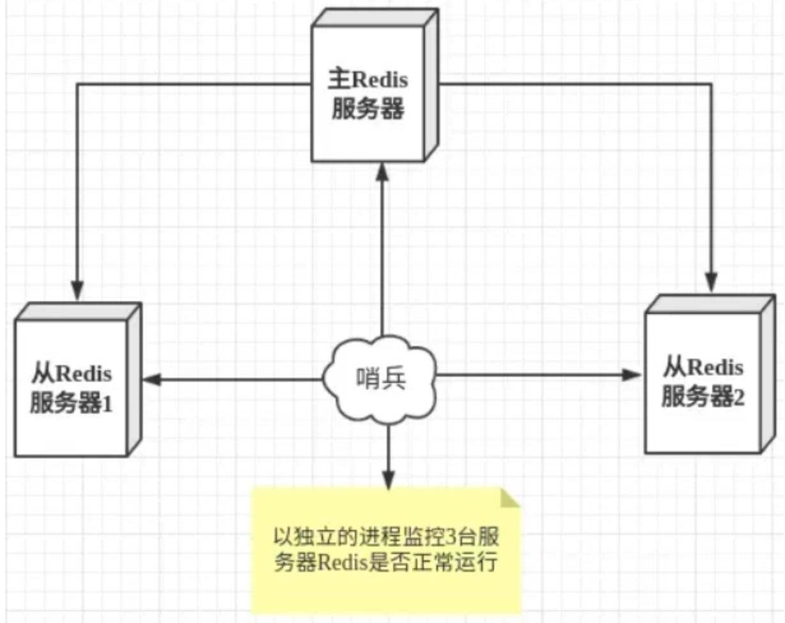

#### 哨兵模式的作用
- 通过发送命令，让 Redis 服务器返回监控其运行状态，包括主服务器和从服务器；
- 当哨兵监测到 master 宕机，会自动将 slave 切换成 master ，然后通过发布订阅模式通知其他的从服务器，修改配置文件，让它们切换主机；

#### 多哨兵模式
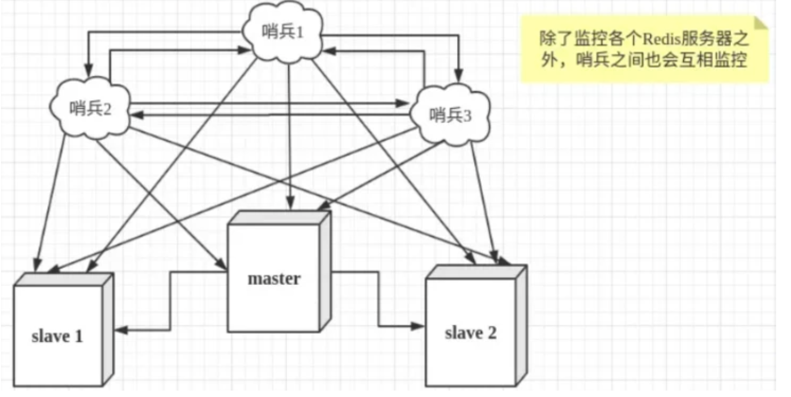

一个哨兵进程对Redis服务器进行监控，也可能会出现问题，为此，我们可以使用多个哨兵进行监控。各个哨兵之间还会进行监控，这样就形成了多哨兵模式

#### 故障切换的过程
- 假设主服务器宕机，哨兵1先检测到这个结果，系统并不会马上进行 failover 过程，仅仅是哨兵1主观的认为主服务器不可用，这个现象成为主观下线。当后面的哨兵也检测到主服务器不可用，并且数量达到一定值时，那么哨兵之间就会进行一次投票，投票的结果由一个哨兵发起，进行 failover 操作。切换成功后，就会通过发布订阅模式，让各个哨兵把自己监控的从服务器实现切换主机，这个过程称为客观下线。这样对于客户端而言，一切都是透明的。

#### 哨兵模式的工作方式
- 每个Sentinel（哨兵）进程以每秒钟一次的频率向整个集群中的 Master 主服务器，Slave 从服务器以及其他Sentinel（哨兵）进程发送一个 PING 命令。
- 如果一个实例（instance）距离最后一次有效回复 PING 命令的时间超过 down-after-milliseconds 选项所指定的值， 则这个实例会被 Sentinel（哨兵）进程标记为主观下线（SDOWN）
- 如果一个 Master 主服务器被标记为主观下线（SDOWN），则正在监视这个 Master 主服务器的所有 Sentinel（哨兵）进程要以每秒一次的频率确认 Master 主服务器的确进入了主观下线状态
- 当有足够数量的 Sentinel（哨兵）进程（大于等于配置文件指定的值）在指定的时间范围内确认 Master 主服务器进入了主观下线状态（SDOWN）， 则 Master 主服务器会被标记为客观下线（ODOWN）
- 在一般情况下， 每个 Sentinel（哨兵）进程会以每 10 秒一次的频率向集群中的所有 Master 主服务器、Slave 从服务器发送 INFO 命令。
- 当 Master 主服务器被 Sentinel（哨兵）进程标记为客观下线（ODOWN）时，Sentinel（哨兵）进程向下线的 Master 主服务器的所有 Slave 从服务器发送 INFO 命令的频率会从 10 秒一次改为每秒一次。
- 若没有足够数量的 Sentinel（哨兵）进程同意 Master主服务器下线， Master 主服务器的客观下线状态就会被移除。若 Master 主服务器重新向 Sentinel（哨兵）进程发送 PING 命令返回有效回复，Master主服务器的主观下线状态就会被移除
#### 哨兵模式的优缺点
优点
- 哨兵模式是基于主从模式的，所有主从的优点，哨兵模式都具有。
- 主从可以自动切换，系统更健壮，可用性更高(可以看作自动版的主从复制)。

缺点
- Redis较难支持在线扩容，在集群容量达到上限时在线扩容会变得很复杂。

## 故障转移时会从剩下的slave选举一个新的master，被选举为master的标准是什么？

如果一个master被认为odown了，而且majority哨兵都允许了主备切换，那么某个哨兵就会执行主备切换操作，此时首先要选举一个slave来，会考虑slave的一些信息。

* 跟master断开连接的时长。
  如果一个slave跟master断开连接已经超过了down-after-milliseconds的10倍，外加master宕机的时长，那么slave就被认为不适合选举为master.

```
( down-after-milliseconds * 10) + milliseconds_since_master_is_in_SDOWN_state
```

* slave优先级。
  按照slave优先级进行排序，slave priority越低，优先级就越高

* 复制offset。
  如果slave priority相同，那么看replica offset，哪个slave复制了越多的数据，offset越靠后，优先级就越高

* run id
  如果上面两个条件都相同，那么选择一个run id比较小的那个slave。

## 同步配置的时候其他哨兵根据什么更新自己的配置呢？

执行切换的那个哨兵，会从要切换到的新master（salve->master）那里得到一个configuration epoch，这就是一个version号，每次切换的version号都必须是唯一的。

如果第一个选举出的哨兵切换失败了，那么其他哨兵，会等待failover-timeout时间，然后接替继续执行切换，此时会重新获取一个新的configuration epoch 作为新的version号。

这个version号就很重要了，因为各种消息都是通过一个channel去发布和监听的，所以一个哨兵完成一次新的切换之后，新的master配置是跟着新的version号的，其他的哨兵都是根据版本号的大小来更新自己的master配置的。

## 为什么Redis哨兵集群只有2个节点无法正常工作？

哨兵集群必须部署2个以上节点。

如果两个哨兵实例，即两个Redis实例，一主一从的模式。

则Redis的配置quorum=1，表示一个哨兵认为master宕机即可认为master已宕机。

但是如果是机器1宕机了，那哨兵1和master都宕机了，虽然哨兵2知道master宕机了，但是这个时候，需要majority，也就是大多数哨兵都是运行的，2个哨兵的majority就是2（2的majority=2，3的majority=2，5的majority=3，4的majority=2），2个哨兵都运行着，就可以允许执行故障转移。

但此时哨兵1没了就只有1个哨兵了了，此时就没有majority来允许执行故障转移，所以故障转移不会执行。

## Redis cluster中是如何实现数据分布的？这种方式有什么优点？

Redis cluster有固定的16384个hash slot（哈希槽），对每个key计算CRC16值，然后对16384取模，可以获取key对应的hash slot。

Redis cluster中每个master都会持有部分slot（槽），比如有3个master，那么可能每个master持有5000多个hash slot。

hash slot让node的增加和移除很简单，增加一个master，就将其他master的hash slot移动部分过去，减少一个master，就将它的hash slot移动到其他master上去。每次增加或减少master节点都是对16384取模，而不是根据master数量，这样原本在老的master上的数据不会因master的新增或减少而找不到。并且增加或减少master时Redis cluster移动hash slot的成本是非常低的。

## Redis cluster节点间通信是什么机制？

Redis cluster节点间采取gossip协议进行通信，所有节点都持有一份元数据，不同的节点如果出现了元数据的变更之后U不断地i将元数据发送给其他节点让其他节点进行数据变更。

> 节点互相之间不断通信，保持整个集群所有节点的数据是完整的。
> 主要交换故障信息、节点的增加和移除、hash slot信息等。

这种机制的好处在于，元数据的更新比较分散，不是集中在一个地方，更新请求会陆陆续续，打到所有节点上去更新，有一定的延时，降低了压力;

缺点，元数据更新有延时，可能导致集群的一些操作会有一些滞后。


## 集群

### Cluster 集群模式
Redis Cluster是一种服务器 Sharding 技术，3.0版本开始正式提供。Redis 的哨兵模式基本已经可以实现高可用，读写分离 ，但是在这种模式下每台 Redis 服务器都存储相同的数据，很浪费内存，所以在 redis3.0上加入了 Cluster 集群模式，实现了 Redis 的分布式存储，也就是说每台 Redis 节点上存储不同的内容

#### 主从复制模型
- 为了保证高可用，redis-cluster集群引入了主从复制模型，一个主节点对应一个或者多个从节点，当主节点宕机的时候，就会启用从节点

##### 数据分区方式
###### 顺序分布

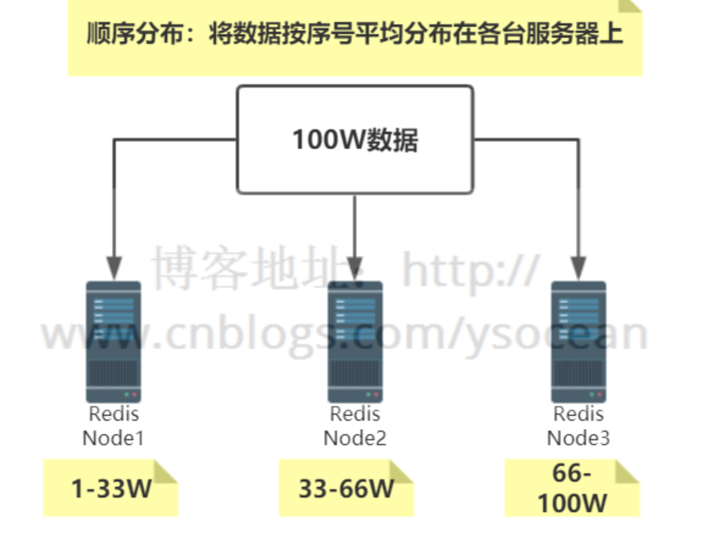
  
特点：键值业务相关；数据分散，但是容易造成访问倾斜；支持顺序访问；支持批量操作

###### 哈希分布

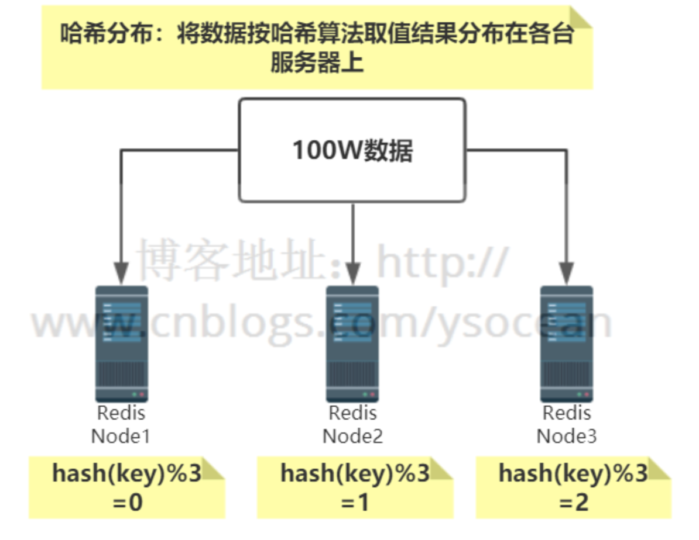

特点：数据分散度高；键值分布与业务无关；不支持顺序访问；支持批量操作。

###### 一致性哈希分布

问题：对于上面介绍的哈希分布，大家可以想一下，如果向集群中增加节点，或者集群中有节点宕机，这个时候应该怎么处理？

增加节点

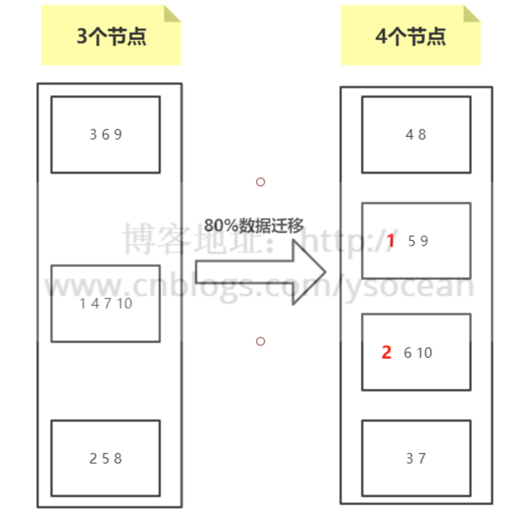
    
- 如上图所示，总共10个数据通过节点取余hash(key)%/3 的方式分布到3个节点，这时候由于访问量变大，要进行扩容，由 3 个节点变为 4 个节点。
- 我们发现，如图所示，数据除了标红的1 2 没有进行迁移，别的数据都要进行变动，达到了80%，如果这时候并发很高，80%的数据都要从下层节点（比如数据库）获取，会给下层节点造成很大的访问压力，这是不能接受的。
- 即使我们进行翻倍扩容，从3个节点增加到6个节点，其数据迁移也在50%左右
   
删除节点


上图其实不管是哪一个节点宕机，其数据迁移量都会超过50%。基本上也是我们所不能接受的 

那么如何使得集群中新增节点或者删除节点时，数据迁移量最少？——一致性哈希算法诞生。
      
- 原理图

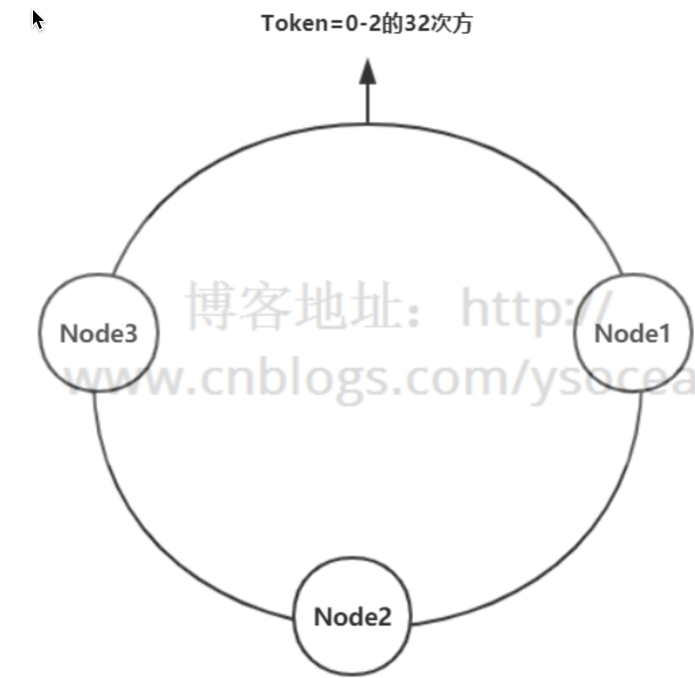

假设有一个哈希环，从0到2的32次方，均匀的分成三份，中间存放三个节点，沿着顺时针旋转，从Node1到Node2之间的数据，存放在Node2节点上；从Node2到Node3之间的数据，存放在Node3节点上，依次类推。

假设Node1节点宕机，那么原来Node3到Node1之间的数据这时候改为存放到Node2节点上，Node2到Node3之间数据保持不变，原来Node1到Node2之间的数据还是存放在Node2上，也就是只影响三分之一的数据，节点越多，影响数据越少

虚拟节点
- hash 算法并不是保证绝对的平衡，如果 cache 较少的话，对象并不能被均匀的映射到 cache 上，为了解决这种情况， consistent hashing 引入了“虚拟节点”的概念，它可以如下定义
  - 虚拟节点（ virtual node ）是实际节点在 hash 空间的复制品（ replica ），一实际个节点对应了若干个“虚拟节点”，这个对应个数也成为“复制个数”，“虚拟节点”在 hash 空间中以 hash 值排列
- 仍以仅部署 cache A 和 cache C 的情况为例。现在我们引入虚拟节点，并设置“复制个数”为 2 ，这就意味着一共会存在 4 个“虚拟节点”， cache A1, cache A2 代表了 cache A； cache C1, cache C2 代表了 cache C 。此时，对象到“虚拟节点”的映射关系为：
  - objec1->cache A2 ； objec2->cache A1 ； objec3->cache C1 ； objec4->cache C2 ；
- 因此对象 object1 和 object2 都被映射到了 cache A 上，而 object3 和 object4 映射到了 cache C 上；平衡性有了很大提高。 引入“虚拟节点”后，映射关系就从 { 对象 -> 节点 } 转换到了 { 对象 -> 虚拟节点 } 。查询物体所在 cache 时的映射关系如下图 所示

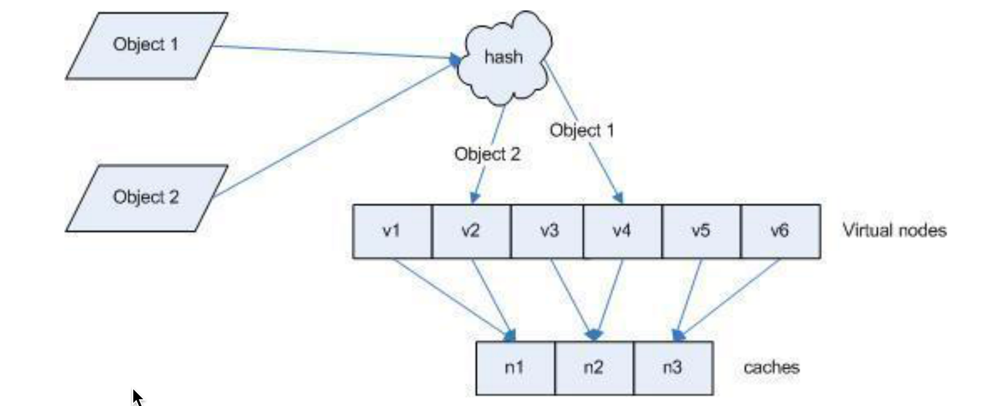

#### Redis Cluster虚拟槽分区
Redis集群数据分布没有使用一致性哈希分布，而是使用虚拟槽分区概念

Redis内部内置了序号 0-16383 个槽位，每个槽位可以用来存储一个数据集合，将这些槽位按顺序分配到集群中的各个节点。每次新的数据到来，会通过哈希函数 CRC16(key) 算出将要存储的槽位下标，然后通过该下标找到前面分配的Redis节点，最后将数据存储到该节点中


特点
- 解耦 数据 和 节点 之间的关系，简化了节点 扩容 和 收缩 难度。
- 节点自身 维护槽的 映射关系，不需要 客户端 或者 代理服务 维护 槽分区元数据。
- 支持 节点、槽、键 之间的 映射查询，用于 数据路由、在线伸缩 等场景
- 只有一个数据库db0

### Redis Cluster 节点通信原理：Gossip 算法

### Gossip 简介
```
Gossip 协议，顾名思义，就像流言蜚语一样，利用一种随机、带有传染性的方式，将信息传播到整个网络中，并在一定时间内，使得系统内的所有节点数据一致。对你来说，掌握这个协议不仅能很好地理解这种最常用的，实现最终一致性的算法，也能在后续工作中得心应手地实现数据的最终一致性。

Gossip 协议又称 epidemic 协议（epidemic protocol），是基于流行病传播方式的节点或者进程之间信息交换的协议，在P2P网络和分布式系统中应用广泛，它的方法论也特别简单：

在一个处于有界网络的集群里，如果每个节点都随机与其他节点交换特定信息，经过足够长的时间后，集群各个节点对该份信息的认知终将收敛到一致。
这里的“特定信息”一般就是指集群状态、各节点的状态以及其他元数据等。Gossip协议是完全符合 BASE 原则，可以用在任何要求最终一致性的领域，比如分布式存储和注册中心。另外，它可以很方便地实现弹性集群，允许节点随时上下线，提供快捷的失败检测和动态负载均衡等。

此外，Gossip 协议的最大的好处是，即使集群节点的数量增加，每个节点的负载也不会增加很多，几乎是恒定的。这就允许 Redis Cluster 或者 Consul 集群管理的节点规模能横向扩展到数千个。
```
### 节点状态和消息类型
Redis Cluster 中的每个节点都维护一份自己视角下的当前整个集群的状态，主要包括：
```
- 当前集群状态
- 集群中各节点所负责的 slots信息，及其migrate状态
- 集群中各节点的master-slave状态
- 集群中各节点的存活状态及怀疑Fail状态
  也就是说上面的信息，就是集群中Node相互八卦传播流言蜚语的内容主题，而且比较全面，既有自己的更有别人的，这么一来大家都相互传，最终信息就全面而且一致了。
```
Redis Cluster 的节点之间会相互发送多种消息，较为重要的如下所示：
```
- MEET：通过「cluster meet ip port」命令，已有集群的节点会向新的节点发送邀请，加入现有集群，然后新节点就会开始与其他节点进行通信；
- PING：节点按照配置的时间间隔向集群中其他节点发送 ping 消息，消息中带有自己的状态，还有自己维护的集群元数据，和部分其他节点的元数据；
- PONG: 节点用于回应 PING 和 MEET 的消息，结构和 PING 消息类似，也包含自己的状态和其他信息，也可以用于信息广播和更新；
- FAIL: 节点 PING 不通某节点后，会向集群所有节点广播该节点挂掉的消息。其他节点收到消息后标记已下线。
```
通过上述这些消息，集群中的每一个实例都能获得其它所有实例的状态信息。这样一来，即使有新节点加入、节点故障、Slot 变更等事件发生，实例间也可以通过 PING、PONG 消息的传递，完成集群状态在每个实例上的同步。下面，我们依次来看看几种常见的场景。

#### 定时 PING/PONG 消息
Redis Cluster 中的节点都会定时地向其他节点发送 PING 消息，来交换各个节点状态信息，检查各个节点状态，包括在线状态、疑似下线状态 PFAIL 和已下线状态 FAIL。

Redis 集群的定时 PING/PONG 的工作原理可以概括成两点：

- 一是，每个实例之间会按照一定的频率，从集群中随机挑选一些实例，把 PING 消息发送给挑选出来的实例，用来检测这些实例是否在线，并交换彼此的状态信息。PING 消息中封装了发送消息的实例自身的状态信息、部分其它实例的状态信息，以及 Slot 映射表。
- 二是，一个实例在接收到 PING 消息后，会给发送 PING 消息的实例，发送一个 PONG 消息。PONG 消息包含的内容和 PING 消息一样。

下图显示了两个实例间进行 PING、PONG 消息传递的情况，其中实例一为发送节点，实例二是接收节点

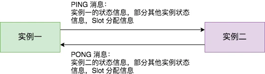

#### 新节点上线
Redis Cluster 加入新节点时，客户端需要执行 CLUSTER MEET 命令，如下图所示。

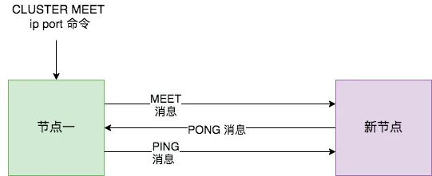

节点一在执行 CLUSTER MEET 命令时会首先为新节点创建一个 clusterNode 数据，并将其添加到自己维护的 clusterState 的 nodes 字典中。有关 clusterState 和 clusterNode 关系，我们在最后一节会有详尽的示意图和源码来讲解。

然后节点一会根据据 CLUSTER MEET 命令中的 IP 地址和端口号，向新节点发送一条 MEET 消息。新节点接收到节点一发送的MEET消息后，新节点也会为节点一创建一个 clusterNode 结构，并将该结构添加到自己维护的 clusterState 的 nodes 字典中。

接着，新节点向节点一返回一条PONG消息。节点一接收到节点B返回的PONG消息后，得知新节点已经成功的接收了自己发送的MEET消息。

最后，节点一还会向新节点发送一条 PING 消息。新节点接收到该条 PING 消息后，可以知道节点A已经成功的接收到了自己返回的P ONG消息，从而完成了新节点接入的握手操作。

MEET 操作成功之后，节点一会通过稍早时讲的定时 PING 机制将新节点的信息发送给集群中的其他节点，让其他节点也与新节点进行握手，最终，经过一段时间后，新节点会被集群中的所有节点认识。

#### 节点疑似下线和真正下线
Redis Cluster 中的节点会定期检查已经发送 PING 消息的接收方节点是否在规定时间 ( cluster-node-timeout ) 内返回了 PONG 消息，如果没有则会将其标记为疑似下线状态，也就是 PFAIL 状态，如下图所示。

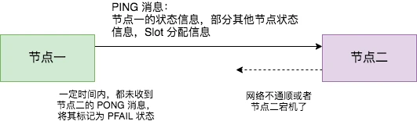

然后，节点一会通过 PING 消息，将节点二处于疑似下线状态的信息传递给其他节点，例如节点三。节点三接收到节点一的 PING 消息得知节点二进入 PFAIL 状态后，会在自己维护的 clusterState 的 nodes 字典中找到节点二所对应的 clusterNode 结构，并将主节点一的下线报告添加到 clusterNode 结构的 fail_reports 链表中。

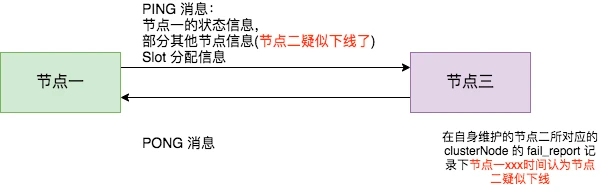

随着时间的推移，如果节点十 (举个例子) 也因为 PONG 超时而认为节点二疑似下线了，并且发现自己维护的节点二的 clusterNode 的 fail_reports 中有半数以上的主节点数量的未过时的将节点二标记为 PFAIL 状态报告日志，那么节点十将会把节点二将被标记为已下线 FAIL 状态，并且节点十会立刻向集群其他节点广播主节点二已经下线的 FAIL 消息，所有收到 FAIL 消息的节点都会立即将节点二状态标记为已下线。如下图所示。

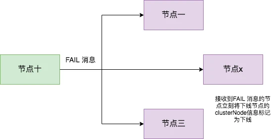

需要注意的是，报告疑似下线记录是由时效性的，如果超过 cluster-node-timeout *2 的时间，这个报告就会被忽略掉，让节点二又恢复成正常状态。


### Redis cluster伸缩的原理
#### 集群扩容
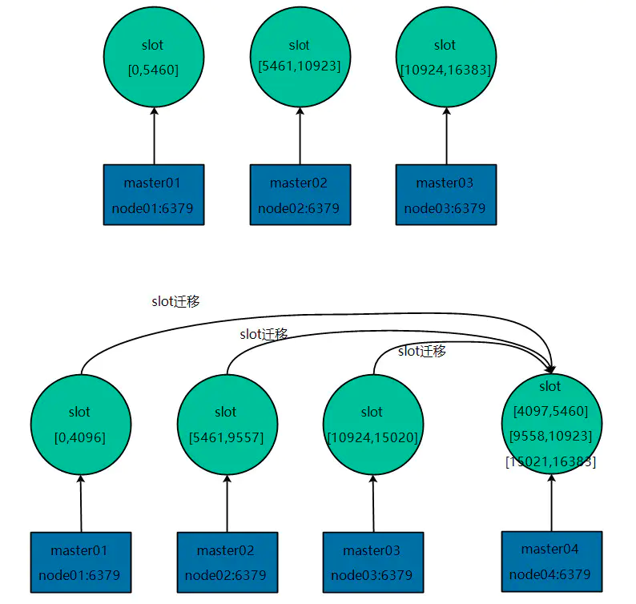

每个master把一部分槽和数据迁移到新的节点node04

#### 集群收缩
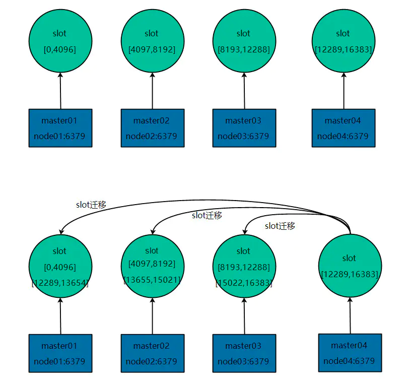

- 如果下线的是slave，那么通知其他节点忘记下线的节点
- 如果下线的是master，那么将此master的slot迁移到其他master之后，通知其他节点忘记此master节点
- 其他节点都忘记了下线的节点之后，此节点就可以正常停止服务了

#### redis cluster为什么没有使用一致性hash算法，而是使用了哈希槽预分片？
```
缓存热点问题：一致性哈希算法在节点太少时，容易因为数据分布不均匀而造成缓存热点的问题。一致性哈希算法可能集中在某个hash区间内的值特别多，会导致大量的数据涌入同一个节点，造成master的热点问题(如同一时间20W的请求都在某个hash区间内)。
```
#### redis的hash槽为什么是16384(2^14)个卡槽，而不是65536(2^16)个？
```
- 如果槽位为65536，发送心跳信息的消息头达8k，发送的心跳包过于庞大。
- redis的集群主节点数量基本不可能超过1000个。集群节点越多，心跳包的消息体内携带的数据越多。如果节点过1000个，也会导致网络拥堵。因此redis作者，不建议redis cluster节点数量超过1000个。 那么，对于节点数在1000以内的redis cluster集群，16384个槽位够用了。没有必要拓展到65536个。
- 槽位越小，节点少的情况下，压缩率高。

```
