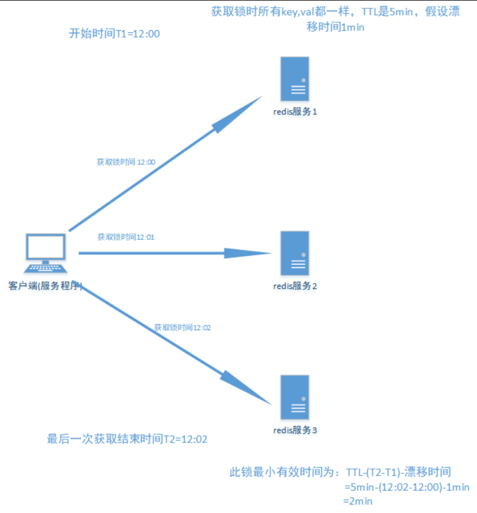

# 分布式问题

## 什么是分布式锁？为什么用分布式锁？

锁在程序中的作用就是同步工具，保证共享资源在同一时刻只能被一个线程访问，Java中的锁我们都很熟悉了，像synchronized 、Lock都是我们经常使用的，但是Java的锁只能保证单机的时候有效，分布式集群环境就无能为力了，这个时候我们就需要用到分布式锁。

分布式锁，顾名思义，就是分布式项目开发中用到的锁，可以用来控制分布式系统之间同步访问共享资源。

思路是：在整个系统提供一个**全局、唯一**的获取锁的“东西”，然后每个系统在需要加锁时，都去问这个“东西”拿到一把锁，这样不同的系统拿到的就可以认为是同一把锁。至于这个“东西”，可以是Redis、Zookeeper，也可以是数据库。

一般来说，分布式锁需要满足的特性有这么几点：

1、互斥性：在任何时刻，对于同一条数据，只有一台应用可以获取到分布式锁；

2、高可用性：在分布式场景下，一小部分服务器宕机不影响正常使用，这种情况就需要将提供分布式锁的服务以集群的方式部署；

3、防止锁超时：如果客户端没有主动释放锁，服务器会在一段时间之后自动释放锁，防止客户端宕机或者网络不可达时产生死锁；

4、独占性：加锁解锁必须由同一台服务器进行，也就是锁的持有者才可以释放锁，不能出现你加的锁，别人给你解锁了。

## 常见的分布式锁有哪些解决方案？

实现分布式锁目前有三种流行方案，即基于关系型数据库、Redis、ZooKeeper 的方案

 1、基于关系型数据库，如MySQL
基于关系型数据库实现分布式锁，是依赖数据库的唯一性来实现资源锁定，比如主键和唯一索引等。

缺点：

* 这把锁强依赖数据库的可用性，数据库是一个单点，一旦数据库挂掉，会导致业务系统不可用。
* 这把锁没有失效时间，一旦解锁操作失败，就会导致锁记录一直在数据库中，其他线程无法再获得到锁。
* 这把锁只能是非阻塞的，因为数据的insert操作，一旦插入失败就会直接报错。没有获得锁的线程并不会进入排队队列，要想再次获得锁就要再次触发获得锁操作。
* 这把锁是非重入的，同一个线程在没有释放锁之前无法再次获得该锁。因为数据中数据已经存在了。

2、基于Redis实现

优点：

Redis 锁实现简单，理解逻辑简单，性能好，可以支撑高并发的获取、释放锁操作。

缺点：

* Redis 容易单点故障，集群部署，并不是强一致性的，锁的不够健壮；
* key 的过期时间设置多少不明确，只能根据实际情况调整；
* 需要自己不断去尝试获取锁，比较消耗性能。

3、基于zookeeper

优点：

zookeeper 天生设计定位就是分布式协调，强一致性，锁很健壮。如果获取不到锁，只需要添加一个监听器就可以了，不用一直轮询，性能消耗较小。

缺点：

在高请求高并发下，系统疯狂的加锁释放锁，最后 zk 承受不住这么大的压力可能会存在宕机的风险。

## 56. Redis实现分布式锁

### 分布式锁的三个核心要素

1、加锁

使用setnx来加锁。key是锁的唯一标识，按业务来决定命名，value这里设置为test。

```
setx key test
```

当一个线程执行setnx返回1，说明key原本不存在，该线程成功得到了锁；当一个线程执行setnx返回0，说明key已经存在，该线程抢锁失败；

2、解锁

有加锁就得有解锁。当得到的锁的线程执行完任务，需要释放锁，以便其他线程可以进入。释放锁的最简单方式就是执行del指令。

```
del key
```

释放锁之后，其他线程就可以继续执行setnx命令来获得锁。

3、锁超时

锁超时知道的是：如果一个得到锁的线程在执行任务的过程中挂掉，来不及显式地释放锁，这块资源将会永远被锁住，别的线程北向进来。

所以，setnx的key必须设置一个超时时间，以保证即使没有被显式释放，这把锁也要在一段时间后自动释放。setnx不支持超时参数，所以需要额外指令，

```
expire key 30
```

### 上述分布式锁存在的问题

**通过上述`setnx` 、`del`和`expire`实现的分布式锁还是存在着一些问题。**

1、SETNX 和 EXPIRE 非原子性

假设一个场景中，某一个线程刚执行setnx，成功得到了锁。此时setnx刚执行成功，还未来得及执行expire命令，节点就挂掉了。此时这把锁就没有设置过期时间，别的线程就再也无法获得该锁。

**解决措施:**

由于`setnx`指令本身是不支持传入超时时间的，而在Redis2.6.12版本上为`set`指令增加了可选参数, 用法如下：

```
SET key value [EX seconds][PX milliseconds] [NX|XX]
```

- EX second: 设置键的过期时间为second秒；
- PX millisecond：设置键的过期时间为millisecond毫秒；
- NX：只在键不存在时，才对键进行设置操作；
- XX：只在键已经存在时，才对键进行设置操作；
- SET操作完成时，返回OK，否则返回nil。

2、锁误解除

如果线程 A 成功获取到了锁，并且设置了过期时间 30 秒，但线程 A 执行时间超过了 30 秒，锁过期自动释放，此时线程 B 获取到了锁；随后 A 执行完成，线程 A 使用 DEL 命令来释放锁，但此时线程 B 加的锁还没有执行完成，线程 A 实际释放的线程 B 加的锁。

**解决办法：**

在del释放锁之前加一个判断，验证当前的锁是不是自己加的锁。

具体在加锁的时候把当前线程的id当做value，可生成一个 UUID 标识当前线程，在删除之前验证key对应的value是不是自己线程的id。

还可以使用 lua 脚本做验证标识和解锁操作。

3、超时解锁导致并发

如果线程 A 成功获取锁并设置过期时间 30 秒，但线程 A 执行时间超过了 30 秒，锁过期自动释放，此时线程 B 获取到了锁，线程 A 和线程 B 并发执行。

A、B 两个线程发生并发显然是不被允许的，一般有两种方式解决该问题：

- 将过期时间设置足够长，确保代码逻辑在锁释放之前能够执行完成。
- 为获取锁的线程增加守护线程，为将要过期但未释放的锁增加有效时间。

4、不可重入

当线程在持有锁的情况下再次请求加锁，如果一个锁支持一个线程多次加锁，那么这个锁就是可重入的。如果一个不可重入锁被再次加锁，由于该锁已经被持有，再次加锁会失败。Redis 可通过对锁进行重入计数，加锁时加 1，解锁时减 1，当计数归 0 时释放锁。

5、无法等待锁释放

上述命令执行都是立即返回的，如果客户端可以等待锁释放就无法使用。

- 可以通过客户端轮询的方式解决该问题，当未获取到锁时，等待一段时间重新获取锁，直到成功获取锁或等待超时。这种方式比较消耗服务器资源，当并发量比较大时，会影响服务器的效率。
- 另一种方式是使用 Redis 的发布订阅功能，当获取锁失败时，订阅锁释放消息，获取锁成功后释放时，发送锁释放消息。

具体实现参考：https://xiaomi-info.github.io/2019/12/17/Redis-distributed-lock/

## 了解RedLock吗？

Redlock是一种算法，Redlock也就是 Redis Distributed Lock，可用实现多节点Redis的分布式锁。

RedLock官方推荐，Redisson完成了对Redlock算法封装。

此种方式具有以下特性：

* 互斥访问：即永远只有一个 client 能拿到锁
* 避免死锁：最终 client 都可能拿到锁，不会出现死锁的情况，即使锁定资源的服务崩溃或者分区，仍然能释放锁。
* 容错性：只要大部分 Redis 节点存活（一半以上），就可以正常提供服务

## RedLock的原理

假设有5个完全独立的Redis主服务器

1. 获取当前时间戳

2. client尝试按照顺序使用相同的key,value获取所有Redis服务的锁，在获取锁的过程中的获取时间比锁过期时间短很多，这是为了不要过长时间等待已经关闭的Redis服务。并且试着获取下一个Redis实例。

  比如：TTL为5s,设置获取锁最多用1s，所以如果一秒内无法获取锁，就放弃获取这个锁，从而尝试获取下个锁

3. client通过获取所有能获取的锁后的时间减去第一步的时间，这个时间差要小于TTL时间并且至少有3个Redis实例成功获取锁，才算真正的获取锁成功

4. 如果成功获取锁，则锁的真正有效时间是 TTL减去第三步的时间差 的时间；比如：TTL 是5s,获取所有锁用了2s,则真正锁有效时间为3s(其实应该再减去时钟漂移);

5. 如果客户端由于某些原因获取锁失败，便会开始解锁所有Redis实例；因为可能已经获取了小于3个锁，必须释放，否则影响其他client获取锁

算法示意图如下：



