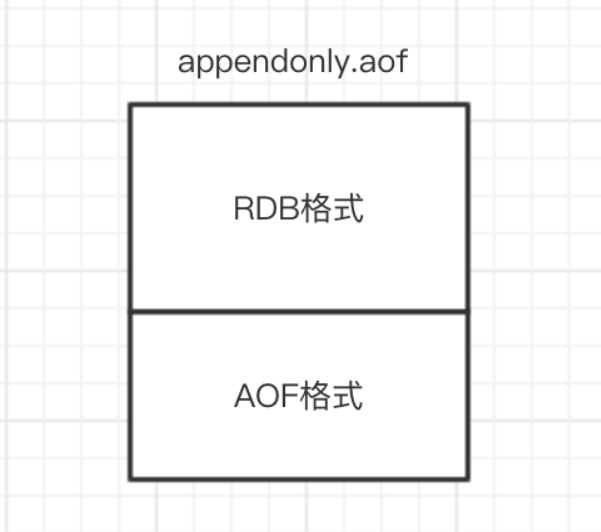

# 持久化

## Redis持久化机制？

为了能够重用Redis数据，或者防止系统故障，我们需要将Redis中的数据写入到磁盘空间中，即持久化。

Redis提供了两种不同的持久化方法可以将数据存储在磁盘中，一种叫快照`RDB`，另一种叫只追加文件`AOF`。

**RDB快照**

在指定的时间间隔内将内存中的数据集快照写入磁盘(`Snapshot`)，它恢复时是将快照文件直接读到内存里。
```
- 当条件满足时 Redis会将某个时间点的数据集保存到一个 RDB文件中，数据的读取和恢复都可以直接通过该文件
- 什么情况下会触发 RDB操作持久化我们的数据？
  - 使用 save命令手动持久化数据 需要注意的是，save命令会造成阻塞，在 RDB文件生成期间 Redis不会处理其他的请求
  - 手动或者自动执行 bgsave命令（bgsave即 background save
    - 该命令执行时 Redis会调用一个 fork();函数，继而创建一条子线程，rdb文件的生成 就会交给该子线程来处理
      - 父进程继续接收并处理客户端发来的命令，而子进程开始将内存中的数据写入硬盘中的临时文件
    - 当子进程写入完所有数据后，会用该临时文件替换旧的RDB文件，至此 一次快照操作完成；子进程退出
    - 这种方式的优劣已经显而易见了，优点是不会出现阻塞问题 且基本上不会影响到主线程；缺点是子线程会占用一定的 CPU性能
    - 虽有小弊病但不致命，所以这种方式使用的会更多一些（所有的自动执行默认都使用的是该命令）
- 在 Redis.conf 配置文件中
  - `save 900 1`           #在900秒(15分钟)之后，如果至少有1个key发生变化，Redis就会自动触发BGSAVE命令创建快照。
  - `save 300 10`          #在300秒(5分钟)之后，如果至少有10个key发生变化，Redis就会自动触发BGSAVE命令创建快照。
  - `save 60 10000`        #在60秒(1分钟)之后，如果至少有10000个key发生变化，Redis就会自动触发BGSAVE命令创建快照。
```
**优势**：适合大规模的数据恢复；对数据完整性和一致性要求不高

**劣势**：在一定间隔时间做一次备份，所以如果Redis意外`down`掉的话，就会丢失最后一次快照后的所有修改。

**AOF追加**

以日志的形式来记录每个写操作，将Redis执行过的所有写指令记录下来(读操作不记录)，只许追加文件但不可以改写文件，Redis启动之初会读取该文件重新构建数据，换言之，Redis重启的话就根据日志文件的内容将写指令从前到后执行一次以完成数据的恢复工作。

AOF采用文件追加方式，文件会越来越大，为避免出现此种情况，新增了重写机制，当AOF文件的大小超过所设定的阈值时， Redis就会启动AOF文件的内容压缩，只保留可以恢复数据的最小指令集。与快照持久化相比，AOF 持久化 的实时性更好，因此已成为主流的持久化方案。

> 默认情况下 Redis 没有开启 AOF（append only file）方式的持久化，可以通过 appendonly 参数开启：appendonly yes

开启 AOF 持久化后每执行一条会更改 Redis 中的数据的命令，Redis 就会将该命令写入硬盘中的 AOF 文件。AOF 文件的保存位置和 RDB 文件的位置相同，都是通过 dir 参数设置的，默认的文件名是 appendonly.aof。

在 Redis 的配置文件中存在三种不同的 AOF 持久化方式，它们分别是：
```
- appendfsync always    #每次有数据修改发生时都会写入AOF文件,这样会严重降低Redis的速度
- appendfsync everysec  #每秒钟同步一次，显示地将多个写命令同步到硬盘
- appendfsync no        #让操作系统决定何时进行同步
```
aof文件的自动重写
```
- 该功能可以最大程度的对 aof文件进行瘦身 同时保证数据的完整性
  - 将重复或者无效的命令从新文件中剔除
  - 将过期的数据从新文件中剔除
  - 将可以进行合并的命令进行合并操作，并记录在新文件中
- 具体实现
  - 在重写开始之前 Redis会先确认有没有 bgsave（RDB持久化）或者bgrewriteaof（AOF重写）在执行
  - 主进程 fork出一条子进程，在 fork期间 Redis是阻塞的
  - 子进程 fork完毕后，主进程会继续处理客户端的请求，所有写命令依然写入缓冲区并根据策略同步到磁盘，保证原有 AOF文件完整和正确
    - 但需要注意的是，子进程在完成 fork后就不再共享主进程的内存了
    - 所以在子进程重写 aof文件这段时间内 为了防止丢失数据，主进程不仅要将 数据写入 aof_buf还要写入 aof_rewrite_buf
  - 子进程根据内存快照，按照命令重写规则写入到新的 AOF文件
  - 子进程写完新的 AOF文件后，会向主进程发信号，主进程更新统计信息
  - 主进程将 aof_rewrite_buf中的数据写入到新的 AOF文件中
  - 使用新的 AOF文件覆盖旧的 AOF文件，重写完成
```
**优势**

- 每修改同步：`appendfsync always` 同步持久化，每次发生数据变更会被立即记录到磁盘，性能较差但数据完整性比较好
- 每秒同步：`appendfsync everysec` 异步操作，每秒记录，如果一秒内宕机，有数据丢失
- 不同步：`appendfsync no`   从不同步

**劣势**

- 相同数据集的数据而言`aof`文件要远大于`rdb`文件，恢复速度慢于`rdb`
- `aof`运行效率要慢于`rdb`，每秒同步策略效率较好，不同步效率和`rdb`相同


## 如何选择合适的持久化方式

- 如果是数据不那么敏感，且可以从其他地方重新生成补回的，那么可以关闭持久化。
- 如果是数据比较重要，不想再从其他地方获取，且可以承受数分钟的数据丢失，比如缓存等，那么可以只使用RDB。
- 如果是用做内存数据库，要使用Redis的持久化，建议是RDB和AOF都开启，或者定期执行bgsave做快照备份，RDB方式更适合做数据的备份，AOF可以保证数据的不丢失。

**补充：Redis4.0 对于持久化机制的优化**

Redis4.0相对与3.X版本其中一个比较大的变化是4.0添加了新的混合持久化方式。

简单的说：新的AOF文件前半段是RDB格式的全量数据后半段是AOF格式的增量数据，如下图：



**优势**：混合持久化结合了RDB持久化 和 AOF 持久化的优点， 由于绝大部分都是RDB格式，加载速度快，同时结合AOF，增量的数据以AOF方式保存了，数据更少的丢失。

**劣势**：兼容性差，一旦开启了混合持久化，在4.0之前版本都不识别该aof文件，同时由于前部分是RDB格式，阅读性较差。

## Redis持久化数据和缓存怎么做扩容？

* 如果Redis被当做缓存使用，使用一致性哈希实现动态扩容缩容。

* 如果Redis被当做一个持久化存储使用，必须使用固定的keys-to-nodes映射关系，节点的数量一旦确定不能变化。否则的话(即Redis节点需要动态变化的情况），必须使用可以在运行时进行数据再平衡的一套系统，而当前只有Redis集群可以做到这样。