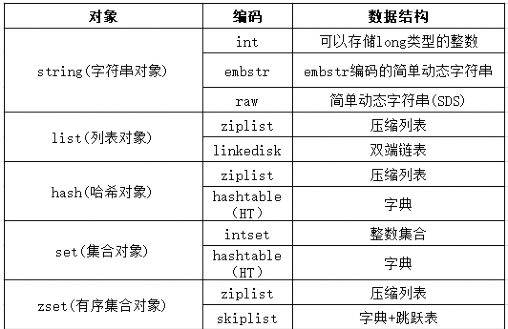
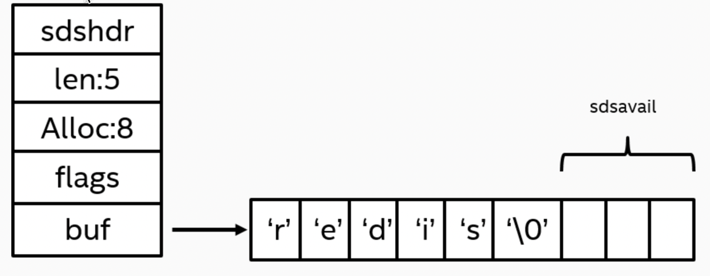
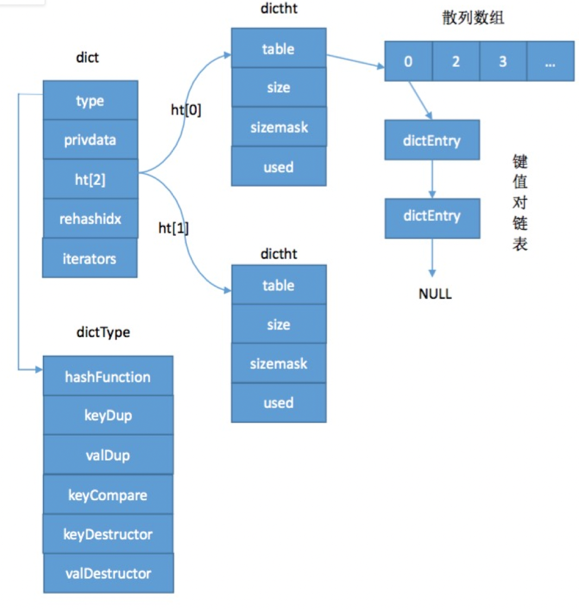
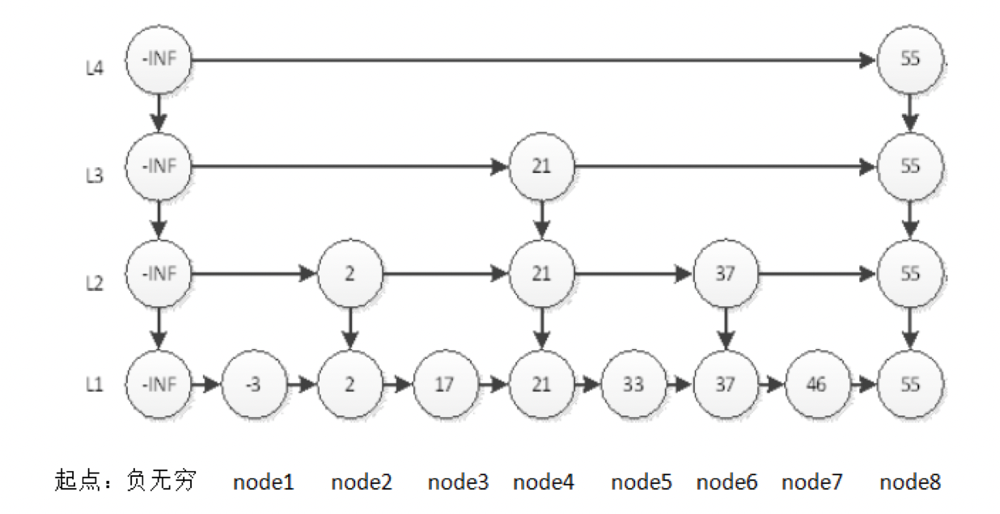
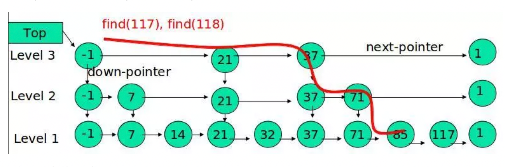
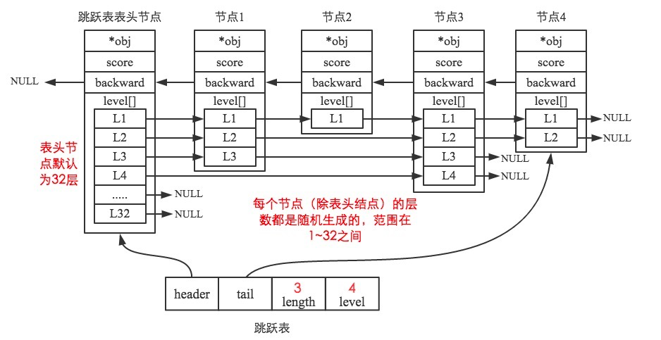
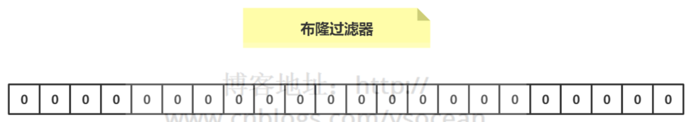
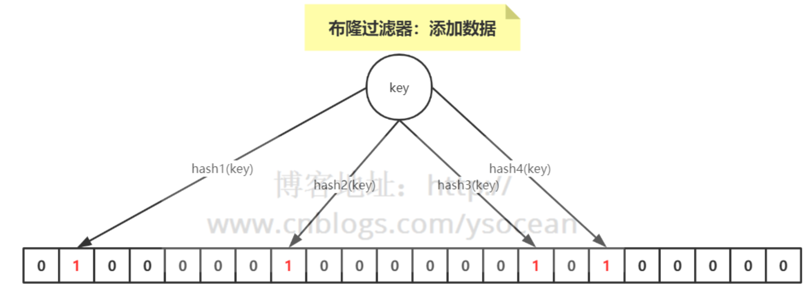

# redisObject
redisObject 的定义位于 redis.h ,Redis的每种数据类型都是套用该对象
```cpp
typedef struct redisObject {
    // 类型
    unsigned type:4;
    // 对齐位
    unsigned notused:2;
    // 编码方式
    unsigned encoding:4;
    // LRU 时间（相对于 server.lruclock）
    unsigned lru:22;
    // 引用计数
    int refcount;
    // 指向对象的值
    void *ptr;
} robj;
```
type 、 encoding 和 ptr 是最重要的三个属性。

type 记录了对象所保存的值的类型，它的值可能是以下常量的其中一个（定义位于 redis.h）：
```cpp
/*
 * 对象类型
 */
#define REDIS_STRING 0  // 字符串
#define REDIS_LIST 1    // 列表
#define REDIS_SET 2     // 集合
#define REDIS_ZSET 3    // 有序集
#define REDIS_HASH 4    // 哈希表
```
encoding 记录了对象所保存的值的编码，它的值可能是以下常量的其中一个（定义位于 redis.h）：
```cpp
/*
 * 对象编码
 */
#define REDIS_ENCODING_RAW 0            // 编码为字符串
#define REDIS_ENCODING_INT 1            // 编码为整数
#define REDIS_ENCODING_HT 2             // 编码为哈希表
#define REDIS_ENCODING_ZIPMAP 3         // 编码为 zipmap
#define REDIS_ENCODING_LINKEDLIST 4     // 编码为双端链表
#define REDIS_ENCODING_ZIPLIST 5        // 编码为压缩列表
#define REDIS_ENCODING_INTSET 6         // 编码为整数集合
#define REDIS_ENCODING_SKIPLIST 7       // 编码为跳跃表
```
ptr 是一个指针，指向实际保存值的数据结构，这个数据结构由 type 属性和 encoding 属性决定。

举个例子，如果一个 redisObject 的 type 属性为 REDIS_LIST ， encoding 属性为 REDIS_ENCODING_LINKEDLIST ，那么这个对象就是一个 Redis 列表，它的值保存在一个双端链表内，而 ptr 指针就指向这个双端链表；

每个类型都会有两种或以上的实现



## **string**
#### int整数
如果保存的字符串是整数值，并且这个整数值可以用long类型来表示，那么ptr指针的void*则转化为C语言源生的long类型
			
#### SDS（raw简单动态字符串）
- sds实现 > 39字节

结构图



我们把上图中非char数组（变量名为buf）的部分都统称为header

`len` 为buf分配的内存空间已使用的长度，即我们看见的，有效的字符串

`alloc` buf分配的内存空间的总长度，alloc – len 就是未使用的空间，当然这长度不包括SDS字符串头和结尾NULL

`flags` 只使用了低三位表示类型，值为0-4，分别表示sdshdr5到sdshdr64这五种类型。高五位没有用处，目的是根据字符串的长度的不同选择不同的sds结构体

```cpp
/* 因为生的跟别人不一样（内部结构不一样），老五（sdshdr5）从来不被使用 */
  struct __attribute__ ((__packed__)) sdshdr5 {
      unsigned char flags; /* 低三位表示类型, 高五位表示字符串长度 */
      char buf[];
  };
  
  struct __attribute__ ((__packed__)) sdshdr8 {
      uint8_t len; /* 字符串长度*/
      uint8_t alloc; /* 分配长度 */
      unsigned char flags; /* 低三位表示类型，高五位未使用 */
      char buf[];
  };
  
  struct __attribute__ ((__packed__)) sdshdr16 {
      uint16_t len; /* 字符串长度*/
      uint16_t alloc; /* 分配长度 */
      unsigned char flags; /* 低三位表示类型，高五位未使用 */
      char buf[];
  };
  
  struct __attribute__ ((__packed__)) sdshdr32 {
      uint32_t len; /* 字符串长度*/
      uint32_t alloc; /* 分配长度 */
      unsigned char flags; /* 低三位表示类型，高五位未使用 */
      char buf[];
  };
  
  struct __attribute__ ((__packed__)) sdshdr64 {
      uint64_t len; /* 字符串长度*/
      uint64_t alloc; /* 分配长度 */
      unsigned char flags; /* 低三位表示类型，高五位未使用 */
      char buf[];
  };
```
- 为何要定义不同的结构体
  - 结构体的主要区别是len和alloc的类型（uint8，uint16等等），定义不同的结构体是为了存储不同长度的字符串，根据不同长度定义不同的类型是为了节省一部分空间大小，毕竟在Redis字符串非常多，哪怕一点点优化积累起来都很可观
  - 与其他的结构体不同，sdshdr5没有定义char数组和alloc字段，他的值存储在flag没有被使用的高五位中，所以sdshdr5对应的SDS_TYPE_5类型字符串只能保存原串长度小于等于2^5 = 32，因此，它不能为字符串分配空余空间。如果字符串需要动态增长，那么它就必然要重新分配内存才行。所以说，这种类型的sds字符串更适合存储静态的短字符串

`buf` 这是一个没有指明长度的字符数组，这是C语言中定义字符数组的一种特殊写法，称为柔性数组（flexible array member），只能定义在一个结构体的最后一个字段上
- 这个字符数组的长度等于最大容量+1
- 之所以字符数组的长度比最大容量多1个字节，就是为了在字符串长度达到最大容量时仍然有1个字节NULL结束符，即ASCII码为0的’\0’字符，这样字符串可以和c语言源生的字符串兼容

使用sds结构的优点
- `有利于减少内存碎片`，提高存储效率
- `常数复杂度获取字符串长度` len
- `杜绝缓冲区溢出` C语言字符串不记录自身长度，也容易造成缓冲区溢出。而当SDS对自身字符串进行修改时，API会先检查SDS的剩余空间是否满足需要（获取alloc减len），如果不满足，则会先拓展空间，再执行API
- `空间预分配`
  - SDS在重新分配空间的时候，会预分配一些空间来作为冗余。当SDS的len属性长度小于1MB时，Redis会分配和len相同长度的free空间。至于为什么这样分配呢，上次用了len长度的空间，那么下次程序可能也会用len长度的空间，所以Redis就为你预分配这么多的空间
  - 但是当SDS的len属性长度大于1MB时，程序将多分配1M的未使用空间。这个时候再根据这种惯性预测来分配的话就有点得不偿失了。所以Redis是将1MB设为一个风险值，没过风险值你用多少我就给你多少，过了的话那这个风险值就是我能给你临界值。
- `惰性空间释放` Redis的内存回收采用惰性回收，即你把字符串变短了，那么多余的内存空间也不会立刻还给操作系统，先留着，用header的字段将其记录下来，以防接下来又要被使用呢
- `二进制安全` 因为`\0`字符串在SDS中没有意义，他作为结束符的任务已经被header字段给替代了，所以与c语言不一样的，SDS是二进制安全的
  - 使用len字段而不是以\0来判断是否结束，使用`\0`只是为了兼容C的字符串而使用原生的api

#### embstr编码的简单动态字符串
- sds实现 <=39 字节 版本不同不一样，现在好像是44
  - 具体原因就是因为各个结构体定义的字节数加起来+字符串的大小是否超过64来判断
- embstr编码是专门用来保存短字符串的一种优化编码方式
- raw会调用两次内存分配函数来创建redisObject结构和sdshdr结构，而embstr编码则通过调用一次内存分配函数来分配一块连续的空间，空间内一次包含了redisObject和sdshdr两个结构

#### string的操作
- `set hello world` 添加
- `get hello` 获取
- `del hello` 删除
- `SETNX key value` 只有在 key 不存在时设置 key 的值。
- `INCR key` 将 key 中储存的数字值增一。
- `DECR key` 将 key 中储存的数字值减一。

--- 

## **list**
list压缩列表
			
linkedlist双端列表
- 结构
```cpp
typedef struct listNode {
    // 前置节点
    struct listNode *prev;
    // 后置节点
    struct listNode *next;
    // 节点的值
    void *value;
} listNode;

```
- 列表的节点（注意不是列表的定义）定义如上，除了双向链表必须的前后指针外，为了实现通用性，支持不同类型数据的存储，Redis将节点类型的数据域定义为void *类型，从而模拟了“泛型”

#### list的操作
- rpush 
```shell
> rpush list-key item
(integer) 1
> rpush list-key item
(integer) 3
> rpush list-key item2
(integer) 2
```
- lrange
```shell
lrange list-key 0 -1
> "item" 2)
> "item2" 3
> "item"
```
- lindex
```shell
lindex list-key 1
> "item2"
```
- lpop
```shell
lpop list-key
> "item"
```

#### 应用场景
发布与订阅或者说消息队列、慢查询

--- 

## hash

Redis的哈希类型是一个字符串字段和字符串值之间的映射表，这种数据类型可以用来表示对象。Redis中存储的每个哈希可以存储232 - 1键值对（字段和值）。

内部来看，Redis使用两种不同的编码方式来存储哈希：

- ziplist（压缩列表）: 当哈希类型的元素数量较小，并且每个元素的大小也较小时，Redis会使用ziplist作为哈希的内部存储结构。ziplist是一个特别设计的紧凑数据结构，它将所有的字段和值紧密排列在一起以节省空间。zziplist是一个字节数组，允许快速的访问，对小的元素数量非常有效率。

- hashtable（哈希表）: 当哈希类型的元素数量增加或者元素的大小增加，达到一定的阈值时，Redis会改用一个真正的哈希表来存储这些字段和值。这时，每个字段会被散列（通过哈希函数）到哈希表中的不同槽位。每个槽位保存了指向字段和值对应节点的指针。

转换之间的具体阈值是可以配置的，通过hash-max-ziplist-entries和hash-max-ziplist-value配置可以定义什么时候将ziplist升级为哈希表。

在两种数据结构中：

- Ziplist 编码的哈希表是一系列的连续内存块，其中包含了节点的编码长度，前一个节点的长度（以便可以向前或向后遍历），以及节点的内容。
- Hashtable 编码的哈希中，每个节点存储一个指向下一个节点的指针（因为它使用链表来处理散列冲突），字段本身，以及字段对应的值。
Redis使用渐进式rehash机制，新的或更新的元素总是添加到新哈希表中，而读取操作会查看新旧表。旧哈希表的元素会逐渐移动到新哈希表中，直到旧表为空。这使得Redis可以继续服务请求，同时完成rehash操作。


#### hashtable字典
结构体



- dict是字典的包装对象，居于最外层
- ht[2]是包含两个项的哈希表的数组，一般情况下，只使用h[0]，h[1]只有在rehash的时候才会使用
  - 字典通过“拉链法”来解决冲突问题的，dictEntry结构体的*next指针指向了其拉链列表的下一个节点。
- dictht是哈希表的结构，他除了一个数组table用来存放键值对以外，还有used字段表示目前已有键值对，size表示数组大小，sizemark=size-1，用来hash索引
- dictType是类型特定函数
  - HashFunction 计算哈希值的函数
  - KeyDup 复制键的函数
  - ValDup 复制值的函数
  - KeyCompare 对比键的函数
  - KeyDestructor 销毁键的函数
  - ValDestructor 销毁值的函数

dict的rehash
- 3步骤
  - 扩展备用的ht[1]，将它的容量扩张到第一个大于ht[0].used*2的 2的n次方
  - 将ht[0]的值重新经过hash索引之后迁移到ht[1]上。
  - 释放ht[0]，将ht[1]设为ht[0]，创建新的空表ht[1]。
- Rehash是渐进式的
  - Rehash不是一步完成的，而是在操作过程中渐进式的。字典维持一个索引计数器rehashidx用来记录当前正在操作的索引，从ht[0]的0号索引上开始，一个项一个项的迁移到ht[1]，直到完成所有迁移，rehashidx变成-1。
  - 在rehash期间，所有新增字段添加在ht[1]中，而删除，更新操作会在两个表上同时进行。查找时先找ht[0]，再找ht[1]。


负载因子（load factor）是用来决定是否需要进行rehash的一个指标。Redis 的哈希表有以下两个负载因子相关的阈值：

- 负载增加的阈值: 当哈希表的负载因子超过 1（即，已存储的元素数量等于哈希表的大小时），如果我们继续向哈希表添加新的元素，Redis 将会初始化一个新的哈希表，其大小大约是原来的两倍，并开始渐进式地将旧表中的元素迁移到新表中。

- 渐进式rehashing: 在rehash操作进行的同时，Redis 仍然可以响应命令请求。当一个新的写入命令被执行，Redis 会将该键值对存入新的哈希表。同时，在执行读取操作时，Redis 会同时检查新旧两个哈希表。最重要的是，在处理每个命令后，Redis 会花费一点时间（由hresize命令配置的数量指定）将旧哈希表的几项元素迁移到新表中。

- 负载减少的阈值: 当哈希表在rehash后的负载因子小于 0.1（即，表中元素数为桶数的十分之一）时，Redis 会减小哈希表的大小，以节省内存空间。

Redis 中哈希表的扩张和收缩是为了保持效率和节省内存。随着数据的增加，避免哈希碰撞变得更重要；同样的，当数据删除后，减少内存的使用也同等重要。通过负载因子的动态调整，Redis 的哈希表可以平衡性能和资源消耗。

#### hash的操作

```shell
# 添加
hset hash-key sub-key1 value1
hset hash-key sub-key2 value2

# 获取全部
hgetall hash-key 

# 删除
hdel hash-key sub-key2 

# 获取
hget hash-key sub-key1 
```
#### 应用场景
特别适合存储对象

--- 

## **set**
#### intset整数集合
- 结构
  ```cpp
  typedef struct intset {
    uint32_t encoding;
    uint32_t length;
    int8_t contents[];
  } intset;
  ```
  - Encoding 存储编码方式
  - Length inset的长度，即元素数量
  - Content Int数组，用来保存元素，各个项在数组中按数值从小到大排序，不包含重复项
- 当一个集合中只包含整数值，并且元素数量不多时，redis使用整数集合作为set的底层实现
- 当在一个int16类型的整数集合中插入一个int32类型的值，整个集合的所有元素都会转换成32类型
- 整数集合只支持升级操作，不支持降级操作

#### hashtable字典
同上
#### set的操作

- sadd 添加
```shell
> sadd set-key item
(integer) 1
> sadd set-key item2
(integer) 1
> sadd set-key item3
(integer) 1
> sadd set-key item
(integer) 0
```
- smembers 返回集合中的所有成员
```shell
> smembers set-key
"item" 
"item2" 
"item3"
```    
- sismember set-key item4 判断 member 元素是否是集合 key 的成员

```shell
> sismember set-key item4
(integer) 0
> sismember set-key item
(integer) 1
```
- SREM 移除集合中一个或多个成员
```shell
SREM key member1 [member2]
```
- SDIFF 返回第一个集合与其他集合之间的差异。
```shell
SDIFF key1 [key2]
```
- SINTER 返回给定所有集合的交集
```shell
SINTER key1 [key2]
```
- SUNION 返回所有给定集合的并集
```shell
SUNION key1 [key2]
```
#### 应用场景
需要存放的数据不能重复以及需要获取多个数据源交集和并集等场景

--- 
## **zset（sorted set）**
#### ziplist压缩列表
当一个列表只包含少量元素，并且每个元素要么就是小整数值，要么就是长度比较短的字符串，那么Redis使用ziplist作为列表实现
- 压缩表是为了节约内存而开发的，压缩表可以包含任意个节点，每个节点保存一个字节数组（字符串）或一个整数值
#### skiplist跳跃表
- 当元素数量比较多，或者元素成员是比较长的字符串时，底层实现采用跳跃表
- 跳跃表是一种有序数据结构，他在一个节点中维持多个指向其他节点的指针
- 跳跃表的平均复杂度为O(logN)，最坏为O(N)，其效率可以和平衡树相媲美，而且跟平衡树相比，实现简单
- 示意图

  					
  - 每一个竖列其实是一个节点。如果能通过在节点中维持多个指向不同节点的指针（比如node4（值为21）就有三个指针，分别指向node5（33），node6（37），node8（55）），那么就会得到一个平衡的跳跃表
  - 跳跃表最难的，就是保持平衡，维持平衡的跳跃表难度要大于维持平衡的二叉树。故而易于实现的，是实现概率平衡，而不是强制平衡
- 跳跃表的查询
  - 示例
  
  
						
  - 跳跃表的查询是从顶层往下找，那么会先从第顶层开始找，方式就是循环比较，如过顶层节点的下一个节点为空说明到达末尾，会跳到第二层，继续遍历，直到找到对应节点
    - 查找元素 117
    - 比较 21， 比 21 大，且21有后继，向后面找
    - 比较 37, 比 37大，且37节点同层没有后继了，则从 37 的下面一层开始找
    - 比较 71, 比 71 大，且71节点同层没有后继了，则从 71 的下面一层开始找
    - 比较 85， 比 85 大，且85有后继，向后面找
    - 比较 117， 等于 117， 找到了节点

#### Redis中的跳跃表的实现
结构
```cpp
#define ZSKIPLIST_MAXLEVEL 32
#define ZSKIPLIST_P 0.25

typedef struct zskiplistNode {
    //成员对象
    robj *obj;
    //分值
    double score;
    //后向指针
    struct zskiplistNode *backward;
    struct zskiplistLevel {
        //前向指针
        struct zskiplistNode *forward;
        //跨度
        unsigned int span;
    } level[];
} zskiplistNode;

typedef struct zskiplist {
    //跳跃表的表头节点和表尾节点
    struct zskiplistNode *header, *tail;
    // 表中节点的数量
    unsigned long length;
    // 表中层数最大的节点层数
    int level;
} zskiplist;

typedef struct zset {
    dict *dict;
    zskiplist *zsl;
} zset;
```

zskiplistNode 表示跳跃表节点结构
- obj 存放着该节点对于的成员对象，一般指向一个sds结构
- score是double结构，存储分数值。
- backward，后退指针，指向列表前一个node
- level [ ]数组，表示一个节点可以有多个层
  - 数组里面的项是zskiplistLevel结构，可以看到，每一层都有一个跳跃指针forward
  - 跨度span，顾名思义，就是用来记录跨度的，相邻的节点跨度为1。
  - 注意：跨度的用处是用来计算某个节点在跳跃表中的排位的，zset的排序按score从小到大排序。比如我查找到node7，通过将沿途的所有跨度累加，我们可以得到其排在列表中的序列



zskiplist 表示跳跃表结构
- zskiplist中有指向整个跳跃表两端的head指针和tail指针
- 记录跳跃表长度的leng字段。
- Int型的level用来记录目前整个跳跃表中最高的层数。

##### 一般情况下维持平衡跳跃表的实现
- 在跳跃表中插入一个新的节点时，程序需要确定两个要素：该节点的位置，以及层数
- 因为有序集合按照score排序，故而位置可以按照score比出，确定位置。
- 确定了位置后，再确定node的层数，可以采用抛硬币的方式，一次正面，层数+1，直到反面出现为止。因为抛硬币会使层数L的值满足参数为 p = 1/2 的几何分布，在数量足够大时，可以近似平衡。
- 用抛硬币的方式，可以使level+1的概率为2分之一，也就是说，k层节点的数量是k+1层的1/2 ，你可以把它看成是一个二叉树。

##### Redis维持平衡跳跃表的实现
幂次定律
- 含义是：如果某件事的发生频率和它的某个属性成幂关系，那么这个频率就可以称之为符合幂次定律。
- 表现是：少数几个事件的发生频率占了整个发生频率的大部分， 而其余的大多数事件只占整个发生频率的一个小部分。
- 说人话版：越大的数，出现的概率越小。

实现算法
- 当Redis在跳跃表中插入一个新的节点时，程序需要确定两个要素：该节点的位置，以及层数
- Redis的实现与一般维持平衡跳跃表的实现大同小异，Redis中跳跃表的层数也是在插入的时候确定，按照分数找好位置后，Redis会生成一个1-32的数作为层数。
- Redis的level+1的概率是1/4,所以Redis的跳跃表是一个四叉树
  
  ```cpp
  /* Returns a random level for the new skiplist node we are going to create.
  * The return value of this function is between 1 and ZSKIPLIST_MAXLEVEL
  * (both inclusive), with a powerlaw-alike distribution where higher
  * levels are less likely to be returned.
  * 
  * 返回一个介于 1 和 ZSKIPLIST_MAXLEVEL 之间的随机值，作为节点的层数。
  * 
  * 根据幂次定律(power law)，数值越大，函数生成它的几率就越小
  * 
  * T = O(N)
  */
  #define ZSKIPLIST_MAXLEVEL 32 /* Should be enough for 2^32 elements */
  #define ZSKIPLIST_P 0.25      /* Skiplist P = 1/4 */
  int zslRandomLevel(void) {
      int level = 1;
      while ((random()&0xFFFF) < (ZSKIPLIST_P * 0xFFFF))
          level += 1;
      return (level<ZSKIPLIST_MAXLEVEL) ? level : ZSKIPLIST_MAXLEVEL;
  }
  ```
  - 指定节点最大层数 MaxLevel，指定概率 p， 默认层数 lvl 为1
  - 生成一个0~1的随机数r，若r<p，且lvl<MaxLevel ，则lvl ++
  - 重复第 2 步，直至生成的r >p 为止，此时的 lvl 就是要插入的层数。
  - 总结 高层概率总是越小的，底层的概率总是最大的

#### zset的操作
- ZADD 添加
```shell
ZADD key score1 member1 [score2 member2]
```
- ZRNAK 查看排名
```shell
ZRNAK key member
```
- ZREVRNAK 查看排名(倒序) 最大的返回是0
```shell
ZREVRNAK key member
```
- ZRANGE 通过索引区间返回有序集合指定区间内的成员
```shell
ZRANGE key start stop [WITHSCORES]

## 查看前10名，sorce排序
127.0.0.1:6379> zrange test 0 10
1) "xiaoming"
2) "xiaohong"
3) "xiaogang"
4) "xinxin"
5) "ghg"
6) "dahua"
```
- ZREVRANGE 通过索引区间返回有序集合指定区间内的成员(倒序)
```shell
ZREVRANGE key start stop [WITHSCORES]

## 查看前10名，sorce倒序
127.0.0.1:6379> zrevrange test 0 10
1) "dahua"
2) "ghg"
3) "xinxin"
4) "xiaogang"
5) "xiaohong"
6) "xiaoming"
```
- ZREVRANGE 获取所有member的排名
```shell
ZREVRANGE key 0 -1

127.0.0.1:6379> zrevrange test 0 -1
1) "dahua"
2) "ghg"
3) "xinxin"
4) "xiaogang"
5) "xiaohong"
6) "xiaoming"
```
- ZSCORE 获取member的分数
```shell
ZSCORE key member

127.0.0.1:6379> ZSCORE test dahua
"104"
```
- ZCRAD 获取zset key的大小
```shell
ZCRAD key

127.0.0.1:6379> zcard test
(integer) 6
```
- ZREM 移除有序集合中的一个或多个成员
```shell
ZREM key member [member ...]
```
#### 应用场景
需要对数据根据某个权重进行排序的场景。比如在直播系统中，实时排行信息包含直播间在线用户列表，各种礼物排行榜，弹幕消息（可以理解为按消息维度的消息排行榜）等信息

#### 为什么使用跳表不使用别的数据结构？
1. **不需要复杂的平衡**，平衡树的插入和删除操作可能引发子树的调整，逻辑复杂，而skiplist的插入和删除只需要修改相邻节点的指针，操作简单又快速
2. **适合范围查找**，在做范围查找的时候，平衡树比skiplist操作要复杂。在平衡树上，我们找到指定范围的小值之后，还需要以中序遍历的顺序继续寻找其它不超过大值的节点。如果不对平衡树进行一定的改造，这里的中序遍历并不容易实现。而在skiplist上进行范围查找就非常简单，只需要在找到小值之后，对第1层链表进行若干步的遍历就可以实现
3. **算法实现上更简单**

--- 

## **bitmap**
bitmap 存储的是连续的二进制数字（0 和 1），通过 bitmap, 只需要一个 bit 位来表示某个元素对应的值或者状态，key 就是对应元素本身 。我们知道 8 个 bit 可以组成一个 byte，所以 bitmap 本身会极大的节省储存空间
#### 常用命令
setbit 、getbit 、bitcount、bitop
#### 应用场景
1、适合需要保存状态信息（比如是否签到、是否登录...）并需要进一步对这些信息进行分析的场景。比如用户签到情况、活跃用户情况、用户行为统计（比如是否点赞过某个视频）
- 使用场景一：用户行为分析 很多网站为了分析你的喜好，需要研究你点赞过的内容
  - 记录你喜欢过 001 号小姐姐
  ```shell
   127.0.0.1:6379> setbit beauty_girl_001 uid 1
  ```
  - 使用场景二：统计活跃用户
    - 使用时间作为 key，然后用户 ID 为 offset，如果当日活跃过就设置为 1
    - 对一个或多个保存二进制位的字符串 key 进行位元操作，并将结果保存到 destkey 上。
    - BITOP 命令支持 AND 、 OR 、 NOT 、 XOR 这四种操作中的任意一种参数
    ```shell
    BITOP operation destkey key [key ...]
    ```
    ```shell
    # 初始化数据: 
    127.0.0.1:6379> setbit 20210308 1 1
    (integer) 0
    127.0.0.1:6379> setbit 20210308 2 1
    (integer) 0
    127.0.0.1:6379> setbit 20210309 1 1
    (integer) 0
    # 统计20210308~20210309总活跃用户数: 1
    127.0.0.1:6379> bitop and desk1 20210308 20210309
    (integer) 1
    127.0.0.1:6379> bitcount desk1
    (integer) 1
    # 统计20210308~20210309在线活跃用户数: 2
    127.0.0.1:6379> bitop or desk2 20210308 20210309
    (integer) 1
    127.0.0.1:6379> bitcount desk2
    (integer) 2
    ```
  - 使用场景三：用户在线状态
    - 取或者统计用户在线状态，使用 bitmap 是一个节约空间效率又高的一种方法。
    - 一个 key，然后用户 ID 为 offset，如果在线就设置为 1，不在线就设置为 0。

2、布隆过滤器

布隆过滤器使用场景
- 原本有10亿个号码，现在又来了10万个号码，要快速准确判断这10万个号码是否在10亿个号码库中？
- 接触过爬虫的，应该有这么一个需求，需要爬虫的网站千千万万，对于一个新的网站url，我们如何判断这个url我们是否已经爬过了？
- 垃圾邮箱的过滤。

图示

		

一种数据结构，是由一串很长的二进制向量组成，可以将其看成一个二进制数组。既然是二进制，那么里面存放的不是0，就是1，但是初始默认值都是0

原理

添加数据
- 当要向布隆过滤器中添加一个元素key时，我们通过多个hash函数，算出一个值，然后将这个值所在的方格置为1。
- 比如，下图hash1(key)=1，那么在第2个格子将0变为1（数组是从0开始计数的），hash2(key)=7，那么将第8个格子置位1，依次类推
- 图示
								

判断数据是否存在
- 通过hash计算出来的位置只要都是1，这个数据一定存在？否，因为其他的key也很有可能通过相同的hash计算出相同的位置，所以，只能判断某个key一定不存在，不能判断一定存在

优缺点
- 优点 二进制组成的数组，占用内存极少，并且插入和查询速度都足够快
- 缺点 随着数据的增加，误判率会增加；还有无法判断数据一定存在；另外还有一个重要缺点，无法删除数据

#### 如何在大数据量里实时判断用户名是否存在
- 首先可以使用布隆，如果判断不存在则直接返回可使用
- 如果存在，如果允许误判则返回，如果100%确认，则可以通过名字长度去查不同的缓存

--- 

## **HyperLogLog**
Redis HyperLogLog 是用来做基数统计的算法，HyperLogLog 的优点是，在输入元素的数量或者体积非常非常大时，计算基数所需的空间总是固定 的、并且是很小的。

基数计算（cardinality counting）指的是统计一批数据中的不重复元素的个数，常见于计算独立用户数（UV）、维度的独立取值数等等

比如 1,2,3,4,7,4,7   不重复的数据是 1,2,3,4,7 基数为5
#### HyperLogLog的原理
HyperLogLog（简称 HLL）是一种基数（cardinality）算法，用于估计一个集合中的元素数量。它的主要思想是利用概率统计的方法，以极小的空间复杂度来实现高精度的基数统计。

HyperLogLog 的核心是哈希函数和桶。它使用哈希函数将每个元素映射到一个固定大小的二进制字符串（一般为 64 位），然后将这个字符串划分为若干个组（一般为 2^b 个），每个组对应一个桶。对于每个桶，使用特定的算法计算其中元素的基数估计值，并将所有桶的估计值进行组合，得到最终的基数估计值。

具体来说，HyperLogLog 使用了一种特殊的哈希函数，称为 MurmurHash。它可以将任意长度的输入值哈希为一个固定长度的输出值，具有较低的冲突率和较高的随机性。在将元素哈希到二进制字符串时，使用了一种特殊的技巧，称为“前缀零计数法”。它的基本思想是，在二进制字符串中找到第一个 1 的位置，将其前面的所有 0 计数，并将计数值作为该元素所属的桶的索引。

对于每个桶，HyperLogLog 使用了一种特殊的算法，称为“基数估计算法”。它的基本思想是，将桶中所有元素哈希后的二进制字符串中最长的前缀零的长度（即“前导零数”）作为该桶的基数估计值。然后，将所有桶的基数估计值进行组合，得到最终的基数估计值。为了提高估计值的精度，HyperLogLog 还使用了多个哈希函数和多个桶，并对不同的哈希函数和桶进行加权。

需要注意的是，HyperLogLog 是一种概率算法，它的估计值可能存在一定的误差，但是可以通过适当地调整桶的数量和哈希函数的数量来控制误差的大小。另外，HyperLogLog 也具有一定的局限性，比如不能对元素进行添加和删除操作。因此，在使用 HyperLogLog 时需要根据具体应用场景进行选择和权衡。

---

# redis索引
Redis并不支持索引，需要自己来维护

对于非范围唯一索引，我们可以简单的把索引存为k-v即可

对于范围索引或非唯一索引，则要使用redis 的 zset来实现。

举例一个传统的用户系统例子
```java
uid 用户id
name 用户名
credit 用户积分
type 类型
```
可以直接放到一个hashset中
```shell
hmset usr:1 uid 1 name aaa credit 10 type 0
hmset usr:2 uid 2 name bbb credit 20 type 1
```
通过uid检索很快，但是如果要查询type=1的用户，则只能全扫描！

在关系数据库中，我们可以简单在type上建立索引
```sql
select * from usr where type=1
```
这样的SQL就可以高效执行了。redis中需要我们自己再维护一个zset
```shell
zadd usr.index.type 0 0:1
zadd usr.index.type 0 1:2
```
注意,所有权重都设置成0,这样可以直接按值检索,然后可以通过
```shell
zrangebylex usr.index.type [1: (1;
```
