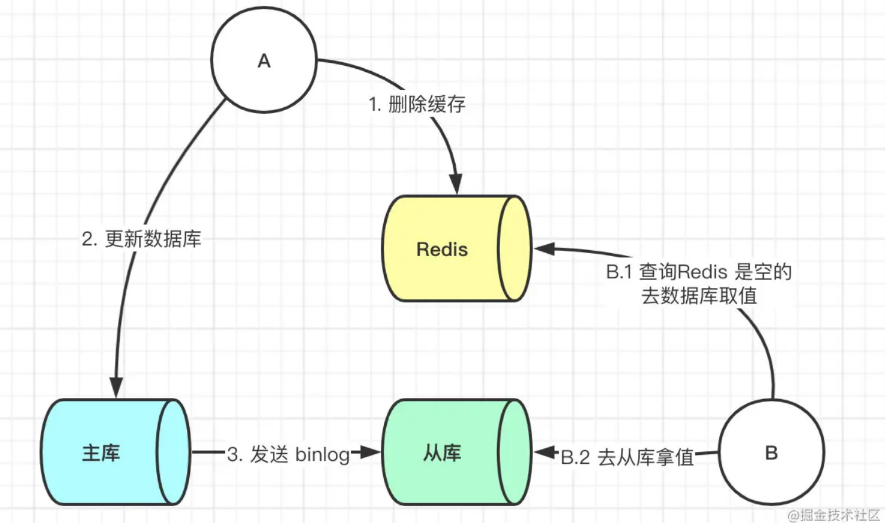
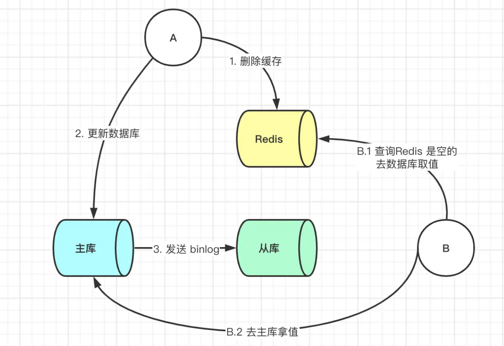
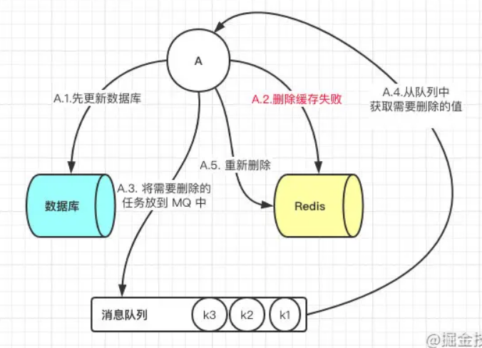
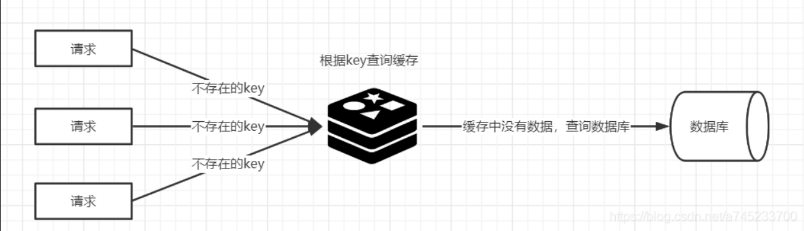

# 缓存异常

> 缓存异常有四种类型，分别是缓存和数据库的数据不一致、缓存雪崩、缓存击穿和缓存穿透。

## 如何保证缓存与数据库双写时的数据一致性？

> 背景：使用到缓存，无论是本地内存做缓存还是使用 Redis 做缓存，那么就会存在数据同步的问题，因为配置信息缓存在内存中，而内存时无法感知到数据在数据库的修改。这样就会造成数据库中的数据与缓存中数据不一致的问题。

共有四种方案：
```
1. 先更新数据库，后更新缓存
2. 先更新缓存，后更新数据库
3. 先删除缓存，后更新数据库
4. 先更新数据库，后删除缓存
```
第一种和第二种方案，没有人使用的，因为第一种方案存在问题是：并发更新数据库场景下，会将脏数据刷到缓存。

第二种方案存在的问题是：如果先更新缓存成功，但是数据库更新失败，则肯定会造成数据不一致。

目前主要用第三和第四种方案。

### 方案一：先删除缓存，后更新数据库

该方案也会出问题，此时来了两个请求，请求 A（更新操作） 和请求 B（查询操作）
```
1. 请求A进行写操作，删除缓存
2. 请求B查询发现缓存不存在
3. 请求B去数据库查询得到旧值
4. 请求B将旧值写入缓存
5. 请求A将新值写入数据库
```
上述情况就会导致不一致的情形出现。而且，如果不采用给缓存设置过期时间策略，该数据永远都是脏数据。

#### 答案一：延时双删

最简单的解决办法延时双删

使用伪代码如下：

```java
public void write(String key,Object data){
		Redis.delKey(key);
	    db.updateData(data);
	    Thread.sleep(1000);
	    Redis.delKey(key);
	}
```

转化为中文描述就是
（1）先淘汰缓存
（2）再写数据库（这两步和原来一样）
（3）休眠1秒，再次淘汰缓存，这么做，可以将1秒内所造成的缓存脏数据，再次删除。确保读请求结束，写请求可以删除读请求造成的缓存脏数据。自行评估自己的项目的读数据业务逻辑的耗时，写数据的休眠时间则在读数据业务逻辑的耗时基础上，加几百ms即可。

如果使用的是 Mysql 的读写分离的架构的话，那么其实主从同步之间也会有时间差。



此时来了两个请求，请求 A（更新操作） 和请求 B（查询操作）
```
1. 请求 A 更新操作，删除了 Redis
2. 请求主库进行更新操作，主库与从库进行同步数据的操作
3. 请 B 查询操作，发现 Redis 中没有数据
4. 去从库中拿去数据
5. 此时同步数据还未完成，拿到的数据是旧数据
```
此时的解决办法就是如果是对 Redis 进行填充数据的查询数据库操作，那么就强制将其指向主库进行查询。




#### 答案二： **更新与读取操作进行异步串行化**

 采用**更新与读取操作进行异步串行化**

 **异步串行化**

- 我在系统内部维护n个内存队列，更新数据的时候，根据数据的唯一标识，将该操作路由之后，发送到其中一个jvm内部的内存队列中（对同一数据的请求发送到同一个队列）。读取数据的时候，如果发现数据不在缓存中，并且此时队列里有更新库存的操作，那么将重新读取数据+更新缓存的操作，根据唯一标识路由之后，也将发送到同一个jvm内部的内存队列中。然后每个队列对应一个工作线程，每个工作线程串行地拿到对应的操作，然后一条一条的执行。

- 这样的话，一个数据变更的操作，先执行删除缓存，然后再去更新数据库，但是还没完成更新的时候，如果此时一个读请求过来，读到了空的缓存，那么可以先将缓存更新的请求发送到队列中，此时会在队列中积压，排在刚才更新库的操作之后，然后同步等待缓存更新完成，再读库。

 **读操作去重**

- 多个读库更新缓存的请求串在同一个队列中是没意义的，因此可以做过滤，如果发现队列中已经有了该数据的更新缓存的请求了，那么就不用再放进去了，直接等待前面的更新操作请求完成即可，待那个队列对应的工作线程完成了上一个操作（数据库的修改）之后，才会去执行下一个操作（读库更新缓存），此时会从数据库中读取最新的值，然后写入缓存中。

- 如果请求还在等待时间范围内，不断轮询发现可以取到值了，那么就直接返回；如果请求等待的时间超过一定时长，那么这一次直接从数据库中读取当前的旧值。（返回旧值不是又导致缓存和数据库不一致了么？那至少可以减少这个情况发生，因为等待超时也不是每次都是，几率很小吧。这里我想的是，如果超时了就直接读旧值，这时候仅仅是读库后返回而不放缓存）

### 方案二：先更新数据库，后删除缓存

这一种情况也会出现问题，比如更新数据库成功了，但是在删除缓存的阶段出错了没有删除成功，那么此时再读取缓存的时候每次都是错误的数据了。



此时解决方案就是利用消息队列进行删除的补偿。具体的业务逻辑用语言描述如下：
```
1. 请求 A 先对数据库进行更新操作
2. 在对 Redis 进行删除操作的时候发现报错，删除失败
3. 此时将Redis 的 key 作为消息体发送到消息队列中
4. 系统接收到消息队列发送的消息后再次对 Redis 进行删除操作
```
但是这个方案会有一个缺点就是会对业务代码造成大量的侵入，深深的耦合在一起，所以这时会有一个优化的方案，我们知道对 Mysql 数据库更新操作后再 binlog 日志中我们都能够找到相应的操作，那么我们可以订阅 Mysql 数据库的 binlog 日志对缓存进行操作。


## 常问故障场景

## 什么是缓存雪崩?

如果缓存在某一个时刻出现大规模的key失效，后面的请求都直接大量落到了数据库上，导致数据库短时间内承受大量请求，使数据库压力巨大，如果在高并发的情况下，可能瞬间就会导致数据库宕机。这时候如果运维马上又重启数据库，马上又会有新的流量把数据库打死。这就是缓存雪崩。

造成缓存雪崩的关键在于同一时间的大规模的key失效，主要有两种可能：第一种是Redis宕机，第二种可能就是采用了相同的过期时间。

解决方案：

**简略回答：**
```
- 针对 Redis 服务不可用的情况
  - 采用 Redis 集群，避免单机出现问题整个缓存服务都没办法使用。
  - 限流，避免同时处理大量的请求
- 针对热点缓存失效的情况
  - 设置不同的失效时间比如随机设置缓存的失效时间。
  - 缓存永不失效
```

**详细回答**
```
1、事前：

* 均匀过期：设置不同的过期时间，让缓存失效的时间尽量均匀，避免相同的过期时间导致缓存雪崩，造成大量数据库的访问。如把每个Key的失效时间都加个随机值，`setRedis（Key，value，time + Math.random() * 10000）；`，保证数据不会在同一时间大面积失效。

* 分级缓存：第一级缓存失效的基础上，访问二级缓存，每一级缓存的失效时间都不同。

* 热点数据缓存永远不过期。永不过期实际包含两层意思：
  * 物理不过期，针对热点key不设置过期时间
  * 逻辑过期，把过期时间存在key对应的value里，如果发现要过期了，通过一个后台的异步线程进行缓存的构建

* 保证Redis缓存的高可用，防止Redis宕机导致缓存雪崩的问题。可以使用 主从+ 哨兵，Redis集群来避免 Redis 全盘崩溃的情况。
```
```
2、事中：

* 互斥锁：在缓存失效后，通过互斥锁或者队列来控制读数据写缓存的线程数量，比如某个key只允许一个线程查询数据和写缓存，其他线程等待。这种方式会阻塞其他的线程，此时系统的吞吐量会下降

* 使用熔断机制，限流降级。当流量达到一定的阈值，直接返回“系统拥挤”之类的提示，防止过多的请求打在数据库上将数据库击垮，至少能保证一部分用户是可以正常使用，其他用户多刷新几次也能得到结果。
```
```
3、事后：

开启Redis持久化机制，尽快恢复缓存数据，一旦重启，就能从磁盘上自动加载数据恢复内存中的数据。
```
## 什么是缓存穿透?

简单点就是大量请求的 key 根本不存在于缓存中，导致请求直接到了数据库上，根本没有经过缓存这一层，导致用户每次请求该数据都要去数据库中查询一遍。（请求的数据在缓存中不存在即没有命中，同时在数据库中也不存在）

> 举个例子：某个黑客故意制造我们缓存中不存在的 key 发起大量请求，会导致短时间大量请求落在数据库上，造成数据库压力过大，甚至导致数据库承受不住而宕机崩溃。

>  缓存穿透的关键在于在Redis中查不到key值，它和缓存击穿的根本区别在于传进来的key在Redis中是不存在的。假如有黑客传进大量的不存在的key，那么大量的请求打在数据库上是很致命的问题，所以在日常开发中要对参数做好校验，一些非法的参数，不可能存在的key就直接返回错误提示。



**解决方法：**
```
- 对请求进行限制，只允许合法的请求获取数据，防止恶意用户发送大量请求

```
```
* 将无效的key存放进Redis中：

当出现Redis查不到数据，数据库也查不到数据的情况，我们就把这个key保存到Redis中，设置value="null"，并设置其过期时间极短，后面再出现查询这个key的请求的时候，直接返回null，就不需要再查询数据库了。但这种处理方式是有问题的，假如传进来的这个不存在的Key值每次都是随机的，那存进Redis也没有意义。
```
```
* 使用布隆过滤器：

如果布隆过滤器判定某个 key 不存在布隆过滤器中，那么就一定不存在，如果判定某个 key 存在，那么很大可能是存在(存在一定的误判率)。于是我们可以在缓存之前再加一个布隆过滤器，将数据库中的所有key都存储在布隆过滤器中，在查询Redis前先去布隆过滤器查询 key 是否存在，如果不存在就直接返回，不让其访问数据库，从而避免了对底层存储系统的查询压力。
```
> 如何选择：针对一些恶意攻击，攻击带过来的大量key是随机，那么我们采用第一种方案就会缓存大量不存在key的数据。那么这种方案就不合适了，我们可以先对使用布隆过滤器方案进行过滤掉这些key。所以，针对这种key异常多、请求重复率比较低的数据，优先使用第二种方案直接过滤掉。而对于空数据的key有限的，重复率比较高的，则可优先采用第一种方式进行缓存。

## 什么是缓存击穿?

缓存击穿跟缓存雪崩有点类似，缓存雪崩是大规模的key失效，而缓存击穿是某个热点的key失效，大并发集中对其进行请求，就会造成大量请求读缓存没读到数据，从而导致高并发访问数据库，引起数据库压力剧增。这种现象就叫做缓存击穿。

从两个方面解决，第一是否可以考虑热点key不设置过期时间，第二是否可以考虑降低打在数据库上的请求数量。

解决方案：

* 在缓存失效后，通过互斥锁或者队列来控制读数据写缓存的线程数量，比如某个key只允许一个线程查询数据和写缓存，其他线程等待。这种方式会阻塞其他的线程，此时系统的吞吐量会下降

* 热点数据缓存永远不过期。永不过期实际包含两层意思：
  * 物理不过期，针对热点key不设置过期时间
  * 逻辑过期，把过期时间存在key对应的value里，如果发现要过期了，通过一个后台的异步线程进行缓存的构建

## 什么是缓存预热?

缓存预热是指系统上线后，提前将相关的缓存数据加载到缓存系统。避免在用户请求的时候，先查询数据库，然后再将数据缓存的问题，用户直接查询事先被预热的缓存数据。

如果不进行预热，那么Redis初始状态数据为空，系统上线初期，对于高并发的流量，都会访问到数据库中， 对数据库造成流量的压力。

缓存预热解决方案：

* 数据量不大的时候，工程启动的时候进行加载缓存动作；

* 数据量大的时候，设置一个定时任务脚本，进行缓存的刷新；

* 数据量太大的时候，优先保证热点数据进行提前加载到缓存。

## 什么是缓存降级？

缓存降级是指缓存失效或缓存服务器挂掉的情况下，不去访问数据库，直接返回默认数据或访问服务的内存数据。降级一般是有损的操作，所以尽量减少降级对于业务的影响程度。

在进行降级之前要对系统进行梳理，看看系统是不是可以丢卒保帅；从而梳理出哪些必须誓死保护，哪些可降级；比如可以参考日志级别设置预案：

* 一般：比如有些服务偶尔因为网络抖动或者服务正在上线而超时，可以自动降级；

* 警告：有些服务在一段时间内成功率有波动（如在95~100%之间），可以自动降级或人工降级，并发送告警；

* 错误：比如可用率低于90%，或者数据库连接池被打爆了，或者访问量突然猛增到系统能承受的最大阀值，此时可以根据情况自动降级或者人工降级；

* 严重错误：比如因为特殊原因数据错误了，此时需要紧急人工降级。
