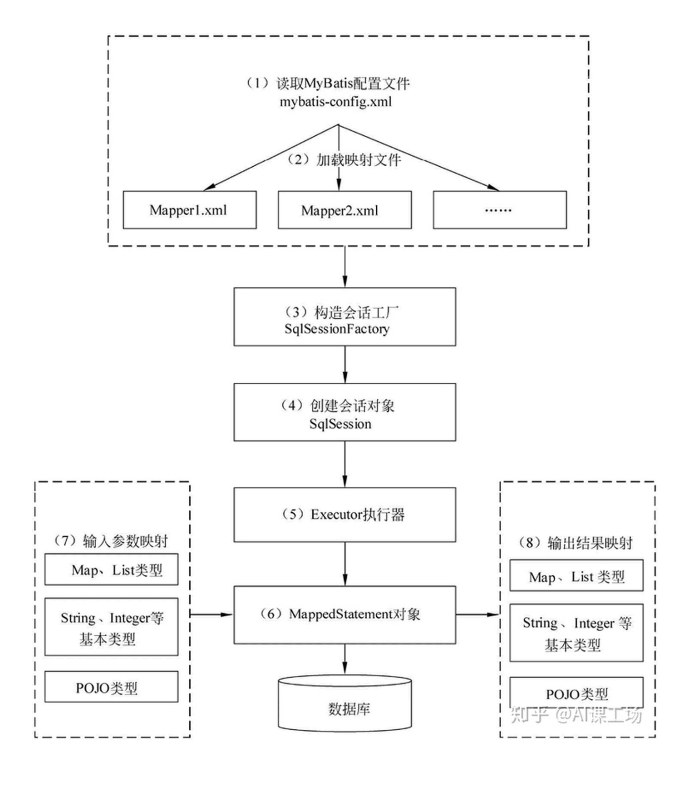
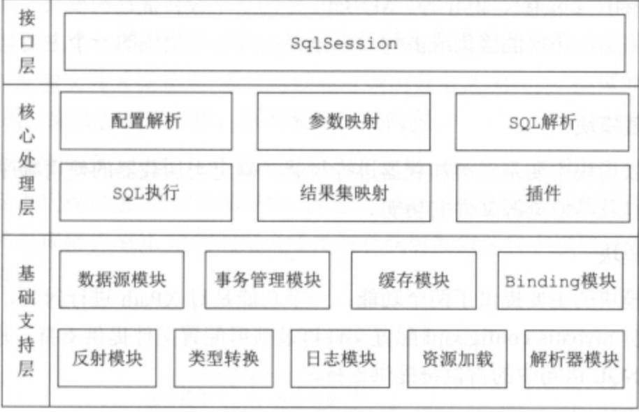
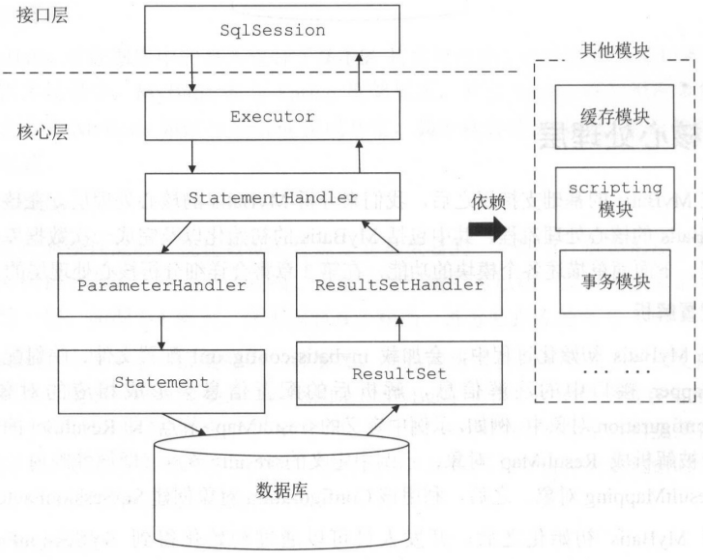

* [mybatis](#mybatis)
    * [什么是mybatis](#什么是mybatis)
    * [JDBC执行六步骤](#jdbc执行六步骤)
    * [mybatis执行8步骤](#mybatis执行8步骤)
        * [步骤](#步骤)
    * [MyBatis 整体架构](#mybatis-整体架构)
        * [基础支持层](#基础支持层)
        * [核心处理层](#核心处理层)
    * [mybatis缓存](#mybatis缓存)
        * [一级缓存（Local Cache）](#一级缓存local-cache)
    * [一级缓存配置](#一级缓存配置)
        * [二级缓存](#二级缓存)
        * [mybatis封装参数执行SQL](#mybatis封装参数执行sql)
    * [mybatis中$和#的区别](#mybatis中和的区别)
* [MyBatis-Plus](#mybatis-plus)
    * [什么是 MyBatis-Plus](#什么是-mybatis-plus)
    * [MyBatis 与 MyBatis-Plus 的区别](#mybatis-与-mybatis-plus-的区别)
    * [核心功能](#核心功能)
        * [1. 通用 CRUD（BaseMapper）](#1-通用-crudbasemapper)
        * [2. 条件构造器（Wrapper）](#2-条件构造器wrapper)
        * [3. 代码生成器](#3-代码生成器)
        * [4. 分页插件](#4-分页插件)
        * [5. 逻辑删除](#5-逻辑删除)
        * [6. 自动填充](#6-自动填充)
        * [7. 乐观锁](#7-乐观锁)
    * [常用注解](#常用注解)
    * [使用注意事项](#使用注意事项)

# mybatis

## 什么是mybatis

MyBatis 是一款旨在帮助开发人员屏蔽底层重复性原生 JDBC 代码的持久化框架，其支持通过映射文件配置或注解将 ResultSet 映射为 Java 对象。相对于其它 ORM 框架，MyBatis 更为轻量级，支持定制化 SQL
和动态 SQL，方便优化查询性能，同时包含了良好的缓存机制

## JDBC执行六步骤

- 注册驱动
- 获取Connection连接
- 执行预编译
- 执行SQL
- 封装结果集
- 释放资源

> JDBC 的完整概念、API 详解与代码示例见 [JDBC 详解](../../JAVA/Java-基础/JDBC.md)。这里仅列出 MyBatis 要解决的 JDBC 样板代码问题。

```java
public void findStudent() {
    Connection conn = null;
    Statement stmt = null;
    ResultSet rs = null;

    try {
        //注册MySQL驱动
        Class.forName("com.mysql.jdbc.Driver");
        //连接数据库的基本信息
        String url = "jdbc:mysql://localhost:3306/db";
        String username = "root";
        String password = "password";
        //创建连接对象
        conn = DriverManager.getConnection(url, username, password);
        //保存查询结果
        List<Student> stuList = new ArrayList<>();
        //创建statement，执行SQL
        stmt = conn.createStatement();
        //执行查询
        rs = stmt.executeQuery("select * from student");
        while (rs.next()) {
            //取出结果封装为对象
            Student student = new Student();
            student.setAge(rs.getInt("age"));
            student.setName(rs.getString("name"));
            stuList.add(student);
        }
    } catch (Exception e) {
        e.printStackTrace();
    } finally {
        //关闭资源
        try {
            if (rs != null) {
                rs.close();
            }
            if (stmt != null) {
                stmt.close();
            }
            if (conn != null) {
                conn.close();
            }
        } catch (SQLException e) {
            e.printStackTrace();
        }
    }
}
```

从上面代码可以看出原生 JDBC 的痛点：**样板代码冗长、结果集需手动映射、连接与事务管理繁琐**。MyBatis 正是为屏蔽这些重复代码而生。
## mybatis执行8步骤


```java
public void testStart() throws IOException {
    //1.mybatis 主配置文件
    String config = "mybatis-config.xml";
    //2.读取配置文件
    InputStream in = Resources.getResourceAsStream(config);
    //3.创建SqlSessionFactory对象，目的是为了获取SqlSession
    SqlSessionFactory factory = new SqlSessionFactoryBuilder().build(in);
    //4.获取SqlSession，SqlSession能执行sql
    SqlSession sqlSession = factory.openSession();
    //5.执行session的select
    List<Student> students = sqlSession.selectList("com.dao.UserDao.selectAll");
    //6.循环输出查询结果
    students.forEach(System.out::println);
    //7.关闭资源
    sqlSession.close();
}
```
### 步骤
1. 读取MyBatis的核心配置文件。mybatis-config.xml为MyBatis的全局配置文件，用于配置数据库连接、属性、类型别名、类型处理器、插件、环境配置、映射器（mapper.xml）等信息，这个过程中有一个比较重要的部分就是映射文件其实是配在这里的；这个核心配置文件最终会被封装成一个Configuration对象
2. 加载映射文件。映射文件即SQL映射文件，该文件中配置了操作数据库的SQL语句，映射文件是在mybatis-config.xml中加载；可以加载多个映射文件。常见的配置的方式有两种，一种是package扫描包，一种是mapper找到配置文件的位置。
3. 构造会话工厂获取SqlSessionFactory。这个过程其实是用建造者设计模式使用SqlSessionFactoryBuilder对象构建的，SqlSessionFactory的最佳作用域是应用作用域。
4. 创建会话对象SqlSession。由会话工厂创建SqlSession对象，对象中包含了执行SQL语句的所有方法，每个线程都应该有它自己的 SqlSession
   实例。SqlSession的实例不是线程安全的，因此是不能被共享的，所以它的最佳的作用域是请求或方法作用域。
    1. SqlSession： 对外提供了用户和数据库之间交互需要的所有方法，隐藏了底层的细节。默认实现类是DefaultSqlSession。
5. Executor执行器。是MyBatis的核心，负责SQL语句的生成和查询缓存的维护，它将根据SqlSession传递的参数动态地生成需要执行的SQL语句，同时负责查询缓存的维护
    1. Executor： SqlSession向用户提供操作数据库的方法，但和数据库操作有关的职责都会委托给Executor。下面是不同的实现类赋予了不同的能力
        1. SimpleExecutor -- SIMPLE 就是普通的执行器。
        2. ReuseExecutor-执行器会重用预处理语句（PreparedStatements）
        3. BatchExecutor --它是批处理执行器
6. MappedStatement对象。MappedStatement是对解析的SQL的语句封装，一个MappedStatement代表了一个sql语句标签，如下：
   ```xml
   <!--一个动态sql标签就是一个`MappedStatement`对象-->
   <select	id="selectUserList"	resultType="com.mybatis.User"> 
   select * from t_user
   </select>
   ```
7. 输入参数映射。输入参数类型可以是基本数据类型，也可以是Map、List、POJO类型复杂数据类型，这个过程类似于JDBC的预编译处理参数的过程，有两个属性 parameterType和parameterMap
8. 封装结果集。可以封装成多种类型可以是基本数据类型，也可以是Map、List、POJO类型复杂数据类型。封装结果集的过程就和JDBC封装结果集是一样的。也有两个常用的属性resultType和resultMap。

## MyBatis 整体架构



### 基础支持层

- 反射模块：提供封装的反射 API，方便上层调用。
- 类型转换：为简化配置文件提供了别名机制，并且实现了 Java 类型和 JDBC 类型的互转。
- 日志模块：能够集成多种第三方日志框架。
- 资源加载模块：对类加载器进行封装，提供加载类文件和其它资源文件的功能。
- 数据源模块：提供数据源实现并能够集成第三方数据源模块。
- 事务管理：可以和 Spring 集成开发，对事务进行管理。
- 缓存模块：提供一级缓存和二级缓存，将部分请求拦截在缓存层。
- Binding 模块：在调用 SqlSession 相应方法执行数据库操作时，需要指定映射文件中的 SQL 节点，MyBatis 通过 Binding 模块将自定义 Mapper
  接口与映射文件关联，避免拼写等错误导致在运行时才发现相应异常。

### 核心处理层



- SqlSession 接口定义了暴露给应用程序调用的 API，接口层在收到请求时会调用核心处理层的相应模块完成具体的数据库操作
- 配置解析：MyBatis 初始化时会加载配置文件、映射文件和 Mapper 接口的注解信息，解析后会以对象的形式保存到 Configuration 对象中
- SQL 解析与 scripting 模块：MyBatis 支持通过配置实现动态 SQL，即根据不同入参生成 SQL
- SQL 执行与结果解析：Executor 负责维护缓存和事务管理，并将数据库相关操作委托给 StatementHandler，ParmeterHadler 负责完成 SQL 语句的实参绑定并通过 Statement 对象执行
  SQL，通过 ResultSet 返回结果，交由 ResultSetHandler 处理

## mybatis缓存

### 一级缓存（Local Cache）

在应用运行过程中，我们有可能在一次数据库会话中，执行多次查询条件完全相同的SQL，MyBatis提供了一级缓存的方案优化这部分场景，如果是相同的SQL语句，会优先命中一级缓存，避免直接对数据库进行查询，提高性能

- 每个SqlSession中持有了Executor，每个Executor中有一个LocalCache。当用户发起查询时，MyBatis根据当前执行的语句生成MappedStatement，在Local
  Cache进行查询，如果缓存命中的话，直接返回结果给用户，如果缓存没有命中的话，查询数据库，结果写入Local Cache，最后返回结果给用户
- 一级缓存配置
    -
    开发者只需在MyBatis的配置文件中，添加如下语句，就可以使用一级缓存。共有两个选项，SESSION或者STATEMENT，默认是SESSION级别，即在一个MyBatis会话中执行的所有语句，都会共享这一个缓存。一种是STATEMENT级别，可以理解为缓存只对当前执行的这一个Statement有效
    - `<setting name="localCacheScope" value="SESSION"/>`
- 特点
    - MyBatis一级缓存的生命周期和SqlSession一致。
    - MyBatis一级缓存内部设计简单，只是一个没有容量限定的HashMap，在缓存的功能性上有所欠缺。
    - MyBatis的一级缓存最大范围是SqlSession内部，有多个SqlSession或者分布式的环境下，数据库写操作会引起脏数据，建议设定缓存级别为Statement。
    - 同一个sqlsession里update\delete都会使缓存实现

### 二级缓存

在上文中提到的一级缓存中，其最大的共享范围就是一个SqlSession内部，如果多个SqlSession之间需要共享缓存，则需要使用到二级缓存。开启二级缓存后，会使用CachingExecutor装饰Executor，进入一级缓存的查询流程前，先在CachingExecutor进行二级缓存的查询

- 二级缓存开启后，同一个namespace下的所有操作语句，都影响着同一个Cache，即二级缓存被多个SqlSession共享，是一个全局的变量。
- 当开启缓存后，数据的查询执行的流程就是 二级缓存 -> 一级缓存 -> 数据库
- 二级缓存配置
    - 在MyBatis的配置文件中开启二级缓存。`<setting name="cacheEnabled" value="true"/>`
    - 在MyBatis的映射XML中配置cache或者 cache-ref 。
      cache-ref代表引用别的命名空间的Cache配置，两个命名空间的操作使用的是同一个Cache。`<cache-ref namespace="mapper.StudentMapper"/>`
- 特点
    - 当sqlsession没有调用commit()方法时，二级缓存并没有起到作用。
    - update操作会刷新该namespace下的二级缓存。
    - 二级缓存不适应用于映射文件中存在多表查询
    - 在分布式环境下，由于默认的MyBatis
      Cache实现都是基于本地的，分布式环境下必然会出现读取到脏数据，需要使用集中式缓存将MyBatis的Cache接口实现，有一定的开发成本，直接使用Redis、Memcached等分布式缓存可能成本更低，安全性也更高
- 建议在生产中关闭缓存，单纯作为ORM框架使用即可

### mybatis封装参数执行SQL

- mybatis会使用MapperProxyFactory类中的newInstance(MapperProxy mapperProxy)方法来使用JDK动态代理生成EmployeeMapper代理对象,通过代理对象来与数据库进行会话.

```java
public class MapperProxyFactory {
    /*
    ...
    */
    protected T newInstance(MapperProxy<T> mapperProxy) {
        return (T) Proxy.newProxyInstance(mapperInterface.getClassLoader(), new Class[]{mapperInterface}, mapperProxy);
    }

    public T newInstance(SqlSession sqlSession) {
        final MapperProxy<T> mapperProxy = new MapperProxy<T>(sqlSession, mapperInterface, methodCache);
        return newInstance(mapperProxy);
    }
}
```

- 该行代码会调用代理对象的invoke方法

```java
public class MapperProxy<T> implements InvocationHandler, Serializable {
    @Override
    public Object invoke(Object proxy, Method method, Object[] args) throws Throwable {
        try {
            if (Object.class.equals(method.getDeclaringClass())) {
                return method.invoke(this, args);
            } else if (isDefaultMethod(method)) {
                return invokeDefaultMethod(proxy, method, args);
            }
        } catch (Throwable t) {
            throw ExceptionUtil.unwrapThrowable(t);
        }
        //该方法首先在缓存中查找是否存在目标方法,如果不存在,则创建一个新的MapperMethod对象并且缓存
        final MapperMethod mapperMethod = cachedMapperMethod(method);
        return mapperMethod.execute(sqlSession, args);
    }
}
```
- 在创建MapperMethod对象时,会同时初始化这两个对象,他们是构造方法的参数
```java
public MapperMethod(Class<?> mapperInterface, Method method, Configuration config) {
    this.command = new SqlCommand(config, mapperInterface, method);
    this.method = new MethodSignature(config, mapperInterface, method);
}
```
- `private final SqlCommand command;`//该类负责封装SQL语句的标签类型(如:SELECT,UPDATE,DELETE,INSERT)和目标方法名
- `private final MethodSignature method;`//该类负责封装方法的参数和返回值类型等信息
   ```java
    public MethodSignature(Configuration configuration, Class<?> mapperInterface, Method method) {
         //...
         最后一行方法需要注意 ，该条语句实例化了一个ParamNameResolver类对象,该类主要的作用就是解析参数.
         this.paramNameResolver = new ParamNameResolver(configuration, method);
       }
   ```
    ```java
    public ParamNameResolver(Configuration config, Method method) {
        final Class<?>[] paramTypes = method.getParameterTypes();
        //获取方法上定义的@Param注解
        final Annotation[][] paramAnnotations = method.getParameterAnnotations();
        final SortedMap<Integer, String> map = new TreeMap<Integer, String>();
        int paramCount = paramAnnotations.length;
        // get names from @Param annotations
        for (int paramIndex = 0; paramIndex < paramCount; paramIndex++) {
          if (isSpecialParameter(paramTypes[paramIndex])) {
            // skip special parameters
            continue;
          }
          String name = null;
          for (Annotation annotation : paramAnnotations[paramIndex]) {
            if (annotation instanceof Param) {
              hasParamAnnotation = true;
              name = ((Param) annotation).value();
              break;
            }
          }
          if (name == null) {
            // @Param was not specified.
            if (config.isUseActualParamName()) {
              name = getActualParamName(method, paramIndex);
            }
            if (name == null) {
              // use the parameter index as the name ("0", "1", ...)
              // gcode issue #71
              name = String.valueOf(map.size());
            }
          }
          //解析后放入一个map里，按顺序设置kv，例如{ 0: id ,1 : name}
          map.put(paramIndex, name);
        }
        names = Collections.unmodifiableSortedMap(map);
      }
    ```
- 这两个对象`SqlCommand`、`MethodSignature`都初始化完毕后，我们回到MapperProxy.invoke()方法，继续执行`mapperMethod.execute(sqlSession, args)`
  - 这里会根据SqlCommand里的参数获取到方法是select、update还是delete等等，执行相应的方法
```java
public Object execute(SqlSession sqlSession, Object[] args) {
    Object result;
    switch (command.getType()) {
      case INSERT: {
      Object param = method.convertArgsToSqlCommandParam(args);
        result = rowCountResult(sqlSession.insert(command.getName(), param));
        break;
      }
      case UPDATE: {
        Object param = method.convertArgsToSqlCommandParam(args);
        result = rowCountResult(sqlSession.update(command.getName(), param));
        break;
      }
      case DELETE: {
        Object param = method.convertArgsToSqlCommandParam(args);
        result = rowCountResult(sqlSession.delete(command.getName(), param));
        break;
      }
      case SELECT:
        if (method.returnsVoid() && method.hasResultHandler()) {
          executeWithResultHandler(sqlSession, args);
          result = null;
        } else if (method.returnsMany()) {
          result = executeForMany(sqlSession, args);
        } else if (method.returnsMap()) {
          result = executeForMap(sqlSession, args);
        } else if (method.returnsCursor()) {
          result = executeForCursor(sqlSession, args);
        } else {
          Object param = method.convertArgsToSqlCommandParam(args);
          result = sqlSession.selectOne(command.getName(), param);
        }
        break;
      case FLUSH:
        result = sqlSession.flushStatements();
        break;
      default:
        throw new BindingException("Unknown execution method for: " + command.getName());
    }
    if (result == null && method.getReturnType().isPrimitive() && !method.returnsVoid()) {
      throw new BindingException("Mapper method '" + command.getName() 
          + " attempted to return null from a method with a primitive return type (" + method.getReturnType() + ").");
    }
    return result;
  }
```
以INSERT为例，会执行method.convertArgsToSqlCommandParam(args);
```java
public Object convertArgsToSqlCommandParam(Object[] args) {
      return paramNameResolver.getNamedParams(args);
}
```
这里会进入`ParamNameResolver.getNamedParams`方法,ParamNameResolver之前已经初始化完，这里遍历names并设置name为arg传入的值，构造param返回
```java
public Object getNamedParams(Object[] args) {
    final int paramCount = names.size();
    if (args == null || paramCount == 0) {
      return null;
    } else if (!hasParamAnnotation && paramCount == 1) {
      return args[names.firstKey()];
    } else {
      final Map<String, Object> param = new ParamMap<Object>();
      int i = 0;
      for (Map.Entry<Integer, String> entry : names.entrySet()) {
        param.put(entry.getValue(), args[entry.getKey()]);
        // add generic param names (param1, param2, ...)
        final String genericParamName = GENERIC_NAME_PREFIX + String.valueOf(i + 1);
        // ensure not to overwrite parameter named with @Param
        if (!names.containsValue(genericParamName)) {
          param.put(genericParamName, args[entry.getKey()]);
        }
        i++;
      }
      return param;
    }
  }
```
参数封装完毕，调用 `result = rowCountResult(sqlSession.insert(command.getName(), param));`，并执行SQL获取结果，封装结果返回

## mybatis中$和#的区别
- `#{}` mybatis生成sql时会使用占位符 ? 替换，并使用预编译，能有效的防止SQL注入
- `${}` 生成SQL时直接设置值

# MyBatis-Plus

## 什么是 MyBatis-Plus

MyBatis-Plus（简称 MP）是 MyBatis 的**增强工具包**，在 MyBatis 基础上**只做增强、不做改变**，引入后原有的 MyBatis 功能可正常使用。

核心目标是简化开发：单表 CRUD 无需手写 SQL，通过继承 `BaseMapper` 即可获得全套常用操作方法，同时提供条件构造器、代码生成器、分页插件等一整套能力。

```xml
<!-- 引入依赖 -->
<dependency>
    <groupId>com.baomidou</groupId>
    <artifactId>mybatis-plus-boot-starter</artifactId>
    <version>3.5.5</version>
</dependency>
```

## MyBatis 与 MyBatis-Plus 的区别

| 对比项 | MyBatis | MyBatis-Plus |
|:---|:---|:---|
| 定位 | 持久层框架（基础） | MyBatis 的增强工具 |
| 单表 CRUD | 需手写 SQL 或 XML | 继承 BaseMapper 即可，无需写 SQL |
| 条件查询 | 手写 SQL 拼接 | Wrapper 条件构造器链式调用 |
| 分页 | 需手动实现（如 PageHelper） | 内置分页插件 |
| 代码生成 | 需第三方插件 | 内置代码生成器 |
| 逻辑删除 | 需自行实现 | `@TableLogic` 注解一行搞定 |
| 字段自动填充 | 需自行实现 | `MetaObjectHandler` 自动填充 |
| 乐观锁 | 需自行实现 | `@Version` + 插件支持 |
| 兼容性 | — | 完全兼容 MyBatis |

> **关键点**：MyBatis-Plus **不是替代** MyBatis，而是在其之上做增强。复杂 SQL（多表关联、动态条件）仍可继续用 XML 编写。

## 核心功能

### 1. 通用 CRUD（BaseMapper）

只需让 Mapper 接口继承 `BaseMapper<T>`，即可直接使用预置的 CRUD 方法，无需编写任何 SQL。

```java
// 实体类
@Data
@TableName("t_user")                     // 指定表名
public class User {
    @TableId(type = IdType.AUTO)         // 主键策略：数据库自增
    private Long id;

    @TableField("user_name")             // 字段名映射
    private String userName;

    @TableField(fill = FieldFill.INSERT) // 插入时自动填充
    private LocalDateTime createTime;
}

// Mapper 接口：继承 BaseMapper 即可
public interface UserMapper extends BaseMapper<User> {
}
```

```java
// 直接使用，无需写 SQL
userMapper.insert(user);                       // 新增
userMapper.deleteById(1L);                     // 按 ID 删除
userMapper.updateById(user);                   // 按 ID 更新
User user = userMapper.selectById(1L);         // 按 ID 查询
List<User> list = userMapper.selectList(null); // 查询全部
Long count = userMapper.selectCount(null);     // 统计数量
```

常用方法一览：

| 方法 | 说明 |
|:---|:---|
| `insert(entity)` | 插入一条记录 |
| `deleteById(id)` | 按主键删除 |
| `updateById(entity)` | 按主键更新（null 字段不更新） |
| `selectById(id)` | 按主键查询 |
| `selectList(wrapper)` | 条件查询列表 |
| `selectOne(wrapper)` | 条件查询单条 |
| `selectCount(wrapper)` | 条件统计数量 |
| `selectPage(page, wrapper)` | 分页查询 |
| `selectBatchIds(ids)` | 按 ID 集合批量查询 |

### 2. 条件构造器（Wrapper）

Wrapper 用于构建复杂查询条件，以链式调用替代手写 SQL，是 MP 最常用的功能。

```java
// QueryWrapper：常规条件构造
QueryWrapper<User> wrapper = new QueryWrapper<>();
wrapper.eq("age", 18)
       .like("user_name", "张")
       .gt("create_time", LocalDate.now().minusDays(7))
       .orderByDesc("id");
List<User> list = userMapper.selectList(wrapper);
// 生成 SQL：where age = 18 and user_name like '%张%' 
//          and create_time > ? order by id desc
```

```java
// LambdaQueryWrapper：推荐用法，用方法引用替代字符串，编译期检查、防字段名写错
LambdaQueryWrapper<User> wrapper = new LambdaQueryWrapper<>();
wrapper.eq(User::getAge, 18)
       .like(User::getUserName, "张")
       .orderByDesc(User::getId);
List<User> list = userMapper.selectList(wrapper);
```

**两种 Wrapper 对比**：

| 类型 | 写法 | 特点 |
|:---|:---|:---|
| `QueryWrapper` | `eq("age", 18)` | 字符串字段名，易写错、无编译检查 |
| `LambdaQueryWrapper` | `eq(User::getAge, 18)` | 方法引用，类型安全，**推荐使用** |
| `UpdateWrapper` | `set("age", 20)` | 用于更新操作 |
| `LambdaUpdateWrapper` | `set(User::getAge, 20)` | 类型安全的更新构造器 |

常用条件方法：

| 方法 | 含义 | 示例 |
|:---|:---|:---|
| `eq` / `ne` | 等于 / 不等于 | `eq("age", 18)` |
| `gt` / `ge` | 大于 / 大于等于 | `gt("age", 18)` |
| `lt` / `le` | 小于 / 小于等于 | `lt("age", 18)` |
| `like` / `notLike` | 模糊匹配 | `like("name", "张")` |
| `in` / `notIn` | 包含 / 不包含 | `in("id", ids)` |
| `isNull` / `isNotNull` | 是否为空 | `isNull("email")` |
| `between` | 区间 | `between("age", 18, 30)` |
| `orderByAsc` / `orderByDesc` | 排序 | `orderByDesc("id")` |
| `and` / `or` | 嵌套条件 | `and(w -> w.eq(...).or()...)` |

> **条件动态拼接**：`eq(condition, column, val)` 的第一个参数为 boolean，为 false 时该条件不参与拼接，常用于动态查询：
> ```java
> wrapper.eq(StringUtils.isNotBlank(name), User::getUserName, name);
> ```

### 3. 代码生成器

MP 提供代码生成器，可根据数据库表自动生成 Entity、Mapper、Service、Controller 等代码，大幅减少模板代码编写。

```java
public class CodeGenerator {
    public static void main(String[] args) {
        FastAutoGenerator.create(
                "jdbc:mysql://localhost:3306/db", "root", "password")
            .globalConfig(builder -> builder
                .author("author")
                .outputDir(System.getProperty("user.dir") + "/src/main/java"))
            .packageConfig(builder -> builder
                .parent("com.example")
                .entity("entity")
                .mapper("mapper")
                .service("service")
                .controller("controller"))
            .strategyConfig(builder -> builder
                .addInclude("t_user", "t_order")        // 指定要生成的表
                .entityBuilder().enableLombok()          // 开启 Lombok
                .controllerBuilder().enableRestStyle())  // 开启 REST 风格
            .execute();
    }
}
```

### 4. 分页插件

需先注册分页插件，否则 `selectPage` 不会真正分页。

```java
@Configuration
public class MybatisPlusConfig {

    @Bean
    public MybatisPlusInterceptor mybatisPlusInterceptor() {
        MybatisPlusInterceptor interceptor = new MybatisPlusInterceptor();
        // 添加分页插件，并指定数据库类型
        interceptor.addInnerInterceptor(
                new PaginationInnerInterceptor(DbType.MYSQL));
        return interceptor;
    }
}
```

```java
// 使用分页
Page<User> page = new Page<>(1, 10);          // 第 1 页，每页 10 条
LambdaQueryWrapper<User> wrapper = new LambdaQueryWrapper<>();
wrapper.eq(User::getAge, 18);

Page<User> result = userMapper.selectPage(page, wrapper);

result.getRecords();     // 当前页数据
result.getTotal();       // 总记录数
result.getPages();       // 总页数
result.getCurrent();     // 当前页码
```

### 5. 逻辑删除

逻辑删除指删除时不物理删除数据，而是把某个字段标记为「已删除」，查询时自动过滤。只需加 `@TableLogic` 注解 + 全局配置。

```java
@Data
public class User {
    @TableLogic
    private Integer deleted;    // 0-未删除，1-已删除
}
```

```yaml
# application.yml
mybatis-plus:
  global-config:
    db-config:
      logic-delete-field: deleted    # 全局逻辑删除字段名
      logic-delete-value: 1          # 已删除值
      logic-not-delete-value: 0      # 未删除值
```

配置后：
- `deleteById()` 实际执行 `update t_user set deleted = 1 where id = ?`
- `selectList()` 会自动追加 `where deleted = 0`

> **注意**：使用逻辑删除后，唯一索引需把 `deleted` 字段纳入，否则删除后无法再插入同名的记录。

### 6. 自动填充

创建时间、更新时间等公共字段无需手动赋值，实现 `MetaObjectHandler` 即可自动填充。

```java
@Component
public class MyMetaObjectHandler implements MetaObjectHandler {

    @Override
    public void insertFill(MetaObject metaObject) {
        this.strictInsertFill(metaObject, "createTime",
                LocalDateTime.class, LocalDateTime.now());
        this.strictInsertFill(metaObject, "updateTime",
                LocalDateTime.class, LocalDateTime.now());
    }

    @Override
    public void updateFill(MetaObject metaObject) {
        this.strictUpdateFill(metaObject, "updateTime",
                LocalDateTime.class, LocalDateTime.now());
    }
}
```

```java
// 实体类标注填充时机
@TableField(fill = FieldFill.INSERT)
private LocalDateTime createTime;

@TableField(fill = FieldFill.INSERT_UPDATE)
private LocalDateTime updateTime;
```

### 7. 乐观锁

通过版本号字段实现乐观锁，防止并发更新丢失数据。

```java
// 1. 实体类加 @Version 注解
@Data
public class Product {
    private Long id;

    @Version                       // 乐观锁版本号
    private Integer version;

    private Integer stock;
}
```

```java
// 2. 注册乐观锁插件
@Bean
public MybatisPlusInterceptor mybatisPlusInterceptor() {
    MybatisPlusInterceptor interceptor = new MybatisPlusInterceptor();
    interceptor.addInnerInterceptor(new OptimisticLockerInnerInterceptor());
    return interceptor;
}
```

```java
// 3. 使用时必须先查出带版本号的对象，再更新
Product product = productMapper.selectById(1L);
product.setStock(product.getStock() - 1);
productMapper.updateById(product);
// SQL: update product set stock = ?, version = version + 1 
//      where id = ? and version = ?
```

> **关键**：`updateById` 必须传入带 version 的对象；若 version 不匹配则更新失败（影响行数为 0），需业务层判断并重试。

## 常用注解

| 注解 | 作用 | 示例 |
|:---|:---|:---|
| `@TableName` | 指定表名 | `@TableName("t_user")` |
| `@TableId` | 指定主键字段及策略 | `@TableId(type = IdType.AUTO)` |
| `@TableField` | 字段映射、填充策略 | `@TableField("user_name")` |
| `@TableLogic` | 逻辑删除标记 | `@TableLogic` |
| `@Version` | 乐观锁版本号 | `@Version` |
| `@EnumValue` | 枚举字段映射 | `@EnumValue` |

**主键策略 `IdType` 常用值**：

| 值 | 说明 |
|:---|:---|
| `AUTO` | 数据库自增 |
| `ASSIGN_ID` | 雪花算法生成的 19 位 ID（**默认**） |
| `ASSIGN_UUID` | UUID |
| `NONE` | 跟随全局配置 |
| `INPUT` | 手动输入 |

## 使用注意事项

- **通用 CRUD 只适用于单表**。多表关联、复杂动态 SQL 仍需在 XML 中手写，MP 并非万能。
- **分页插件必须注册**，否则 `selectPage` 会返回全部数据（内存分页），造成严重性能问题。
- **`LambdaQueryWrapper` 优于 `QueryWrapper`**，方法引用有编译期检查，可避免字段名拼写错误。
- **`updateById` 忽略 null 字段**，若要把字段更新为 null，需用 `UpdateWrapper` 的 `set` 显式指定。
- **逻辑删除配置后不可逆**，历史数据中 `deleted` 字段需有默认值，且唯一索引要纳入该字段。
- **乐观锁必须传入查询出的对象**，若前端直接传参构造对象导致 version 丢失，乐观锁会失效。
- **自动填充需实现 `MetaObjectHandler` 并注入 Spring 容器**，只加注解不会生效。
- **生产环境关闭 SQL 日志**，`log-impl: StdOutImpl` 会打印全部 SQL，影响性能。

## 参考文章

- [MyBatis-Plus 官方文档](https://baomidou.com/)
- [MyBatis 官方文档](https://mybatis.org/mybatis-3/zh/index.html)
- [MyBatis-Plus 快速开始](https://baomidou.com/getting-started/)
