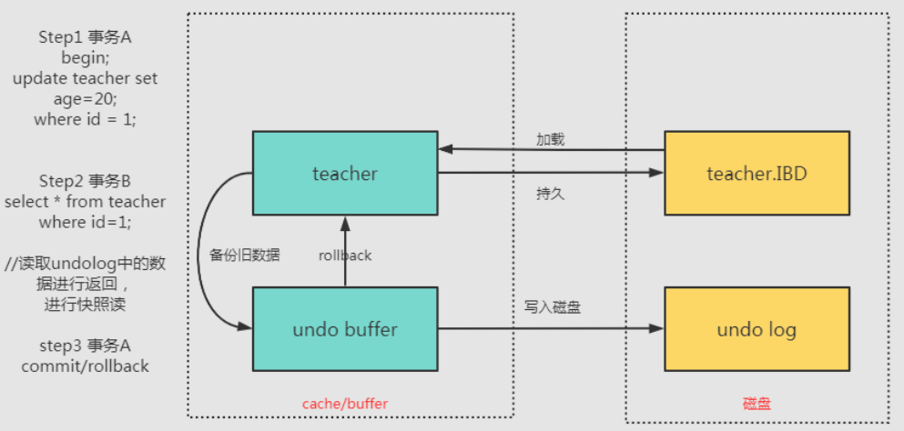
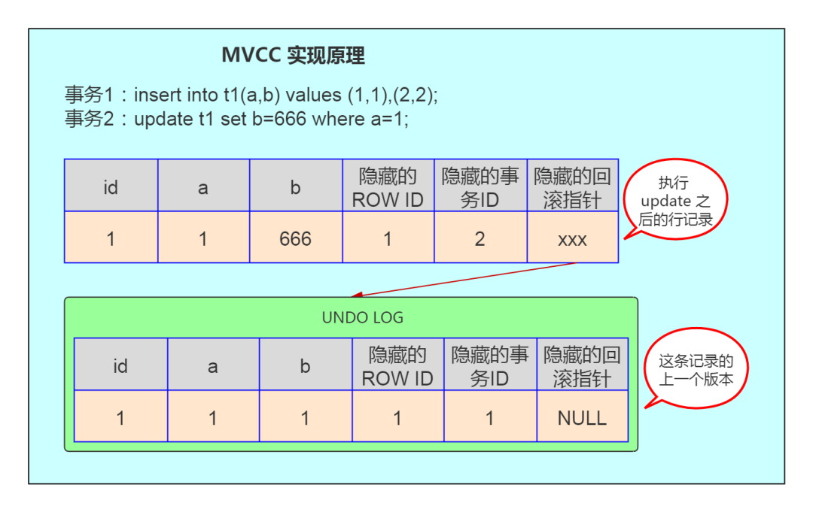

# 事务

## 1. 什么是数据库事务？
事务是一个不可分割的数据库操作序列，也是数据库并发控制的基本单位，其执行的结果必须使数据库从一种一致性状态变到另一种一致性状态。事务是逻辑上的一组操作，要么都执行，要么都不执行。

事务最经典也经常被拿出来说例子就是转账了。

假如小明要给小红转账1000元，这个转账会涉及到两个关键操作就是：将小明的余额减少1000元，将小红的余额增加1000元。万一在这两个操作之间突然出现错误比如银行系统崩溃，导致小明余额减少而小红的余额没有增加，这样就不对了。事务就是保证这两个关键操作要么都成功，要么都要失败。

## 2. 介绍一下事务具有的四个特征（事务特性ACID）

事务就是一组原子性的操作，这些操作要么全部发生，要么全部不发生。事务把数据库从一种一致性状态转换成另一种一致性状态。

#### 1、原子性（Atomicity，或称不可分割性）
- 定义： 原子性是指一个事务是一个不可分割的逻辑工作单位，其中的操作要么都做，要么都不做；如果事务中一个sql语句执行失败，则已执行的语句也必须回滚，数据库退回到事务前的状态
- 实现原理 undo log

#### 2、一致性（Consistency）
- 一致性是指事务执行的结果必须是使数据库从一个一致性状态变到另一个一致性状态，也就是说一个事务执行之前和执行之后都必须处于一致性状态。因此当数据库只包含成功事务提交的结果时，就说数据库处于一致性状态。如果数据库系统运行中发生故障，有些事务尚未完成就被迫中断，这些未完成事务对数据库所做的修改有一部分已写入物理数据库，这时数据库就处于一种不正确的状态，或者说是不一致的状态。
```
如转账的栗子: 假设用户A和用户B两者的钱加起来一共是5000，那么不管A和B之间如何转账，转几次账，事务结束后两个用户的钱相加起来应该还得是5000，这就是事务的一致性
```

#### 3、隔离性（Isolation）
- 一个事务的执行不能其它事务干扰。即一个事务内部的操作及使用的数据与其他事务（其它并发事务）是隔离的是隔离的，并发执行的各个事务之间不能互相干扰
  - (一个事务)写操作对(另一个事务)写操作的影响：锁机制保证隔离性
  - (一个事务)写操作对(另一个事务)读操作的影响：MVCC保证隔离性

[隔离级别](#)

##### [3.1、读未提交：read uncommitted](#)
事物A和事物B，事物A未提交的数据，事物B可以读取到 这里读取到的数据叫做“脏数据 
##### [3.2、读已提交：read committed](#)
事物A和事物B，事物A提交的数据，事物B才能读取到 这种隔离级别会导致“不可重复读取”,再次读发现和第一次读的内容不一致
- 使用行锁解决读未提交问题，脏读问题
##### [3.3、可重复读：repeatable read](#)
事务A和事务B，事务A提交之后的数据，事务B读取不到（B始终读到的数据是第一次读到的）
- mvcc解决不可重复读问题
- 锁解决幻读问题
##### [3.4、串行化：serializable](#)
事务A和事务B，事务A在操作数据库时，事务B只能排队等待
- 这种级别可以避免“幻像读”，每一次读取的都是数据库中真实存在数据，事务A与事务B串行，而不并发
```
MySQL 默认采用的 REPEATABLE_READ隔离级别 Oracle 默认采用的 READ_COMMITTED隔离级别

事务隔离机制的实现基于锁机制和并发调度。其中并发调度使用的是MVVC（多版本并发控制），通过保存修改的旧版本信息来支持并发一致性读和回滚等特性。

因为隔离级别越低，事务请求的锁越少，所以大部分数据库系统的隔离级别都是READ-COMMITTED(读取提交内容):，但是你要知道的是InnoDB 存储引擎默认使用 **REPEATABLE-READ（可重读）**并不会有任何性能损失。

InnoDB 存储引擎在 分布式事务 的情况下一般会用到**SERIALIZABLE(可串行化)**隔离级别。
```
##### MVCC解决不可重复读
MVCC 实现三大要素

1-`隐式字段`

- 在 Innodb 存储引擎中，在有聚簇索引的情况下每一行记录中都会隐藏俩个字段，如果没有聚簇索引则还有一个 6byte 的隐藏主键
- 俩个隐式字段为 DB_TRX_ID，DB_ROLL_PTR，没有聚簇索引还会有 DB_ROW_ID 这个字段
  - `DB_TRX_ID`：记录创建这条记录上次修改他的事务 ID。
  - `DB_ROLL_PTR`：回滚指针，指向这条记录的上一个版本

2-`undo log（回滚日志）` undo log 保存的是一个版本链，也就是使用 DB_ROLL_PTR 这个字段来连接的。

- 当事务不可见时就会读取相应的之前版本链上的版本

3-`ReadView` 通过隐藏列和版本链，MySQL可以将数据恢复到指定版本；但是具体要恢复到哪个版本，则需要根据ReadView来确定。所谓ReadView，是指事务（记做事务A）在某一时刻给整个事务系统（trx_sys）打快照，之后再进行读操作时，会将读取到的数据中的事务id与trx_sys快照比较，从而判断数据对该ReadView是否可见，即对事务A是否可见

- 当前系统中还有哪些活跃的读写事务，把它们的事务id放到一个列表中，我们把这个列表命名为为m_ids
- 如果被访问版本的 trx_id 属性值小于 m_ids 列表中最小的事务id，表明生成该版本的事务在生成 ReadView 前已经提交，所以该版本可以被当前事务访问。
- 如果被访问版本的 trx_id 属性值大于 m_ids 列表中最大的事务id，表明生成该版本的事务在生成 ReadView 后才生成，所以该版本不可以被当前事务访问。
- 如果被访问版本的 trx_id 属性值在 m_ids 列表中最大的事务id和最小事务id之间，那就需要判断一下 trx_id 属性值是不是在 m_ids 列表中，如果在，说明创建 ReadView 时生成该版本的事务还是活跃的，该版本不可以被访问；如果不在，说明创建 ReadView 时生成该版本的事务已经被提交，该版本可以被访问。
             
```
1、初始：
  事务1
  事务2
  事务3
  事务4 读取
  事务5
          
2、事务2提交了：
  事务1
  事务2 commit
  事务3
  事务4
  事务5
          
3、事务4打快照：
  事务1
  事务3
  事务4 生成trx_sys[1-5]
  事务5
            
4、事务4读取事务0：
  事务1
  事务3
  事务4 再次读取，内容如果包含事务0的内容，0 < trx_sys[1-5]最小1 可以被读取
  事务5
          
5、事务4读取事务6：
  事务1
  事务3
  事务4 再次读取，内容如果包含事务6的内容，6 > trx_sys[1-5]最大5 不可以被读取
  事务5
            
  事务6
            
6、事务4读取事务3：
  事务1
  事务3
  事务4 再次读取，内容如果包含事务3的内容，3 在 trx_sys[1-5]中 ，因为创建时还活跃(创建时事务3还未提交)，不可以被读取
  事务5
            
  事务6
          
7、事务4读取事务2：
  事务1
  事务3
  事务4 再次读取，内容如果包含事务2的内容，2 在 trx_sys[1-5]中 ，因为创建时事务2已提交，可以被读取
  事务5
            
  事务6
```

##### 幻读问题
当一个事务在读取某个范围的记录时，另外一个事务在这个范围内插入了一条新的数据，当事务再次进行读取数据时，发现比第一次读取记录多了一条，这就是所谓的幻读，两次读取的结果不一致.

虽然可以达到可重复读取，但是会导致“幻像读”

- 加锁读解决幻读问题
  - 示例
    - 共享锁读取 `select...lock in share mode`
      - 共享锁事务之间的读取是可以正常获取的
      - 共享锁之间的update是需要等待锁释放的
    - 排它锁读取 `select...for update`
      - 读取和修改都是不允许的
      - innodb_lock_wait_timeout 设置全局的锁超时时间
  - 加锁读在查询时会对查询的数据加锁（共享锁或排它锁）。由于锁的特性，当某事务对数据进行加锁读后，其他事务无法对数据进行写操作，因此可以避免脏读和不可重复读。
  - 而避免幻读，则需要通过next-key lock。next-key lock是行锁的一种，实现相当于record lock(记录锁) + gap lock(间隙锁)；其特点是不仅会锁住记录本身(record lock的功能)，还会锁定一个范围(gap lock的功能)。因此，加锁读同样可以避免脏读、不可重复读和幻读，保证隔离性

####  4、持久性（Durability）
- 持续性。也称永久性，指一个事务一旦提交，它对数据库中的数据的改变就应该是永久性的。接下来的其它操作或故障不应该对其执行结果有任何影响。
- 实现原理：redo log


## 4. 什么是脏读？幻读？不可重复读？

1、脏读：事务 A 读取了事务 B 更新的数据，然后 B 回滚操作，那么 A 读取到的数据是脏数据

2、不可重复读：事务 A 多次读取同一数据，事务 B 在事务 A 多次读取的过程中，对数据作了更新并提交，导致事务 A 多次读取同一数据时，结果 不一致。

3、幻读：系统管理员 A 将数据库中所有学生的成绩从具体分数改为 ABCDE 等级，但是系统管理员 B 就在这个时候插入了一条具体分数的记录，当系统管理员 A 改结束后发现还有一条记录没有改过来，就好像发生了幻觉一样，这就叫幻读。

不可重复读侧重于修改，幻读侧重于新增或删除（多了或少量行），脏读是一个事务回滚影响另外一个事务。

## 5. 事务的实现原理

事务是基于重做日志文件(redo log)和回滚日志(undo log)实现的。

每提交一个事务必须先将该事务的所有日志写入到重做日志文件进行持久化，数据库就可以通过重做日志来保证事务的原子性和持久性。

每当有修改事务时，还会产生 undo log，如果需要回滚，则根据 undo log 的反向语句进行逻辑操作，比如 insert 一条记录就 delete 一条记录。undo log 主要实现数据库的一致性。

## 6. MySQL事务日志介绍下？

innodb 事务日志包括 redo log 和 undo log。

undo log 指事务开始之前，在操作任何数据之前，首先将需操作的数据备份到一个地方。redo log 指事务中操作的任何数据，将最新的数据备份到一个地方。

事务日志的目的：实例或者介质失败，事务日志文件就能派上用场。

### redo log（重做日志）
- 保证事务持久性
- MySQL每执行一条语句，先将记录写入redo log buffer ，然后写入OS buffer（cache），系统调用fsync()刷入redo log file磁盘
- redo log 采用大小固定，循环写入的方式，写到结尾会回到开头写
- MySQL提供了buffer pool（内存）来提高读取速度，并且对数据的修改也会首先写入bufferpool等待后刷入磁盘，如果在还未刷入磁盘时发生宕机就会发生数据丢失，所以引入redo log（磁盘）对数据的修改也会记录在redo log中，DB宕机后重启，InnoDB会首先去查看数据页中的LSN的数值。这个值代表数据页被刷新回磁盘的LSN的大小。然后再去查看redo log的LSN的大小。如果数据页中的LSN值大说明数据页领先于redo log刷新回磁盘，不需要进行恢复。反之需要从redo log中恢复数据
  - LSN (逻辑序列号)
    - LSN不仅记录在重做日志中，还存在于每个页中，在每个页的头部，值FIL_PAGE_LSN记录该页的LSN。表示页最后刷新时LSN的大小
    - 单调递增的
- 与bing日志的不同
  - bing日志使数据库可以基于时间点恢复数据，也用于主从复制而且是MySQL服务层提供的，二进制
```
redo log 不是随着事务的提交才写入的，而是在事务的执行过程中，便开始写入 redo 中。具体的落盘策略可以进行配置 。防止在发生故障的时间点，尚有脏页未写入磁盘，在重启 MySQL 服务的时候，根据 redo log 进行重做，从而达到事务的未入磁盘数据进行持久化这一特性。RedoLog 是为了实现事务的持久性而出现的产物。
```


### undo log（回滚日志）
- 事务原子性和隔离性实现的基础
- 当事务对数据库进行修改时，InnoDB会生成对应的undo log；如果事务执行失败或调用了rollback，导致事务需要回滚，便可以利用undo log中的信息将数据回滚到修改之前的样子
- undo log属于逻辑日志，它记录的是sql执行相关的信息。当发生回滚时，InnoDB会根据undo log的内容做与之前相反的工作：对于每个insert，回滚时会执行delete；对于每个delete，回滚时会执行insert；对于每个update，回滚时会执行一个相反的update，把数据改回去
```
undo log 用来回滚行记录到某个版本。事务未提交之前，Undo 保存了未提交之前的版本数据，Undo 中的数据可作为数据旧版本快照供其他并发事务进行快照读。是为了实现事务的原子性而出现的产物,在 MySQL innodb 存储引擎中用来实现多版本并发控制。
```



## 7. 什么是MySQL的 binlog（二进制日志）？

> MySQL binlog 以事件形式记录，还包含语句所执行的消耗的时间，MySQL 的二进制日志是事务安全型的。binlog 的主要目的是复制和恢复。

用于记录数据库执行的写入性操作(不包括查询)信息，以二进制的形式保存在磁盘中
- Server 层进行记录
- binlog 是通过追加的方式进行写入的，可以通过 max_binlog_size 参数设置每个 binlog文件的大小，当文件大小达到给定值之后，会生成新的文件来保存日志
- binlog使用场景
  - `主从复制` 在 Master 端开启 binlog ，然后将 binlog 发送到各个 Slave 端， Slave 端重放 binlog 从而达到主从数据一致
  - `数据恢复` 通过使用 mysqlbinlog 工具来恢复数据
- binlog刷盘时机
  - 对于 InnoDB 存储引擎而言，只有在事务提交时才会记录 biglog ，此时记录还在内存中，那么 biglog 是什么时候刷到磁盘中的呢？ mysql 通过 sync_binlog 参数控制 biglog 的刷盘时机，取值范围是 0-N
    - 0：不去强制要求，由系统自行判断何时写入磁盘；
    - 1：每次 commit 的时候都要将 binlog 写入磁盘；
    - N：每N个事务，才会将 binlog 写入磁盘。
- binlog日志格式
  - `STATMENT`
    - MySQL 5.7.7 之前，默认的格式是 STATEMENT
    - 基于 SQL 语句的复制( statement-based replication, SBR )，每一条会修改数据的sql语句会记录到 binlog 中
      - * 优点： 不需要记录每一行的变化，减少了` binlog ` 日志量，节约了 ` IO ` , 从而提高了性能；
      - * 缺点： 在某些情况下会导致主从数据不一致，比如执行` sysdate() ` 、 ` slepp() ` 等 。
      > 基于 SQL 语句的模式，某些语句和函数如 UUID, LOAD DATA INFILE 等在复制过程可能导致数据不一致甚至出错。
  - `ROW`
    - MySQL 5.7.7 之后，默认值是 ROW
    - 基于行的复制( row-based replication, RBR )，不记录每条sql语句的上下文信息，仅需记录哪条数据被修改了
      - 优点： 不会出现某些特定情况下的存储过程、或function、或trigger的调用和触发无法被正确复制的问题 ；
      - 缺点： 会产生大量的日志，尤其是 alter table 的时候会让日志暴涨
      > 基于行的模式，记录的是行的变化，很安全。但是 binlog 会比其他两种模式大很多，在一些大表中清除大量数据时在 binlog 中会生成很多条语句，可能导致从库延迟变大。
  - `MIXED`
    - 基于 STATMENT 和 ROW 两种模式的混合复制( mixed-based replication, MBR )，一般的复制使用 STATEMENT 模式保存 binlog ，对于 STATEMENT 模式无法复制的操作使用 ROW 模式保存 binlog
      > 混合模式，根据语句来选用是 statement 还是 row 模式。
- 日志格式通过 binlog-format 指定


MySQL的 binlog 是记录所有数据库表结构变更（例如 CREATE、ALTER TABLE）以及表数据修改（INSERT、UPDATE、DELETE）的二进制日志。binlog 不会记录 SELECT 和 SHOW 这类操作，因为这类操作对数据本身并没有修改，但你可以通过查询通用日志来查看 MySQL 执行过的所有语句。


## **8. 在事务中可以混合使用存储引擎吗？**

尽量不要在同一个事务中使用多种存储引擎，MySQL服务器层不管理事务，事务是由下层的存储引擎实现的。

如果在事务中混合使用了事务型和非事务型的表（例如InnoDB和MyISAM表）,在正常提交的情况下不会有什么问题。

但如果该事务需要回滚，非事务型的表上的变更就无法撤销，这会导致数据库处于不一致的状态，这种情况很难修复，事务的最终结果将无法确定。所以，为每张表选择合适的存储引擎非常重要。

## 9. MySQL中是如何实现事务隔离的?

读未提交和串行化基本上是不需要考虑的隔离级别，前者不加锁限制，后者相当于单线程执行，效率太差。

MySQL 在可重复读级别解决了幻读问题，是通过行锁和间隙锁的组合 Next-Key 锁实现的。

详细原理看这篇文章：https://haicoder.net/note/MySQL-interview/MySQL-interview-MySQL-trans-level.html

## 10. 什么是 MVCC？

MVCC， 即多版本并发控制。MVCC 的实现，是通过保存数据在某个时间点的快照来实现的。根据事务开始的时间不同，每个事务对同一张表，同一时刻看到的数据可能是不一样的。

## 11. MVCC 的实现原理

对于 InnoDB ，聚簇索引记录中包含 3 个隐藏的列：

- ROW ID：隐藏的自增 ID，如果表没有主键，InnoDB 会自动按 ROW ID 产生一个聚集索引树。
- 事务 ID：记录最后一次修改该记录的事务 ID。
- 回滚指针：指向这条记录的上一个版本。

我们拿上面的例子，对应解释下 MVCC 的实现原理，如下图：



如图，首先 insert 语句向表 t1 中插入了一条数据，a 字段为 1，b 字段为 1， ROW ID 也为 1 ，事务 ID 假设为 1，回滚指针假设为 null。当执行 update t1 set b=666 where a=1 时，大致步骤如下：

- 数据库会先对满足 a=1 的行加排他锁；
- 然后将原记录复制到 undo 表空间中；
- 修改 b 字段的值为 666，修改事务 ID 为 2；
- 并通过隐藏的回滚指针指向 undo log 中的历史记录；
- 事务提交，释放前面对满足 a=1 的行所加的排他锁。

在前面实验的第 6 步中，session2 查询的结果是 session1 修改之前的记录，这个记录就是**来自 undolog** 中。

因此可以总结出 MVCC 实现的原理大致是：

InnoDB 每一行数据都有一个隐藏的回滚指针，用于指向该行修改前的最后一个历史版本，这个历史版本存放在 undo log 中。如果要执行更新操作，会将原记录放入 undo log 中，并通过隐藏的回滚指针指向 undo log 中的原记录。其它事务此时需要查询时，就是查询 undo log 中这行数据的最后一个历史版本。

MVCC 最大的好处是读不加锁，读写不冲突，极大地增加了 MySQL 的并发性。通过 MVCC，保证了事务 ACID 中的 I（隔离性）特性。


## redo log和binlog的区别
- redo log和binlog的产生方式不同。redo log是在物理存储引擎层产生，而binlog是在MySQL数据库的Server层产生的，并且binlog不仅针对InnoDB存储引擎，MySQL数据库中的任何存储引擎对数据库的更改都会产生binlog。
- redo log和binlog的记录形式不同。MySQL Server层产生的binlog记录的是一种逻辑日志，即通过SQL语句的方式来记录数据库的修改；而InnoDB层产生的redo log是一种物理格式日志，其记录的是对于磁盘中每一个数据页的修改。
- redo log和binlog记录的时间点不同。binlog只是在事务提交完成后进行一次写入，而redo log则是在事务进行中不断地被写入，redo log并不是随着事务提交的顺序进行写入的，这也就是说在redo log 中针对一个事务会有多个不连续的记录日志。

## redo log和binlog一致性问题
binlog和redo log都是在事务提交阶段记录的。这时我们不禁会有一些疑问：

- 是先写binlog还是先写redo log的呢？
- 写binlog和redo log的顺序对于数据库系统的持久性和主从复制会不会产生影响？
- 如果有影响，MySQL又是怎么做到binlog和redo log的一致性的呢？

带着这些问题，我深入地研究了MySQL中binlog和redo log的一致性问题。

### 先写binlog还是先写redo log的呢？
#### 假设一：先写redo log再写binlog
想象一下，如果数据库系统在写完一个事务的redo log时发生crash，而此时这个事务的binlog还没有持久化。在数据库恢复后，主库会根据redo log中去完成此事务的重做，主库中就有可这个事务的数据。但是，由于此事务并没有产生binlog，即使主库恢复后，关于此事务的数据修改也不会同步到从库上，这样就产生了主从不一致的错误。
#### 假设二：先写binlog再写redo log
想象一下，如果数据库系统在写完一个事务的binlog时发生crash，而此时这个事务的redo log还没有持久化，或者说此事务的redo log还没记录完（至少没有记录commit log）。在数据库恢复后，从库会根据主库中记录的binlog去回放此事务的数据修改。但是，由于此事务并没有产生完整提交的redo log，主库在恢复后会回滚该事务，这样也会产生主从不一致的错误。

通过上面的假设和分析，我们可以看出，不管是先写redo log还是先写binlog，都有可能会产生主从不一致的错误，那么MySQL又是怎么做到binlog和redo log的一致性的呢？
### MySQL的内部XA（两阶段提交）
XA-2PC (two phase commit, 两阶段提交 )

XA是由X/Open组织提出的分布式事务的规范。XA规范主要定义了(全局)事务管理器(TM: Transaction Manager)和(局部)资源管理器(RM: Resource Manager)之间的接口。XA为了实现分布式事务，将事务的提交分成了两个阶段：也就是2PC (tow phase commit)，XA协议就是通过将事务的提交分为两个阶段来实现分布式事务。
- prepare 阶段：第一阶段，事务管理器向所有涉及到的数据库服务器发出prepare"准备提交"请求，数据库收到请求后执行数据修改和日志记录等处理，处理完成后只是把事务的状态改成"可以提交",然后把结果返回给事务管理器.
- commit 阶段：事务管理器收到回应后进入第二阶段，如果在第一阶段内有任何一个数据库的操作发生了错误，或者事务管理器收不到某个数据库的回应，则认为事务失败，回撤所有数据库的事务。数据库服务器收不到第二阶段的确认提交请求，也会把"可以提交"的事务回撤。如果第一阶段中所有数据库都提交成功，那么事务管理器向数据库服务器发出"确认提交"请求，数据库服务器把事务的"可以提交"状态改为"提交完成"状态，然后返回应答。

MySQL中的XA实现分为：外部XA和内部XA。前者是指我们通常意义上的分布式事务实现；后者是指单台MySQL服务器中，Server层作为TM(事务协调者)，而服务器中的多个数据库实例作为RM，而进行的一种分布式事务，也就是MySQL跨库事务；也就是一个事务涉及到同一条MySQL服务器中的两个innodb数据库(因为其它引擎不支持XA)。

**内部XA的额外功能**

在MySQL内部，在事务提交时利用两阶段提交(内部XA的两阶段提交)很好地解决了上面提到的binlog和redo log的一致性问题：

- 第一阶段： InnoDB Prepare阶段。此时SQL已经成功执行，并生成事务ID(xid)信息及redo和undo的内存日志。此阶段InnoDB会写事务的redo log，但要注意的是，此时redo log只是记录了事务的所有操作日志，并没有记录提交（commit）日志，因此事务此时的状态为Prepare。此阶段对binlog不会有任何操作。
- 第二阶段：commit 阶段，这个阶段又分成两个步骤。第一步写binlog（先调用write()将binlog内存日志数据写入文件系统缓存，再调用fsync()将binlog文件系统缓存日志数据永久写入磁盘）；第二步完成事务的提交（commit），此时在redo log中记录此事务的提交日志（增加commit 标签）。
可以看出，此过程中是先写redo log再写binlog的。但需要注意的是，在第一阶段并没有记录完整的redo log（不包含事务的commit标签），而是在第二阶段记录完binlog后再写入redo log的commit 标签。还要注意的是，在这个过程中是以第二阶段中binlog的写入与否作为事务是否成功提交的标志。

通过上述MySQL内部XA的两阶段提交就可以解决binlog和redo log的一致性问题。数据库在上述任何阶段crash，主从库都不会产生不一致的错误。

此时的崩溃恢复过程如下：

- 如果数据库在记录此事务的binlog之前和过程中发生crash。数据库在恢复后认为此事务并没有成功提交，则会回滚此事务的操作。与此同时，因为在binlog中也没有此事务的记录，所以从库也不会有此事务的数据修改。
- 如果数据库在记录此事务的binlog之后发生crash。此时，即使是redo log中还没有记录此事务的commit 标签，数据库在恢复后也会认为此事务提交成功（因为在上述两阶段过程中，binlog写入成功就认为事务成功提交了）。它会扫描最后一个binlog文件，并提取其中的事务ID（xid），InnoDB会将那些状态为Prepare的事务（redo log没有记录commit 标签）的xid和Binlog中提取的xid做比较，如果在Binlog中存在，则提交该事务，否则回滚该事务。这也就是说，binlog中记录的事务，在恢复时都会被认为是已提交事务，会在redo log中重新写入commit标志，并完成此事务的重做（主库中有此事务的数据修改）。与此同时，因为在binlog中已经有了此事务的记录，所有从库也会有此事务的数据修改。

### 总结
上述利用两阶段提交解决了事务提交时binlog和redo log的一致性问题，此过程的实现是在MySQL 5.6 之前。但是此过程存在严重缺陷：此过程中为了保证MySQL Server层binlog的写入顺序和InnoDB层的事务提交顺序是一致的，MySQL数据库内部使用了prepare_commit_mutex这个锁。但是在启用了这个锁之后，并不能并发写入binlog，从而导致了group commit失效。这个问题在MySQL 5.6中的Binary Log Group Commit（BLGC）得到解决。
