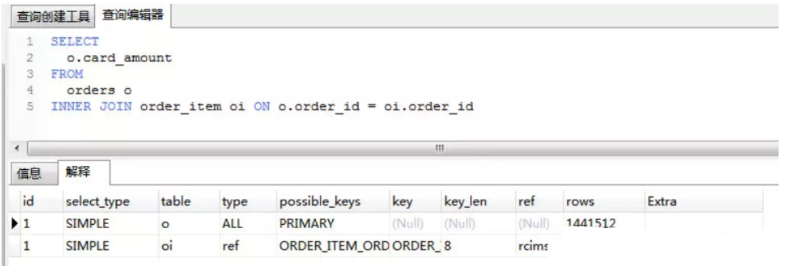

# MySQL优化

## 1. 如何定位及优化SQL语句的性能问题？

对于低性能的SQL语句的定位，最重要也是最有效的方法就是使用执行计划，MySQL提供了explain命令来查看语句的执行计划。 我们知道，不管是哪种数据库，或者是哪种数据库引擎，在对一条SQL语句进行执行的过程中都会做很多相关的优化，对于查询语句，最重要的优化方式就是使用索引。

 而执行计划，就是显示数据库引擎对于SQL语句的执行的详细情况，其中包含了是否使用索引，使用什么索引，使用的索引的相关信息等。

## 2. 大表数据查询，怎么优化
* 优化shema、sql语句+索引；
* 第二加缓存，memcached, redis；
* 主从复制，读写分离；
* 垂直拆分，根据你模块的耦合度，将一个大的系统分为多个小的系统，也就是分布式系统；
* 水平切分，针对数据量大的表，这一步最麻烦，最能考验技术水平，要选择一个合理的sharding key, 为了有好的查询效率，表结构也要改动，做一定的冗余，应用也要改，sql中尽量带sharding key，将数据定位到限定的表上去查，而不是扫描全部的表；

## 3. 超大分页怎么处理?

数据库层面,这也是我们主要集中关注的(虽然收效没那么大),类似于`select * from table where age > 20 limit 1000000`,10 这种查询其实也是有可以优化的余地的. 这条语句需要 load1000000 数据然后基本上全部丢弃,只取 10 条当然比较慢. 当时我们可以修改为`select * from table where id in (select id from table where age > 20 limit 1000000,10)`.这样虽然也 load 了一百万的数据,但是由于索引覆盖,要查询的所有字段都在索引中,所以速度会很快。

解决超大分页,其实主要是靠缓存,可预测性的提前查到内容,缓存至redis等k-V数据库中,直接返回即可.

在阿里巴巴《Java开发手册》中,对超大分页的解决办法是类似于上面提到的第一种.

> 【推荐】利用延迟关联或者子查询优化超多分页场景。 
>
> 说明：MySQL并不是跳过offset行，而是取offset+N行，然后返回放弃前offset行，返回N行，那当offset特别大的时候，效率就非常的低下，要么控制返回的总页数，要么对超过特定阈值的页数进行SQL改写。 
>
> 正例：先快速定位需要获取的id段，然后再关联： 
>
> SELECT a.* FROM 表1 a, (select id from 表1 where 条件 LIMIT 100000,20 ) b where a.id=b.id

## 4. 统计过慢查询吗？对慢查询都怎么优化过？

在业务系统中，除了使用主键进行的查询，其他的我都会在测试库上测试其耗时，慢查询的统计主要由运维在做，会定期将业务中的慢查询反馈给我们。

慢查询的优化首先要搞明白慢的原因是什么？ 是查询条件没有命中索引？是load了不需要的数据列？还是数据量太大？

所以优化也是针对这三个方向来的，

* 首先分析语句，看看是否load了额外的数据，可能是查询了多余的行并且抛弃掉了，可能是加载了许多结果中并不需要的列，对语句进行分析以及重写。
* 分析语句的执行计划，然后获得其使用索引的情况，之后修改语句或者修改索引，使得语句可以尽可能的命中索引。
* 如果对语句的优化已经无法进行，可以考虑表中的数据量是否太大，如果是的话可以进行横向或者纵向的分表。

## 5. 如何优化查询过程中的数据访问

* 访问数据太多导致查询性能下降
* 确定应用程序是否在检索大量超过需要的数据，可能是太多行或列
* 确认MySQL服务器是否在分析大量不必要的数据行
* 查询不需要的数据。解决办法：使用limit解决
* 多表关联返回全部列。解决办法：指定列名
* 总是返回全部列。解决办法：避免使用SELECT *
* 重复查询相同的数据。解决办法：可以缓存数据，下次直接读取缓存
* 是否在扫描额外的记录。解决办法：
  使用explain进行分析，如果发现查询需要扫描大量的数据，但只返回少数的行，可以通过如下技巧去优化：
  使用索引覆盖扫描，把所有的列都放到索引中，这样存储引擎不需要回表获取对应行就可以返回结果。
* 改变数据库和表的结构，修改数据表范式
* 重写SQL语句，让优化器可以以更优的方式执行查询。

## 6. 如何优化关联查询

- 确定ON或者USING子句中是否有索引。
- 确保GROUP BY和ORDER BY只有一个表中的列，这样MySQL才有可能使用索引。

## 7. 数据库结构优化

一个好的数据库设计方案对于数据库的性能往往会起到事半功倍的效果。

需要考虑数据冗余、查询和更新的速度、字段的数据类型是否合理等多方面的内容。

1. **将字段很多的表分解成多个表**

对于字段较多的表，如果有些字段的使用频率很低，可以将这些字段分离出来形成新表。

因为当一个表的数据量很大时，会由于使用频率低的字段的存在而变慢。

2. **增加中间表**

对于需要经常联合查询的表，可以建立中间表以提高查询效率。

通过建立中间表，将需要通过联合查询的数据插入到中间表中，然后将原来的联合查询改为对中间表的查询。

3. **增加冗余字段**

设计数据表时应尽量遵循范式理论的规约，尽可能的减少冗余字段，让数据库设计看起来精致、优雅。但是，合理的加入冗余字段可以提高查询速度。

表的规范化程度越高，表和表之间的关系越多，需要连接查询的情况也就越多，性能也就越差。

注意：

冗余字段的值在一个表中修改了，就要想办法在其他表中更新，否则就会导致数据不一致的问题。
## 8. MySQL数据库cpu飙升到500%的话他怎么处理？
当 cpu 飙升到 500%时，先用操作系统命令 top 命令观察是不是 MySQLd 占用导致的，如果不是，找出占用高的进程，并进行相关处理。

如果是 MySQLd 造成的， show processlist，看看里面跑的 session 情况，是不是有消耗资源的 sql 在运行。找出消耗高的 sql，看看执行计划是否准确， index 是否缺失，或者实在是数据量太大造成。

一般来说，肯定要 kill 掉这些线程(同时观察 cpu 使用率是否下降)，等进行相应的调整(比如说加索引、改 sql、改内存参数)之后，再重新跑这些 SQL。

也有可能是每个 sql 消耗资源并不多，但是突然之间，有大量的 session 连进来导致 cpu 飙升，这种情况就需要跟应用一起来分析为何连接数会激增，再做出相应的调整，比如说限制连接数等。
## 9. 大表怎么优化？

类似的问题：某个表有近千万数据，CRUD比较慢，如何优化？分库分表了是怎么做的？分表分库了有什么问题？有用到中间件么？他们的原理知道么？

当MySQL单表记录数过大时，数据库的CRUD性能会明显下降，一些常见的优化措施如下：

* 限定数据的范围： 务必禁止不带任何限制数据范围条件的查询语句。比如：我们当用户在查询订单历史的时候，我们可以控制在一个月的范围内；
* 读/写分离： 经典的数据库拆分方案，主库负责写，从库负责读；
* 缓存： 使用MySQL的缓存，另外对重量级、更新少的数据可以考虑；
* 通过分库分表的方式进行优化，主要有垂直分表和水平分表。 

### explain
Explain 可以用来分析select、update、delete、insert等语句，开发人员可以通过分析 Explain 结果来优化查询语句
### 属性

- `id`: SELECT 查询的标识符. 每个 SELECT 都会自动分配一个唯一的标识符.
  - SQL执行的顺序的标识,SQL从大到小的执行
    1. id相同时，执行顺序由上至下
    2. 如果是子查询，id的序号会递增，id值越大优先级越高，越先被执行
    3. id如果相同，可以认为是一组，从上往下顺序执行；在所有组中，id值越大，优先级越高，越先执行
- `select_type`: SELECT 查询的类型.
  - `SIMPLE`, 表示此查询不包含 UNION 查询或子查询
  - `PRIMARY`, 表示此查询是最外层的查询
  - `UNION`, 表示此查询是 UNION 的第二或随后的查询
  - `DEPENDENT UNION`, UNION 中的第二个或后面的查询语句, 取决于外面的查询
  - `UNION RESULT`, UNION 的结果
  - `SUBQUERY`, 子查询中的第一个 SELECT
  - `DEPENDENT SUBQUERY`: 子查询中的第一个 SELECT, 取决于外面的查询. 即子查询依赖于外层查询的结果.
- `table`: 查询的是哪个表
- `partitions`: 匹配的分区
- `type`: 表示MySQL在表中找到所需行的方式，又称“访问类型” ，效率：`NULL > system > const > eq_ref > ref > range ~ index_merge > index > ALL`
  - `NULL`: MySQL在优化过程中分解语句，执行时甚至不用访问表或索引，例如从一个索引列里选取最小值可以通过单独索引查找完成
  - `system`: 表只有一行记录（等于系统表），这是const类型的特列，平时不会出现，这个也可以忽略不计。
  - `const`: 表示通过索引一次就找到了，const用于比较primary key或者unique索引。因为只匹配一行数据，所以很快如将主键置于where列表中，MySQL就能将该查询转换为一个常量。
  - `eq_ref`: 唯一性索引扫描，对于每个索引键，表中只有一条记录与之匹配。常见于主键或唯一索引扫描。
  - `ref`: 非唯一性索引扫描，返回匹配某个单独值的所有行，本质上也是一种索引访问，它返回所有匹配某个单独值的行，然而，它可能会找到多个符合条件的行，所以他应该属于查找和扫描的混合体
  - `range`: 表示使用索引范围查询, 通过索引字段范围获取表中部分数据记录. 这个类型通常出现在 =, <>, >, >=, <, <=, IS NULL, <=>, BETWEEN, IN() 操作中.
    - 当 type 是 range 时, 那么 EXPLAIN 输出的 ref 字段为 NULL, 并且 key_len 字段是此次查询中使用到的索引的最长的那个
  - `index`: 表示全索引扫描(full index scan), 和 ALL 类型类似, 只不过 ALL 类型是全表扫描, 而 index 类型则仅仅扫描所有的索引, 而不扫描数据.
    - index 类型通常出现在: 所要查询的数据直接在索引树中就可以获取到, 而不需要扫描数据. 当是这种情况时, Extra 字段 会显示 Using index
  - `ALL`: 表示全表扫描, 这个类型的查询是性能最差的查询之一. 通常来说, 我们的查询不应该出现 ALL 类型的查询, 因为这样的查询在数据量大的情况下, 对数据库的性能是巨大的灾难. 如一个查询是 ALL 类型查询, 那么一般来说可以对相应的字段添加索引来避免

- `possible_keys`: 此次查询中可能选用的索引
- `key`: 此次查询中确切使用到的索引.
- `key_len`: 表示索引中使用的字节数，可通过该列计算查询中使用的索引的长度（key_len显示的值为索引字段的最大可能长度，并非实际使用长度，即key_len是根据表定义计算而得，不是通过表内检索出的）
- `ref`: 哪个字段或常数与 key 一起被使用
- `rows`: 显示此查询一共扫描了多少行. 这个是一个估计值.
- `filtered`: 这个字段表示存储引擎返回的数据在server层过滤后，剩下多少满足查询的记录数量的比例，注意是百分比，不是具体记录数。这个字段不重要
- `extra`: 额外的信息
  - `Using where`:列数据是从仅仅使用了索引中的信息而没有读取实际的行动的表返回的，这发生在对表的全部的请求列都是同一个索引的部分的时候，表示mysql服务器将在存储引擎检索行后再进行过滤
  - `Using temporary`：表示MySQL需要使用临时表来存储结果集，常见于排序和分组查询
  - `Using filesort`：MySQL中无法利用索引完成的排序操作称为“文件排序”
    - 在使用order by关键字的时候，如果待排序的内容不能由所使用的索引直接完成排序的话，MySQL有可能就要进行文件排序
    - filesort是通过相应的排序算法将取得的数据在内存中进行排序，所使用的内存区域也就是通过sort_buffer_size 系统变量所设置的排序区。这个排序区是每个Thread 独享的，可能同一时刻在MySQL 中存在多个 sort buffer 内存区域
    - 比如 SELECT id FROM testing WHERE room_number=1000 ORDER BY id ;只有ID索引，explain可能出现using where;using filesort就是无法直接使用索引完成排序，如果加上room_number索引，则结果只有using where
  - `Using join buffer`：改值强调了在获取连接条件时没有使用索引，并且需要连接缓冲区来存储中间结果。如果出现了这个值，那应该注意，根据查询的具体情况可能需要添加索引来改进能。
  - `Impossible where`：这个值强调了where语句会导致没有符合条件的行。
  - `Select tables optimized away`：这个值意味着仅通过使用索引，优化器可能仅从聚合函数结果中返回一行
### 如何做慢查询排查的
#### 什么是慢查询日志
具体指运行时间超过long_query_time值的SQL，则会被记录到慢查询日志中。long_query_time的默认值为10，意思是运行10秒以上的语句。
- 如果不是调优需要的话，一般不建议启动该参数，因为开启慢查询日志会或多或少带来一定的性能影响。慢查询日志支持将日志记录写入文件
- 默认关闭：`SHOW VARIABLES LIKE '%slow_query_log%';`

  

  - 临时生效：`set global slow_query_log=1;`
  - 永久生效，修改配置文件my.cnf（其它系统变量也是如此）
- 查询当前系统中有多少条慢查询记录
  - `show global status like '%Slow_queries%';`
#### 使用工具分析
- mysql自带的 mysqldumpslow,
  - `mysqldumpslow  /var/lib/mysql/mysql-slow.log`
    - 得到的信息
      - 主要功能是, 统计不同慢sql的
      - 出现次数(Count),
      - 执行最长时间(Time),
      - 累计总耗费时间(Time),
      - 等待锁的时间(Lock),
      - 发送给客户端的行总数(Rows),
      - 扫描的行总数(Rows),
      - 用户以及sql语句本身(抽象了一下格式, 比如 limit 1, 20 用 limit N,N 表示).
  - 一般一台服务器有很多数据库，这样根本看不出来啊
- mysqlsla
  - 需要单独安装
  - 使用举例
    - 统计慢查询文件为/data/mysql/127-slow.log的所有select的慢查询sql，并显示执行时间最长的100条sql，并写到sql_select.log中去
    - `mysqlsla -lt slow  -sf "+select" -top 100  /data/mysql/127-slow.log >/tmp/sql_select.log`
      
    
  - 返回参数
    - `Count`, sql的执行次数及占总的slow log数量的百分比.
    - `Time`, 执行时间, 包括总时间, 平均时间, 最小, 最大时间, 时间占到总慢sql时间的百分比.
    - `95% of Time`, 去除最快和最慢的sql, 覆盖率占95%的sql的执行时间.
    - `Lock Time`, 等待锁的时间.95% of Lock , 95%的慢sql等待锁时间.Rows sent, 结果行统计数量, 包括平均, 最小, 最大数量.
    - `Rows examined`, 扫描的行数量.
    - `Database`, 属于哪个[数据库]
    - `Users`, 哪个用户,IP, 占到所有用户执行的sql百分比
    - `Query abstract`, 抽象后的sql语句
    - `Query sample`, sql语句
  - 对于得到这个信息还可以进一步分析，就是登陆到mysql 的客户端，登陆数据库，执行 EXPLAIN查看sql具体的 type 信息。
### select * select col 主要区别
- select * 是查询表的所有字段，数据返回量肯定比较大
- 如果只是查询单独字段，最好写单独字段不要查询全部字段
- 如果查询单独字段比如select abc，而写了select * 如果abc有索引，则会读完索引的数据再去读其他data造成性能问题
### select count(*)  count(1)  count(col) 主要区别
count(1) 和count(*) 没有什么很大区别

count(1) 和 count(col)
- 主要区别是 count(1)会统计值为null的数据,count(*)也不会忽略
- 而count(col)会忽略
