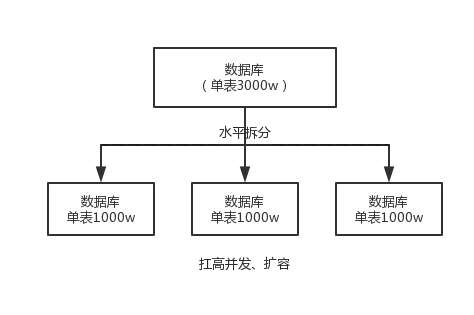
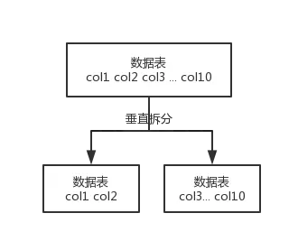

# 分库分表

## 1. 为什么要分库分表？

**分表**

比如你单表都几千万数据了，你确定你能扛住么？绝对不行，单表数据量太大，会极大影响你的 sql执行的性能，到了后面你的 sql 可能就跑的很慢了。一般来说，就以我的经验来看，单表到几百万的时候，性能就会相对差一些了，你就得分表了。

分表就是把一个表的数据放到多个表中，然后查询的时候你就查一个表。比如按照用户 id 来分表，将一个用户的数据就放在一个表中。然后操作的时候你对一个用户就操作那个表就好了。这样可以控制每个表的数据量在可控的范围内，比如每个表就固定在 200 万以内。

**分库**

分库就是你一个库一般我们经验而言，最多支撑到并发 2000，一定要扩容了，而且一个健康的单库并发值你最好保持在每秒 1000 左右，不要太大。那么你可以将一个库的数据拆分到多个库中，访问的时候就访问一个库好了。

这就是所谓的分库分表。


## 2. 用过哪些分库分表中间件？不同的分库分表中间件都有什么优点和缺点？

这个其实就是看看你了解哪些分库分表的中间件，各个中间件的优缺点是啥？然后你用过哪些分库分表的中间件。

比较常见的包括：

- cobar
- TDDL
- atlas
- sharding-jdbc
- mycat

#### cobar

阿里 b2b 团队开发和开源的，属于 proxy 层方案。早些年还可以用，但是最近几年都没更新了，基本没啥人用，差不多算是被抛弃的状态吧。而且不支持读写分离、存储过程、跨库 join 和分页等操作。

#### TDDL

淘宝团队开发的，属于 client 层方案。支持基本的 crud 语法和读写分离，但不支持 join、多表查询等语法。目前使用的也不多，因为还依赖淘宝的 diamond 配置管理系统。

#### atlas

360 开源的，属于 proxy 层方案，以前是有一些公司在用的，但是确实有一个很大的问题就是社区最新的维护都在 5 年前了。所以，现在用的公司基本也很少了。

#### sharding-jdbc

当当开源的，属于 client 层方案。确实之前用的还比较多一些，因为 SQL 语法支持也比较多，没有太多限制，而且目前推出到了 2.0 版本，支持分库分表、读写分离、分布式 id 生成、柔性事务（最大努力送达型事务、TCC 事务）。而且确实之前使用的公司会比较多一些（这个在官网有登记使用的公司，可以看到从 2017 年一直到现在，是有不少公司在用的），目前社区也还一直在开发和维护，还算是比较活跃，个人认为算是一个现在也**可以选择的方案**。

#### mycat

基于 cobar 改造的，属于 proxy 层方案，支持的功能非常完善，而且目前应该是非常火的而且不断流行的数据库中间件，社区很活跃，也有一些公司开始在用了。但是确实相比于 sharding jdbc 来说，年轻一些，经历的锤炼少一些。

## 3. （切分）如何对数据库如何进行垂直拆分或水平拆分的？

### 水平切分
水平切分又称为 Sharding，它是将同一个表中的记录拆分到多个结构相同的表中
- 当一个表的数据不断增多时，Sharding 是必然的选择，它可以将数据分布到集群的不同节点上，从而缓存单个数据库的压力。
  - 优点
    - 单库单表的数据保持在一定的量级，有助于性能的提高。
    - 切分的表的结构相同，应用层改造较少，只需要增加路由规则即可。
    - 提高了系统的稳定性和负载能力。
  - 缺点
    - 切分后，数据是分散的，很难利用数据库的Join操作，跨库Join性能较差。
    - 拆分规则难以抽象。
    - 分片事务的一致性难以解决。
    - 数据扩容的难度和维护量极大。
```
**水平拆分**的意思，就是把一个表的数据给弄到多个库的多个表里去，但是每个库的表结构都一样，只不过每个库表放的数据是不同的，所有库表的数据加起来就是全部数据。水平拆分的意义，就是将数据均匀放更多的库里，然后用多个库来抗更高的并发，还有就是用多个库的存储容量来进行扩容。
```



### 垂直切分
垂直切分是将一张表按列切分成多个表，通常是按照列的关系密集程度进行切分，也可以利用垂直切分将经常被使用的列和不经常被使用的列切分到不同的表中
- 优点
  - 拆分后业务清晰，拆分规则明确。
  - 系统之间进行整合或扩展很容易。
  - 按照成本、应用的等级、应用的类型等奖表放到不同的机器上，便于管理。
  - 便于实现动静分离、冷热分离的数据库表的设计模式。
  - 数据维护简单。
- 缺点
  - 部分业务表无法关联(Join), 只能通过接口方式解决，提高了系统的复杂度。
  - 受每种业务的不同限制，存在单库性能瓶颈，不易进行数据扩展和提升性能。
  - 事务处理复杂。
```
**垂直拆分**的意思，就是**把一个有很多字段的表给拆分成多个表**，**或者是多个库上去**。每个库表的结构都不一样，每个库表都包含部分字段。一般来说，会**将较少的访问频率很高的字段放到一个表里去**，然后**将较多的访问频率很低的字段放到另外一个表里去**。因为数据库是有缓存的，你访问频率高的行字段越少，就可以在缓存里缓存更多的行，性能就越好。这个一般在表层面做的较多一些。
```



两种**分库分表的方式**：

- 一种是按照 range 来分，就是每个库一段连续的数据，这个一般是按比如**时间范围**来的，但是这种一般较少用，因为很容易产生热点问题，大量的流量都打在最新的数据上了。
- 或者是按照某个字段hash一下均匀分散，这个较为常用。

range 来分，好处在于说，扩容的时候很简单，因为你只要预备好，给每个月都准备一个库就可以了，到了一个新的月份的时候，自然而然，就会写新的库了；缺点，但是大部分的请求，都是访问最新的数据。实际生产用 range，要看场景。

hash 分发，好处在于说，可以平均分配每个库的数据量和请求压力；坏处在于说扩容起来比较麻烦，会有一个数据迁移的过程，之前的数据需要重新计算 hash 值重新分配到不同的库或表

## 复制
### 主从复制
#### 原理
主库会生成一个 log dump 线程,用来给从库 I/O 线程传 Binlog 数据。 从库的 I/O 线程会去请求主库的 Binlog，并将得到的 Binlog 写到本地的 relay log (中继日志)文件中。 SQL 线程,会读取 relay log 文件中的日志，并解析成 SQL 语句逐一执行。
- 主节点
  - 打开 Master 端的 Binlog 功能
  - `log dump thread` 当从节点连接主节点时，主节点会为其创建一个 log dump 线程，用于发送和读取 Binlog 的内容。在读取 Binlog 中的操作时，log dump 线程会对主节点上的 Binlog 加锁；当读取完成发送给从节点之前，锁会被释放。主节点会为自己的每一个从节点创建一个 log dump 线程
- 从库
  - `I/O 线程` 当从节点上执行start slave命令之后，从节点会创建一个 I/O 线程用来连接主节点，请求主库中更新的Binlog。I/O 线程接收到主节点的 log dump 进程发来的更新之后，保存在本地 relay-log（中继日志）中
  - `SQL 线程` SQL 线程负责读取 relay log 中的内容，解析成具体的操作并执行，最终保证主从数据的一致性
#### 主从复制的模式
- 异步模式 (async-mode)
  - 这种模式下，主节点不会主动推送数据到从节点，主库在执行完客户端提交的事务后会立即将结果返给给客户端，并不关心从库是否已经接收并处理，这样就会有一个问题，主节点如果崩溃掉了，此时主节点上已经提交的事务可能并没有传到从节点上，如果此时，强行将从提升为主，可能导致新主节点上的数据不完整
    - 从库主动拉
    - 不保证数据完整复制
  - 默认
- 半同步模式(semi-sync)
  - 介于异步复制和全同步复制之间，主库在执行完客户端提交的事务后不是立刻返回给客户端，而是等待至少一个从库接收到并写到 relay log 中才返回成功信息给客户端（只能保证主库的 Binlog 至少传输到了一个从节点上），否则需要等待直到超时时间然后切换成异步模式再提交。
    - 等待至少一个从库回复
    - 超时后使用异步模式
- 全同步模式
  - 指当主库执行完一个事务，然后所有的从库都复制了该事务并成功执行完才返回成功信息给客户端。因为需要等待所有从库执行完该事务才能返回成功信息，所以全同步复制的性能必然会收到严重的影响
    - 所有从库全部完成后主库才确认成功
#### 问题
延迟
- 主库的TPS很高，从库来不及同步
- 解决
  - 官方称为Enhanced Multi-threaded Slaves，即MTS
  - MySQL 5.7 版本引入了基于组提交的并行复制
  - 多线程并发执行relay log提交的事务
### 读写分离
- Apache ShardingSphere
- 主库主写，从库主读