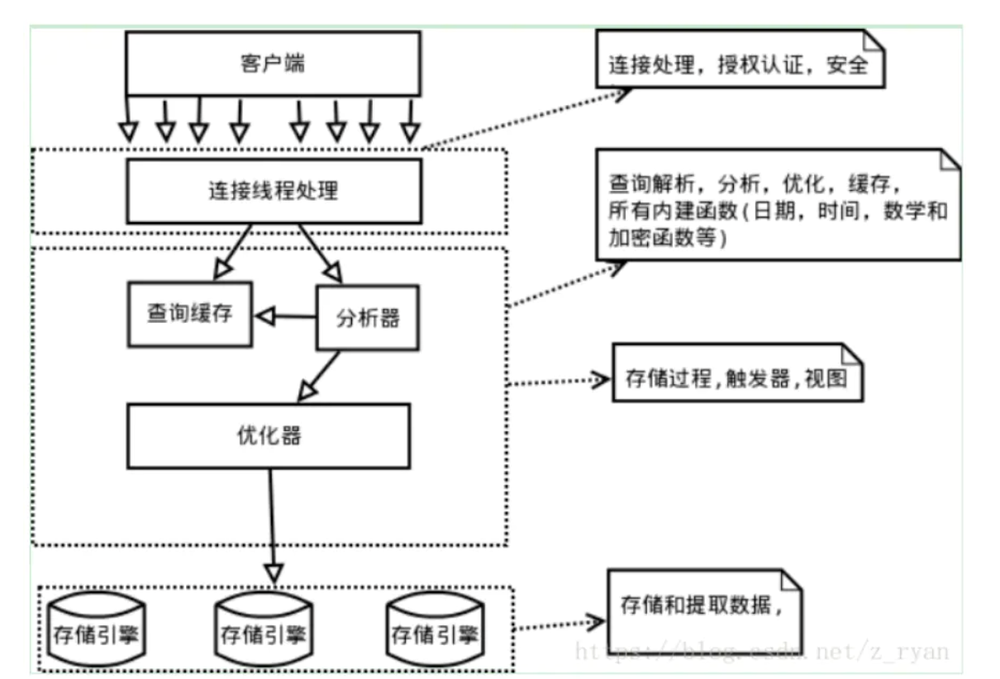
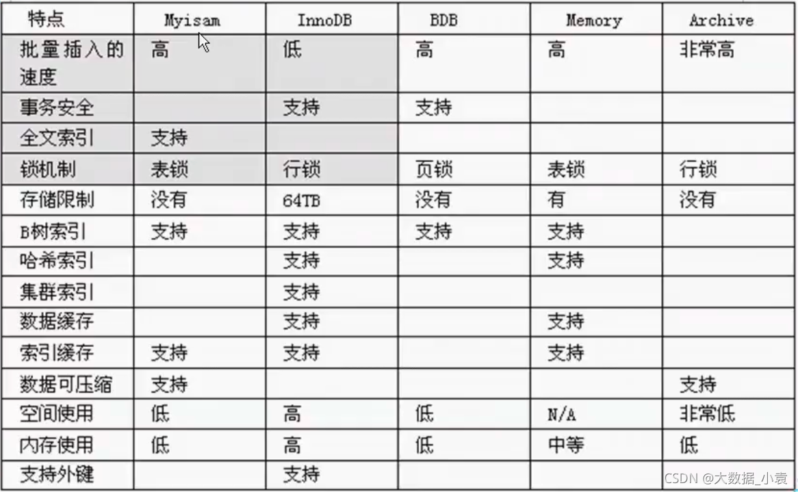
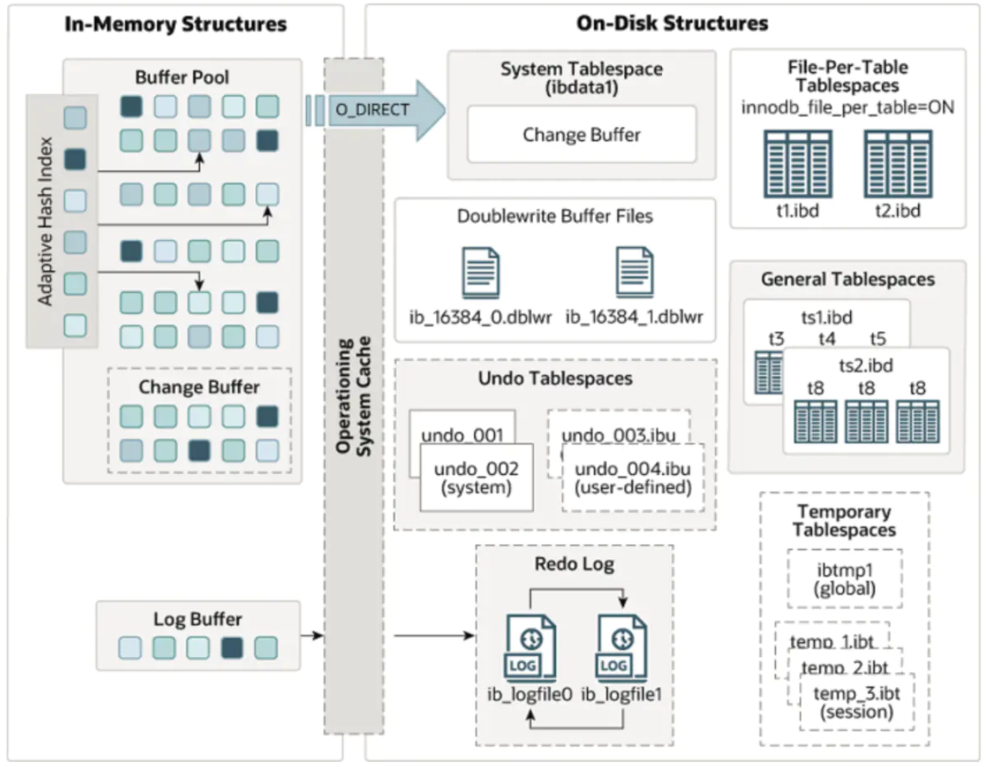
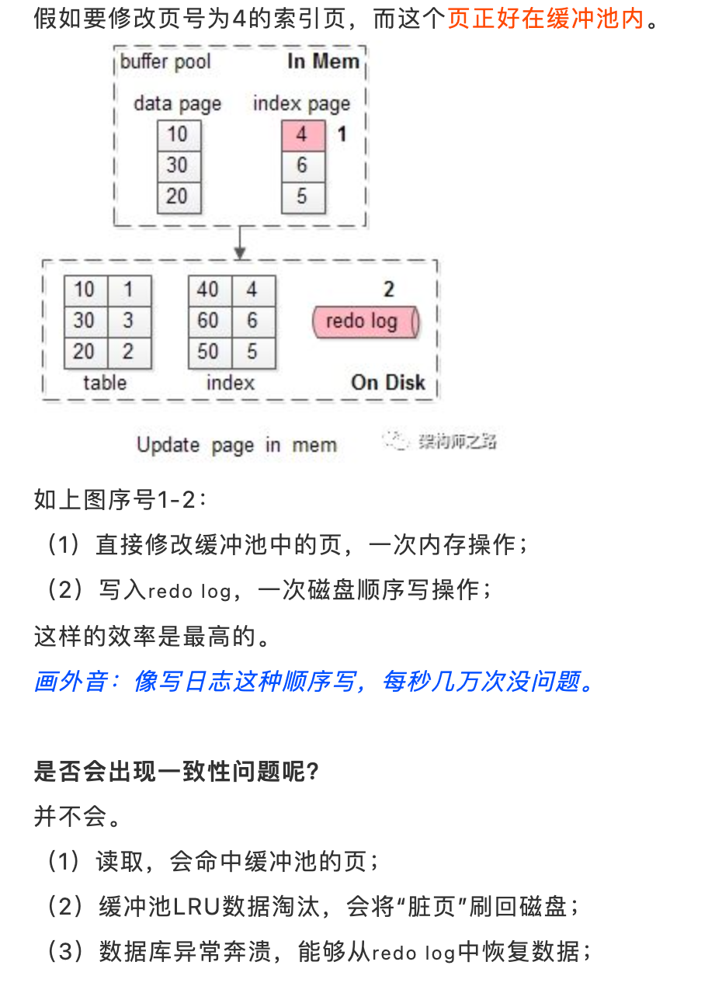
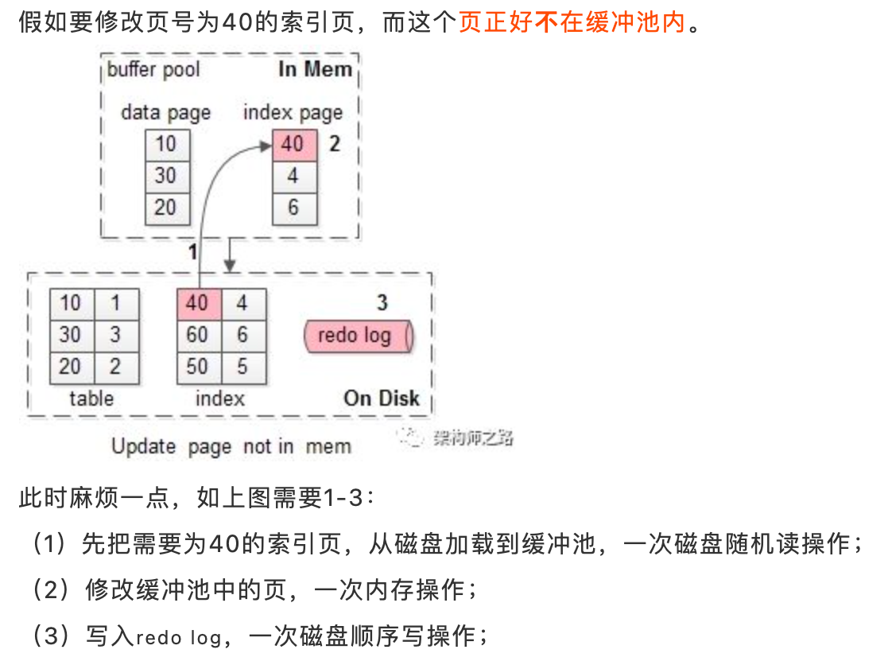
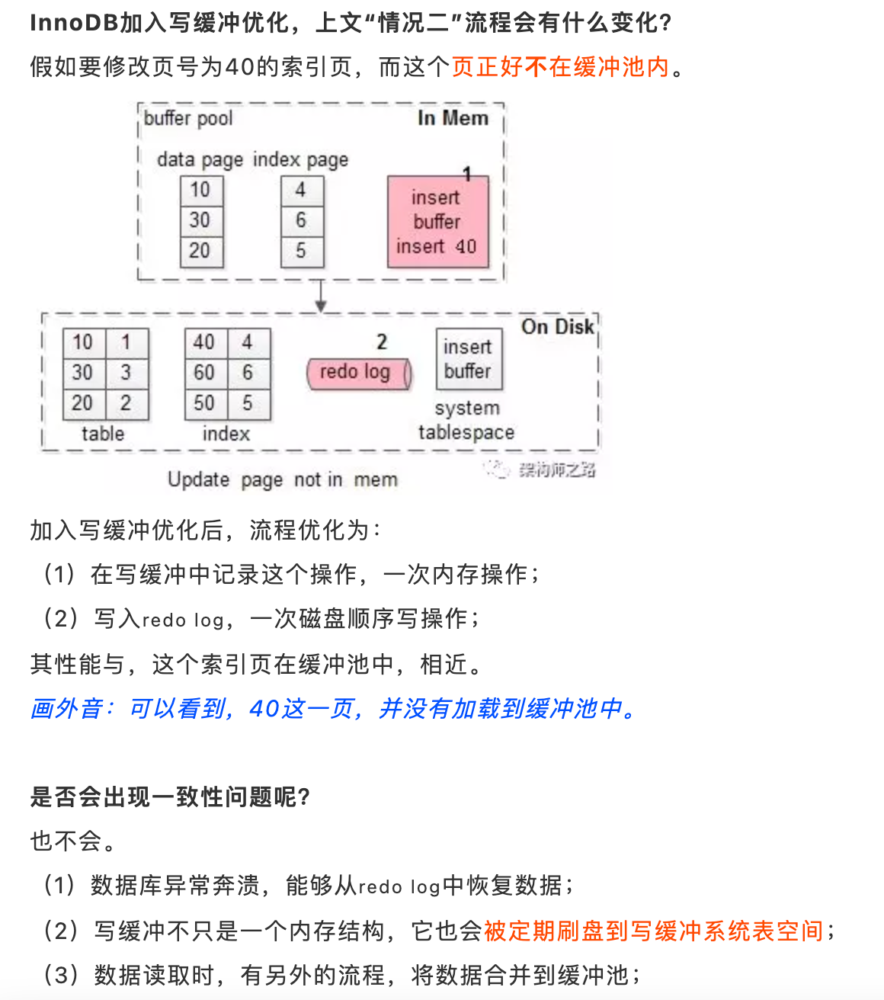
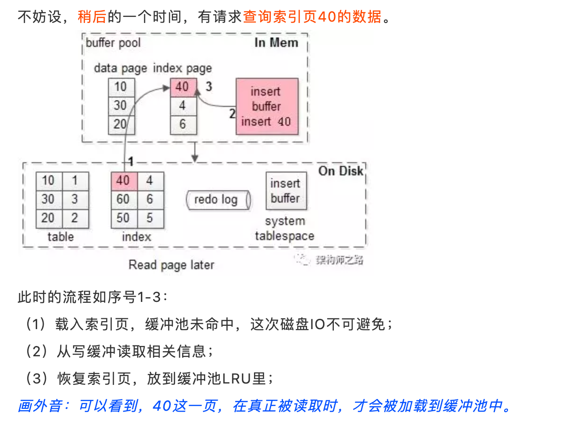
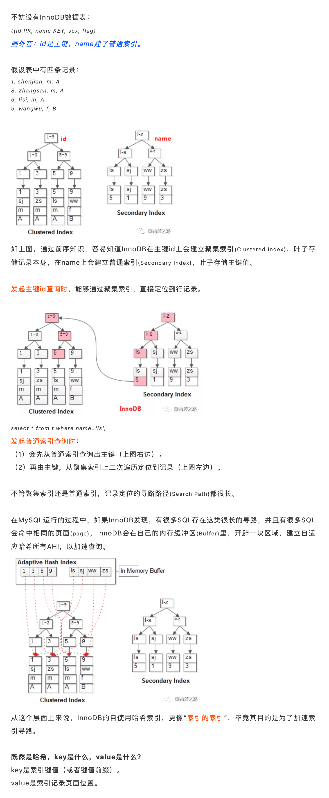

# MySQL
## 架构

### 客户端
各种语言都提供了连接mysql数据库的方法，比如jdbc、php、go等，可根据选择 的后端开发语言选择相应的方法或框架连接mysql
### server层
包括连接器、查询缓存、分析器、优化器、执行器等，涵盖mysql的大多数核心服务功能，以及所有的内置函数（例如日期、世家、数 学和加密函数等），所有跨存储引擎的功能都在这一层实现，比如存储过程、触发器、视图等
- `连接器` 连接器负责来自客户端的连接、获取用户权限、维持和管理连接
- `查询缓存`
  - mysql拿到一个查询请求后，会先到查询缓存查看之前是否执行过这条语句
  - MySQL 8.0 版本直接将查询缓存的整块功能删掉了
- `分析器`
  - 词法分析（识别关键字，操作，表名，列名）
  - 语法分析 (判断是否符合语法）
- `优化器` 优化器是在表里面有多个索引的时候，决定使用哪个索引；或者在一个语句有多表关联（join）的时候，决定各个表的连接顺序。优化器阶段完成后，这个语句的执行方案就确定下来了，然后进入执行器阶段
- `执行器`
  - 首先，肯定是要判断权限，就是有没有权限执行这条SQL。工作中可能会对某些客户端进行权限控制
  - 如果有权限，就打开表继续执行。打开表的时候，执行器就会根据表的引擎定义，去使用这个引擎提供的接口

最终对结果集进行过滤、排序以及键值对的比较等
- cpu密集型
### 储存引擎
负责数据的存储和提取，是真正与底层物理文件打交道的组件。 数据本质是存储在磁盘上的，通过特定的存储引擎对数据进行有组织的存放并根据业务需要对数据进行提取。存储引擎的架构模式是插件式的，支持Innodb，MyIASM、Memory等多个存储引擎。现在最常用的存储引擎是Innodb，它从mysql5.5.5版本开始成为了默认存储引擎
- io密集型
### 物理文件层
存储数据库真正的表数据、日志等。物理文件包括：redolog、undolog、binlog、errorlog、querylog、slowlog、data、index等

## 储存引擎
MySQL 5.7 支持的存储引擎有 InnoDB、MyISAM、Memory、Merge、Archive、CSV、BLACKHOLE 等。可以使用SHOW ENGINES;语句查看系统所支持的引擎类型

### InnoDB
特点
- 灾难恢复性好
- 支持事务
- 使用行级锁
- 支持外键关联
- 支持热备份
### MyISAM
- 不支持事务使用表级锁
- 并发性差主机宕机后，MyISAM表易损坏
- 灾难恢复性不佳可以配合锁，实现操作系统下的复制备份、迁移
- 只缓存索引，数据的缓存是利用操作系统缓冲区来实现的。可能引发过多的系统调用且效率不佳
- 数据紧凑存储，因此可获得更小的索引和更快的全表扫描性能
### MEMORY
- 使用内存
- 重启后数据会丢失

### ARCHIVE
该存储引擎非常适合存储大量独立的、作为历史记录的数据。区别于InnoDB和MyISAM这两种引擎，ARCHIVE提供了压缩功能，拥有高效的插入速度，但是这种引擎不支持索引，所以查询性能较差一些

### InnoDB
#### 架构图

#### 架构划分
##### 内存结构
###### 缓冲池 (Buffer Pool) 
buffer pool是主存中的一个区域，InnoDB在访问表和索引数据时在这里进行缓存。buffer pool允许直接从内存访问常用数据，从而提高处理速度。在专用服务器上，多达80%的物理内存通常分配给缓冲池
- `预读` 磁盘读写，并不是按需读取，而是按页读取，一次至少读一页数据（一般是16K），如果未来要读取的数据就在页中，就能够省去后续的磁盘IO，提高效率
- `LRU` 管理这些缓冲页
  - `传统的LRU` 把入缓冲池的页放到LRU的头部，作为最近访问的元素，从而最晚被淘汰
    1. 页已经在缓冲池里，那就只做“移至”LRU头部的动作，而没有页被淘汰；
    2. 页不在缓冲池里，除了做“放入”LRU头部的动作，还要做“淘汰”LRU尾部页的动作
  - `MySQL LRU`
    - 问题：`预读失效` 由于预读(Read-Ahead)，提前把页放入了缓冲池，但最终MySQL并没有从页中读取数据，称为预读失效
      - 如何对预读失效进行优化？
        - 思路
          1. 让预读失败的页，停留在缓冲池LRU里的时间尽可能短；
          2. 让真正被读取的页，才挪到缓冲池LRU的头部；
        - 方法
          - 将LRU分为两个部分
          
          
            - 新生代(new sublist)
            - 老生代(old sublist)
          - 新老生代首尾相连，即：新生代的尾(tail)连接着老生代的头(head)
          - 新页（例如被预读的页）加入缓冲池时，只加入到老生代头部
            - 如果数据真正被读取（预读成功），才会加入到新生代的头部
            - 如果数据没有被读取，则会比新生代里的“热数据页”更早被淘汰出缓冲池
    - 问题：`缓冲池污染` 当某一个SQL语句，要批量扫描大量数据时，可能导致把缓冲池的所有页都替换出去，导致大量热数据被换出，MySQL性能急剧下降，这种情况叫缓冲池污染
      - 例如，有一个数据量较大的用户表，当执行： `select * from user where name like "%shenjian%";` 虽然结果集可能只有少量数据，但这类like不能命中索引，必须全表扫描，就需要访问大量的页：
        1. 把页加到缓冲池（插入老生代头部）；
        2. 从页里读出相关的row（插入新生代头部）；
        3. row里的name字段和字符串shenjian进行比较，如果符合条件，加入到结果集中；
        4. …直到扫描完所有页中的所有row…
        - 如此一来，所有的数据页都会被加载到新生代的头部，但只会访问一次，真正的热数据被大量换出。
      - 老生代停留时间窗口
        1. 假设T=老生代停留时间窗口；
        2. 插入老生代头部的页，即使立刻被访问，并不会立刻放入新生代头部；
        3. 只有满足“被访问”并且“在老生代停留时间”大于T，才会被放入新生代头部
        - 举例
        - 

参数
- `innodb_buffer_pool_size` 配置缓冲池的大小，在内存允许的情况下，DBA往往会建议调大这个参数，越多数据和索引放到内存里，数据库的性能会越好
- `innodb_old_blocks_pct` 老生代占整个LRU链长度的比例，默认是37，即整个LRU中新生代与老生代长度比例是63:37。
- `innodb_old_blocks_time` 老生代停留时间窗口，单位是毫秒，默认是1000，即同时满足“被访问”与“在老生代停留时间超过1秒”两个条件，才会被插入到新生代头部

总结
1. 缓冲池(buffer pool)是一种常见的降低磁盘访问的机制；
2. 缓冲池通常以页(page)为单位缓存数据；
3. 缓冲池的常见管理算法是LRU，memcache，OS，InnoDB都使用了这种算法；
4. InnoDB对普通LRU进行了优化：
   1. 将缓冲池分为老生代和新生代，入缓冲池的页，优先进入老生代，页被访问，才进入新生代，以解决预读失效的问题
   2. 页被访问，且在老生代停留时间超过配置阈值的，才进入新生代，以解决批量数据访问，大量热数据淘汰的问题
###### 写缓冲 (Change Buffer)
目的是提升 InnoDB 性能，加速写请求，避免每次写入都进行磁盘 IO。 在MySQL5.5之前，叫插入缓冲(insert buffer)，只针对insert做了优化；现在对delete和update也有效，叫做写缓冲(change buffer),它是一种应用在非唯一普通索引页(non-unique secondary index page)不在缓冲池中，对页进行了写操作，并不会立刻将磁盘页加载到缓冲池，而仅仅记录缓冲变更(buffer changes)，等未来数据被读取时，再将数据合并(merge)恢复到缓冲池中的技术。写缓冲的目的是降低写操作的磁盘IO，提升数据库性能

情况一

情况二

加入写缓冲优化

此后的读取情况

为什么写缓冲优化，仅适用于非唯一普通索引页呢？
- 如果索引设置了唯一(unique)属性，在进行修改操作时，InnoDB必须进行唯一性检查。也就是说，索引页即使不在缓冲池，磁盘上的页读取无法避免(否则怎么校验是否唯一？)，此时就应该直接把相应的页放入缓冲池再进行修改
- 除了数据页被访问，还有哪些场景会触发刷写缓冲中的数据呢？
  1. 有一个后台线程，会认为数据库空闲时；
  2. 数据库缓冲池不够用时；
  3. 数据库正常关闭时；
  4. redo log写满时

什么业务场景，适合开启InnoDB的写缓冲机制？
- 什么时候不适合
  1. 数据库都是唯一索引；
  2. 或者，写入一个数据后，会立刻读取它；
- 适合
  1. 数据库大部分是非唯一索引；
  2. 业务是写多读少，或者不是写后立刻读取；
###### 自适应哈希索引 (Adaptive Hash Index)
InnoDB的哈希索引
1. InnoDB用户无法手动创建哈希索引，这一层上说，InnoDB确实不支持哈希索引；
2. InnoDB会自调优(self-tuning)，如果判定建立自适应哈希索引(Adaptive Hash Index, AHI)，能够提升查询效率，InnoDB自己会建立相关哈希索引，这一层上说，InnoDB又是支持哈希索引的；
- 原理

					
  - 为啥叫“自适应(adaptive)”哈希索引？
  - 系统自己判断“应该可以加速查询”而建立的，不需要用户手动建立，故称“自适应”。
  - 系统会不会判断失误，是不是一定能加速？
  - 不是一定能加速，有时候会误判。
###### 日志缓冲 (Log Buffer) 
redo log，binlog都先写入到日志缓冲区，然后再追加写入到磁盘日志文件中，主要的目的是把磁盘随机IO写优化成磁盘批量写和顺序写（磁盘顺序写的性能要比随机写高非常多）
- 事务提交时，将redo log写入Log Buffer，就会认为事务提交成功
- 如果写入Log Buffer的数据，write入OS cache之前，数据库崩溃，就会出现数据丢失
- 如果写入OS cache的数据，fsync入磁盘之前，操作系统奔溃，也可能出现数据丢失
  - `策略一`：最佳性能(`innodb_flush_log_at_trx_commit=0`) 每隔一秒，才将Log Buffer中的数据批量write入OS cache，同时MySQL主动fsync。 这种策略，如果数据库奔溃，有一秒的数据丢失。
  - `策略二`：强一致(`innodb_flush_log_at_trx_commit=1`) 每次事务提交，都将Log Buffer中的数据write入OS cache，同时MySQL主动fsync。 这种策略，是InnoDB的默认配置，为的是保证事务ACID特性。
  - `策略三`：折衷(`innodb_flush_log_at_trx_commit=2`) 每次事务提交，都将Log Buffer中的数据write入OS cache； 每隔一秒，MySQL主动将OS cache中的数据批量fsync。这种策略，如果操作系统奔溃，最多有一秒的数据丢失。
##### 磁盘结构
//TODO
#### 特点总结
- 支持事务处理，
- 支持外键，
- 支持崩溃修复能力和并发控制。如果需要对事务的完整性要求比较高（比如银行），要求实现并发控制（比如售票），那选择InnoDB有很大的优势。如果需要频繁的更新、删除操作的数据库，也可以选择InnoDB，因为支持事务的提交（commit）和回滚（rollback）
### MyISAM
- 不支持事务
- 不支持行级锁
- MyISAM 崩溃后发生损坏的概率比 InnoDB 高很多，而且恢复的速度也更慢
- MyISAM 支持压缩表和空间数据索引
- 插入数据快，空间和内存使用比较低。如果表主要是用于插入新记录和读出记录，那么选择MyISAM能实现处理高效率。如果应用的完整性、并发性要求比 较低，也可以使用

## MyISAM和InnoDB的区别总结

### 存储结构
**MyISAM**：每个MyISAM在磁盘上存储成三个文件。分别为：表定义文件、数据文件、索引文件。第一个文件的名字以表的名字开始，扩展名指出文件类型。.frm文件存储表定义。数据文件的扩展名为.MYD (MYData)。索引文件的扩展名是.MYI (MYIndex)。

**InnoDB**：所有的表都保存在同一个数据文件中（也可能是多个文件，或者是独立的表空间文件），InnoDB表的大小只受限于操作系统文件的大小，一般为2GB。

### 存储空间
**MyISAM**： MyISAM支持三种不同的存储格式：静态表(默认，但是注意数据末尾不能有空格，会被去掉)、动态表、压缩表。当表在创建之后并导入数据之后，不会再进行修改操作，可以使用压缩表，极大的减少磁盘的空间占用。

**InnoDB**： 需要更多的内存和存储，它会在主内存中建立其专用的缓冲池用于高速缓冲数据和索引。

### 可移植性、备份及恢复
**MyISAM**：数据是以文件的形式存储，所以在跨平台的数据转移中会很方便。在备份和恢复时可单独针对某个表进行操作。

**InnoDB**：免费的方案可以是拷贝数据文件、备份 binlog，或者用 mysqldump，在数据量达到几十G的时候就相对痛苦了。

### 事务支持
**MyISAM**：强调的是性能，每次查询具有原子性,其执行数度比InnoDB类型更快，但是不提供事务支持。

**InnoDB**：提供事务支持事务，外部键等高级数据库功能。 具有事务(commit)、回滚(rollback)和崩溃修复能力(crash recovery capabilities)的事务安全(transaction-safe (ACID compliant))型表。

### AUTO_INCREMENT 
**MyISAM**：可以和其他字段一起建立联合索引。引擎的自动增长列必须是索引，如果是组合索引，自动增长可以不是第一列，他可以根据前面几列进行排序后递增。

**InnoDB**：InnoDB中必须包含只有该字段的索引。引擎的自动增长列必须是索引，如果是组合索引也必须是组合索引的第一列。

### 表锁差异
**MyISAM**： 只支持表级锁，用户在操作myisam表时，select，update，delete，insert语句都会给表自动加锁，如果加锁以后的表满足insert并发的情况下，可以在表的尾部插入新的数据。

**InnoDB**： 支持事务和行级锁，是innodb的最大特色。行锁大幅度提高了多用户并发操作的新能。但是InnoDB的行锁，只是在WHERE的主键是有效的，非主键的WHERE都会锁全表的。

### 全文索引MySql全文索引
**MyISAM**：支持 FULLTEXT类型的全文索引

**InnoDB**：不支持FULLTEXT类型的全文索引，但是innodb可以使用sphinx插件支持全文索引，并且效果更好。

### 表主键
**MyISAM**：允许没有任何索引和主键的表存在，索引都是保存行的地址。

**InnoDB**：如果没有设定主键或者非空唯一索引，就会自动生成一个6字节的主键(用户不可见)，数据是主索引的一部分，附加索引保存的是主索引的值。

### 表的具体行数
**MyISAM**： 保存有表的总行数，如果select count() from table;会直接取出出该值。

**InnoDB**： 没有保存表的总行数，如果使用select count(*) from table；就会遍历整个表，消耗相当大，但是在加了wehre条件后，myisam和innodb处理的方式都一样。

### CRUD操作
**MyISAM**：如果执行大量的SELECT，MyISAM是更好的选择。

**InnoDB**：如果你的数据执行大量的INSERT或UPDATE，出于性能方面的考虑，应该使用InnoDB表。
### 外键
**MyISAM**：不支持

**InnoDB**：支持

## 中间件
### mycat
MyCAT主要是通过对SQL的拦截，然后经过一定规则的分片解析、路由分析、读写分离分析、缓存分析等，然后将SQL发给后端真实的数据块，并将返回的结果做适当处理返回给客户端
### ShardingSphere
Sharding-JDBC、Sharding-Proxy和Sharding-Sidecar（计划中）这3款相互独立的产品组成
#### Sharding-JDBC
1. SQL 解析：解析分为词法解析和语法解析。先通过词法解析器将这句 SQL 拆分为一个个不可再分的单词，再使用语法解析器对 SQL 进行理解，并最终提炼出解析上下文。简单来说就是要理解这句 SQL，明白它的构造和行为，这是下面的优化、路由、改写、执行和归并的基础。
2. SQL 路由：根据解析上下文匹配用户对这句 SQL 所涉及的库和表配置的分片策略，并根据分片策略生成路由后的 SQL。路由后的 SQL 有一条或多条，每一条都对应着各自的真实物理分片。
3. SQL 改写：将 SQL 改写为在真实数据库中可以正确执行的语句（逻辑 SQL 到物理 SQL 的映射，例如把逻辑表名改成带编号的分片表名）。
4. SQL 执行：通过多线程执行器异步执行路由和改写之后得到的 SQL 语句。
5. 结果归并：将多个执行结果集归并以便于通过统一的 JDBC 接口输出。
#### Sharding-Proxy
- Sharding-Proxy的定位是透明化的数据库代理，它封装了数据库二进制协议，用于完成对异构语言的支持
- 前端（Frontend）负责与客户端进行网络通信，采用的是基于NIO的客户端/服务器框架，在Windows和Mac操作系统下采用NIO模型，Linux系统自动适配为Epoll模型，在通信的过程中完成对MySQL协议的编解码；
- 核心组件（Core-module）得到解码的MySQL命令后，开始调用Sharding-Core对SQL进行解析、改写、路由、归并等核心功能；
- 后端（Backend）与真实数据库的交互暂时借助基于BIO的Hikari连接池。BIO的方式在数据库集群规模很大，或者一主多从的情况下，性能会有所下降。所以未来我们还会提供NIO的方式连接真实数据库

## 数据库三范式
### 第一范式
1NF是对属性的原子性，要求属性具有原子性，不可再分解；

_表：字段1、 字段2(字段2.1、字段2.2)、字段3 ......_

如学生（学号，姓名，性别，出生年月日），如果认为最后一列还可以再分成（出生年，出生月，出生日），它就不是一范式了，否则就是；
### 第二范式
2NF是对记录的唯一性，要求记录有唯一标识，即实体的唯一性，即不存在部分依赖；

_表：学号、课程号、姓名、学分;_

这个表明显说明了两个事务:学生信息, 课程信息;由于非主键字段必须依赖主键，这里学分依赖课程号，姓名依赖与学号，所以不符合二范式。
### 第三范式
3NF是对字段的冗余性，要求任何字段不能由其他字段派生出来，它要求字段没有冗余，即不存在传递依赖；

_表: 学号, 姓名, 年龄, 学院名称, 学院电话_

因为存在依赖传递: (学号) → (学生)→(所在学院) → (学院电话) 。

## MySQL与PostGreSQL的区别
一.PostgreSQL相对于MySQL的优势
1. 在SQL的标准实现上要比MySQL完善，而且功能实现比较严谨；
2. 存储过程的功能支持要比MySQL好，具备本地缓存执行计划的能力；
3. 对表连接支持较完整，优化器的功能较完整，支持的索引类型很多，复杂查询能力较强；
4. PG主表采用堆表存放，MySQL采用索引组织表，能够支持比MySQL更大的数据量。
5. PG的主备复制属于物理复制，相对于MySQL基于binlog的逻辑复制，数据的一致性更加可靠，复制性能更高，对主机性能的影响也更小。
6. MySQL的存储引擎插件化机制，存在锁机制复杂影响并发的问题，而PG不存在。

二、MySQL相对于PG的优势：
1. innodb的基于回滚段实现的MVCC机制，相对PG新老数据一起存放的基于XID的MVCC机制，是占优的。因此MySQL的速度是高于PG的；
2. MySQL采用索引组织表，这种存储方式非常适合基于主键匹配的查询、删改操作，但是对表结构设计存在约束；
3. MySQL的优化器较简单，系统表、运算符、数据类型的实现都很精简，非常适合简单的查询操作；
4. MySQL分区表的实现要优于PG的基于继承表的分区实现，主要体现在分区个数达到上千上万后的处理性能差异较大。
# 参考文章
- https://www.zhihu.com/question/20596402/answer/529312016
- https://segmentfault.com/a/1190000013695030
- https://cloud.tencent.com/developer/article/1704743
- https://zhuanlan.zhihu.com/p/73035620
- https://www.jianshu.com/p/c6483ded042d
- https://juejin.cn/post/6844904073955639304
- https://blog.csdn.net/huangjw_806/article/details/100927097
- https://juejin.cn/post/6844903439760097294
- https://juejin.cn/post/6860655290732249095
- https://blog.csdn.net/yuan2019035055/article/details/122310447?utm_medium=distribute.pc_feed_blog_category.none-task-blog-classify_tag-5.nonecasedepth_1-utm_source=distribute.pc_feed_blog_category.none-task-blog-classify_tag-5.nonecase