## 1. 索引是什么？

索引是一种特殊的文件(InnoDB数据表上的索引是表空间的一个组成部分)，它们包含着对数据表里所有记录的引用指针。

索引是一种数据结构。数据库索引，是数据库管理系统中一个排序的数据结构，以协助快速查询、更新数据库表中数据。索引的实现通常使用B树及其变种B+树。更通俗的说，索引就相当于目录。为了方便查找书中的内容，通过对内容建立索引形成目录。而且索引是一个文件，它是要占据物理空间的。

MySQL索引的建立对于MySQL的高效运行是很重要的，索引可以大大提高MySQL的检索速度。比如我们在查字典的时候，前面都有检索的拼音和偏旁、笔画等，然后找到对应字典页码，这样然后就打开字典的页数就可以知道我们要搜索的某一个key的全部值的信息了。

## 2. 索引有哪些优缺点？

**索引的优点**

* 可以大大加快数据的检索速度，这也是创建索引的最主要的原因。
* 通过使用索引，可以在查询的过程中，使用优化隐藏器，提高系统的性能。

**索引的缺点**

* 时间方面：创建索引和维护索引要耗费时间，具体地，当对表中的数据进行增加、删除和修改的时候，索引也要动态的维护，会降低增/改/删的执行效率；
* 空间方面：索引需要占物理空间。

## 3. MySQL有哪几种索引类型？

1、从存储结构上来划分：BTree索引（B-Tree或B+Tree索引），Hash索引，full-index全文索引，R-Tree索引。这里所描述的是索引存储时保存的形式，

2、从应用层次来分：普通索引，唯一索引，复合索引。

* 普通索引：即一个索引只包含单个列，一个表可以有多个单列索引

* 唯一索引：索引列的值必须唯一，但允许有空值

* 复合索引：多列值组成一个索引，专门用于组合搜索，其效率大于索引合并

* 聚簇索引(聚集索引)：并不是一种单独的索引类型，而是一种数据存储方式。具体细节取决于不同的实现，InnoDB的聚簇索引其实就是在同一个结构中保存了B-Tree索引(技术上来说是B+Tree)和数据行。

* 非聚簇索引： 不是聚簇索引，就是非聚簇索引

3、根据中数据的物理顺序与键值的逻辑（索引）顺序关系： 聚集索引，非聚集索引。
```
- 按数据结构分类可分为：B+tree索引、Hash索引、Full-text索引。
- 按物理存储分类可分为：聚簇索引、二级索引（辅助索引）。
- 按字段特性分类可分为：主键索引、普通索引、前缀索引。
- 按字段个数分类可分为：单列索引、联合索引（复合索引、组合索引）。
```
## 4. 说一说索引的底层实现？

**Hash索引** 

基于哈希表实现，只有精确匹配索引所有列的查询才有效，对于每一行数据，存储引擎都会对所有的索引列计算一个哈希码（hash code），并且Hash索引将所有的哈希码存储在索引中，同时在索引表中保存指向每个数据行的指针。


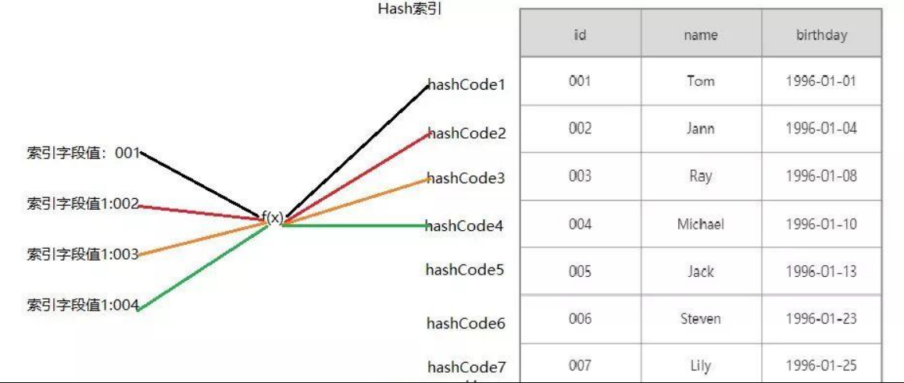

**B-Tree索引**（MySQL使用B+Tree）

B-Tree能加快数据的访问速度，因为存储引擎不再需要进行全表扫描来获取数据，数据分布在各个节点之中。

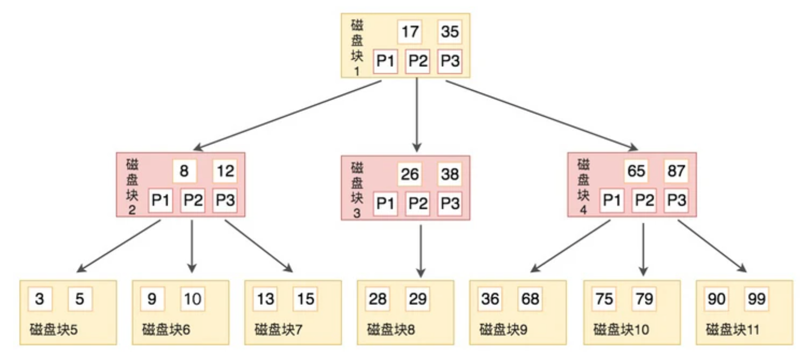

**B+Tree索引**

是B-Tree的改进版本，同时也是数据库索引索引所采用的存储结构。数据都在叶子节点上，并且增加了顺序访问指针，每个叶子节点都指向相邻的叶子节点的地址。相比B-Tree来说，进行范围查找时只需要查找两个节点，进行遍历即可。而B-Tree需要获取所有节点，相比之下B+Tree效率更高。

B+tree性质：

* n棵子tree的节点包含n个关键字，不用来保存数据而是保存数据的索引。

* 所有的叶子结点中包含了全部关键字的信息，及指向含这些关键字记录的指针，且叶子结点本身依关键字的大小自小而大顺序链接。

* 所有的非终端结点可以看成是索引部分，结点中仅含其子树中的最大（或最小）关键字。

* B+ 树中，数据对象的插入和删除仅在叶节点上进行。

* B+树有2个头指针，一个是树的根节点，一个是最小关键码的叶节点。

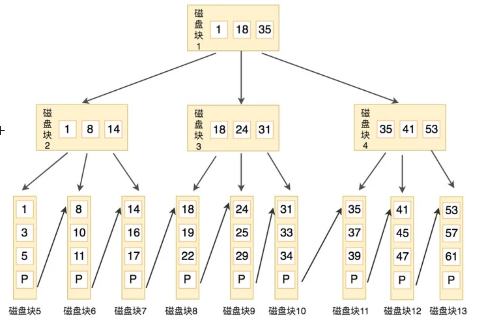


## 5. 为什么索引结构默认使用B+Tree，而不是B-Tree，Hash，二叉树，红黑树？

B-tree： 从两个方面来回答

*  B+树的磁盘读写代价更低：B+树的内部节点并没有指向关键字具体信息的指针，因此其内部节点相对B(B-)树更小，如果把所有同一内部节点的关键字存放在同一盘块中，那么盘块所能容纳的关键字数量也越多，一次性读入内存的需要查找的关键字也就越多，相对`IO读写次数就降低`了。

*  由于B+树的数据都存储在叶子结点中，分支结点均为索引，方便扫库，只需要扫一遍叶子结点即可，但是B树因为其分支结点同样存储着数据，我们要找到具体的数据，需要进行一次中序遍历按序来扫，所以B+树更加适合在`区间查询`的情况，所以通常B+树用于数据库索引。

Hash： 

* 虽然可以快速定位，但是没有顺序，IO复杂度高；

- 基于Hash表实现，只有Memory存储引擎显式支持哈希索引 ；

- 适合**等值查询**，如=、in()、<=>，不支持范围查询 ；

- 因为不是按照索引值顺序存储的，就不能像B+Tree索引一样利用索引完成[排序]() ；

- Hash索引在查询等值时非常快 ；

- 因为Hash索引始终索引的**所有列的全部内容**，所以不支持部分索引列的匹配查找 ；

- 如果有大量重复键值得情况下，哈希索引的效率会很低，因为存在哈希碰撞问题 。

二叉树： 树的高度不均匀，不能自平衡，查找效率跟数据有关（树的高度），并且IO代价高。

红黑树： 树的高度随着数据量增加而增加，IO代价高。

## 6. 讲一讲聚簇索引与非聚簇索引？

在 InnoDB 里，索引B+ Tree的叶子节点存储了整行数据的是主键索引，也被称之为聚簇索引，即将数据存储与索引放到了一块，找到索引也就找到了数据。

而索引B+ Tree的叶子节点存储了主键的值的是非主键索引，也被称之为非聚簇索引、二级索引。

聚簇索引与非聚簇索引的区别：

- 非聚集索引与聚集索引的区别在于非聚集索引的叶子节点不存储表中的数据，而是存储该列对应的主键（行号） 

- 对于InnoDB来说，想要查找数据我们还需要根据主键再去聚集索引中进行查找，这个再根据聚集索引查找数据的过程，我们称为**回表**。第一次索引一般是顺序IO，回表的操作属于随机IO。需要回表的次数越多，即随机IO次数越多，我们就越倾向于使用全表扫描 。

- 通常情况下， 主键索引（聚簇索引）查询只会查一次，而非主键索引（非聚簇索引）需要回表查询多次。当然，如果是覆盖索引的话，查一次即可 

- 注意：MyISAM无论主键索引还是二级索引都是非聚簇索引，而InnoDB的主键索引是聚簇索引，二级索引是非聚簇索引。我们自己建的索引基本都是非聚簇索引。

## 7. 非聚簇索引一定会回表查询吗？

不一定，这涉及到查询语句所要求的字段是否全部命中了索引，如果全部命中了索引，那么就不必再进行回表查询。一个索引包含（覆盖）所有需要查询字段的值，被称之为"覆盖索引"。

举个简单的例子，假设我们在员工表的年龄上建立了索引，那么当进行`select score from student where score > 90`的查询时，在索引的叶子节点上，已经包含了score 信息，不会再次进行回表查询。

## 8. 联合索引是什么？为什么需要注意联合索引中的顺序？

MySQL可以使用多个字段同时建立一个索引，叫做联合索引。在联合索引中，如果想要命中索引，需要按照建立索引时的字段顺序挨个使用，否则无法命中索引。

具体原因为:

MySQL使用索引时需要索引有序，假设现在建立了"name，age，school"的联合索引，那么索引的排序为: 先按照name排序，如果name相同，则按照age排序，如果age的值也相等，则按照school进行排序。

当进行查询时，此时索引仅仅按照name严格有序，因此必须首先使用name字段进行等值查询，之后对于匹配到的列而言，其按照age字段严格有序，此时可以使用age字段用做索引查找，以此类推。因此在建立联合索引的时候应该注意索引列的顺序，一般情况下，将查询需求频繁或者字段选择性高的列放在前面。此外可以根据特例的查询或者表结构进行单独的调整。

## 9. 讲一讲MySQL的最左前缀原则?

最左前缀原则就是最左优先，在创建多列索引时，要根据业务需求，where子句中使用最频繁的一列放在最左边。
mysql会一直向右匹配直到遇到范围查询(>、<、between、like)就停止匹配，比如a = 1 and b = 2 and c > 3 and d = 4 如果建立(a,b,c,d)顺序的索引，d是用不到索引的，如果建立(a,b,d,c)的索引则都可以用到，a,b,d的顺序可以任意调整。

=和in可以乱序，比如a = 1 and b = 2 and c = 3 建立(a,b,c)索引可以任意顺序，mysql的查询优化器会帮你优化成索引可以识别的形式。

## 10. 讲一讲前缀索引？

因为可能我们索引的字段非常长，这既占内存空间，也不利于维护。所以我们就想，如果只把很长字段的前面的公共部分作为一个索引，就会产生超级加倍的效果。但是，我们需要注意，order by不支持前缀索引 。

 流程是： 

 先计算完整列的选择性 :`  select count(distinct col_1)/count(1) from table_1  `

 再计算不同前缀长度的选择性 :` select count(distinct left(col_1,4))/count(1) from table_1  `

 找到最优长度之后，创建前缀索引 :` create index idx_front on table_1 (col_1(4))`

## 11. 了解索引下推吗？

MySQL 5.6引入了索引下推优化。默认开启，使用SET optimizer_switch = ‘index_condition_pushdown=off’;可以将其关闭。 

-  有了索引下推优化，可以在**减少回表次数** 

-  在InnoDB中只针对二级索引有效

官方文档中给的例子和解释如下：

在 people_table中有一个二级索引(zipcode，lastname，address)，查询是SELECT * FROM people WHERE zipcode=’95054′ AND lastname LIKE ‘%etrunia%’ AND address LIKE ‘%Main Street%’; 

* 如果没有使用索引下推技术，则MySQL会通过zipcode=’95054’从存储引擎中查询对应的数据，返回到MySQL服务端，然后MySQL服务端基于lastname LIKE ‘%etrunia%’ and address LIKE ‘%Main Street%’来判断数据是否符合条件 

* 如果使用了索引下推技术，则MYSQL首先会返回符合zipcode=’95054’的索引，然后根据lastname LIKE ‘%etrunia%’ and address LIKE ‘%Main Street%’来判断索引是否符合条件。如果符合条件，则根据该索引来定位对应的数据，如果不符合，则直接reject掉。

## 12. 怎么查看MySQL语句有没有用到索引？

通过explain，如以下例子：

` EXPLAIN SELECT * FROM employees.titles WHERE emp_no='10001' AND title='Senior Engineer' AND from_date='1986-06-26'; `

| id   | select_type | table  | partitions | type  | possible_keys | key     | key_len | ref               | filtered | rows | Extra |
| ---- | ----------- | ------ | ---------- | ----- | ------------- | ------- | ------- | ----------------- | -------- | ---- | ----- |
| 1    | SIMPLE      | titles | null       | const | PRIMARY       | PRIMARY | 59      | const,const,const | 10       | 1    |       |

 


* id：在⼀个⼤的查询语句中每个**SELECT**关键字都对应⼀个唯⼀的id ，如explain select * from s1 where id = (select id from s1 where name = 'egon1');第一个select的id是1，第二个select的id是2。有时候会出现两个select，但是id却都是1，这是因为优化器把子查询变成了连接查询 。

* select_type：select关键字对应的那个查询的类型，如SIMPLE,PRIMARY,SUBQUERY,DEPENDENT,SNION 。

* table：每个查询对应的表名 。

* type：`type` 字段比较重要, 它提供了判断查询是否高效的重要依据依据. 通过 `type` 字段, 我们判断此次查询是 `全表扫描` 还是 `索引扫描` 等。如const(主键索引或者唯一二级索引进行等值匹配的情况下),ref(普通的⼆级索引列与常量进⾏等值匹配),index(扫描全表索引的覆盖索引) 。

  通常来说, 不同的 type 类型的性能关系如下:
  `ALL < index < range ~ index_merge < ref < eq_ref < const < system`
  `ALL` 类型因为是全表扫描, 因此在相同的查询条件下, 它是速度最慢的.
  而 `index` 类型的查询虽然不是全表扫描, 但是它扫描了所有的索引, 因此比 ALL 类型的稍快.

* possible_key：查询中可能用到的索引*(可以把用不到的删掉，降低优化器的优化时间)* 。

* key：此字段是 MySQL 在当前查询时所真正使用到的索引。

* filtered：查询器预测满足下一次查询条件的百分比 。

* rows 也是一个重要的字段. MySQL 查询优化器根据统计信息, 估算 SQL 要查找到结果集需要扫描读取的数据行数.
  这个值非常直观显示 SQL 的效率好坏, 原则上 rows 越少越好。

* extra：表示额外信息，如Using where,Start temporary,End temporary,Using temporary等。

## 13. 为什么官方建议使用自增长主键作为索引？

结合B+Tree的特点，自增主键是连续的，在插入过程中尽量减少页分裂，即使要进行页分裂，也只会分裂很少一部分。并且能减少数据的移动，每次插入都是插入到最后。总之就是减少分裂和移动的频率。

插入连续的数据：


插入非连续的数据：


## 14. 如何创建索引？

创建索引有三种方式。

1、 在执行CREATE TABLE时创建索引

```sql
CREATE TABLE user_index2 (
	id INT auto_increment PRIMARY KEY,
	first_name VARCHAR (16),
	last_name VARCHAR (16),
	id_card VARCHAR (18),
	information text,
	KEY name (first_name, last_name),
	FULLTEXT KEY (information),
	UNIQUE KEY (id_card)
);

```

2、 使用ALTER TABLE命令去增加索引。

```sql
ALTER TABLE table_name ADD INDEX index_name (column_list);
```

ALTER TABLE用来创建普通索引、UNIQUE索引或PRIMARY KEY索引。

其中table_name是要增加索引的表名，column_list指出对哪些列进行索引，多列时各列之间用逗号分隔。

索引名index_name可自己命名，缺省时，MySQL将根据第一个索引列赋一个名称。另外，ALTER TABLE允许在单个语句中更改多个表，因此可以在同时创建多个索引。
3、 使用CREATE INDEX命令创建。

```sql
CREATE INDEX index_name ON table_name (column_list);
```

## 15. 创建索引时需要注意什么？

* 非空字段：应该指定列为NOT NULL，除非你想存储NULL。在mysql中，含有空值的列很难进行查询优化，因为它们使得索引、索引的统计信息以及比较运算更加复杂。你应该用0、一个特殊的值或者一个空串代替空值；
* 取值离散大的字段：（变量各个取值之间的差异程度）的列放到联合索引的前面，可以通过count()函数查看字段的差异值，返回值越大说明字段的唯一值越多字段的离散程度高；
* 索引字段越小越好：数据库的数据存储以页为单位一页存储的数据越多一次IO操作获取的数据越大效率越高。

## 16. 建索引的原则有哪些？

1、最左前缀匹配原则，非常重要的原则，mysql会一直向右匹配直到遇到范围查询(>、<、between、like)就停止匹配，比如a = 1 and b = 2 and c > 3 and d = 4 如果建立(a,b,c,d)顺序的索引，d是用不到索引的，如果建立(a,b,d,c)的索引则都可以用到，a,b,d的顺序可以任意调整。

2、=和in可以乱序，比如a = 1 and b = 2 and c = 3 建立(a,b,c)索引可以任意顺序，mysql的查询优化器会帮你优化成索引可以识别的形式。

3、尽量选择区分度高的列作为索引，区分度的公式是count(distinct col)/count(*)，表示字段不重复的比例，比例越大我们扫描的记录数越少，唯一键的区分度是1，而一些状态、性别字段可能在大数据面前区分度就是0，那可能有人会问，这个比例有什么经验值吗？使用场景不同，这个值也很难确定，一般需要join的字段我们都要求是0.1以上，即平均1条扫描10条记录。

4、索引列不能参与计算，保持列“干净”，比如from_unixtime(create_time) = ’2014-05-29’就不能使用到索引，原因很简单，b+树中存的都是数据表中的字段值，但进行检索时，需要把所有元素都应用函数才能比较，显然成本太大。所以语句应该写成create_time = unix_timestamp(’2014-05-29’)。

5、尽量的扩展索引，不要新建索引。比如表中已经有a的索引，现在要加(a,b)的索引，那么只需要修改原来的索引即可。

## 17. 使用索引查询一定能提高查询的性能吗？

通常通过索引查询数据比全表扫描要快。但是我们也必须注意到它的代价。

索引需要空间来存储，也需要定期维护， 每当有记录在表中增减或索引列被修改时，索引本身也会被修改。 这意味着每条记录的I* NSERT，DELETE，UPDATE将为此多付出4，5 次的磁盘I/O。 因为索引需要额外的存储空间和处理，那些不必要的索引反而会使查询反应时间变慢。使用索引查询不一定能提高查询性能，索引范围查询(INDEX RANGE SCAN)适用于两种情况:

* 基于一个范围的检索，一般查询返回结果集小于表中记录数的30%。
* 基于非唯一性索引的检索。

## 18. 什么情况下不走索引（索引失效）？

##### 1、使用!= 或者 <> 导致索引失效

##### 2、类型不一致导致的索引失效

##### 3、函数导致的索引失效

如：

```
SELECT * FROM `user` WHERE DATE(create_time) = '2020-09-03';
```

如果使用函数在索引列，这是不走索引的。

##### 4、运算符导致的索引失效

```
SELECT * FROM `user` WHERE age - 1 = 20;
```

如果你对列进行了（+，-，*，/，!）, 那么都将不会走索引。

##### 5、OR引起的索引失效

```
SELECT * FROM `user` WHERE `name` = '张三' OR height = '175';
```

OR导致索引是在特定情况下的，并不是所有的OR都是使索引失效，如果OR连接的是同一个字段，那么索引不会失效，反之索引失效。

##### 6、模糊搜索导致的索引失效

```
SELECT * FROM `user` WHERE `name` LIKE '%冰';
```

当`%`放在匹配字段前是不走索引的，放在后面才会走索引。

##### 7、NOT IN、NOT EXISTS导致索引失效


### B树
#### b+ tree
- B+tree 非叶子节点只存储键值信息


- 叶子结点单链表有序
- 利用磁盘预读特性
  - 为了减少磁盘 I/O 操作，磁盘往往不是严格按需读取，而是每次都会预读。预读过程中，磁盘进行顺序读取，顺序读 取不需要进行磁盘寻道，并且只需要很短的磁盘旋转时间，速度会非常快。 操作系统一般将内存和磁盘分割成固定大小的块，每一块称为一页，内存与磁盘以页为单位交换数据。数据库系统将 索引的一个节点的大小设置为页的大小，使得一次 I/O 就能完全载入一个节点。并且可以利用预读特性，相邻的节点 也能够被预先载入。
#### 为什么数据库索引用B+树，而不用list、map、二叉树或红黑树
- 为什么不用b树
  - b+树只有叶子节点存放数据，而b树每个索引节点都会存放数据，查询范围数据时io次数会大大增加
  - b+树叶子结点也是链表，在范围查找时也是非常高效
- 为什么不使用hash
  - hash只能值匹配不能实现范围查询
  - 不能实现排序
  - 不能联合索引
  - 数据量大，hash冲突大
- 为什么不是AVL
  - b+树的高度远低于AVL，查找效率更高
- 为什么不是红黑树
  - 树高度
  - 红黑树的平衡
#### MySQL B+树一般几层，怎么算的
非叶子节点就是一个16k大小的page，所以对于一棵树能存多少数据，主要就看非叶节点能存下多少个`主键ID+指针`了

下面以一个高度=2，且主键ID是一个bigint(8字节)来分析可以存下多少数据(这个假设是有意义的，在绝大部分主键id都是一个自增的bigint)。

Innodb中一个指针是6字节长度。所以`主键ID+指针`总共就占14字节。所以一个16K大小的节点可以存下的`主键ID+指针`个数=16K/14=16384/14=1170，也就是说一个高度=2的B+树可以放下1170个叶子节点，即1170个用于存放行数据的page，即可以存放的行数据的大小=1170 * 16K=18720K=1.8M，准确的说这是树上的，还有很多不在树上的，所以实际能放下的数据不止1.8M。

如果下面我们分析高度=3，即有两层非叶子节点的B+树，能存放多少数据。根节点的16k的page可以存放16k/14=1170个`主键ID+指针`，即第二层就可以有1170个page。所以总共树上可以放的叶子节点的个数=1170 * 1170=1368900，所以能放下的数据=1368900 * 16K=21902400K=21G。同理，因为不是所有的行数据都在树上，所以高度=3的B+树不止放下21G的数据的。

所以，在实际中，绝大部分的表的索引树的高度都不会超过4。
#### b tree
所有节点都会储存信息


#### 联合索引的树存储结构

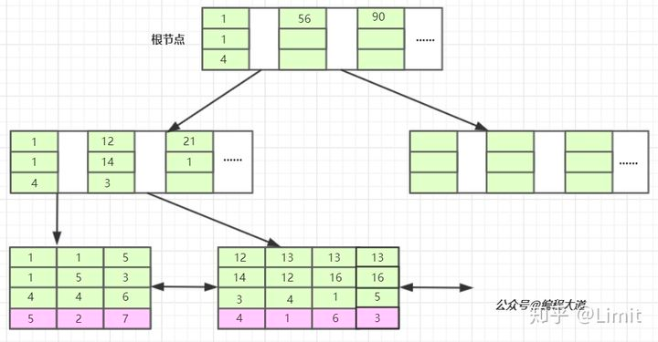

联合索引的所有索引列都出现在索引树上，并依次比较三列的大小。

### 哈希索引
哈希索引能以 O(1) 时间进行查找，但是失去了有序性
- 无法用于排序与分组
- 只支持精确查找，无法用于部分查找和范围查找
### 全文索引
MyISAM 存储引擎支持全文索引，用于查找文本中的关键词，而不是直接比较是否相等
### 空间数据索引
- MyISAM 存储引擎支持空间数据索引（R-Tree），可以用于地理数据存储。空间数据索引会从所有维度来索引数据，
- 可以有效地使用任意维度来进行组合查询
- 必须使用 GIS 相关的函数来维护数据。
### MySQL 索引失效
- `违反最左匹配原则` 最左匹配原则：最左优先，以最左边的为起点任何连续的索引都能匹配上，如不连续，则匹配不上。
- `多条件联合查询时最好建联合索引`
- 遇到`范围`查询（>、<、between、like）就会停止匹配。
  - 使用范围后的索引会失效，例如 `select * from table where a > 1 and b= 9` a索引生效，b索引不生效
- 使用`不等于`（!= 、<>）
  - 这种要看MySQL是怎么优化的，因为`=`是走索引的比如有1%的数据，而`!= `相当于查询另外99%的数据，相当于全表扫描了所以选择不走索引
- 如`计算、函数、（手动或自动）类型转换`等操作，会导致索引失效而进行全表扫描。
- in 值较多时会失效
  - 推测是查找的效率 < 全表扫描
- like以通配符开头（'%abc'）
- 索引列类型不一致

### like索引失效原理
```sql
where name like "a%"
where name like "%a%"
where name like "%a"
```
我们先来了解一下%的用途

- %放在右边，代表查询以"a"开头的数据，如：abc
- 两个%%，代表查询数据中包含"a"的数据，如：cab、cba、abc
- %放在左边，代表查询以"a"为结尾的数据，如cba

为什么%放在右边有时候能用到索引
- %放右边叫做：前缀
- %%叫做：中缀
- %放在左边叫做：后缀

没错，这里依然是最佳左前缀法则这个概念 如果索引是字符串，那么B+树是由字符串组成的。

字符串的排序方式：先按照第一个字母排序，如果第一个字母相同，就按照第二个字母排序。。。以此类推

**一、%号放右边（前缀）**

由于B+树的索引顺序，是按照首字母的大小进行排序，前缀匹配又是匹配首字母。所以可以在B+树上进行有序的查找，查找首字母符合要求的数据。所以有些时候可以用到索引。

**二、%号放左边**

是匹配字符串尾部的数据，我们上面说了排序规则，尾部的字母是没有顺序的，所以不能按照索引顺序查询，就用不到索引。

**三、两个%%号**

这个是查询任意位置的字母满足条件即可，只有首字母是进行索引排序的，其他位置的字母都是相对无序的，所以查找任意位置的字母是用不上索引的。
### ICP(index condition pushdown)
索引下推

首先，我们可以通过如下语句开启或关闭Myslq的ICP特性：
```sql
SET optimizer_switch = 'index_condition_pushdown=off'; //关闭
SET optimizer_switch = 'index_condition_pushdown=on';  //开启
```

#### 怎么理解ICP
Index Condition Pushdown (ICP)是MySQL用索引去表里取数据的一种优化。如果禁用ICP，引擎层会穿过索引在基表中寻找数据行，然后返回给MySQL Server层，再去为这些数据行进行WHERE后的条件的过滤。ICP启用，如果部分WHERE条件能使用索引中的字段，MySQL Server 会把这部分下推到引擎层。存储引擎通过使用索引条目，然后推索引条件进行评估，使用这个索引把满足的行从表中读取出。ICP能减少引擎层访问基表的次数和MySQL Server 访问存储引擎的次数。

用两张图解释下：

关闭ICP：

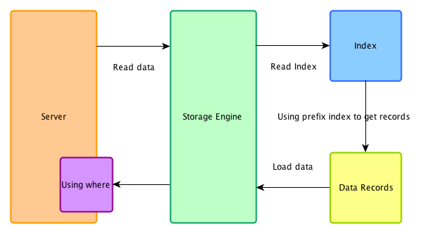

此时，索引符合之前推文提过的最左前缀原理，当多列索引的某一列是范围查询后，之后的字段便不会走索引。

开启ICP:

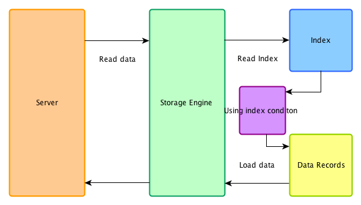

开启ICP后，查询同样符合最左前缀规则，但是当多列索引的某一列是范围查询后，之后的字段还是会被下推到存储引擎（Storage Engine）层进行条件判断，过滤出符合条件的数据后再返回给Server层。而由于在引擎层就能够过滤掉大量的数据，这样无疑能够减少了对base table和mysql server的访问次数。从而提升了性能。

#### 举例
假设我们有一个表 employees，包含以下字段：
```sql
CREATE TABLE employees (
    id INT PRIMARY KEY,
    name VARCHAR(100),
    age INT,
    department VARCHAR(50),
    salary DECIMAL(10, 2)
);
```
表上有一个联合索引：
```sql
CREATE INDEX idx_age_salary ON employees(age, salary);
```
现在我们有以下查询：

```sql
SELECT * FROM employees WHERE age = 30 AND salary > 50000;
```
传统的查询处理方式

- 索引扫描：数据库使用索引 idx_age_salary 找到所有 age = 30 的行。
- 回表查询：根据找到的行号去表中读取完整的行数据。
- 过滤：对读取的行数据应用 salary > 50000 的条件，过滤掉不满足条件的行。

在这个过程中，数据库必须读取所有 age = 30 的行，然后再进一步过滤 salary > 50000 的行，这可能会读取很多不必要的行。

索引下推的查询处理方式

- 索引扫描：数据库使用索引 idx_age_salary，但在扫描索引时就可以应用 salary > 50000 的条件。
- 回表查询：仅对满足 age = 30 且 salary > 50000 的行进行回表查询。

通过在索引扫描阶段就进行一部分过滤，索引下推减少了回表查询的次数，从而提升了查询效率。


#### ICP的使用条件
只能用于二级索引(secondary index)。

explain显示的执行计划中type值

（join 类型）为range、 ref、 eq_ref或者ref_or_null。

且查询需要访问表的整行数据，即不能直接通过二级索引的元组数据获得查询结果(索引覆盖)。

对于InnnoDB表，ICP仅用于二级索引。（ICP的目的是减少全行读取的次数，从而减少IO操作），对于innodb聚集索引，完整的记录已被读入到innodb缓冲区，在这种情况下，ICP不会减少io。

ICP可以用于MyISAM和InnnoDB存储引擎，不支持分区表（5.7将会解决这个问题）
### 索引优化
- `独立的列`
  - 在进行查询时，索引列不能是表达式的一部分，也不能是函数的参数，否则无法使用索引 `SELECT actor_id FROM sakila.actor WHERE actor_id + 1 = 5;`
- `多列索引`
  - 在需要使用多个列作为条件进行查询时，使用多列索引比使用多个单列索引性能更好 `SELECT film_id, actor_ id FROM sakila.film_actor WHERE actor_id = 1 AND film_id = 1;`
- `索引列的顺序`
  - 让选择性最强的索引列放在前面
  - 索引的选择性是指：不重复的索引值和记录总数的比值。最大值为 1，此时每个记录都有唯一的索引与其对应。选择 性越高，每个记录的区分度越高，查询效率也越高
- `前缀索引`
  - 对于 BLOB、TEXT 和 VARCHAR 类型的列，必须使用前缀索引，只索引开始的部分字符
- `覆盖索引`
  - 索引包含所有需要查询的字段的值
### MyISAM的索引
- MyISAM的索引与行记录是分开存储的，叫做非聚集索引（UnClustered Index）
- 主键索引与普通索引是两棵独立的索引B+树，通过索引列查找时，先定位到B+树的叶子节点，再通过指针定位到行记录

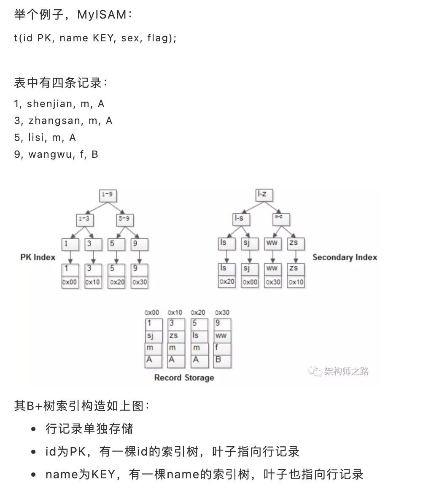

### InnoDB的索引
InnoDB的主键索引与行记录是存储在一起的，故叫做聚集索引（Clustered Index）
- 没有单独区域存储行记录
- 主键索引的叶子节点，存储主键，与对应行记录（而不是指针）
- 普通索引的叶子节点，存储主键

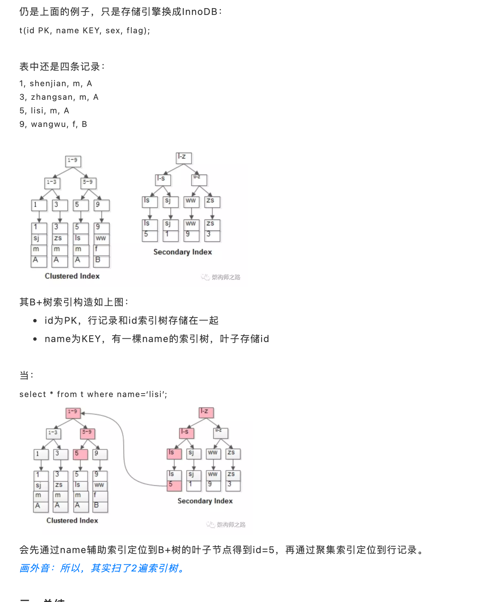


- 所以主键不宜用很长的列

### 主键和唯一索引的区别
- 主键一定是唯一性索引，唯一性索引并不一定就是主键
- 一个表中可以有多个唯一性索引，但只能有一个主键
- 主键列不允许空值，而唯一性索引列允许空值
  - 注意唯一索引的null值会使唯一索引失效，一般设置为不为空或者空字符串`''`

## 联合索引的底层组织方式
数据：

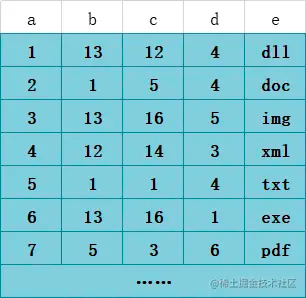

现在建立联合索引(b,c,d)

bcd联合索引在B+树上的结构图：

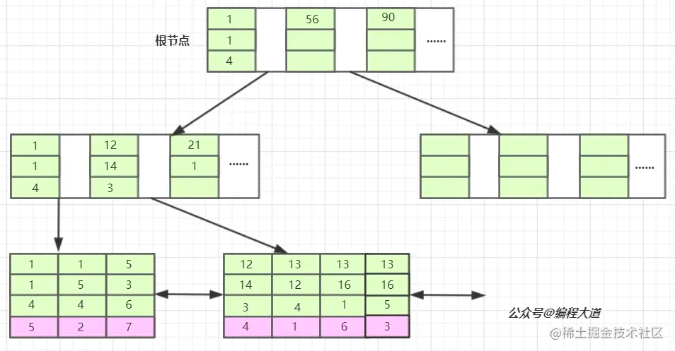


### 联合索引具体查找步骤
当我们的SQL语言可以应用到索引的时候，比如 select * from T1 where b = 12 and c = 14 and d = 3 ；也就是T1表中a列为4的这条记录。

查找步骤具体如下：

1. 存储引擎首先从根节点（一般常驻内存）开始查找，第一个索引的第一个索引列为1,12大于1，第二个索引的第一个索引列为56,12小于56，于是从这俩索引的中间读到下一个节点的磁盘文件地址（此处实际上是存在一个指针的，指向的是下一个节点的磁盘位置）。
2. 进行一次磁盘IO，将此节点值加载后内存中，然后根据第一步一样进行判断，发现 数据都是匹配的，然后根据指针将此联合索引值所在的叶子节点也从磁盘中加载后内存，此时又发生了一次磁盘IO，最终根据叶子节点中索引值关联的 主键值  。
3. 根据主键值  回表 去主键索引树（聚簇索引）中查询具体的行记录。

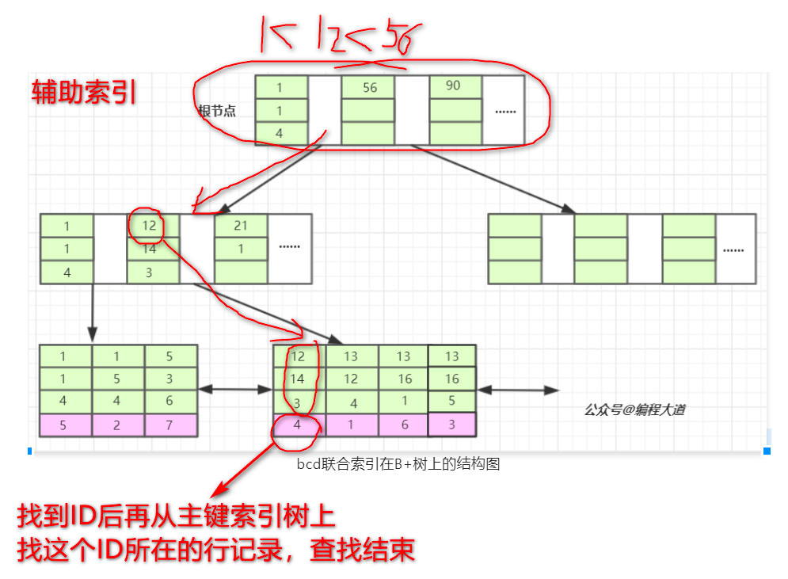