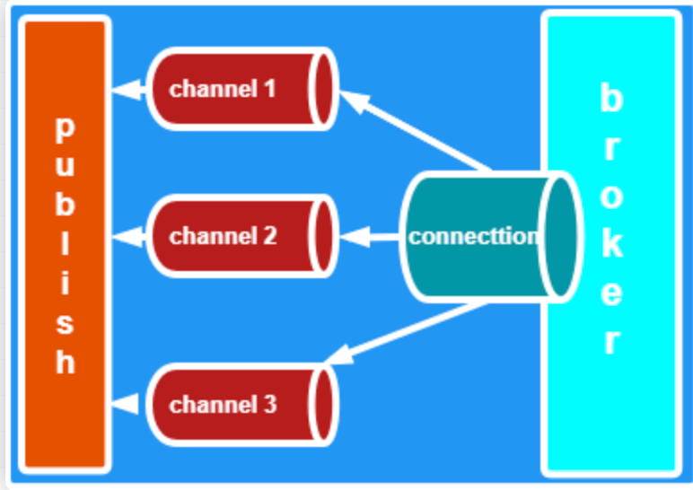
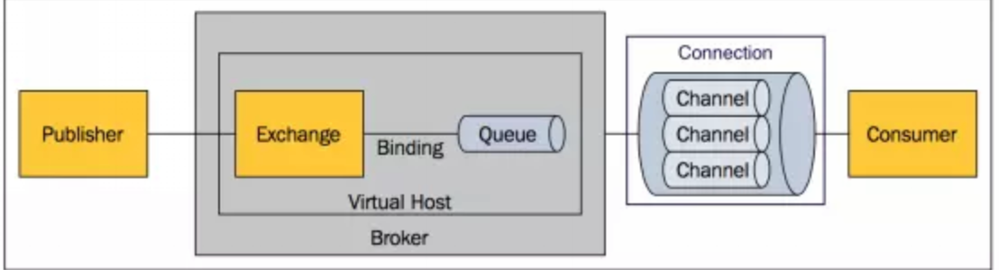
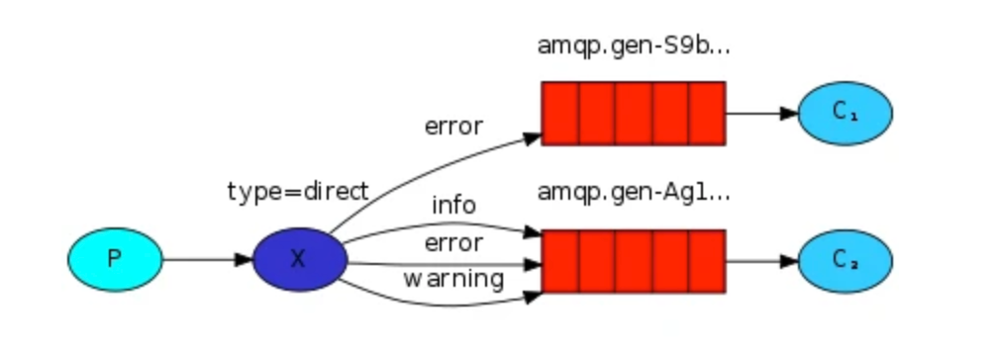
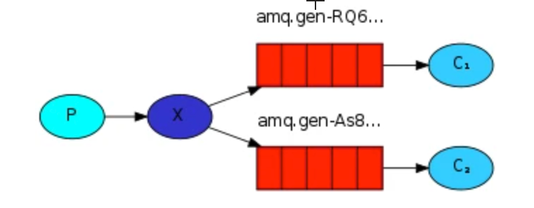
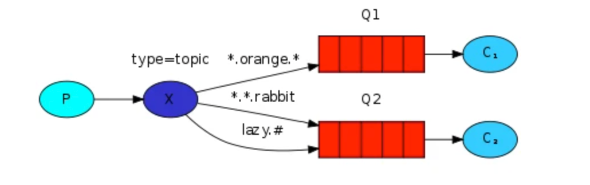

* [RabbitMQ](#rabbitmq)
    * [中间件介绍](#中间件介绍)
        * [RabbitMQ是什么？](#rabbitmq是什么)
        * [RabbitMQ特点](#rabbitmq特点)
        * [amqp](#amqp是什么amqp的3层协议)
    * [概念介绍](#概念介绍)
    * [架构图](#架构图)
    * [exchange类型](#exchange类型)
        * [Direct](#direct)
        * [Fanout](#fanout)
        * [Topic](#topic)
    * [RabbitMQ 消息持久化](#rabbitmq-消息持久化)
    * [集群](#集群)
    * [交换器无法根据自身类型和路由键找到符合条件队列时，会如何处理？](#交换器无法根据自身类型和路由键找到符合条件队列时会如何处理)
    * [RabbitMQ 的六种模式](#rabbitmq-的六种模式)
    * [死信队列应用场景](#死信队列应用场景)
    * [事务机制](#事务机制)
        * [步骤](#步骤)
        * [事务回滚](#事务回滚)
    * [Confirm模式](#confirm模式)
        * [producer端confirm模式的实现原理](#producer端confirm模式的实现原理)
        * [开启confirm模式的方法](#开启confirm模式的方法)
        * [编程模式](#编程模式)
            * [普通confirm模式](#普通confirm模式)
            * [批量confirm模式](#批量confirm模式)
            * [异步confirm模式](#异步confirm模式)
* [参考文章](#参考文章)


# RabbitMQ

## 中间件介绍

### RabbitMQ是什么？

RabbitMQ是实现了高级消息队列协议（AMQP）的开源消息代理软件（亦称面向消息的中间件）。RabbitMQ服务器是用Erlang语言编写的，而群集和故障转移是构建在开放电信平台框架上的。所有主要的编程语言均有与代理接口通讯的客户端库。

### RabbitMQ特点?

可靠性: RabbitMQ使用一些机制来保证可靠性， 如持久化、传输确认及发布确认等。

灵活的路由 : 在消息进入队列之前，通过交换器来路由消息。对于典型的路由功能， RabbitMQ 己经提供了一些内置的交换器来实现。针对更复杂的路由功能，可以将多个 交换器绑定在一起， 也可以通过插件机制来实现自己的交换器。

扩展性: 多个RabbitMQ节点可以组成一个集群，也可以根据实际业务情况动态地扩展 集群中节点。

高可用性 : 队列可以在集群中的机器上设置镜像，使得在部分节点出现问题的情况下队 列仍然可用。

多种协议: RabbitMQ除了原生支持AMQP协议，还支持STOMP， MQTT等多种消息 中间件协议。

多语言客户端 :RabbitMQ 几乎支持所有常用语言，比如 Java、 Python、 Ruby、 PHP、 C#、 JavaScript 等。

管理界面 : RabbitMQ 提供了一个易用的用户界面，使得用户可以监控和管理消息、集 群中的节点等。

令插件机制: RabbitMQ 提供了许多插件 ， 以实现从多方面进行扩展，当然也可以编写自 己的插件。

#### AMQP是什么?AMQP的3层协议？

RabbitMQ就是 AMQP 协议的 `Erlang` 的实现(当然 RabbitMQ 还支持 `STOMP2`、 `MQTT3` 等协议 ) AMQP 的模型架构 和 RabbitMQ 的模型架构是一样的，生产者将消息发送给交换器，交换器和队列绑定 。

RabbitMQ 中的交换器、交换器类型、队列、绑定、路由键等都是遵循的 AMQP 协议中相 应的概念。目前 RabbitMQ 最新版本默认支持的是 AMQP 0-9-1。

**AMQP三层协议**
```
Module Layer:协议最高层，主要定义了一些客户端调用的命令，客户端可以用这些命令实现自己的业务逻辑。

Session Layer:中间层，主要负责客户端命令发送给服务器，再将服务端应答返回客户端，提供可靠性同步机制和错误处理。

TransportLayer:最底层，主要传输二进制数据流，提供帧的处理、信道服用、错误检测和数据表示等。
```

## 概念介绍
- Broker：简单来说就是消息队列服务器实体。
- Exchange：消息交换机，它指定消息按什么规则，路由到哪个队列。
- Queue：消息队列载体，每个消息都会被投入到一个或多个队列。
- Binding：绑定，它的作用就是把exchange和queue按照路由规则绑定起来。
- Routing Key：路由关键字，exchange根据这个关键字进行消息投递。
- vhost：虚拟主机，一个broker里可以开设多个vhost，用作不同用户的权限分离。
    - 出于多租户和安全因素设计的，把AMQP的基本组件划分到一个虚拟的分组中，类似于网络中的namespace概念。当多个不同的用户使用同一个RabbitMQ server提供的服务时，可以划分出多个vhost，每个用户在自己的vhost创建exchange／queue等
- producer：消息生产者，就是投递消息的程序。
    - 消息生产者，投递消息
    - 消息一般包含两个部分：消息体（payload)和标签(Label)
    
    #### 生产者消息运转的流程？
    ```
    1. `Producer`先连接到Broker,建立连接Connection,开启一个信道(Channel)。
    2. `Producer`声明一个交换器并设置好相关属性。
    3. `Producer`声明一个队列并设置好相关属性。
    4. `Producer`通过路由键将交换器和队列绑定起来。
    5. `Producer`发送消息到`Broker`,其中包含路由键、交换器等信息。
    6. 相应的交换器根据接收到的路由键查找匹配的队列。
    7. 如果找到，将消息存入对应的队列，如果没有找到，会根据生产者的配置丢弃或者退回给生产者。
    8. 关闭信道。
    9. 管理连接。
    ```
    #### 生产者如何将消息可靠投递到RabbitMQ？
    ```
    1. Client发送消息给MQ
    2. MQ将消息持久化后，发送Ack消息给Client，此处有可能因为网络问题导致Ack消息无法发送到Client，那么Client在等待超时后，会重传消息；
    3. Client收到Ack消息后，认为消息已经投递成功。
    ```
- consumer：消息消费者，就是接受消息的程序。
    #### 消费者接收消息过程？
    ```
    1. `Producer`先连接到`Broker`,建立连接`Connection`,开启一个信道(`Channel`)。
    2. 向`Broker`请求消费响应的队列中消息，可能会设置响应的回调函数。
    3. 等待`Broker`回应并投递相应队列中的消息，接收消息。
    4. 消费者确认收到的消息,`ack`。
    5. `RabbitMq`从队列中删除已经确定的消息。
    6. 关闭信道。
    7. 关闭连接。
    ```
    ##### RabbitMQ如何将消息可靠投递到消费者？
    ```
    1. MQ将消息push给Client（或Client来pull消息）
    2. Client得到消息并做完业务逻辑
    3. Client发送Ack消息给MQ，通知MQ删除该消息，此处有可能因为网络问题导致Ack失败，那么Client会重复消息，这里就引出消费幂等的问题；
    4. MQ将已消费的消息删除。
    ```
- channel：消息通道，在客户端的每个连接里，可建立多个channel，每个channel代表一个会话任务。
- connection
- 
    - 什么是connection
        - connection 是 生产者或消费者与 RabbitMQ Broker 建立的连接，是一个TCP连接
        - 一旦 TCP 连接建立起来，客户端紧接着可以创建一个 AMQP 信道（Channel），每个信道都会被指派一个唯一的 ID
        - 信道是建立在 Connection 之上的虚拟连接，多个信道复用一个TCP连接，可以减少性能开销，同时也便于管理
        - 因为一个应用需要向RabbitMQ 中生成或者消费消息的话，都要建一个TCP连接，TCP连接开销非常大，如果遇到使用高峰，性能瓶颈也随之显现
    - 信道复用连接优势
        - 复用TCP连接，减少性能开销，便于管理
        - RabbitMQ 保障每一个信道的私密性
    - 当每个信道的流量不是很大时，复用单一的 Connection 可以在产生性能瓶颈的情况下有效地节省 TCP 连接资源
        - 信道本身的流量很大时，这时候多个信道复用一个 Connection 就会产生性能瓶颈，进而使整体的流量被限制了，此时就需要开辟多个 Connection，将这些信道均摊到这些 Connection 中
    ### 问题：说说Broker服务节点、Queue队列、Exchange交换器？
    ```
    答案：
    - Broker可以看做RabbitMQ的服务节点。一般请下一个Broker可以看做一个RabbitMQ服务器。
    - Queue:RabbitMQ的内部对象，用于存储消息。多个消费者可以订阅同一队列，这时队列中的消息会被平摊（轮询）给多个消费者进行处理。
    - Exchange:生产者将消息发送到交换器，由交换器将消息路由到一个或者多个队列中。当路由不到时，或返回给生产者或直接丢弃。
    ```
    ### 如何保证RabbitMQ消息队列的高可用?

    **回答：**

    RabbitMQ 有三种模式：`单机模式`，`普通集群模式`，`镜像集群模式`。

    **单机模式**：就是demo级别的，一般就是你本地启动了玩玩儿的，没人生产用单机模式

    **普通集群模式**：意思就是在多台机器上启动多个RabbitMQ实例，每个机器启动一个。

    **镜像集群模式**：这种模式，才是所谓的RabbitMQ的高可用模式，跟普通集群模式不一样的是，你创建的queue，无论元数据(元数据指RabbitMQ的配置数据)还是queue里的消息都会存在于多个实例上，然后每次你写消息到queue的时候，都会自动把消息到多个实例的queue里进行消息同步。

## 架构图

## exchange类型
### Direct

  
点对点模式，根据route_key精确匹配
### Fanout

  
广播模式，将消息发送到与该exchange绑定的所有queue上
### Topic


- 模式匹配，根据route_key模式匹配
- 以上图中的配置为例，routingKey=”quick.orange.rabbit”的消息会同时路由到Q1与Q2，routingKey=”lazy.orange.fox”的消息会路由到Q1，routingKey=”lazy.brown.fox”的消息会路由到Q2，routingKey=”lazy.pink.rabbit”的消息会路由到Q2（只会投递给Q2一次，虽然这个routingKey与Q2的两个bindingKey都匹配）；routingKey=”quick.brown.fox”、routingKey=”orange”、routingKey=”quick.orange.male.rabbit”的消息将会被丢弃，因为它们没有匹配任何bindingKey。
## RabbitMQ 消息持久化
- 默认情况下重启服务器会导致消息丢失
- 持久化需要满足如下三个条件才可以恢复 RabbitMQ 的数据
    - 投递消息的时候 durable 设置为 true，消息持久化
    - 消息已经到达持久化交换器上
    - 消息已经到达持久化的队列上
- 持久化的工作原理
    - Rabbit 会将持久化消息写入磁盘上的持久化日志文件，等消息被消费之后，Rabbit 会把这条消息标识为等待垃圾回收
## 集群
- 普通集群模式
    - 意思就是在多台机器上启动多个 RabbitMQ 实例，每个机器启动一个。你创建的 queue，只会放在一个 RabbitMQ 实例上，但是每个实例都同步 queue 的元数据（元数据可以认为是 queue 的一些配置信息，通过元数据，可以找到 queue 所在实例）。你消费的时候，实际上如果连接到了另外一个实例，那么那个实例会从 queue 所在实例上拉取数据过来。这方案主要是提高吞吐量的，就是说让集群中多个节点来服务某个 queue 的读写操作
    - 缺点:一个服务节点宕机了，数据就丢失了
- 镜像集群模式
    - 这种模式，才是所谓的 RabbitMQ 的高可用模式。跟普通集群模式不一样的是，在镜像集群模式下，你创建的 queue，无论元数据还是 queue 里的消息都会存在于多个实例上，就是说，每个 RabbitMQ 节点都有这个 queue 的一个完整镜像，包含 queue 的全部数据的意思。然后每次你写消息到 queue 的时候，都会自动把消息同步到多个实例的 queue 上。RabbitMQ 有很好的管理控制台，就是在后台新增一个策略，这个策略是镜像集群模式的策略，指定的时候是可以要求数据同步到所有节点的，也可以要求同步到指定数量的节点，再次创建 queue 的时候，应用这个策略，就会自动将数据同步到其他的节点上去了。这样的话，好处在于，你任何一个机器宕机了，没事儿，其它机器（节点）还包含了这个 queue 的完整数据，别的 consumer 都可以到其它节点上去消费数据。
    - 坏处在于，第一，这个性能开销也太大了吧，消息需要同步到所有机器上，导致网络带宽压力和消耗很重！RabbitMQ 一个 queue 的数据都是放在一个节点里的，镜像集群下，也是每个节点都放这个 queue 的完整数据。
        - 性能开销大
        - 没有扩展可言
## 交换器无法根据自身类型和路由键找到符合条件队列时，会如何处理？
- 我们对交换机设置参数的时候，有一个标志叫做 mandatory
- 当mandatory标志位设置为true时
- 如果exchange根据自身类型和消息routingKey无法找到一个合适的queue存储消息，那么broker就会调用basic.return方法将消息返还给生产者
- 当mandatory设置为false时
- 前置条件和上述保持一致，此时 broker会直接将消息丢弃
## RabbitMQ 的六种模式
- `simple模式`（即最简单的收发模式） 简单的生产者生产消息，放入队列，消费者消费消息
- `work` 当生产者生产消息的速度大于消费者消费的速度，就要考虑用 work 工作模式，这样能提高处理速度提高负载
- `publish`
    - 1、每个消费者监听自己的队列；
    - 2、生产者将消息发给broker，由交换机将消息转发到绑定此交换机的每个队列，每个绑定交换机的队列都将接收到消息。
- `routing`
    - 消息生产者将消息发送给交换机按照路由判断,路由是字符串(info) 当前产生的消息携带路由字符(对象的方法),交换机根据路由的key
    - 只能匹配上路由key对应的消息队列,对应的消费者才能消费消息
- `topic` 话题模式，一个消息被多个消费者获取，消息的目标 queue 可用 BindingKey 以通配符

## 死信队列应用场景
一般用在较为重要的业务队列中，确保未被正确消费的消息不被丢弃，一般发生消费异常可能原因主要有由于消息信息本身存在错误导致处理异常，处理过程中参数校验异常，或者因网络波动导致的查询异常等等，当发生异常时，当然不能每次通过日志来获取原消息，然后让运维帮忙重新投递消息（没错，以前就是这么干的= =）。通过配置死信队列，可以让未正确处理的消息暂存到另一个队列中，待后续排查清楚问题后，编写相应的处理代码来处理死信消息，这样比手工恢复数据要好太多了。

## 事务机制

RabbitMQ中与事务机制有关的方法有三个：txSelect(), txCommit()以及txRollback()
- txSelect用于将当前channel设置成transaction模式
- txCommit用于提交事务
- txRollback用于回滚事务

在通过txSelect开启事务之后，我们便可以发布消息给broker代理服务器了，如果txCommit提交成功了，则消息一定到达了broker了，如果在txCommit执行之前broker异常崩溃或者由于其他原因抛出异常，这个时候我们便可以捕获异常通过txRollback回滚事务了。

### 步骤
1. client发送Tx.Select
2. broker发送Tx.Select-Ok(之后publish)
3. client发送Tx.Commit
4. broker发送Tx.Commit-Ok
### 事务回滚
```java
try {
    channel.txSelect();
    channel.basicPublish(exchange, routingKey, MessageProperties.PERSISTENT_TEXT_PLAIN, msg.getBytes());
    int result = 1 / 0;
    channel.txCommit();
} catch (Exception e) {
    e.printStackTrace();
    channel.txRollback();
}
```
## Confirm模式
上面我们介绍了RabbitMQ可能会遇到的一个问题，即生成者不知道消息是否真正到达broker，随后通过AMQP协议层面为我们提供了事务机制解决了这个问题，但是采用事务机制实现会降低RabbitMQ的消息吞吐量，那么有没有更加高效的解决方式呢？答案是采用Confirm模式。

### producer端confirm模式的实现原理

生产者将信道设置成confirm模式，一旦信道进入confirm模式，所有在该信道上面发布的消息都会被指派一个唯一的ID(从1开始)，一旦消息被投递到所有匹配的队列之后，broker就会发送一个确认给生产者（包含消息的唯一ID）,这就使得生产者知道消息已经正确到达目的队列了，如果消息和队列是可持久化的，那么确认消息会将消息写入磁盘之后发出，broker回传给生产者的确认消息中deliver-tag域包含了确认消息的序列号，此外broker也可以设置basic.ack的multiple域，表示到这个序列号之前的所有消息都已经得到了处理。

confirm模式最大的好处在于他是异步的，一旦发布一条消息，生产者应用程序就可以在等信道返回确认的同时继续发送下一条消息，当消息最终得到确认之后，生产者应用便可以通过回调方法来处理该确认消息，如果RabbitMQ因为自身内部错误导致消息丢失，就会发送一条nack消息，生产者应用程序同样可以在回调方法中处理该nack消息。

在channel 被设置成 confirm 模式之后，所有被 publish 的后续消息都将被 confirm（即 ack） 或者被nack一次。但是没有对消息被 confirm 的快慢做任何保证，并且同一条消息不会既被 confirm又被nack 。

###  开启confirm模式的方法
已经在transaction事务模式的channel是不能再设置成confirm模式的，即这两种模式是不能共存的。

生产者通过调用channel的confirmSelect方法将channel设置为confirm模式

核心代码:
```java
//生产者通过调用channel的confirmSelect方法将channel设置为confirm模式  
channel.confirmSelect(); 
```
### 编程模式

对于固定消息体大小和线程数，如果消息持久化，生产者confirm(或者采用事务机制)，消费者ack那么对性能有很大的影响.

消息持久化的优化没有太好方法，用更好的物理存储（SAS, SSD, RAID卡）总会带来改善。生产者confirm这一环节的优化则主要在于客户端程序的优化之上。归纳起来，客户端实现生产者confirm有三种编程方式：

- 普通confirm模式：每发送一条消息后，调用waitForConfirms()方法，等待服务器端confirm。实际上是一种串行confirm了。
- 批量confirm模式：每发送一批消息后，调用waitForConfirms()方法，等待服务器端confirm。
- 异步confirm模式：提供一个回调方法，服务端confirm了一条或者多条消息后Client端会回调这个方法。

事务模式性能是最差的，普通confirm模式性能比事务模式稍微好点，但是和批量confirm模式还有异步confirm模式相比，还是小巫见大巫。批量confirm模式的问题在于confirm之后返回false之后进行重发这样会使性能降低，异步confirm模式(async)编程模型较为复杂，至于采用哪种方式，那是仁者见仁智者见智了

#### 普通confirm模式
```java
package com.hrabbit.rabbitmq.confirm;

import com.hrabbit.rabbitmq.utils.ConnectionUtils;
import com.rabbitmq.client.Channel;
import com.rabbitmq.client.Connection;
import org.junit.jupiter.api.Test;

import java.io.IOException;
import java.util.concurrent.TimeoutException;

/**
 * @Auther: hrabbit
 * @Date: 2018-07-02 下午3:20
 * @Description:
 */
public class SendConfirm {
    private static final String QUEUE_NAME = "QUEUE_simple_confirm";

    @Test
    public void sendMsg() throws IOException, TimeoutException, InterruptedException {
        /* 获取一个连接 */
        Connection connection = ConnectionUtils.getConnection();
        /* 从连接中创建通道 */
        Channel channel = connection.createChannel();
        channel.queueDeclare(QUEUE_NAME, false, false, false, null);
        //生产者通过调用channel的confirmSelect方法将channel设置为confirm模式
        channel.confirmSelect();
        String msg = "Hello   QUEUE !";
        channel.basicPublish("", QUEUE_NAME, null, msg.getBytes());
        if (!channel.waitForConfirms()) {
            System.out.println("send message 失败");
        } else {
            System.out.println(" send messgae ok ...");
        }
        channel.close();
        connection.close();
    }
}
```
#### 批量confirm模式
批量confirm模式稍微复杂一点，客户端程序需要定期（每隔多少秒）或者定量（达到多少条）或者两则结合起来publish消息，然后等待服务器端confirm, 相比普通confirm模式，批量极大提升confirm效率，但是问题在于一旦出现confirm返回false或者超时的情况时，客户端需要将这一批次的消息全部重发，这会带来明显的重复消息数量，并且，当消息经常丢失时，批量confirm性能应该是不升反降的。
```java
package com.hrabbit.rabbitmq.confirm;

import com.hrabbit.rabbitmq.utils.ConnectionUtils;
import com.rabbitmq.client.Channel;
import com.rabbitmq.client.Connection;
import org.junit.jupiter.api.Test;

import java.io.IOException;
import java.util.concurrent.TimeoutException;

/**
 * @Auther: hrabbit
 * @Date: 2018-07-02 下午3:25
 * @Description:
 */
public class SendbatchConfirm {

    private static final String QUEUE_NAME = "QUEUE_simple_confirm";

    @Test
    public void sendMsg() throws IOException, TimeoutException, InterruptedException {
        /* 获取一个连接 */
        Connection connection = ConnectionUtils.getConnection();
        /* 从连接中创建通道 */
        Channel channel = connection.createChannel();
        channel.queueDeclare(QUEUE_NAME, false, false, false, null);
        //生产者通过调用channel的confirmSelect方法将channel设置为confirm模式
        channel.confirmSelect();

        //生产者通过调用channel的confirmSelect方法将channel设置为confirm模式
        channel.confirmSelect();
        String msg = "Hello   QUEUE !";
        for (int i = 0; i < 10; i++) {
            channel.basicPublish("", QUEUE_NAME, null,msg.getBytes());
        }

        if (!channel.waitForConfirms()) {
            System.out.println("send message error");
        } else {
            System.out.println(" send messgae ok ...");
        }
        channel.close();
        connection.close();
    }
}

```
#### 异步confirm模式
Channel对象提供的ConfirmListener()回调方法只包含deliveryTag（当前Chanel发出的消息序号），我们需要自己为每一个Channel维护一个unconfirm的消息序号集合，每publish一条数据，集合中元素加1，每回调一次handleAck方法，unconfirm集合删掉相应的一条（multiple=false）或多条（multiple=true）记录。从程序运行效率上看，这个unconfirm集合最好采用有序集合SortedSet存储结构。实际上，SDK中的waitForConfirms()方法也是通过SortedSet维护消息序号的。
```java
package com.hrabbit.rabbitmq.confirm;

import com.hrabbit.rabbitmq.utils.ConnectionUtils;
import com.rabbitmq.client.Channel;
import com.rabbitmq.client.ConfirmListener;
import com.rabbitmq.client.Connection;

import java.io.IOException;
import java.util.Collections;
import java.util.SortedSet;
import java.util.TreeSet;
import java.util.concurrent.TimeoutException;

/**
 * @Auther: hrabbit
 * @Date: 2018-07-02 下午3:28
 * @Description:
 */
public class SendAync {

    private static final String QUEUE_NAME = "QUEUE_simple_confirm_aync";
    public static void main(String[] args) throws IOException, TimeoutException {
        /* 获取一个连接 */
        Connection connection = ConnectionUtils.getConnection();
        /* 从连接中创建通道 */
        Channel channel = connection.createChannel();
        channel.queueDeclare(QUEUE_NAME, false, false, false, null);
        //生产者通过调用channel的confirmSelect方法将channel设置为confirm模式
        channel.confirmSelect();
        final SortedSet<Long> confirmSet = Collections.synchronizedSortedSet(new TreeSet<Long>());
        channel.addConfirmListener(new ConfirmListener() {
            //每回调一次handleAck方法，unconfirm集合删掉相应的一条（multiple=false）或多条（multiple=true）记录。
            public void handleAck(long deliveryTag, boolean multiple) throws IOException {
                if (multiple) {
                    System.out.println("--multiple--");
                    confirmSet.headSet(deliveryTag + 1).clear();
                    //用一个SortedSet, 返回此有序集合中小于end的所有元素。
                    } else {
                    System.out.println("--multiple false--");
                    confirmSet.remove(deliveryTag);
                }
            }
            public void handleNack(long deliveryTag, boolean multiple) throws IOException {
                System.out.println("Nack, SeqNo: " + deliveryTag + ", multiple: " + multiple);
                if (multiple) {
                    confirmSet.headSet(deliveryTag + 1).clear();
                } else {
                    confirmSet.remove(deliveryTag);
                }
            }
        });
        String msg = "Hello   QUEUE !";
        while (true) {
            long nextSeqNo = channel.getNextPublishSeqNo();
            channel.basicPublish("", QUEUE_NAME, null, msg.getBytes());
            confirmSet.add(nextSeqNo);
        }
    }
}
```

# 参考文章
- https://mfrank2016.github.io/breeze-blog/2020/05/04/rabbitmq/rabbitmq-how-to-use-dead-letter-queue/
- https://blog.csdn.net/u013256816/article/details/55515234
- https://www.jianshu.com/p/801456df3930