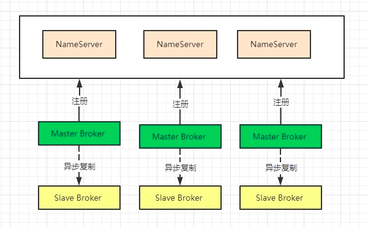
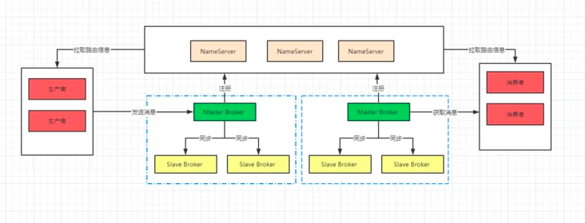

* [RocketMQ](#rocketmq)
* [中间件介绍](#中间件介绍)
        * [RocketMQ是什么？](#amqp是什么)
        * [RabbitMQ特点](#rabbitmq特点)
  * [架构图](#架构图)
* [组件](#组件)
  * [NameServer](#nameserver)
  * [Broker](#broker)
  * [Producer](#producer)
  * [Consumer](#consumer)
* [消息特性](#消息特性)
* [消息功能](#消息功能)
* [rocket的事务实现机制](#rocket的事务实现机制)
  * [概览](#概览)
  * [交互流程](#交互流程)
* [Broker 集群部署架构](#broker-集群部署架构)
  * [多 Master 模式](#多-master-模式)
  * [多 Master 多 Salve - 异步复制 模式](#多-master-多-salve---异步复制-模式)
  * [多 Master 多 Salve - 同步双写 模式](#多-master-多-salve---同步双写-模式)
  * [Dledger 模式](#dledger-模式)
* [参考文章](#参考文章)


# RocketMQ

## 中间件介绍
### RocketMQ是什么？	

RocketMQ 是阿里巴巴开源的分布式消息中间件。支持事务消息、顺序消息、批量消息、定时消息、消息回溯等。它里面有几个区别于标准消息中件间的概念，如Group、Topic、Queue等。系统组成则由Producer、Consumer、Broker、NameServer等。

**RocketMQ 特点**

- 是一个队列模型的消息中间件，具有高性能、高可靠、高实时、分布式等特点
- Producer、Consumer、队列都可以分布式
- Producer 向一些队列轮流发送消息，队列集合称为 Topic，Consumer 如果做广播消费，则一个 Consumer 实例消费这个 Topic 对应的所有队列，如果做集群消费，则多个 Consumer 实例平均消费这个 Topic 对应的队列集合
- 能够保证严格的消息顺序
- 支持拉（pull）和推（push）两种消息模式
- 高效的订阅者水平扩展能力
- 实时的消息订阅机制
- 亿级消息堆积能力
- 支持多种消息协议，如 JMS、OpenMessaging 等
- 较少的依赖

## RocketMQ消费模式有几种？

消费模型由Consumer决定，消费维度为Topic。

1、集群消费

* 一条消息只会被同Group中的一个Consumer消费

* 多个Group同时消费一个Topic时，每个Group都会有一个Consumer消费到数据

2、广播消费

消息将对一 个Consumer Group 下的各个 Consumer 实例都消费一遍。即即使这些 Consumer 属于同一个Consumer Group ，消息也会被 Consumer Group 中的每个 Consumer 都消费一次。


## 架构图

# 组件

## RocketMQ由哪些角色组成，每个角色作用和特点是什么？

| 角色       | 作用                                                         |
| ---------- | ------------------------------------------------------------ |
| Nameserver | 无状态，动态列表；这也是和zookeeper的重要区别之一。zookeeper是有状态的。 |
| Producer   | 消息生产者，负责发消息到Broker。                             |
| Broker     | 就是MQ本身，负责收发消息、持久化消息等。                     |
| Consumer   | 消息消费者，负责从Broker上拉取消息进行消费，消费完进行ack。  |

### NameServer
NameServer 是一个功能齐全的服务器，主要包括两个功能：
- Broker 管理，NameServer接受来自 Broker 集群的注册，并提供心跳机制来检查 Broker 是否处于活动状态。
- 路由管理，每个 NameServer 将保存有关代理集群的完整路由信息和客户端查询的队列信息。
### Broker
Broker主要负责消息的存储、投递和查询以及服务高可用保证，为了实现这些功能，Broker包含了以下几个重要子模块
- Remoting Module远程模块，代理的入口，处理来自客户端的请求。
- Client Manager，管理客户端（Producer/Consumer），维护Consumer的topic订阅。
- Store Service存储服务，提供简单的 API 来存储或查询物理磁盘中的消息。
- HA Service，提供主代理和从代理之间的数据同步功能。
- Index Service索引服务，通过指定的key为消息建立索引，并提供快速的消息查询。
#### 问题：broker如何处理拉取请求的？
回答：
```
Consumer首次请求Broker

- Broker中是否有符合条件的消息
```
```
- 有 

- - 响应Consumer
  - 等待下次Consumer的请求
```
```
- 没有

- - DefaultMessageStore#ReputMessageService#run方法
  - PullRequestHoldService 来Hold连接，每个5s执行一次检查pullRequestTable有没有消息，有的话立即推送
  - 每隔1ms检查commitLog中是否有新消息，有的话写入到pullRequestTable
  - 当有新消息的时候返回请求
  - 挂起consumer的请求，即不断开连接，也不返回数据
  - 使用consumer的offset，
  ```

### Producer
生产者 消息发布的角色，支持分布式集群方式部署。Producer通过MQ的负载均衡模块选择相应的Broker集群队列进行消息投递，投递的过程支持快速失败并且低延迟
### Consumer
消费者 消息消费的角色，支持分布式集群方式部署。支持以push推，pull拉两种模式对消息进行消费。同时也支持集群方式和广播方式的消费，它提供实时消息订阅机制，可以满足大多数用户的需求。

# 消息特性

`消息重试`：在消费者返回消息重试的响应后，消息队列RocketMQ版会按照相应的重试规则进行消息重投。

`至少投递一次（At-least-once）`：消息队列RocketMQ版保证消息成功被消费一次。消息队列RocketMQ版的分布式特点和瞬变的网络条件，或者用户应用重启发布的情况下，可能导致消费者收到重复的消息。开发人员应将其应用程序设计为多次处理一条消息不会产生任何错误或不一致性。消息幂等最佳实践请参见消费幂等。

`消息过滤`：消息队列RocketMQ版支持设置消息属性给消息进行分类，消息队列RocketMQ版服务端会根据您订阅消息时设置的过滤条件对消息进行过滤，您将只消费到需要关注的消息。
# 消息功能

`消息查询`：消息队列RocketMQ版提供了三种消息查询的方式，分别是按Message ID、Message Key以及Topic查询。

`查询消息轨迹`：通过消息轨迹，能清晰定位消息从生产者发出，经由消息队列RocketMQ版服务端，投递给消息消费者的完整链路，方便定位排查问题。

`集群消费和广播消费`：当使用集群消费模式时，消息队列RocketMQ版认为任意一条消息只需要被消费者集群内的任意一个消费者处理即可；当使用广播消费模式时，消息队列RocketMQ版会将每条消息推送给消费者集群内所有注册过的消费者，保证消息至少被每台机器消费一次。

`重置消费位点`：根据时间或位点重置消费进度，允许用户进行消息回溯或者跳过堆积的消息从最新位点消费。

`死信队列`：将无法正常消费的消息储存到特殊的死信队列供后续处理。

`资源报表`：消息生产和消费数据的统计功能。通过该功能，您可查询在一段时间范围内发送至某Topic的消息总量或者TPS（消息生产数据），也可查询在一个时间段内某Topic投递给某Group ID的消息总量或TPS（消息消费数据）。

`监控报警`：您可使用消息队列RocketMQ版提供的监控报警功能，监控某Group ID订阅的某Topic的消息消费状态并接收报警短信，帮助您实时掌握消息消费状态，以便及时处理消费异常。

### 问题：RocketMQ消费消息是push还是pull？
回答：
```
RocketMQ没有真正意义的push，都是pull，虽然有push类，但实际底层实现采用的是**长轮询机制**，即拉取方式

> broker端属性 longPollingEnable 标记是否开启长轮询。默认开启
```
#### 追问：为什么要主动拉取消息而不使用事件监听方式？
回答：
```
事件驱动方式是建立好长连接，由事件（发送数据）的方式来实时推送。

如果broker主动推送消息的话有可能push速度快，消费速度慢的情况，那么就会造成消息在consumer端堆积过多，同时又不能被其他consumer消费的情况。而pull的方式可以根据当前自身情况来pull，不会造成过多的压力而造成瓶颈。所以采取了pull的方式。
```

# rocket的事务实现机制
RocketMQ提供了事务消息的功能，采用2PC(两段式协议)+补偿机制（事务回查）的分布式事务功能，通过消息队列 RocketMQ 版事务消息能达到分布式事务的最终一致。

## 概览
- `半事务消息`：
暂不能投递的消息，发送方已经成功地将消息发送到了消息队列 RocketMQ 版服务端，但是服务端未收到生产者对该消息的二次确认，此时该消息被标记成“暂不能投递”状态，处于该种状态下的消息即半事务消息。
- `消息回查`：
由于网络闪断、生产者应用重启等原因，导致某条事务消息的二次确认丢失，消息队列 RocketMQ 版服务端通过扫描发现某条消息长期处于“半事务消息”时，需要主动向消息生产者询问该消息的最终状态（Commit 或是 Rollback），该询问过程即消息回查。

## 交互流程


事务消息发送步骤如下：
1. 发送方将半事务消息发送至消息队列 RocketMQ 版服务端。
2. 消息队列 RocketMQ 版服务端将消息持久化成功之后，向发送方返回 Ack确认消息已经发送成功，此时消息为半事务消息。
3. 发送方开始执行本地事务逻辑。
4. 发送方根据本地事务执行结果向服务端提交二次确认（Commit 或是 Rollback），服务端收到 Commit 状态则将半事务消息标记为可投递，订阅方最终将收到该消息；服务端收到 Rollback 状态则删除半事务消息，订阅方将不会接受该消息。

事务消息回查步骤如下：
1. 在断网或者是应用重启的特殊情况下，上述步骤 4 提交的二次确认最终未到达服务端，经过固定时间后服务端将对该消息发起消息回查。
2. 发送方收到消息回查后，需要检查对应消息的本地事务执行的最终结果。
3. 发送方根据检查得到的本地事务的最终状态再次提交二次确认，服务端仍按照步骤 4 对半事务消息进行操作。

总体而言RocketMQ事务消息分为两条主线
- 发送流程：发送half message(半消息)，执行本地事务，发送事务执行结果
- 定时任务回查流程：MQ定时任务扫描半消息，回查本地事务，发送事务执行结果

# Broker 集群部署架构
开始部署 RocketMQ 之前，我们也做过一些功课，对现在 RocketMQ 支持的集群方案做了一些整理，目前 RocketMQ 支持的集群部署方案有以下4种：

- 多Master模式：一个集群无Slave，全是Master，例如2个Master或者3个Master
- 多Master多Slave模式-异步复制：每个Master配置一个Slave，有多对Master-Slave，HA采用异步复制方式，主备有短暂消息延迟（毫秒级）
- 多Master多Slave模式-同步双写：每个Master配置一个Slave，有多对Master-Slave，HA采用同步双写方式，即只有主备都写成功，才向应用返回成功
- Dledger部署：每个Master配置二个 Slave 组成 Dledger Group，可以有多个 Dledger Group，由 Dledger 实现 Master 选举

## 多 Master 模式
一个 RocketMQ 集群中所有的节点都是 Master 节点，每个 Master 节点没有 Slave 节点。


这种模式的优缺点如下：

- 优点：配置简单，单个Master宕机或重启维护对应用无影响，在磁盘配置为RAID10时，即使机器宕机不可恢复情况下，由于RAID10磁盘非常可靠，消息也不会丢（异步刷盘丢失少量消息，同步刷盘一条不丢），性能最高；
- 缺点：单台机器宕机期间，这台机器上未被消费的消息在机器恢复之前不可订阅，消息实时性会受到影响。

## 多 Master 多 Salve - 异步复制 模式
每个Master配置一个Slave，有多对Master-Slave，HA采用异步复制方式，主备有短暂消息延迟（毫秒级）



这种模式的优缺点如下：

- 优点：即使磁盘损坏，消息丢失的非常少，且消息实时性不会受影响，同时Master宕机后，消费者仍然可以从Slave消费，而且此过程对应用透明，不需要人工干预，性能同多Master模式几乎一样；
- 缺点：Master宕机，磁盘损坏情况下会丢失少量消息。

## 多 Master 多 Salve - 同步双写 模式
每个Master配置一个Slave，有多对Master-Slave，HA采用同步双写方式，即只有主备都写成功，才向应用返回成功


这种模式的优缺点如下：

- 优点：数据与服务都无单点故障，Master宕机情况下，消息无延迟，服务可用性与数据可用性都非常高；
- 缺点：性能比异步复制模式略低（大约低10%左右），发送单个消息的RT会略高，且目前版本在主节点宕机后，备机不能自动切换为主机。

## Dledger 模式
RocketMQ 4.5 以前的版本大多都是采用 Master-Slave 架构来部署，能在一定程度上保证数据的不丢失，也能保证一定的可用性。

但是那种方式 的缺陷很明显，最大的问题就是当 Master Broker 挂了之后 ，没办法让 Slave Broker 自动 切换为新的 Master Broker，需要手动更改配置将 Slave Broker 设置为 Master Broker，以及重启机器，这个非常麻烦。

在手式运维的期间，可能会导致系统的不可用。

使用 Dledger 技术要求至少由三个 Broker 组成 ，一个 Master 和两个 Slave，这样三个 Broker 就可以组成一个 Group ，也就是三个 Broker 可以分组来运行。一但 Master 宕机，Dledger 就可以从剩下的两个 Broker 中选举一个 Master 继续对外提供服务。


使用 Dledger 方式最终的逻辑部署图如下



**高可用**

三个 NameServer 极端情况下，确保集群的可用性，任何两个 NameServer 挂掉也不会影响信息的整体使用。

在上图中每个 Master Broker 都有两个 Slave Broker，这样可以保证可用性，如在同一个 Dledger Group 中 Master Broker 宕机后，Dledger 会去行投票将剩下的节点晋升为 Master Broker。

**高并发**

假设某个Topic的每秒十万消息的写入， 可以增加 Master Broker 然后十万消息的写入会分别分配到不同的 Master Broker ，如有5台 Master Broker 那每个 Broker 就会承载2万的消息写入。

**可伸缩**

如果消息数量增大，需要存储更多的数量和最高的并发，完全可以增加 Broker ，这样可以线性扩展集群。

**海量消息**

数据都是分布式存储的，每个Topic的数据都会分布在不同的 Broker 中，如果需要存储更多的数据，只需要增加 Master Broker 就可以了。
# 参考文章
- https://juejin.cn/post/6844904193526857742
- https://segmentfault.com/a/1190000038318572